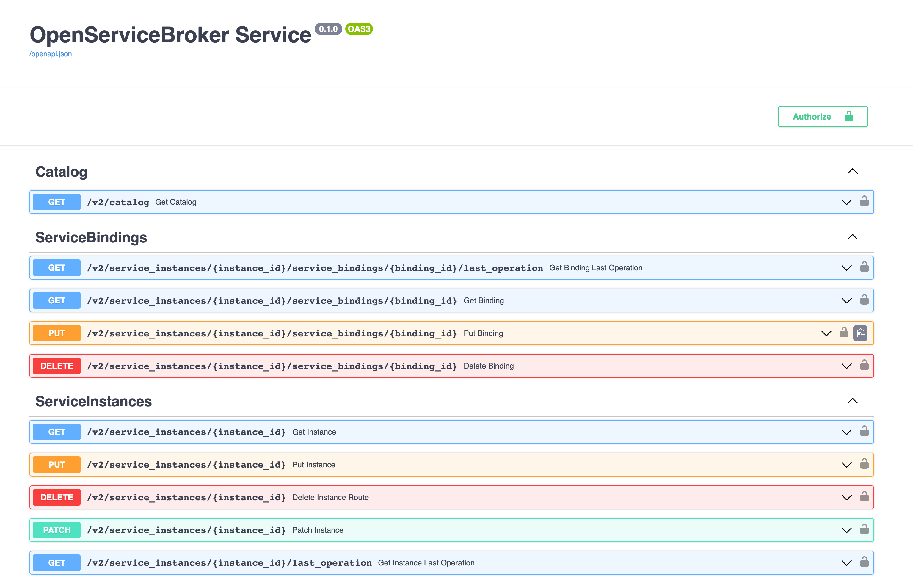
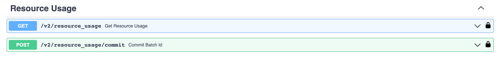

{include(/kz/_includes/_translated_by_ai.md)}

# {heading(Брокерді жергілікті тестілеу)[id=saas_upload_localtest]}

Брокерді жергілікті түрде тестілеңіз.

Үлгі негізінде әзірленген брокерді жергілікті түрде тестілеу үшін келесі әрекеттерді орындаңыз:

1. Брокер директориясындағы `.env` файлында орта айнымалыларын сипаттаңыз:

   * `BROKER_PROVIDER_CLIENT_ID` — SaaS-қолданбаға қол жеткізуге арналған брокер атауы.
   * `BROKER_PROVIDER_SECRET` — брокердің SaaS-қолданбаға қол жеткізу құпиясөзі.
   * `BROKER_PROVIDER_URL` — SaaS-қолданбаның URL мекенжайы.
   * `BROKER_USERNAME` — брокермен сервистераралық өзара әрекеттесуге арналған дүкен атауы.
   * `BROKER_PASSWORD` — брокермен сервистераралық өзара әрекеттесуге арналған дүкен құпиясөзі.

   {note:err}

   `BROKER_USERNAME` айнымалысының мәні брокерді тіркеу өтінімінде көрсетілген `username` мәнімен, ал `BROKER_PASSWORD` айнымалысының мәні `password` мәнімен сәйкес келуі тиіс.

   {/note}
1. Брокер директориясындағы `.env` файлында брокердің ДБ-на қол жеткізуге арналған айнымалылар мәндерін көрсетіңіз.
1. Python кітапханаларын орнату үшін келесі команданы орындаңыз:

   ```console
   $ pip install -r requirements/prod.txt
   ```

1. Брокерді іске қосу үшін келесі команданы орындаңыз:

   ```console
   $ gunicorn app.main:app --log-file - --workers ${UVICORN_WORKERS:-1} --worker-class uvicorn.workers.UvicornWorker --bind 0.0.0.0:${BROKER_PORT:-8000} --timeout ${WORKER_TIMEOUT:-90}
   ```

   {caption(Брокерді іске қосу командасына жауап мысалы)[align=left;position=above]}
   ```console
   INFO:     Started server process [34934]
   INFO:     Waiting for application startup.
   INFO:     Application startup complete.
   INFO:     Uvicorn running on http://0.0.0.0:8000 (Press CTRL+C to quit)
   ```
   {/caption}

   Брокерді орнатқаннан кейін `http://0.0.0.0:8000/docs` мекенжайында swagger UI редакторындағы API қолжетімді болады ({linkto(#pic_saas_swagger_broker)[text=сурет %number]}, {linkto(#pic_saas_swagger_resourceusage)[text=сурет %number]}).

   {caption(Сурет {counter(pic)[id=numb_pic_saas_swagger_broker]} — API swagger UI мысалы)[align=center;position=under;id=pic_saas_swagger_broker;number={const(numb_pic_saas_swagger_broker)} ]}
   
   {/caption}

   {caption(Сурет {counter(pic)[id=numb_pic_saas_swagger_resourceusage]} — Кейін төленетін тарифтік опциялар үшін сұрауларды қамтитын API swagger UI мысалы)[align=center;position=under;id=pic_saas_swagger_resourceusage;number={const(numb_pic_saas_swagger_resourceusage)} ]}
   
   {/caption}
1. Swagger UI API-де сипатталған сұрауларды орындаңыз.

   Сұрауларда мыналарды пайдаланыңыз:

   * `x-broker-api-version` VK OSB протоколы нұсқасының мәні (мысалы, `"0.1"`).
   * `BROKER_USERNAME` файлындағы `.env` мәні.
   * `BROKER_PASSWORD` файлындағы `.env` мәні.
