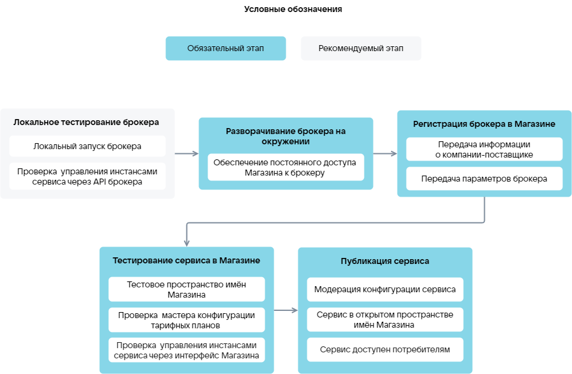

{include(/kz/_includes/_translated_by_ai.md)}

# {heading(Сервисті жүктеу кезеңдері)[id=saas_upload_phases]}

Сервисті дүкенге жүктейтін пайдаланушының бұлттық платформада тіркелгісі (жеке кабинеті) болуы тиіс. Тіркелу нұсқаулығы [Регистрация в VK Cloud](/kz/intro/onboarding/account) бөлімінде берілген.

Marketplace дүкеніне SaaS-қолданбаны жүктеу кезеңдері ({linkto(#pic_saas_upload)[text=сурет %number]}):

1. {linkto(../saas_upload_localtest#saas_upload_localtest)[text=%text]}.
1. {linkto(../saas_upload_env#saas_upload_env)[text=%text]}.
1. {linkto(../saas_upload_registration#saas_upload_registration)[text=%text]}.
1. {linkto(../saas_upload_testmarketplace#saas_upload_testmarketplace)[text=%text]}.
1. {linkto(../saas_upload_publish#saas_upload_publish)[text=%text]}.

{caption(Сурет {counter(pic)[id=numb_pic_saas_upload]} — SaaS-қолданбаны жүктеу)[align=center;position=under;id=pic_saas_upload;number={const(numb_pic_saas_upload)} ]}
{params[noBorder=true]}
{/caption}
