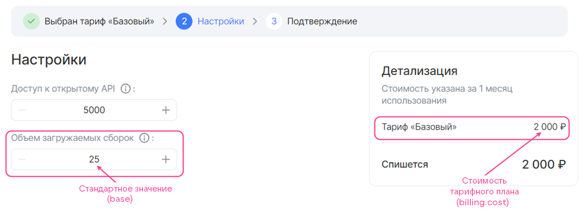
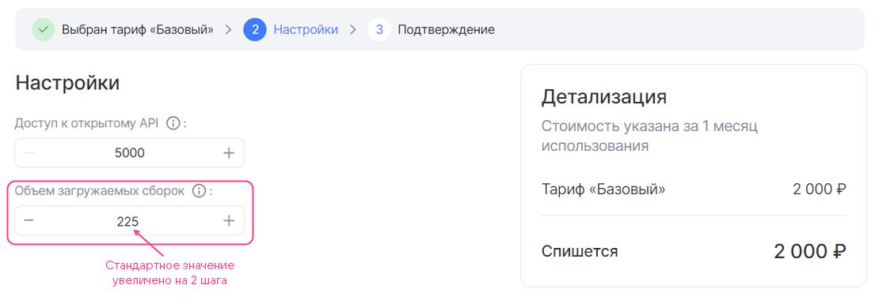
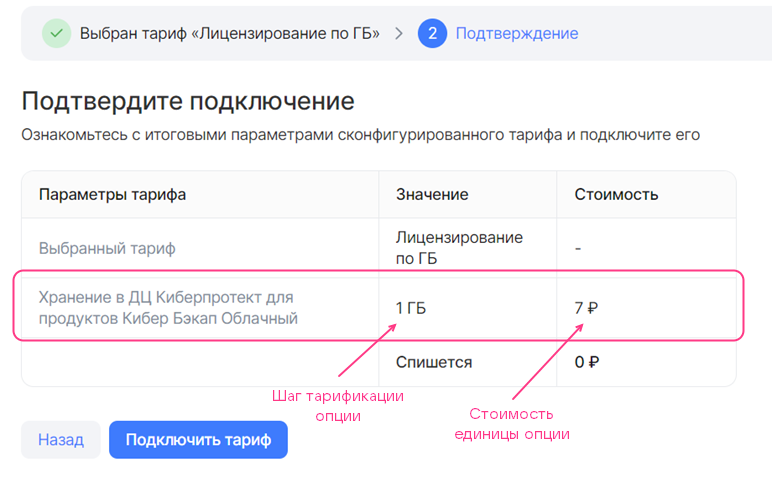

{include(/kz/_includes/_translated_by_ai.md)}

`billing` секциясы [сервис конфигурациясының JSON-файлында](../../../manage-saas-apps/saas-add#service_config) келесі ақпаратты қамтиды:

* Тарифтік жоспардың құны.
* Тарификация үшін есептік кезеңнің ұзақтығы.
* Marketplace брокерден ресурстарды пайдалану туралы есептерді сұрататын кезеңділік.
* Пайдаланылмаған бонустарға қатысты әрекеттер тәртібі.
* `integer` түріндегі тарифтік опциялар үшін өзгерту қадамы.
* Жоспардың тарифтік опцияларының құны. Ақылы тарифтік опциялардың келесі түрлеріне қолдау көрсетіледі:

  * Сандық (`integer`, `number`). Алдын ала төленетін және кейін төленетін тарификация қолдау табады.
  * Логикалық (`boolean`). Алдын ала төленетін тарификация қолдау табады.

Тарификация түрлері туралы толығырақ — [Тарификация](/kz/tools-for-using-services/vendor-account/manage-apps/concepts/about#xaas_billing) бөлімінде.

{note:warn}

Тарифтік жоспарда алдын ала төленетін және кейін төленетін опцияларды бір уақытта пайдалануға болмайды. Кейін төленетін тарифтік опциялар тек тегін тарифтік жоспарда ғана болуы мүмкін.

{/note}

Қолданылатын тарификация түрі [schemas секциясында](../schemas-section) тарифтік опциялардың қай жерде сипатталғанына байланысты:

* Егер опциялар `service_instance.create` және `service_instance.update` секцияларында сипатталса, алдын ала төленетін тарификация қолданылады.
* Егер опциялар `service_instance.resource_usages` секциясында сипатталса, кейін төленетін тарификация қолданылады.

`billing` секциясының құрылымы келесідей:

```json
"billing": {
            "cost": <СТОИМОСТЬ>,
            "billing_cycle_flat": <ОТЧЕТНЫЙ_ПЕРИОД>,
            "billing_cycle_step": <ПЕРИОДИЧНОСТЬ_ПРОВЕРКИ>,
            "refundable": <ПОДЛЕЖИТ_ВОЗВРАТУ>,
            "options": {
              "<ИМЯ_ОПЦИИ>": {
                <БИЛЛИНГ_ОПЦИИ>
                },
              ...
              }
            }
```

Мұнда:

* `<СТОИМОСТЬ>` — ақылы тарифтік опцияларды есепке алмағанда, есептік кезеңге арналған жоспар құны. Marketplace өрістетілген елдің валютасында беріледі. Егер жоспар тегін болса, `0` мәні көрсетіледі. Тек алдын ала төленетін тарификация қолдау табады.

* (Қосымша) `<ОТЧЕТНЫЙ_ПЕРИОД>` — тарификация үшін есептік кезеңнің ұзақтығы. Оны тек алдын ала төленетін тарифтік жоспар үшін беруге болады.

  Форматы: `<КОЛИЧЕСТВО_МЕСЯЦЕВ> mons <КОЛИЧЕСТВО_ДНЕЙ> days`. Мысалы, `1 mons 15 days` немесе `30 days`. `mons` ішіндегі айдағы күндер саны күнтізбе бойынша есептеледі, сондықтан `1 mons 0 days` және `0 mons 31 days` кезеңдері бір-біріне тең емес.

* (Қосымша) `<ПЕРИОДИЧНОСТЬ_ПРОВЕРКИ>` — Marketplace брокерде өңделмеген есептер бар-жоғын тексеретін кезеңнің ұзақтығы. Толығырақ — [Тарификация](/kz/tools-for-using-services/vendor-account/manage-apps/concepts/about#xaas_billing) бөлімінде. Оны кейін төленетін тарифтік опциялары бар тарифтік жоспар үшін ғана беруге болады.

  Форматы: `<КОЛИЧЕСТВО_МЕСЯЦЕВ> mons <КОЛИЧЕСТВО_ДНЕЙ> days`. Мысалы, `1 mons 15 days` немесе `30 days`. `mons` ішіндегі айдағы күндер саны күнтізбе бойынша есептеледі, сондықтан `1 mons 0 days` және `0 mons 31 days` кезеңдері бір-біріне тең емес.

* (Қосымша) `<ПОДЛЕЖИТ_ВОЗВРАТУ>` — егер пайдаланушы тарифтік жоспарды өзгертсе немесе сервис инстансын жойса, есептік кезеңнің қалған күндері үшін ақшалай қаражатты жоба бонустық шотына қайтару керек пе, жоқ па. Оны тек алдын ала төленетін тарифтік жоспар үшін көрсетуге болады. Әдепкі мәні — `true`.

  Параметр пайдаланушы тарифтік жоспарды өзгерткен кезде (тарифтік опцияларды өңдегенде немесе жаңасына ауысқанда) сервис үшін төлемді есептен шығару күніне әсер етеді:

  * `true` — күн өзгермейді.
  * `false` — күн тарифтік жоспар өзгертілген күнге жаңартылады.

* (Қосымша) `options` секциясы ақылы тарифтік опциялардың құнын сипаттайды.
  * `<ИМЯ_ОПЦИИ>` — сервис конфигурациясының JSON-файлындағы тарифтік опцияның атауы.
  * `<БИЛЛИНГ_ОПЦИИ>` — тарифтік опция құны және `integer` түріндегі опция үшін өзгерту қадамының параметрлері. Тарифтік опцияның өзі (түрі, мән баптаулары) [schemas секциясында](../schemas-section) сипатталады.

`<БИЛЛИНГ_ОПЦИИ>` секциясының параметрлері опция түріне байланысты:

[cols="2,5,2,2", options="header"]
|===
|Атауы
|Сипаттамасы
|Форматы
|Міндетті

4+^|**Өзгерту қадамы бар `integer` түріндегі алдын ала төленетін опция**

|`base`
|Тарифтік жоспар құнына кіретін тарифтік опцияның стандартты мәнін анықтайды.

Стандартты мән — пайдаланушы қоя алатын ең төменгі мән.

Егер параметр берілмесе, стандартты мән `0`-ге тең
|integer
| 

|`cost`
|Тарифтік опция мәнін өзгертуге болатын қадамның құнын анықтайды. Егер `0` көрсетілсе, опцияны өзгерту тегін

|float64, >= 0
| 

|`unit`
|Опцияны өзгерту қадамының параметрлерін анықтайды
| 
| 

4+|`unit` секциясының параметрлері

|`unit.size`
|Тарифтік опция мәнін өзгертуге болатын қадам өлшемін анықтайды
|integer, > 0
| 

|`unit.measurement`
|`unit.size` параметрінде берілген қадамның өлшем бірліктерін анықтайды
|string, 255 таңбаға дейін
| 

4+^|**`boolean` түріндегі алдын ала төленетін ауыстырғыш-опция**

|`cost`
|
Опцияның құнын анықтайды
|float64, >= 0
| 

4+^|**`integer` немесе `number` түріндегі кейін төленетін опция**

|`cost`
|Тарифтік опция бірлігінің құнын анықтайды.

{note:warn}

Егер метрикалар [pull-моделі](../../../manage-apps/concepts/about#billing_pull) бойынша жиналса, құн Marketplace-ке есепті жіберу үшін [брокер әдісінде](../../../manage-saas-apps/saas-add) көрсетілген `price` мәніне сәйкес болуы керек.

{/note}
|float64, >= 0
| 

|`unit`
|Опцияны өзгерту қадамының параметрлерін анықтайды
| 
| 

4+|`unit` секциясының параметрлері

|`unit.size`
|Опцияны өзгерту қадамының өлшемін анықтайды. Мәні `1`-ге тең болуы керек
|integer
| 

|`unit.measurement`
|Опцияның өлшем бірліктерін анықтайды
|string, 255 таңбаға дейін
| 
|===

{note:info}

Marketplace-те сервисті тестілеу және жөндеу үшін берілетін [бонустарды](../../../manage-saas-apps/saas-add#saas_test_marketplace) тиімді пайдалану үшін, сервис жарияланғанға дейін тарифтік жоспар мен оның опцияларының тестілік құнын көрсетіңіз.

{/note}

### billing секциясын сипаттау мысалдары

{cut(Өзгерту қадамы бар integer түріндегі тегін тарифтік опциясы бар billing секциясының мысалы)}

```json
"billing": {
  "cost": 2000,  // Стоимость тарифного плана
  "options": {
    "quantity": { // Имя опции в JSON-файле
      "base": 25, // Стандартное значение опции
      "cost": 0, // Стоимость шага изменения опции
      "unit": {
        "size": 100 // Шаг изменения опции
      }
    }
  }
}
```

Төменде осы мысалдағы тарифтік жоспар құны мен опцияның тарифтік жоспарды конфигурациялау шеберінде қалай көрсетілетіні берілген. Шеберде көрсетілетін опция атауы `schemas` секциясындағы `<ИМЯ_ОПЦИИ>.description` параметрімен беріледі. Бұл мысалда `quantity.description` мәні `Объем загружаемых сборок` болып табылады.

* Тарифтік жоспар баптауларында опция үшін стандартты мән таңдалған:

  {params[width=90%]}

* Тарифтік жоспар баптауларында опция мәні стандартты мәнмен салыстырғанда 2 қадамға ұлғайтылған:

  {params[width=90%]}

  Опция тегін болғандықтан, жоспар құны өзгерген жоқ.

{/cut}

{cut(Өзгерту қадамы бар integer түріндегі алдын ала төленетін тарифтік опциясы бар billing секциясының мысалы)}

```json
"billing": {
  "cost": 2000, // Стоимость тарифного плана
  "options": {
    "quantity": { // Имя опции в JSON-файле
      "base": 25, // Стандартное значение опции
      "cost": 150, // Стоимость шага изменения опции
      "unit": {
        "size": 100 // Шаг изменения опции
      }
    }
  }
}
```

Төменде осы мысалдағы тарифтік жоспар құны мен опцияның тарифтік жоспарды конфигурациялау шеберінде қалай көрсетілетіні берілген. Шеберде көрсетілетін опция атауы `schemas` секциясындағы `<ИМЯ_ОПЦИИ>.description` параметрімен беріледі. Бұл мысалда `quantity.description` мәні `Объем загружаемых сборок` болып табылады.

* Тарифтік жоспар баптауларында опция үшін стандартты мән таңдалған:

  {params[width=90%]}

* Тарифтік жоспар баптауларында алдын ала төленетін опцияның мәні стандартты мәнмен салыстырғанда 1 қадамға ұлғайтылған:

  {params[width=90%]}

  Жоспар құны алдын ала төленетін опция қадамының бағасына ұлғайды.

{/cut}

{cut(boolean түріндегі алдын ала төленетін ауыстырғыш-опциясы бар billing секциясының мысалы)}

```json
"billing": {
  "cost": 2000, // Стоимость тарифного плана
  "options": {
    "notifications": { // Имя опции в JSON-файле
      "cost": 50 // Стоимость опции
    }
  }
}
```

Төменде осы мысалдағы тарифтік жоспар құны мен опцияның тарифтік жоспарды конфигурациялау шеберінде қалай көрсетілетіні берілген. Шеберде көрсетілетін опция атауы `schemas` секциясындағы `<ИМЯ_ОПЦИИ>.description` параметрімен беріледі. Бұл мысалда `notifications.description` мәні `Уведомления о новых отчетах` болып табылады.

{params[width=90%]}

{/cut}

{cut(Сандық кейін төленетін тарифтік опциясы бар billing секциясының мысалы)}

```json
"billing": {
  "cost": 0, // Стоимость тарифного плана
  "options": {
    "storage": { // Имя опции в JSON-файле
      "cost": 7,
      "unit": {
      "size": 1,
      "measurement": "ГБ"
      }
    }
  }
}
```

Келтірілген мысалда тарифтік жоспар тегін, `storage` кейін төленетін тарифтік опциясының бірлігі 1 ГБ-ты құрайды және 7 ақша бірлігі тұрады.

Тарифтік жоспарды конфигурациялау шеберінің көрінісі суретте келтірілген. Шеберде көрсетілетін опция атауы `schemas` секциясындағы `<ИМЯ_ОПЦИИ>.description` параметрімен беріледі. Бұл мысалда `storage.description` мәні `Хранение в ДЦ Киберпротект для продуктов Кибер Бэкап Облачный` болып табылады.

{params[width=70%]}

{/cut}
