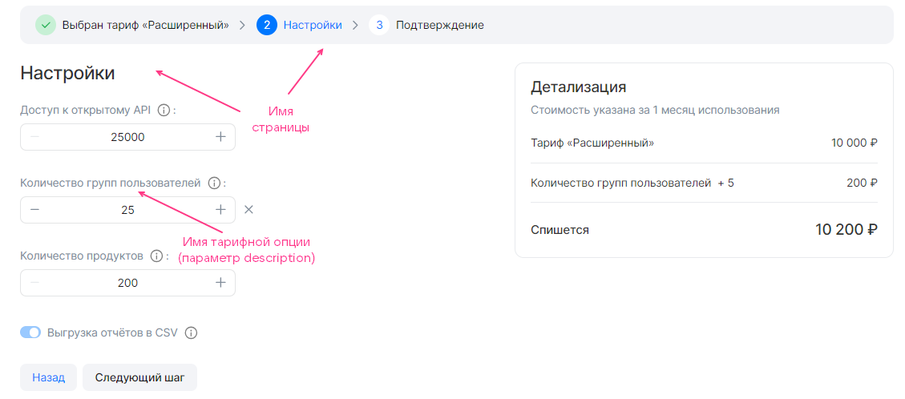

{include(/kz/_includes/_translated_by_ai.md)}

`display` секциясы [сервис конфигурациясының JSON-файлында](../../../manage-saas-apps/saas-add#service_config) [тарифтік жоспарды конфигурациялау шеберін](/kz/tools-for-using-services/vendor-account/manage-apps/concepts/about#xaas_wizard) сипаттайды. Секцияның құрылымы келесідей:

```json
"display": {
  "pages": [
    {
      <ПАРАМЕТРЫ_СТРАНИЦЫ>,
      "groups": [
        {
          <ПАРАМЕТРЫ_ГРУППЫ>,
          "parameters": [
            {
              <ПАРАМЕТРЫ_ОПЦИИ>
            },
            ...
          ]
        }
        ...
      ]
    },
  ...
  ]
}
```

Мұнда:

* `pages` — тарифтік жоспарды конфигурациялау шеберінің беттерін сипаттайтын секция. Бос болуы мүмкін.
* `<ПАРАМЕТРЫ_СТРАНИЦЫ>` — бір беттің параметрлері.
* `groups` — бір бет шеңберіндегі тарифтік опциялар топтарын сипаттайтын секция.
* `<ПАРАМЕТРЫ_ГРУППЫ>` — тарифтік опциялар тобының параметрлері.
* `parameters` — бір топ шеңберіндегі тарифтік опцияларды сипаттайтын секция.

   {note:warn}

   Бір тарифтік опция тек бір топта ғана көрсетілуі мүмкін.

   {/note}
* `<ПАРАМЕТРЫ_ОПЦИИ>` — тарифтік опциялардың параметрлері.

`display` секциясында тарифтік жоспарды конфигурациялау шеберінің бірінші және соңғы бетінен басқа барлық беттері сипатталады. Беттердің ең көп саны — 5.

Топтардағы беттердің, топтардың және тарифтік опциялардың параметрлері бірдей және кестеде келтірілген.

[cols="2,5,4,2", options="header"]
|===
|Атауы
|Сипаттамасы
|Форматы
|Міндетті

|`name`
|
JSON-файлдағы беттің, топтың немесе тарифтік опцияның атауы.

{note:warn}

Дүкен интерфейсінде тарифтік опциялар [schemas секциясындағы](../schemas-section) осы опциялардың `description` параметрінде берілген атаулармен көрсетіледі.

{/note}
|
string.

Бет атауы — 32 таңбаға дейін.

Топ атауы — 255 таңбаға дейін
| 

|`index`
|
Беттің, беттегі топтың немесе топтағы тарифтік опцияның реттік нөмірі
|
integer
| 
|===

{cut(display секциясының мысалы)}

```json
"display": {
  "pages": [
    {
      "name": "Настройки", // Имя страницы
      "index": 0,
      "groups": [
        {
          "name": "", // Имя группы
          "index": 0,
          "parameters": [
            {
              "name": "api_requests_daily_limit", // Имя тарифной опции в JSON-файле
              "index": 0,
            },
            {
              "name": "groups",
              "index": 1,
            },
            {
              "name": "products",
              "index": 2,
            },
            {
              "name": "reports",
              "index": 3
            }
          ]
        }
      ]
    }
  ]
}
```

`display` секциясының осы мазмұнына суретте келтірілген тарифтік жоспарды конфигурациялау шебері сәйкес келеді:



{/cut}

Әдепкі бойынша тарифтік жоспарды конфигурациялау шеберінде `groups` тарифтік опцияларының барлық топтары көрсетіледі және бапталады. Топ тек белгілі бір шарттарда көрсетілуі үшін [when конструкциясын](/kz/tools-for-using-services/vendor-account/manage-apps/ibservice_add/ibservice_configure/ib_display#IBdisplay_when) пайдаланыңыз.

{note:warn}

Брокер `when` конструкцияларында берілген шарттарды ескере отырып, сервис инстансын жасауды қолдауы керек.

{/note}

JSON форматындағы `when` құрылымы:

```json
{
  "when": {
    "in": { // Или "not_in"
      "key": {
        "param": "<ИМЯ_ОПЦИИ>" // Или "const": "<ЗНАЧЕНИЕ>"
      },
      "values": [
        {
          "const": "<ЗНАЧЕНИЕ>"
        },
        {
          "param": "<ИМЯ_ОПЦИИ>"
        },
      ...
      ]
    }
  },
  "parameters": [
  ...
  ]
}
```

Мұнда:

* `<ИМЯ_ОПЦИИ>` — сервис конфигурациясының JSON-файлындағы тарифтік опцияның атауы.
* `<ЗНАЧЕНИЕ>` — константа мәні.

[pages секциясындағы when конструкциясы](/kz/tools-for-using-services/vendor-account/manage-apps/ibservice_add/ibservice_configure/ib_display#IBdisplay_when_in_pages) image-based қосымшаларындағыдай қолданылады.

{cut(pages секциясында when конструкциясын пайдалану мысалы)}

```json
{
  "pages": [
    {
      "name": "Настройки бекапа", // Имя страницы
      "groups": [
        {
          "name": "High-frequency бекап", // Имя группы тарифных опций
          "parameters": [
            {
              "name": "frequency_per_day" // Имя тарифной опции в JSON-файле
            }
          ],
          "when": {
            "in": {
              "key": {
                "param": "backup_method" // Имя тарифной опции в JSON-файле
              },
              "values": [
                {
                  "const": "high-frequency"
                }
              ]
            }
          }
        }
      ]
    }
  ]
}
```

Бұл мысалда бэкаптарды жасау жиілігі бапталады. Егер `backup_method` тарифтік опциясының мәні `high-frequency` болса, тарифтік жоспарды конфигурациялау шеберінде `frequency_per_day` тарифтік опциясы бар `High-frequency бекап` тобы көрсетіледі.

`backup_method` тарифтік опциясы:

* Басқа топтардағы `when` конструкциясында пайдаланылуы мүмкін.
* Басқа топтағы `parameters` ішінде берілуі керек.

`frequency_per_day` тарифтік опциясын басқа топтарда пайдалану мүмкін емес:

* `when` конструкциясында — өйткені тәуелділіктер иерархиясының бір деңгейі ғана қолдау табады.
* `parameters` ішінде — өйткені бір тарифтік опция тек бір топта ғана көрсетілуі мүмкін.

{/cut}
