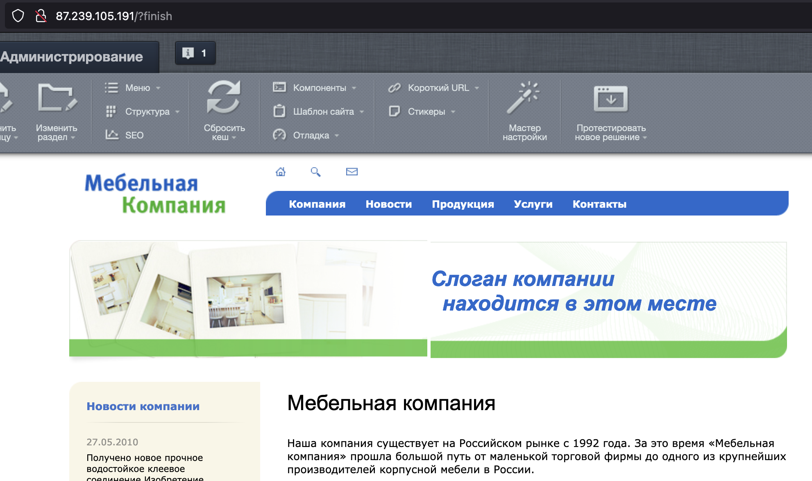

[1С-Битрикс: Управление сайтом](https://www.1c-bitrix.ru/products/cms/) — профессиональная система управления интернет-ресурсами, с помощью которой можно создавать и поддерживать информационные порталы, интернет-магазины и корпоративные сайты.

Данная инструкция поможет развернуть 1С-Битрикс: Управление сайтом последней версии в операционной системе Ubuntu 22.04 в VK Cloud, а также настроить DNS-запись для доступа по доменному имени. В качестве СУБД используется MySQL 8.0 конфигурации Single.

## 1. Подготовительные шаги

1. [Зарегистрируйтесь](/ru/additionals/start/account-registration) в VK Cloud.
1. [Создайте](/ru/networks/vnet/operations/manage-net#sozdanie_seti) сеть `network1` с доступом в интернет и подсетью `10.0.0.0/24`.
1. [Создайте ВМ](/ru/base/iaas/instructions/vm/vm-create):

   - имя: `Ubuntu_22_04_Bitrix`;
   - операционная система: Ubuntu 22.04;
   - сеть: `network1` с подсетью `10.0.0.0/24`;
   - назначьте публичный IP-адрес. В примере будет использоваться `87.239.105.191`;
   - группы безопасности: `default`, `ssh+www`.

1. [Создайте инстанс БД](/ru/dbs/dbaas/instructions/create/create-single-replica):

   - имя: `MySQL-1111`;
   - СУБД: MySQL 8.0;
   - тип конфигурации: Single;
   - сеть: `network1`;
   - название БД: `MySQL-1111`;
   - имя пользователя БД: `user`;
   - пароль пользователя: `AN0r25e0ae4d626p`;

   В примере внутренний IP созданного инстанса: `10.0.0.7`.

1. [Создайте](/ru/networks/dns/publicdns#sozdanie_zony) DNS-зону.

   <warn>

   Убедитесь, что DNS-зона делегирована успешно и NS-записи настроены верно: зона должна находиться в статусе **NS-записи настроены верно**.

   </warn>

1. [Создайте](/ru/networks/dns/publicdns#dobavlenie_resursnyh_zapisey) запись в выделенной зоне:

   - тип записи: `A`;
   - имя: например, `site-bitrix.example.vk.cloud`;
   - IP-адрес: внешний адрес ВМ `87.239.105.191`.

1. (Опционально) Проверьте резолвинг имени в IP-адрес с помощью команды `nslookup site-bitrix.example.vk.cloud`. Вывод при успешной операции:

   ```bash
   Non-authoritative answer:
   Name:   site-bitrix.example.vk.cloud
   Address: 87.239.105.191
   ```

## 2. Установите Bitrix на ВМ

1. [Подключитесь](/ru/base/iaas/instructions/vm/vm-connect/vm-connect-nix) к ВМ `Ubuntu_22_04_Bitrix`.
1. Обновите пакеты до актуальной версии и перезагрузите ВМ с помощью команд:

   ```bash
   sudo dnf update -y
   sudo apt upgrade -y
   sudo systemctl reboot
   ```

1. Установите необходимые пакеты для CMS Bitrix:

   ```bash
   sudo apt install apache2 apache2-utils libapache2-mod-php php8.1 php8.1-cli php8.1-curl php8.1-fpm php8.1-gd php8.1-intl php8.1-mbstring php8.1-mysql php8.1-opcache php8.1-readline php8.1-soap php8.1-xml php8.1-xmlrpc php8.1-zip php-gd -y
   ```

1. Найдите файл `/etc/php/8.1/apache2/php.ini`, раскомментируйте и измените в нем параметры:

   ```txt
   short_open_tag = On

   opcache.revalidate_freq = 0

   date.timezone = Europe/Moscow
   ```

1. Найдите файл `/etc/apache2/sites-available/000-default.conf` и добавьте в него фрагмент после блока `DocumentRoot /var/www/html`:

   ```txt
   <Directory /var/www/html>
     AllowOverride All
   </Directory>
   ```

1. Проверьте конфигурацию веб-сервера на синтаксические ошибки:

   ```bash
   apachectl configtest
   ```

   При успешном прохождении проверки появится сообщение вида `Syntax OK`.

1. Перезапустите веб-сервер с помощью команды:

   ```bash
   sudo systemctl restart apache2
   ```

1. Скачайте репозиторий CMS Bitrix редакции «Старт» с официального сайта и распакуйте его на веб-сервер:

   ```bash
   cd ~
   wget https://www.1c-bitrix.ru/download/start_encode.tar.gz
   sudo rm -rf /var/www/html/*
   sudo tar xzf start_encode.tar.gz -C /var/www/html/
   sudo chown -R www-data:www-data /var/www/html/
   ```

1. В браузере введите публичный адрес ВМ (в текущей инструкции это `site-bitrix.example.vk.cloud`).
1. В мастере установки начните процесс установки CMS.
1. На шаге «Лицензионное соглашение» примите условия лицензионного соглашения CMS Bitrix.
1. На шаге «Регистрация» [зарегистрируйте](https://dev.1c-bitrix.ru/learning/course/index.php?COURSE_ID=32&LESSON_ID=2043&LESSON_PATH=3903.4862.4888.4538.2043) продукт.
1. На шаге «Предварительная проверка» убедитесь, что все параметры соответствуют требуемым (выделены зеленым).
1. На шаге «Создание базы данных» БД укажите параметры `MySQL-1111`:

   - **Сервер**: `10.0.0.7`.
   - **Пользователь базы данных**: `Существующий`.
   - **Имя пользователя**: `user`.
   - **Пароль пользователя базы данных**: `AN0r25e0ae4d626p`.
   - **База данных**: `Существующая`.
   - **Имя базы данных**: `MySQL-1111`.

1. На шаге «Установка продукта» дождитесь установки продукта, может занять некоторое время.
1. В [появившемся окне](https://dev.1c-bitrix.ru/learning/course/index.php?COURSE_ID=32&LESSON_ID=2059&LESSON_PATH=3903.4862.4888.4538.2059) укажите учетные данные администратора.

## 3. Проверьте работоспособность Bitrix

После [указания учетных данных администратора](https://dev.1c-bitrix.ru/learning/course/index.php?COURSE_ID=32&LESSON_ID=2059&LESSON_PATH=3903.4862.4888.4538.2059) нажмите кнопку **Перейти на сайт**. Откроется стартовая страница CMS Bitrix.



## Удалите неиспользуемые ресурсы

Развернутые виртуальные ресурсы тарифицируются. Если они вам больше не нужны:

- [Удалите](/ru/base/iaas/instructions/vm/vm-manage#udalenie_vm) ВМ `Ubuntu_22_04_Bitrix`.
- [Удалите](/ru/dbs/dbaas/instructions/manage-instance/mysql#udalenie_instansa_bd_ili_ego_hostov) инстанс БД `MySQL-1111`.
- При необходимости [удалите](/ru/networks/vnet/operations/manage-floating-ip#udalenie_plavayushchego_ip_adresa_iz_proekta) плавающий IP-адрес `87.239.105.191`.
- [Удалите](/ru/networks/dns/publicdns#udalenie_resursnyh_zapisey) созданную DNS-запись `site-bitrix.example.vk.cloud`.
