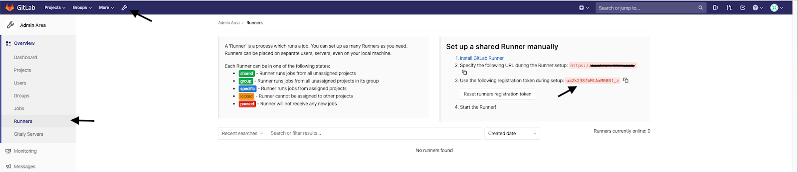
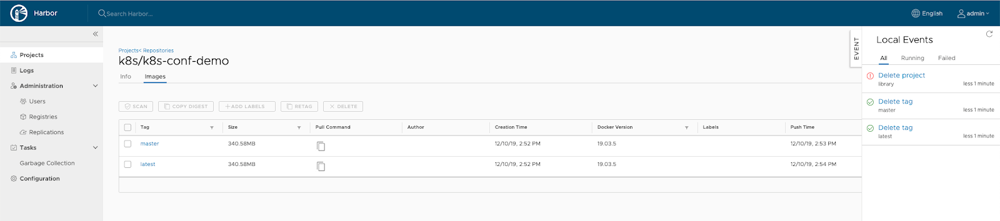
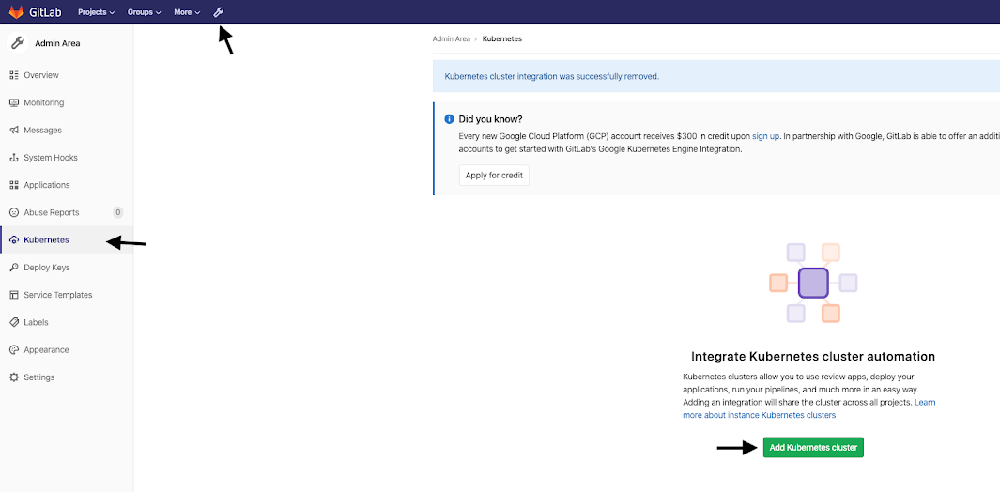

В данной статье описано, как настроить авторазвертывание приложения в кластер Kubernetes. В примере будет использоваться оборудование:

- Сервер Ubuntu 18.04 LTS x86_64: на нем будут установлены и настроены Docker, GitLab и Harbor.
- [Развернутый](/ru/base/k8s/operations/create-cluster/create-webui) в VK Cloud кластер K8s.

## Подготовительные шаги

1. [Установите и настройте Docker](/ru/additionals/cases/cases-gitlab/case-docker).
1. [Установите и настройте GitLab](/ru/additionals/cases/cases-gitlab/case-gitlab).
1. [Установите и настройте Harbor](/ru/additionals/cases/cases-gitlab/case-harbor).

## 1. Настройте GitLab-runner

<info>

В примере будет настроен общий runner (shared runner).

</info>

1. Авторизуйтесь в веб-интерфейсе GitLab c правами администратора:

   

1. Скопируйте **registration token**. В консоли на сервере, на котором установлен GitLab-runner, выполните команду:

   ```bash
   docker exec -it gitlab-runner gitlab-runner register -n --url https://<SERVER_DNS_NAME>/ --executor docker --registration-token ua2k238fbMtAxMBBRf_z --description "shared-runner" --docker-image="docker:dind" --tag-list "shared_runner" --docker-privileged --docker-volumes /var/run/docker.sock:/var/run/docker.sock
   ```

   В результате runner отобразится в веб-интерфейсе:

   

1. Настройте переменные среды выполнения:

   1. Перейдите в раздел **Settings** → **CI/CD**.
   1. В блоке **Variables** нажмите кнопку **Expand**:
   1. Установите переменные, которые будут использоваться в файле автосборки `.gitlab-ci.yml`:

      - `DOCKER_USER` — пользователь для доступа к репозиторию в Harbor. В нашем примере — `k8s`.
      - `DOCKER_PASSWORD` — пароль пользователя k8s, который вы ввели при создании пользователя в Harbor. Отметьте для переменной опцию **Masked** — благодаря этому при попытке вывода текста в переменной в скрипте он маскируется, и пароль не виден.
      - `DOCKER_REGISTRY` — имя хоста, на котором расположен Harbor. В нашем примере — `<SERVER_DNS_NAME>`.

## 2. Настройте файл автосборки

1. Перейдите в папку со скачанным репозиторием и создайте файл `.gitlab-ci.yml` с содержимым:

   <details>
    <summary>.gitlab-ci.yml</summary>

   ```yaml
   image: docker:latest
   
   stages:
     - builds
     - test
     - release
   
   variables:
     REGISTRY_URL: https://$DOCKER_REGISTRY:8443
     IMAGE: $DOCKER_REGISTRY:8443/$DOCKER_USER/$CI_PROJECT_NAME:$CI_COMMIT_REF_NAME
     RELEASE: $DOCKER_REGISTRY:8443/$DOCKER_USER/$CI_PROJECT_NAME:latest
   
   before_script:
      - docker login $REGISTRY_URL -u $DOCKER_USER -p $DOCKER_PASSWORD
   
   build:
     stage: builds
     tags:
       - shared_runner
     script:
      - cd app && docker build --pull -t $IMAGE .
      - docker push $IMAGE
   
   release:
     stage: release
     tags:
       - shared_runner
     script:
       - docker pull $IMAGE
       - docker tag $IMAGE $RELEASE
       - docker push $RELEASE
     only:
       - master
   ```

   Информация о переменных в файле:

   - `image` — указывает docker image, в котором будет запускаться сборка. Поскольку собирается Docker-образ, требуется image, содержащий нужные для сборки утилиты. Обычно используется `image docker:latest`.
   - `stages` — описывает стадии сборки образа. В примере стадия `test` пропускается.
   - `before_script` — первая стадия: вход в registry по реквизитам GitLab runner.
   - `build` — сборка образа. Стандартная сборка Docker-образа c использованием Dockerfile в репозитории.
   - `release` — секция формирования окончательного образа. В примере берем образ, собранный на предыдущей стадии, добавляем ему тег `latest` и загружаем в репозиторий.

   <warn>

   `tags: shared_runner` — тег, который был указан при регистрации runner. Указание этого тега в файле `.gitlab-ci.yml` разрешает GitLab-runner выполнять этот скрипт. После сборки вносится собранный образ в регистри с тегом `CI_COMMIT_REF_NAME`. Подробно о переменных, которые можно использовать при сборке [читайте в статье](https://docs.gitlab.com/ee/ci/variables). В примере, поскольку происходит коммит в ветку `master`, имя образа будет `k8s/k8s-conf-demo:master`.

   </warn>

   </details>

1. Загрузите созданный файл в репозиторий:

   ```bash
   ash-work:k8s-conf-demo git add .
   ash-work:k8s-conf-demo git commit -m "create .gitlab-ci.yml"
   [master 55dd5fa] create .gitlab-ci.yml
   1 file changed, 1 insertion(+), 1 deletion(-)
   ash-work:k8s-conf-demo git push
   Перечисление объектов: 5, готово.
   Подсчет объектов: 100% (5/5), готово.
   При сжатии изменений используется до 4 потоков
   Сжатие объектов: 100% (3/3), готово.
   Запись объектов: 100% (3/3), 299 bytes | 299.00 KiB/s, готово.
   Всего 3 (изменения 2), повторно использовано 0 (изменения 0)
   To testrom.ddns.net:ash/k8s-conf-demo.git
      7c91eab..55dd5fa  master -> master
   ```

   Как только файл `.gitlab-ci.yml` появится в репозитории, GitLab автоматически запустит его сборку.

1. Дождитесь завершения сборки.

   <details>
    <summary>Где отслеживать процесс сборки?</summary>

   1. В интерфейсе GitLab перейдите в раздел **CI/CD** → **Pipelines**.
   1. Нажмите на статус сборки. Откроется текущий пайплайн:

      

   1. Нажмите на стадии сборки, чтобы открыть консоль с процессом выполнения операции.

      Пример для стадии `build`:

      

      Пример для стадии `release`:

      

   </details>

1. (Опционально) Проверьте наличие собранного образа в Harbor:

   

## 3. Разверните локальное приложение в кластере Kubernetes

1. [Создайте](/ru/base/k8s/operations/create-cluster/create-webui) кластер Kubernetes в VK Cloud.
1. [Подключитесь](/ru/base/k8s/connect/kubectl) к кластеру с помощью `kubectl`.
1. Предоставьте кластеру права доступа к репозиторию образов Harbor:

   1. Создайте secret с `<SERVER_DNS_NAME>` (имя сервера Harbor) и `<PASSWORD>` (пароль пользователя k8s в Harbor):

   ```bash
   kubectl create secret docker-registry myprivateregistry --docker-server=https://<SERVER_DNS_NAME>:8443 --docker-username=k8s --docker-password=<PASSWORD>
   ```

   1. Убедитесь, что secret успешно создан:

   ```bash
   ash-work:~ kubectl get secret myprivateregistry --output="jsonpath={.data.\.dockerconfigjson}" | base64 --decode
   ```

1. Создайте файл приложения `deployment.yml`:

   <details>
     <summary>deployment.yml</summary>

   ```yaml
   apiVersion: apps/v1
   kind: Deployment
   metadata:
     name: myapp
   spec:
     selector:
       matchLabels:
         run: myapp
     template:
       metadata:
         labels:
           run: myapp
       spec:
         containers:
         - name: myapp
           image: <SERVER_DNS_NAME>:8443/k8s/k8s-conf-demo:latest
           imagePullPolicy: Always
           env:
           - name: HTTP_PORT
             value: "8081"
           ports:
           - containerPort: 8081
         imagePullSecrets:
         - name: myprivateregistry
   ```

   </details>

1. Запустите приложение:

   ```bash
   kubectl create -f deployment.yaml 
   ```

1. Через некоторое время убедитесь, что контейнер поднялся:

   ```bash
   kubectl get pods 
   ```

   Должна быть выведена похожая информация:

   ```bash
   NAME READY STATUS RESTARTS AGE 
   myapp-deployment-66d55bcbd5-s86m6   1/1     Running   0          39s
   ```

1. Создайте файл `service.yml`:

   <details>
     <summary>service.yml</summary>

   ```yaml
   apiVersion: v1
   kind: Service
   metadata:
     name: myapp-svc
     labels:
       run: myapp
   spec:
     ports:
       - protocol: TCP
         port: 8081
         targetPort: 8081
     selector:
       run: myapp
   ```

   </details>

1. Создайте сервис:

   ```bash
   kubectl create -f service.yaml
   ```

1. Чтобы обеспечить доступ к приложению из внешней сети, настройте ingress-контроллер. Для этого создайте файл `ingress.yaml`:

   <details>
     <summary>ingress.yaml</summary>

   ```yaml
   apiVersion: extensions/v1beta1 
   kind: Ingress 
   metadata: 
   name: myapp-ingress 
   spec: 
   rules: 
   - host: echo.com 
   http: 
   paths: 
   - path: / 
   backend: 
   serviceName: myapp-svc 
             servicePort: 8081
   ```

   В этом файле укажите домен, при обращении к которому будет выполнен переход в приложение. Можно указать любой домен, в примере указан локально для тестов.

   </details>

1. Примените ingress-контроллер:

   ```bash
   kubectl create -f ingress.yaml
   ```

1. Посмотрите состояние ingress-контроллера:

   ```bash
   kubectl describe ingress myapp-ingress
   ```

   Ожидаемый вывод команды:

   ```bash
   Name: myapp-ingress 
   Namespace: default 
   Address: 
   Default backend: default-http-backend:80 (<none>) 
   Rules: 
   Host Path Backends 
   ---- ---- -------- 
   echo.com 
   / myapp-svc:8081 (10.100.69.71:8081) 
   Annotations: 
   Events: 
   Type Reason Age From Message 
   ---- ------ ---- ---- ------- 
   Normal CREATE 45s nginx-ingress-controller Ingress default/myapp-ingress 
     Normal  UPDATE  5s    nginx-ingress-controller  Ingress default/myapp-ingress
   ```

1. Протестируйте работу приложения. Внешний IP-адрес, связанный с ingress-контроллером, можно на [странице кластера](/ru/base/k8s/operations/manage-cluster#poluchit_informaciyu_o_klastere). Он называется IP-адрес балансировщика нагрузки для Ingress Controller. Обозначим его как `<INGRESS_EXTERNAL_IP>`.

   ```bash
   ash-work:~ curl --resolve echo.com:80:<INGRESS_EXTERNAL_IP> http://echo.com/handler
   ```

   <info>

   Опция `--resolve` отвечает за локальный резолв при запросе curl, так как домен локальный и настоящего резолва нет.

   </info>

1. (Опционально) Удалите созданные в кластере сервисы:

   ```bash
   ash-work:~ kubectl delete -f ingress.yaml
   ash-work:~ kubectl delete -f service.yaml
   ash-work:~ kubectl delete -f deployment.yaml
   ```

## 4. Разверните приложение в кластере Kubernetes с использованием GitLab CI/CD

GitLab по умолчанию поддерживает интеграцию с кластером Kubernetes. Чтобы настроить интеграцию, получите несколько параметров кластера:

1. Получите API URL:

   ```bash
   ash-work:~ kubectl cluster-info | grep 'Kubernetes master' | awk '/http/ {print $NF}'
   ```

1. Получите список секретов кластера:

   ```bash
   kubectl get secrets
   ```

   Ожидаемый вывод команды:

   ```bash
   NAME                       TYPE                                  DATA   AGE
   dashboard-sa-token-xnvmp   kubernetes.io/service-account-token   3      41h
   default-token-fhvxq        kubernetes.io/service-account-token   3      41h
   myprivateregistry          kubernetes.io/dockerconfigjson        1      39h
   regcred                    kubernetes.io/dockerconfigjson        1      39h   
   ```

1. Получите PEM-сертификат секрета `default-token`:

   ```bash
   kubectl get secret default-token-fhvxq -o jsonpath="{['data']['ca\.crt']}" | base64 --decode
   ```

1. Создайте файл `gitlab-admin-service-account.yaml`, который описывает права доступа GitLab к кластеру.

   <details>
     <summary>gitlab-admin-service-account.yaml</summary>

   ```yaml
   apiVersion: v1
   kind: ServiceAccount
   metadata:
   name: gitlab-admin
   namespace: kube-system
   ---
   apiVersion: rbac.authorization.k8s.io/v1beta1
   kind: ClusterRoleBinding
   metadata:
   name: gitlab-admin
   roleRef:
   apiGroup: rbac.authorization.k8s.io
   kind: ClusterRole
   name: cluster-admin
   subjects:
   - kind: ServiceAccount
   name: gitlab-admin
     namespace: kube-system
   ```

   </details>

1. Примените права и получите токен доступа к кластеру:

   ```bash
   kubectl apply -f gitlab-admin-service-account.yaml
   kubectl -n kube-system describe secret $(kubectl -n kube-system get secret | grep gitlab-admin | awk '{print $1}')
   ```

1. Перейдите в администраторскую часть интерфейса GitLab и нажмите **Add Kubernetes Cluster**:

   

1. Выберите вкладку **Add Existing cluster**, внесите параметры (API URL, PEM, Token) и нажмите **Add Kubernetes Cluster**:

   

1. Переместите файлы `deployment.yaml`, `service.yaml`, `ingress.yaml` в папку `deployments` проекта.
1. В файл `.gitlab-ci.yml` добавьте секцию `deploy`:

   <details>
     <summary>.gitlab-ci.yml</summary>

   ```yaml
   image: docker:latest
   
   stages:
   - build
   - test
   - release
   - deploy
   
   variables:
   REGISTRY_URL: https://$DOCKER_REGISTRY:8443
   IMAGE: $DOCKER_REGISTRY:8443/$DOCKER_USER/$CI_PROJECT_NAME:$CI_COMMIT_REF_NAME
   RELEASE: $DOCKER_REGISTRY:8443/$DOCKER_USER/$CI_PROJECT_NAME:latest
   
   before_script:
   - docker login $REGISTRY_URL -u $DOCKER_USER -p $DOCKER_PASSWORD
   
   build:
   stage: build
   tags:
   - shared_runner
   script:
   - cd app && docker build --pull -t $IMAGE .
   - docker push $IMAGE
   
   release:
   stage: release
   tags:
   - shared_runner
   script:
   - docker pull $IMAGE
   - docker tag $IMAGE $RELEASE
   - docker push $RELEASE
   only:
   - master
   
   deploy:
   stage: deploy
   before_script:
   - apk add --no-cache curl
   - curl -LO https://storage.googleapis.com/kubernetes-release/release/$(curl -s https://storage.googleapis.com/kubernetes-release/release/stable.txt)/bin/linux/amd64/kubectl
   - chmod +x ./kubectl
   tags:
   - shared_runner
   environment:
   name: production
   script:
   - echo $KUBECONFIG
   - export KUBECONFIG=$KUBECONFIG
       - ./kubectl create secret docker-registry myprivateregistry --docker-server=$REGISTRY_URL --docker-username=$DOCKER_USER --docker-password=$DOCKER_PASSWORD --dry-run -o yaml | ./kubectl apply -f -
       - ./kubectl apply -f manifests/deployment.yaml
   - ./kubectl apply -f manifests/service.yaml
       - ./kubectl apply -f manifests/ingress.yaml
       - ./kubectl rollout restart deployment
   ```

   </details>

1. Проверьте namespace кластера:

   ```bash
   kubectl get namespaces
   ```

   Ожидаемый вывод команды:

   ```bash
   NAME STATUS AGE
   default Active 45h
   gitlab-managed-apps Active 67m
   ingress-nginx Active 45h
   k8s-conf-demo-1-production Active 57m
   kube-node-lease Active 45h
   kube-public Active 45h
   kube-system Active 45h
   magnum-tiller Active 45h
   ```

1. Посмотрите поды, сервисы и ingress в `k8s-conf-demo-1-production`:

   ```bash
   kubectl get pods -n k8s-conf-demo-1-production
   kubectl get services -n k8s-conf-demo-1-production
   kubectl get ingress -n k8s-conf-demo-1-production
   ```

1. Проверьте работоспособность приложения:

   ```bash
   ash-work:~ curl --resolve echo.com:<INGRESS_EXTERNAL_IP> http://echo.com/handler
   ```

   Ожидаемый вывод: `OK`.

1. Для тестирования авторазвертывания измените код приложения: в файле репозитория `app/app.py` исправьте строку `return 'OK'` на `return 'HANDLER OK'`.
1. Опубликуйте изменения:

   ```bash
   k8s-conf-demo git add . && git commit -m "update" && git push
   ```

1. Дождитесь окончания выполнения CI/CD и проверьте вывод приложения повторно:

   ```bash
   ash-work:~ curl --resolve echo.com:<INGRESS_EXTERNAL_IP> http://echo.com/handler
   ```

   При успешной настройке авторазвертывания появится сообщение `HANDLER OK`.
