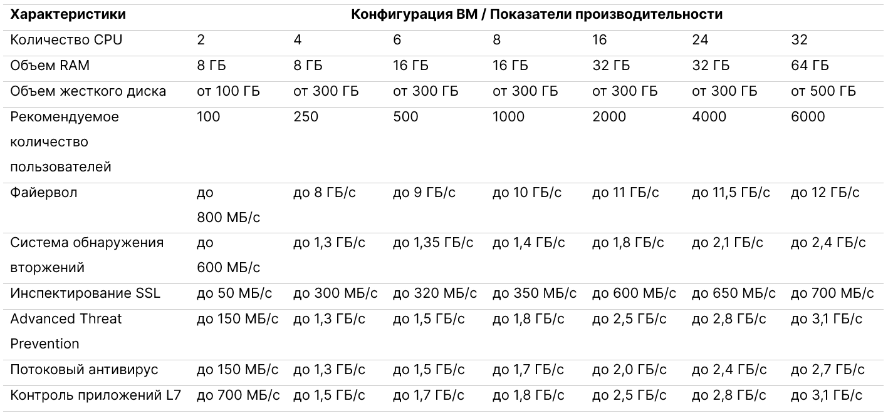

Вы можете настроить межсетевой экран для защиты инфраструктуры от сетевых атак с помощью сервиса [UserGate NGFW](https://msk.cloud.vk.com/app/services/marketplace/v2/apps/service/e27c25f9-49db-4ba7-9789-6395b96b39c9/latest/info/). Возможности сервиса:

- защита от атак;
- управление трафиком;
- аутентификация пользователей;
- блокировка вредоносного содержимого при просмотре внешних ресурсов интернета.

    
Рекомендуемые технические характеристики сервера для сервиса

Чтобы создать ВМ, у которой более 24 CPU, обратитесь в [техническую поддержку](/ru/contacts).

Данная инструкция поможет развернуть сервис UserGate NGFW на ВМ в VK Cloud, подключиться к консоли UserGate NGFW и добавить новую сеть через консоль сервиса.

Используя сервис UserGate NGFW, вы соглашаетесь с лицензионными соглашениями сервисов [Marketplace](/ru/intro/start/legal/marketplace) и [UserGate](https://www.usergate.com/ru/usergate-eula).

<warn>

UserGate NGFW предоставляется по модели BYOL (Bring Your Own Licence): самостоятельно приобретите [лицензию](https://www.usergate.com/ru/purchase) на использование сервиса.

</warn>

## Подготовительные шаги

1. [Зарегистрируйтесь](/ru/intro/start/account-registration) в VK Cloud.
1. [Создайте](/ru/networks/vnet/service-management/net#sozdanie_seti) сеть с доступом в интернет, если она не была создана ранее.
1. В [настройках подсети](/ru/networks/vnet/service-management/net#redaktirovanie_podseti), где будет размещена ВМ с развернутым сервисом, отключите опцию **Приватный DNS**.
1. [Разверните](../../service-management/pr-instance-add/) сервис UserGate NGFW:

   - Выберите ранее созданные сеть с доступом в интернет и подсеть.
   - Остальные параметры выберите на свое усмотрение.

   После завершения установки на почту придет одноразовая ссылка на логин и пароль. Запишите их. Сервис будет развернут по адресу вида `https://<внешний IP-адрес ВМ>:8001` (консоль UserGate).

1. (Опционально) Настройте промежуточный сервер (jump host) для ВМ сервиса, чтобы повысить безопасность работы.

## 1. Добавьте сеть в сервис

<info>

По умолчанию UserGate NGFW создается с единственной сетью для подключения к MGMT-порту.

</info>

1. Перейдите в консоль UserGate напрямую по IP виртуальной машины или через промежуточный сервер.
1. На шаге выбора языка укажите **Русский**.
1. На шаге выбора часового пояса укажите **Europe/Moscow**.
1. Прочитайте и примите условия [лицензионного соглашения](https://www.usergate.com/ru/usergate-eula).
1. На шаге установки первого узла укажите логин и пароль, полученные после развертывания сервиса.
1. Нажмите кнопку **Старт**.

   Откроется дашборд консоли UserGate.

1. Перейдите в раздел **Настройки** → **Сеть** → **Интерфейсы**. Убедитесь, что в группе **Текущий узел** один сетевой адаптер (сеть, выбранная на этапе развертывания сервиса).
1. [Перейдите](https://msk.cloud.vk.com/app/) в личный кабинет VK Cloud.
1. Перейдите в раздел **Облачные вычисления** → **Виртуальные машины**.
1. Откройте страницу ВМ сервиса (обычно `<идентификатор>usergate`), нажав на ее имя в списке.
1. Перейдите на вкладку **Сети**.
1. [Подключите](/ru/computing/iaas/service-management/vm/vm-add-net#podklyuchenie_seti_k_vm) нужную сеть к ВМ.
1. Перезагрузите ВМ [средствами VK Cloud](/ru/computing/iaas/service-management/vm/vm-manage#start_stop_restart_vm) или через [консоль UserGate](https://docs.usergate.com/upravlenie-ustrojstvom_84.html#Операции_с_сервером).

## 2. Проверьте наличие добавленной сети

1. Перейдите в консоль UserGate напрямую по IP виртуальной машины или через промежуточный сервер.
1. Перейдите в раздел **Настройки** → **Сеть** → **Интерфейсы**.
1. Убедитесь, что в группе **Текущий узел** появился новый сетевой адаптер. Он будет неактивным.

Для расширенной конфигурации сервиса используйте официальную инструкцию [UserGate NGFW](https://docs.usergate.com/usergate-7x-11/).

<info>

Рекомендации по работе с сервисом:

- При настройке сетевого интерфейса используйте статическую адресацию: IP-адрес должен совпадать с адресом, назначенным для порта ВМ. Посмотреть адрес можно на странице ВМ на вкладке **Сети**.
- Если вы подключаетесь к [внешней сети](/ru/networks/vnet/concepts/net-types#vneshnyaya_set), настройте вручную IP-адреса в консоли UserGate. Воспользуйтесь реквизитами сети из раздела **Виртуальные сети** → **Сети**.

</info>

## Удалите неиспользуемые ресурсы

Работающая инфраструктура сервиса потребляет вычислительные ресурсы. Если она вам больше не нужна:

- [Удалите](../../service-management/pr-instance-manage#udalenie_instansa_servisa) инстанс сервиса UserGate NGFW.
- [Удалите](/ru/networks/vnet/service-management/net#udalenie_seti) сеть, используемую для сервиса.
- [Удалите](/ru/networks/vnet/service-management/floating-ip#udalenie_plavayushchego_ip_adresa_iz_proekta) плавающий IP-адрес, созданный во время развертывания сервиса.
