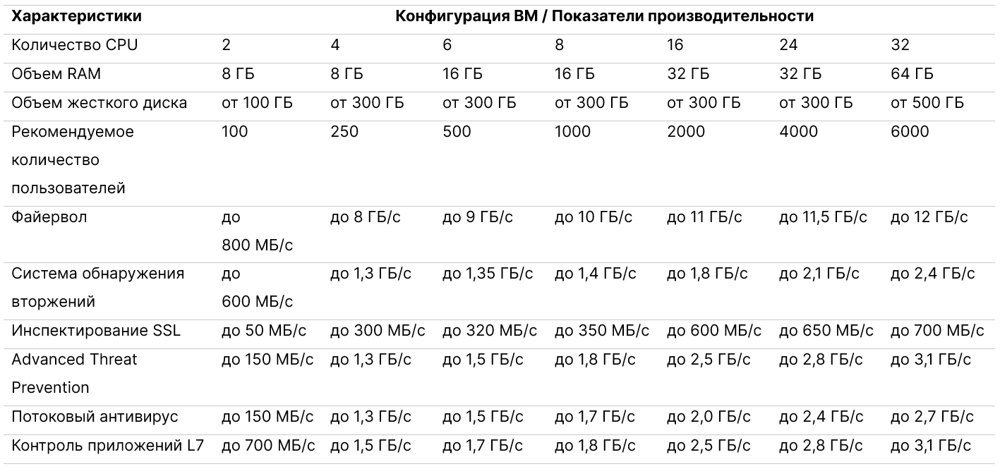

# {heading(Защита инфраструктуры с помощью UserGate NGFW)[id=marketplace-usergate-start]}

Вы можете настроить файервол нового поколения для защиты инфраструктуры от сетевых атак с помощью сервиса UserGate NGFW. Возможности сервиса:

- защита от атак;
- управление трафиком;
- аутентификация пользователей;
- блокировка вредоносного содержимого при просмотре внешних ресурсов интернета.

{cut(Рекомендуемые технические характеристики сервера для сервиса)}

{params[noBorder=true]}

Чтобы создать ВМ, у которой более 24 CPU, обратитесь в [техническую поддержку](/ru/contacts).

{/cut}

Данная инструкция поможет развернуть сервис UserGate NGFW на ВМ в {var(cloud)}, подключиться к консоли UserGate NGFW и добавить новую сеть через консоль сервиса.

Используя сервис UserGate NGFW, вы соглашаетесь с лицензионными соглашениями сервисов [Marketplace](../../../../start/legal/vk/marketplace) и [UserGate](https://www.usergate.com/ru/usergate-eula).

{note:warn}
UserGate NGFW предоставляется по модели BYOL (Bring Your Own Licence): самостоятельно приобретите [лицензию](https://www.usergate.com/ru/purchase) на использование сервиса.
{/note}

## {heading(Подготовительные шаги)[id=marketplace-usergate-start-prepare-step]}

1. {linkto(../../../../intro/onboarding/account/create-account#onboarding-create-account)[text=Зарегистрируйтесь]} в {var(cloud)}.
1. {linkto(../../../../networks/vnet/instructions/net#vnet-net-add)[text=Создайте]} сеть с доступом в интернет, если она не была создана ранее.
1. В {linkto(../../../../networks/vnet/instructions/net#vnet-net-subnet-edit)[text=настройках подсети]}, где будет размещена ВМ с развернутым сервисом, отключите опцию **Приватный DNS**.
1. {linkto(../../../../applications-and-services/marketplace/instructions/pr-instance-add#marketplace-pr-instance-add)[text=Разверните]} сервис UserGate NGFW:

   - Выберите ранее созданные сеть с доступом в интернет и подсеть.
   - Остальные параметры выберите на свое усмотрение.

   После завершения установки на почту придет одноразовая ссылка на логин и пароль. Запишите их. Сервис будет развернут по адресу вида `https://<ВНЕШНИЙ_IP-АДРЕС_ВМ>:8001` (консоль UserGate).

1. (Опционально) Настройте промежуточный сервер (jump host) для ВМ сервиса, чтобы повысить безопасность работы.

## {heading(1. Добавьте сеть в сервис)[id=marketplace-usergate-start-add-check]}

{note:info}
По умолчанию UserGate NGFW создается с единственной сетью для подключения к MGMT-порту.
{/note}

1. Перейдите в консоль UserGate напрямую по IP виртуальной машины или через промежуточный сервер.
1. На шаге выбора языка укажите **Русский**.
1. На шаге выбора часового пояса укажите **Europe/Moscow**.
1. Прочитайте и примите условия [лицензионного соглашения](https://www.usergate.com/ru/usergate-eula).
1. На шаге установки первого узла укажите логин и пароль, полученные после развертывания сервиса.
1. Нажмите кнопку **Старт**.

   Откроется дашборд консоли UserGate.

1. Перейдите в раздел **Настройки** → **Сеть** → **Интерфейсы**. Убедитесь, что в группе **Текущий узел** один сетевой адаптер (сеть, выбранная на этапе развертывания сервиса).
1. [Перейдите](https://msk.cloud.vk.com/app) в личный кабинет {var(cloud)}.
1. Перейдите в раздел **Облачные вычисления** → **Виртуальные машины**.
1. Откройте страницу ВМ сервиса (обычно `<ID>usergate`), нажав на ее имя в списке.
1. Перейдите на вкладку **Сети**.
1. {linkto(../../../../computing/iaas/instructions/vm/vm-add-net#iaas-vm-add-net-connect)[text=Подключите]} нужную сеть к ВМ.
1. Перезагрузите ВМ {linkto(../../../../computing/iaas/instructions/vm/vm-manage#iaas-vm-manage-start-stop-restart)[text=средствами {var(cloud)}]} или через [консоль UserGate](https://docs.usergate.com/upravlenie-ustrojstvom_84.html#Операции_с_сервером).

## {heading(2. Проверьте наличие добавленной сети)[id=marketplace-usergate-start-check-net]}

1. Перейдите в консоль UserGate напрямую по IP виртуальной машины или через промежуточный сервер.
1. Перейдите в раздел **Настройки** → **Сеть** → **Интерфейсы**.
1. Убедитесь, что в группе **Текущий узел** появился новый сетевой адаптер. Он будет неактивным.

Для расширенной конфигурации сервиса используйте официальную инструкцию [UserGate NGFW](https://docs.usergate.com/usergate-7x-11).

{note:info}
Рекомендации по работе с сервисом:

- При настройке сетевого интерфейса используйте статическую адресацию: IP-адрес должен совпадать с адресом, назначенным для порта ВМ. Посмотреть адрес можно на странице ВМ на вкладке **Сети**.
- Если вы подключаетесь к {linkto(../../../../networks/vnet/concepts/net-types#vnet-net-types-external-net)[text=внешней сети]}, настройте вручную IP-адреса в консоли UserGate. Воспользуйтесь реквизитами сети из раздела **Виртуальные сети** → **Сети**.
{/note}

## {heading(Удалите неиспользуемые ресурсы)[id=marketplace-usergate-start-delete]}

Работающая инфраструктура сервиса потребляет вычислительные ресурсы. Если она вам больше не нужна:

- {linkto(../../../../applications-and-services/marketplace/instructions/pr-instance-manage#marketplace-pr-instance-manage-delete)[text=Удалите]} инстанс сервиса UserGate NGFW.
- {linkto(../../../../networks/vnet/instructions/net#vnet-net-delete)[text=Удалите]} сеть, используемую для сервиса.
- {linkto(../../../../networks/vnet/instructions/ip/floating-ip#vnet-floating-ip-delete)[text=Удалите]} Floating IP-адрес, созданный во время развертывания сервиса.
