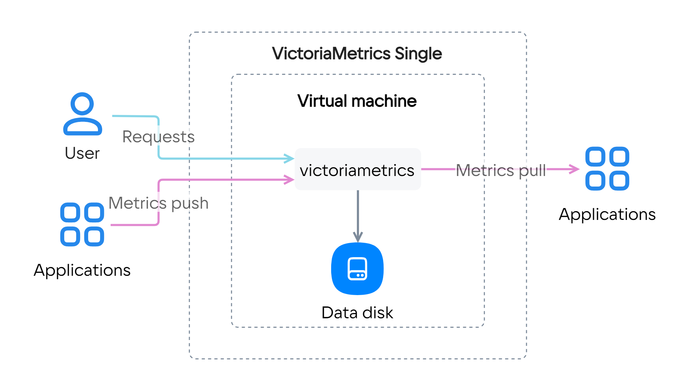
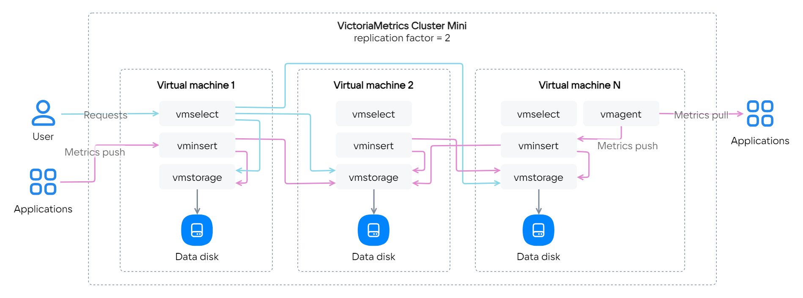

# {heading(Развертывание VictoriaMetrics)[id=marketplace-victoriametrics-start]}

Вы можете собирать, хранить и анализировать метрики в базе данных временных рядов (time series database) с помощью сервиса [VictoriaMetrics](https://msk.cloud.vk.com/app/services/marketplace/v2/apps/service/f260ad2b-bdc1-4ccc-a35f-2f440681e0f6/latest/info).

Инструкция поможет развернуть сервис VictoriaMetrics (на примере версии 1.93.9) на ВМ в {var(cloud)} и настроить сбор метрик.

Используя VictoriaMetrics, вы соглашаетесь с лицензионными соглашениями [Marketplace](../../../../start/legal/vk/marketplace) и [VictoriaMetrics](https://victoriametrics.com/assets/VM_EULA.pdf).

Чтобы развернуть сервис VictoriaMetrics в проекте:

1. {linkto(../../../../intro/onboarding/account/create-account#onboarding-create-account)[text=Зарегистрируйтесь]} в {var(cloud)}.
1. {linkto(../../../../networks/vnet/instructions/net#vnet-net-add)[text=Создайте]} сеть, если она не была создана ранее.
1. В {linkto(../../../../networks/vnet/instructions/net#vnet-net-subnet-edit)[text=настройках подсети]}, где будет размещены один или несколько серверов с развернутым сервисом, отключите опцию **Приватный DNS**.
1. {linkto(../../../../applications-and-services/marketplace/instructions/pr-instance-add#marketplace-pr-instance-add)[text=Разверните]} сервис в проекте, выбрав подходящий тарифный план (**Single**, **Cluster Mini**, **Cluster Maxi**):

   {cut(Подробнее о конфигурациях для тарифных планов)}

   {tabs}

   {tab(Single)}

   Один сервер, отвечающий за прием, хранение и обработку метрик. Сервис разворачивается на одной ВМ, поддерживает вертикальное масштабирование (увеличение CPU и RAM).

   

   {/tab}

   {tab(Cluster Mini)}

   Кластер из нескольких узлов с [компонентами](https://docs.victoriametrics.com/Cluster-VictoriaMetrics.html#architecture-overview):

   - `vminsert` — прием метрик в различных форматах;
   - `vmselect` — выполнение запросов для метрик, сохраненных в рамках `vmstorage`;
   - `vmstorage` — хранение метрик на диске.

   Дополнительно на любом узле можно настроить [vmagent](https://docs.victoriametrics.com/vmagent.html), исполняемый файл входит в поставку.

   Экземпляр сервиса разворачивается на заданном количестве узлов, каждый узел включает все три компонента. Все узлы в кластере равнозначные. {linkto(../../../../computing/iaas/concepts/vm/flavor#iaas-flavor)[text=Тип конфигурации]} и размер дисков устанавливается одинаковым для всех узлов кластера. Поддерживает вертикальное (увеличение CPU и RAM) и горизонтальное (добавление узлов) масштабирование.

   

   {/tab}

   {tab(Cluster Maxi)}

   Кластер из нескольких узлов с [компонентами](https://docs.victoriametrics.com/Cluster-VictoriaMetrics.html#architecture-overview):

   - `vminsert` — прием метрик в различных форматах;
   - `vmselect` — выполнение запросов для метрик, сохраненных в рамках `vmstorage`;
   - `vmstorage` — хранение метрик на диске.

   Дополнительно на любом узле можно настроить [vmagent](https://docs.victoriametrics.com/vmagent.html), исполняемый файл входит в поставку.

   Экземпляр сервиса разворачивается на заданном количестве узлов, каждый узел включает только один из компонентов. {linkto(../../../../computing/iaas/concepts/vm/flavor#iaas-flavor)[text=Тип конфигурации]} и размер дисков устанавливается индивидуально для каждого узла кластера. Поддерживает вертикальное (увеличение CPU и RAM) и горизонтальное (добавление узлов) масштабирование.

   

   {/tab}

   {/tabs}

   {/cut}

   {tabs}

   {tab(Single)}

   1. На шаге **Настройки VictoriaMetrics**:

      - **Резервное копирование**: выберите вариант `no`, чтобы не сохранять данные в объектное хранилище {linkto(../../../../storage/s3/concepts/about#s3-concepts-about)[text=VK Object Storage]}. При варианте `yes` будут скопированы данные за последние 7 дней.
      - **Сколько хранить все метрики**: укажите время хранения метрик с нужным суффиксом: `h` (час), `d` (день), `w` (неделя), `y` (год). Если не указать суффикс, в качестве единицы измерения используются месяцы. Минимальное значение — `24h` (`1d`), по умолчанию — `12` (12 месяцев).
      - **Параметры дедупликаци**: укажите периодичность удаления одинаковых метрик, используйте суффиксы `ms`, `s`, `m`, `h`. Метрика — это совокупность самой метрики и ее метаданных. Например, метрики `cpu{host=hostname1}` и `cpu{host=hostname2}` считаются разными. Значение по умолчанию — `1ms`.

   1. Нажмите кнопку **Следующий шаг**.
   1. На шаге **Параметры сервера**:

      - **Сеть**: выберите ранее созданные сеть и подсеть.
      - **Зона доступности**: выберите, в каком из центров обработки данных будет запущена ВМ.
      - **Тип виртуальной машины**: выберите предустановленную {linkto(../../../../computing/iaas/concepts/vm/flavor#iaas-flavor)[text=конфигурацию ВМ]}.
      - Для системного диска и диска с данными:

        - **Размер диска**: укажите нужный размер диска ВМ в гигабайтах.
        - **Тип диска**: выберите {linkto(../../../../computing/iaas/concepts/data-storage/disk-types#iaas-disk-types-list)[text=один из типов диска]} — HDD, SSD или High-IOPS SSD.

   1. Нажмите кнопку **Следующий шаг**.
   1. На шаге **Подтверждение** ознакомьтесь с рассчитанной стоимостью сервиса и нажмите кнопку **Подключить тариф**.

   {/tab}

   {tab(Cluster Mini)}

   1. На шаге **Настройки VictoriaMetrics**:

      - **Резервное копирование**: выберите вариант `no`, чтобы не сохранять данные в объектное хранилище {linkto(../../../../storage/s3/concepts/about#s3-concepts-about)[text=VK Object Storage]}. При варианте `yes` будут скопированы данные за последние 7 дней.
      - **Replication factor**: укажите количество копий метрик, которые будут записываться в `vmstorage` на разных ВМ.
      - **Сколько хранить все метрики**: укажите время хранения метрик с нужным суффиксом: `h` (час), `d` (день), `w` (неделя), `y` (год). Если не указать суффикс, в качестве единицы измерения используются месяцы. Минимальное значение — `24h` (`1d`), по умолчанию — `12` (12 месяцев).
      - **Параметры дедупликаци**: укажите периодичность удаления одинаковых метрик, используйте суффиксы `ms`, `s`, `m`, `h`. Метрика — это совокупность самой метрики и ее метаданных. Например, метрики `cpu{host=hostname1}` и `cpu{host=hostname2}` считаются разными. Значение по умолчанию — `1ms`.

   1. Нажмите кнопку **Следующий шаг**.
   1. На шаге **Параметры серверов**:

      - **Количество серверов**: укажите количество разворачиваемых ВМ в кластере.
      - **Сеть**: выберите ранее созданные сеть и подсеть.
      - **Зона доступности**: выберите, в каком из центров обработки данных будет запущена ВМ.
      - **Тип виртуальной машины**: выберите предустановленную {linkto(../../../../computing/iaas/concepts/vm/flavor#iaas-flavor)[text=конфигурацию ВМ]}.
      - Для системного диска и диска с данными:

        - **Размер диска**: укажите нужный размер диска ВМ в гигабайтах.
        - **Тип диска**: выберите {linkto(../../../../computing/iaas/concepts/data-storage/disk-types#iaas-disk-types-list)[text=один из типов диска]} — HDD, SSD или High-IOPS SSD.

   1. Нажмите кнопку **Следующий шаг**.
   1. На шаге **Подтверждение** ознакомьтесь с рассчитанной стоимостью сервиса и нажмите кнопку **Подключить тариф**.

   {/tab}

   {tab(Cluster Maxi)}

   1. На шаге **Настройки Кластера**:

      - **Резервное копирование**: выберите вариант `no`, чтобы не сохранять данные в объектное хранилище {linkto(../../../../storage/s3/concepts/about#s3-concepts-about)[text=VK Object Storage]}. При варианте `yes` будут скопированы данные за последние 7 дней.
      - **Replication factor**: укажите количество копий метрик, которые будут записываться в `vmstorage` на разных ВМ.
      - **Сколько хранить все метрики**: укажите время хранения метрик с нужным суффиксом: `h` (час), `d` (день), `w` (неделя), `y` (год). Если не указать суффикс, в качестве единицы измерения используются месяцы. Минимальное значение — `24h` (`1d`), по умолчанию — `12` (12 месяцев).
      - **Параметры дедупликаци**: укажите периодичность удаления одинаковых метрик, используйте суффиксы `ms`, `s`, `m`, `h`. Метрика — это совокупность самой метрики и ее метаданных. Например, метрики `cpu{host=hostname1}` и `cpu{host=hostname2}` считаются разными. Значение по умолчанию — `1ms`.

   1. Нажмите кнопку **Следующий шаг**.
   1. На шаге **Общие параметры**:

      - **Сеть**: выберите ранее созданные сеть и подсеть.
      - **Зона доступности**: выберите, в каком из центров обработки данных будет запущена ВМ.
      - **Размер диска**: укажите нужный размер диска ВМ в гигабайтах.
      - **Тип диска**: выберите {linkto(../../../../computing/iaas/concepts/data-storage/disk-types#iaas-disk-types-list)[text=один из типов диска]} — HDD, SSD или High-IOPS SSD.

   1. Нажмите кнопку **Следующий шаг**.
   1. На шаге **Параметры компонентов**:

      - Для каждого из компонентов `vmselect`, `vminsert` и `vmstorage` укажите количество разворачиваемых ВМ в кластере и {linkto(../../../../computing/iaas/concepts/vm/flavor#iaas-flavor)[text=тип виртуальной машины]}.
      - Для диска с данными для `vmstorage`:

        - **Размер диска**: укажите нужный размер диска ВМ в гигабайтах.
        - **Тип диска**: выберите {linkto(../../../../computing/iaas/concepts/data-storage/disk-types#iaas-disk-types-list)[text=один из типов диска]} — HDD, SSD или High-IOPS SSD.

   1. На шаге **Подтверждение** ознакомьтесь с рассчитанной стоимостью сервиса и нажмите кнопку **Подключить тариф**.

   {/tab}

   {/tabs}

   После завершения установки на почту придет одноразовая ссылка с доступами.

1. Перейдите по ссылке из письма.
1. Сохраните данные для доступа к VictoriaMetrics.

   {note:info}
   Если вы не сохранили данные для доступа, {linkto(../../../../applications-and-services/marketplace/instructions/pr-instance-manage#marketplace-pr-instance-manage-update-access)[text=сгенерируйте]} новые.
   {/note}

1. (Опционально) Настройте сбор метрик в зависимости от выбранной конфигурации:

   - **Single**: воспользуйтесь [инструкцией из официальной документации](https://docs.victoriametrics.com/Single-server-VictoriaMetrics.html#how-to-scrape-prometheus-exporters-such-as-node-exporter).
   - **Cluster Mini** и **Cluster Maxi**: воспользуйтесь утилитой [vmagent](https://docs.victoriametrics.com/vmagent.html).

   Для расширенной конфигурации сервиса используйте официальную инструкцию [VictoriaMetrics](https://docs.victoriametrics.com/guides).
