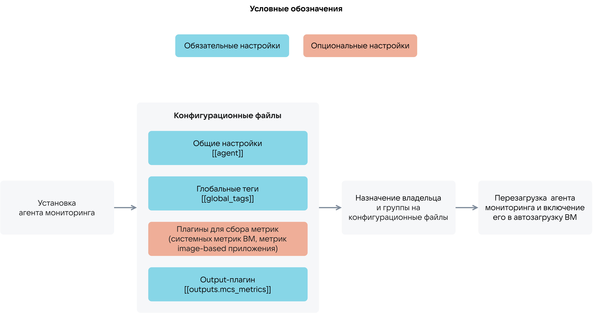

# {heading(Агент мониторинга)[id=ib_cloud_monitoring_telegraf]}

{var(sys1)} интегрирован с сервисом [Cloud Monitoring](/ru/monitoring-services/monitoring) облачной платформы, позволяющим собирать метрики для image-based приложений. Сбор метрик выполняется с помощью агента мониторинга (Telegraf). Схема использования агента мониторинга приведена на {linkto(#pic_use_agent)[text=рисунке %number]}.

{caption(Рисунок {counter(pic)[id=numb_pic_use_agent]} — Использование агента мониторинга)[align=center;position=under;id=pic_use_agent;number={const(numb_pic_use_agent)} ]}

{/caption}

Подробнее об использовании агента мониторинга — в разделах {linkto(../ib_cloud_monitoring_vm/#ib_cloud_monitoring_vm)[text=%text]} и {linkto(../ib_cloud_monitoring_app/#ib_cloud_monitoring_app)[text=%text]}.
