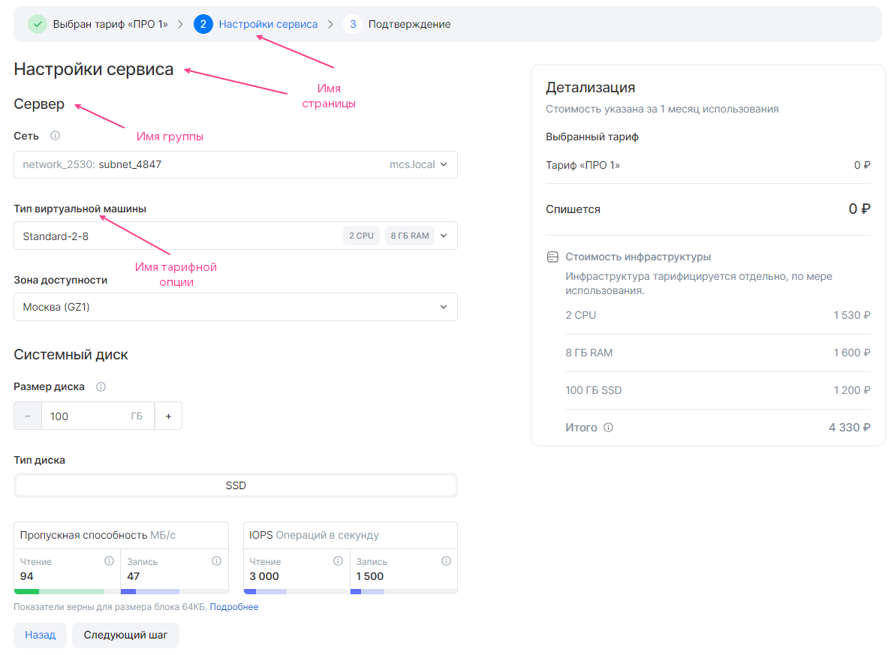
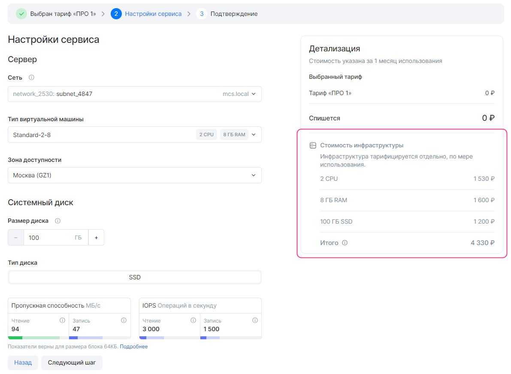
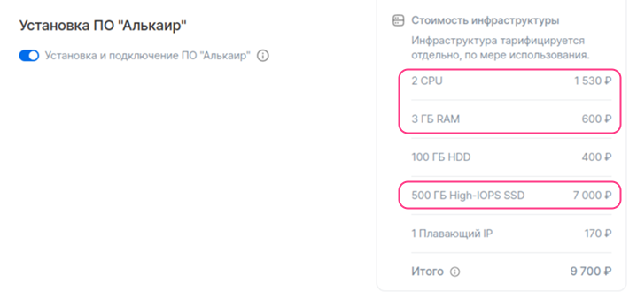

# {heading(Файл display.yaml)[id=ib_display]}

Чтобы описать {linkto(/ru/applications-and-services/marketplace/vendor/concepts/about/#xaas_wizard)[text=%text]}, в файле `plans/<PLAN_NAME>/display.yaml` укажите параметры, приведенные в {linkto(#tab_plans)[text=таблице %number]}.

{caption(Таблица {counter(table)[id=numb_tab_plans]} — Параметры файла plans/<PLAN_NAME>/display.yaml)[align=right;position=above;id=tab_plans;number={const(numb_tab_plans)}]}
[cols="2,5,2,2", options="header"]
|===
|Имя
|Описание
|Формат
|Обязательный

|pages
|
Описывает все страницы мастера конфигурации тарифного плана, кроме первой и последней.

Если параметр не указан, то мастер конфигурации будет состоять только из автоматически формируемых страниц
|Массив (подробнее — в разделе {linkto(../ib_display/#IBdisplay_pages)[text=%text]})
|
Нет

|entities
|
Описывает элементы инфраструктуры облачной платформы, чтобы в мастере конфигурации тарифного плана отображался расчет их стоимости:

* ВМ.
* Балансировщики нагрузки.
* Внешние IP-адреса.

Стоимость рассчитывается автоматически в соответствии с тарифами облачной платформы
|Массив (подробнее — в разделе {linkto(../ib_display/#IBdisplay_entities)[text=%text]})
|
Да
|===
{/caption}

## {heading(Массив pages)[id=IBdisplay_pages]}

По умолчанию в мастере конфигурации тарифного плана отображаются и настраиваются все группы тарифных опций `groups`. Чтобы настроить отображение групп в зависимости от условий, используйте конструкцию `when` (подробнее — в разделе {linkto(../ib_display/#IBdisplay_when)[text=%text]}).

Чтобы описать страницы мастера конфигурации тарифного плана ({linkto(#pic_wizard_ib_page)[text=рисунок %number]}):

1. В файле `plans/<PLAN_NAME>/display.yaml` укажите массив `pages`.
1. В `pages` задайте:

   * Параметр `name` — имя страницы. Не должно превышать 32 символа.
   * Массив `groups`.

1. В `groups` опишите группы тарифных опций для конкретной страницы мастера конфигурации тарифного плана. Для каждой группы задайте:

   * Параметр `name` — имя группы тарифных опций. Не должно превышать 255 символов.
   * Массив `parameters` — тарифные опции, входящие в группу.

1. В `parameters` для каждой тарифной опции укажите параметр `name` — имя ее YAML-файла.

   В интерфейсе {var(sys2)} тарифные опции будут отображаться с именами, заданными в секции `schema` в их YAML-файлах.

   <warn>

   Одна и та же тарифная опция может быть указана только в одной группе.

   </warn>
1. Опишите последующие страницы мастера конфигурации тарифного плана таким же образом. Максимальное количество страниц — 5.

{caption(Рисунок {counter(pic)[id=numb_pic_wizard_ib_page]} — Мастер конфигурации тарифного плана)[align=center;position=under;id=pic_wizard_ib_page;number={const(numb_pic_wizard_ib_page)} ]}

{/caption}

{caption(Пример описания страницы **Настройки сервиса** мастера конфигурации тарифного плана)[align=left;position=above]}
```yaml
pages:
- name: Настройки сервиса # Имя страницы
  groups:
  - name: Сервер # Имя группы тарифных опций
    parameters:
    - name: network # Имя YAML-файла тарифной опции
    - name: vm
    - name: az

  - name: Системный диск
    parameters:
    - name: volume_size
    - name: volume_type
```
{/caption}

<warn>

Все тарифные опции плана должны быть указаны в файле `plans/<PLAN_NAME>/display.yaml`.

</warn>

## {heading(Массив entities)[id=IBdisplay_entities]}

По умолчанию в мастере конфигурации тарифного плана рассчитывается стоимость всех элементов инфраструктуры, описанных в массиве `entities`. Чтобы настроить отображение стоимости инфраструктуры в зависимости от условий, используйте конструкцию `when` (подробнее — в разделе {linkto(../ib_display/#IBdisplay_when)[text=%text]}).

Тип элемента инфраструктуры определяется в параметре `entities.entity`:

* `vm` — ВМ.
* `load_balancing` — балансировщик нагрузки.
* `floating_ip` — внешний IP-адрес.

<warn>

Манифесты Terraform должны содержать описание элементов инфраструктуры из `entities`.

</warn>

### {heading(ВМ)[id=IBdisplay_vm]}

Чтобы в мастере конфигурации тарифного плана рассчитывалась стоимость ВМ ({linkto(#pic_wizard_ib_price)[text=рисунок %number]}):

1. В файле `plans/<PLAN_NAME>/display.yaml` укажите массив `entities`.
1. В `entities` задайте следующие параметры:

   * `entity` — тип элемента инфраструктуры. Укажите `vm`.
   * `description` — описание ВМ (опционально).
   * `count.const` или `count.param` — количество ВМ.

      Чтобы задать константу, укажите параметр `count.const` и его значение.

      Чтобы количество ВМ определялось значением тарифной опции, укажите параметр `count.param` и имя соответствующего YAML-файла.
   * `flavor.const` или `flavor.param` — тип ВМ.

      Чтобы задать константу, укажите параметр `flavor.const` и ID типа ВМ.

      Чтобы тип ВМ определялся значением тарифной опции, укажите параметр `flavor.param` и имя YAML-файла, описывающего тип ВМ (`datasource.type` = `flavor`).

1. Опишите диски ВМ с помощью массива `disks` (опционально, если в конфигурации инфраструктуры нет тарифной опции типа `datasource.type` = `volume_type`).

   1. Для каждого диска задайте следующие параметры:

      * `type.const` или `type.param` — тип диска.

         Чтобы тип диска определялся значением тарифной опции, укажите параметр `type.param` и имя YAML-файла тарифной опции, описывающего тип диска (`datasource.type` = `volume_type`).

         Чтобы задать константу, укажите параметр `type.const` и одно из значений:

         * `ceph-ssd` — диск типа SSD.
         * `ceph-hdd` — диск типа HDD.
         * `high-iops` — диск типа High-IOPS SSD (SSD с повышенной производительностью).

      * `size.const` или `size.param` — размер диска.

         Чтобы задать константу, укажите параметр `size.const` и его значение.

         Чтобы размер диска определялся значением тарифной опции, укажите параметр `size.param` и имя соответствующего YAML-файла тарифной опции.


{caption(Рисунок {counter(pic)[id=numb_pic_wizard_ib_price]} — Мастер конфигурации тарифного плана. Информация о стоимости инфраструктуры)[align=center;position=under;id=pic_wizard_ib_price;number={const(numb_pic_wizard_ib_price)} ]}

{/caption}

{caption(Пример описания ВМ для мастера конфигурации тарифного плана)[align=left;position=above]}
```yaml
entities:
  - entity: vm
    description: Виртуальная машина
    count:
      const: 1
    flavor:
      param: ds-flavor # Имя YAML-файла тарифной опции
    disks:
      - type:
          param: root_type
        size:
          param: root_size
      - type:
          param: data_type
        size:
          param: data_size
```
{/caption}

<warn>

Если в конфигурации инфраструктуры сервиса используется тарифная опция типа `datasource`, описывающая тип диска, то при описании ВМ массив `disks` обязательно должен быть заполнен.

</warn>

### {heading(Балансировщик нагрузки)[id=IBdisplay_lb]}

Чтобы в мастере конфигурации тарифного плана рассчитывалась стоимость балансировщика нагрузки:

1. В файле `plans/<PLAN_NAME>/display.yaml` укажите массив `entities`.
1. В `entities` задайте следующие параметры:

   * `entity` — тип элемента инфраструктуры. Укажите `load_balancing`.
   * `count.const` или `count.param` — количество балансировщиков нагрузки.

      Чтобы задать константу, укажите параметр `count.const` и его значение.

      Чтобы количество балансировщиков нагрузки определялось значением тарифной опции, укажите параметр `count.param` и имя соответствующего YAML-файла.

{caption(Пример описания балансировщика нагрузки для мастера конфигурации тарифного плана)[align=left;position=above]}
```yaml
entities:
  - entity: load_balancing
    count:
      param: number_balancing # Имя YAML-файла тарифной опции
```
{/caption}

### {heading(Внешний IP-адрес)[id=IBdisplay_floating_ip]}

Чтобы в мастере конфигурации тарифного плана рассчитывалась стоимость внешнего IP-адреса:

1. В файле `plans/<PLAN_NAME>/display.yaml` укажите массив `entities`.
1. В `entities` задайте следующие параметры:

   * `entity` — тип элемента инфраструктуры. Укажите `floating_ip`.
   * `count.const` или `count.param` — количество внешних IP-адресов.

      Чтобы задать константу, укажите параметр `count.const` и его значение.

      Чтобы количество внешних IP-адресов определялось значением тарифной опции, укажите параметр `count.param` и имя соответствующего YAML-файла.

{caption(Пример описания внешнего IP-адреса для мастера конфигурации тарифного плана)[align=left;position=above]}
```yaml
entities:
  - entity: floating_ip
    count:
      const: 1
```
{/caption}

## {heading(Конструкция when)[id=IBdisplay_when]}

Конструкция `when` управляет условным ветвлением. Она включает:

* Тип условия:

   * `when.in` — проверка равенства значений, заданных в параметрах `key` и `values`. Условие выполнено, если значение в `key` равно хотя бы одному из значений в `values`.
   * `when.not_in` — проверка неравенства значений, заданных в параметрах `key` и `values`. Условие выполнено, если значение в `key` не равно всем значениям в `values`.

* Критерии. Задаются в параметрах `key` и `values` одним из способов:

   * Через параметр `param` — чтобы использовать значение конкретной тарифной опции.
   * Через параметр `const` — чтобы использовать константу.

   В `key` можно задать одно значение, в `values` — одно или несколько.

{caption(Структура `when` в формате YAML)[align=left;position=above]}
```yaml
when:
  in: # Или not_in
    key:
      param: <OPTION> # Или const: <VALUE>
    values:
      - const: <VALUE>
      - param: <OPTION>
      ...
```
{/caption}

Здесь:

* `<OPTION>` — имя YAML-файла тарифной опции.
* `<VALUE>` — значение константы.

<warn>

Ресурсы в манифестах Terraform должны быть описаны с учетом условий, заданных в конструкциях `when`.

</warn>

### {heading(В массиве pages)[id=IBdisplay_when_in_pages]}

В массиве `pages` в конструкции `when` задается условие, определяющее отображать или нет группу тарифных опций.

<warn>

Поддерживается только первый уровень иерархии в зависимостях между группами. Если в группе указана конструкция `when`, тарифные опции этой группы (указанные в `parameters`) нельзя использовать в конструкции `when` в других группах.

</warn>

При использовании конструкции `when` страница с группами тарифных опций будет скрыта, если выполняются следующие условия:

* В рамках одной страницы все группы имеют конструкцию `when`.
* В мастере конфигурации тарифного плана заданы такие значения тарифных опций, что условия во всех группах на этой странице не выполняются.

Одна и та же тарифная опция может использоваться в конструкциях `when` в разных группах. В зависимости от значения тарифной опции будут отображаться те или иные группы.

{caption(Пример использования конструкции `when` в массиве `pages`)[align=left;position=above]}
```yaml
pages:
- name: Настройки бекапа # Имя страницы
  groups:
  - name: High-frequency бекап # Имя группы тарифных опций
    parameters:
    - name: frequency_per_day # Имя YAML-файла тарифной опции
    when:
      in:
        key:
          param: backup_method # Имя YAML-файла тарифной опции
        values:
          - const: high-frequency
```
{/caption}

В примере выше настраивается частота создания бекапов для метода high-frequency: если значение тарифной опции `backup_method` равно `high-frequency`, в мастере конфигурации тарифного плана отображать группу `High-frequency бекап` с тарифной опцией `frequency_per_day`.

Тарифная опция `backup_method`:

* Может использоваться в конструкции `when` в других группах.
* Должна быть задана в `parameters` в другой группе.

Тарифная опция `frequency_per_day` не может использоваться в других группах:

* В конструкции `when`, потому что поддерживается один уровень иерархии зависимостей.
* В `parameters`, потому что одна тарифная опция может быть указана только в одной группе.

### {heading(В массиве entities)[id=IBdisplay_when_in_entities]}

В массиве `entities` в конструкции `when` задается условие, добавлять или нет стоимость элемента, описанного в `entities`, в стоимость инфраструктуры инстанса сервиса. Стоимость отображается в мастере конфигурации тарифного плана.

{caption(Пример использования конструкции `when` в массиве `entities`)[align=left;position=above]}
```yaml
entities:
  - entity: vm
    description: alkair_software
    when:
      in:
        key:
          param: need_install_alkair_software # Имя YAML-файла тарифной опции
        values:
          - const: true
    flavor:
      const: 6a7a0690-943a-4921-936e-2849970ccfba # Тип ВМ (CPU, RAM). В данном примере тип ВМ с 2 CPU и 3 ГБ RAM
    count:
      const: 1
    disks:
      - type:
          const: high-iops # Тип диска
        size:
          const: 500 # Размер диска
```
{/caption}

В примере выше приведена настройка отображения стоимости ВМ для ПО Алькаир: если значение тарифной опции `need_install_alkair_software` равно `true`, в мастере конфигурации тарифного плана отображать стоимость ВМ, описанной в `entities.entity` ({linkto(#pic_alkair_included)[text=рисунок %number]}).

{caption(Рисунок {counter(pic)[id=numb_pic_alkair_included]} — Тарифная опция включена, стоимость ВМ для ПО Алькаир учитывается в стоимости инфраструктуры)[align=center;position=under;id=pic_alkair_included;number={const(numb_pic_alkair_included)} ]}

{/caption}
