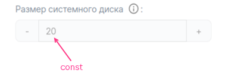
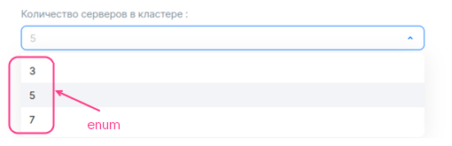
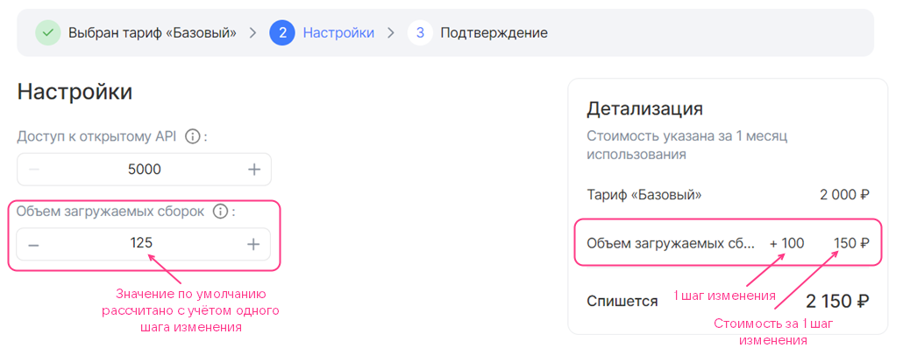
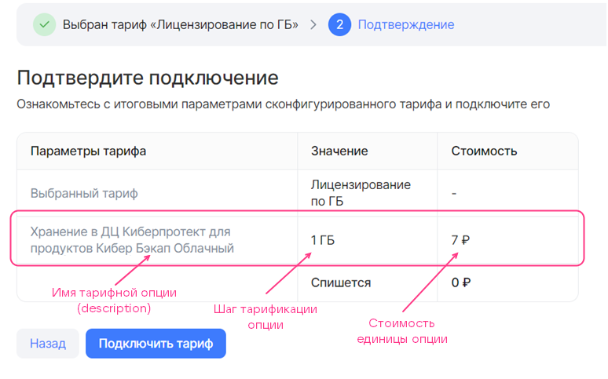
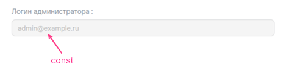
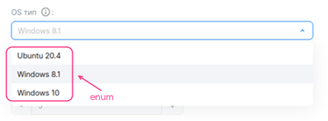
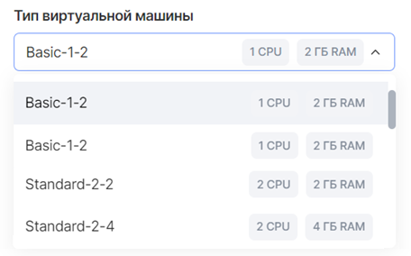
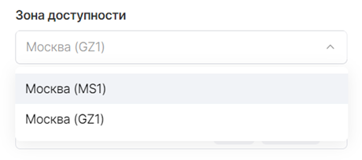
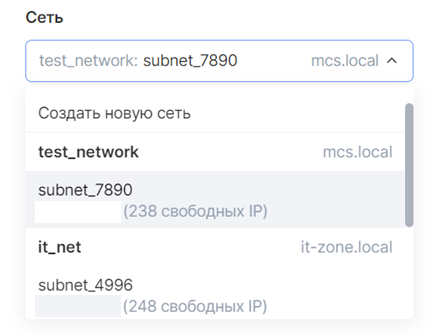
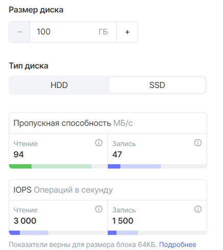

# {heading(Заполнение YAML-файлов тарифных опций)[id=IB_option_fill_in]}

В файлах `parameters/<OPTION_NAME>.yaml` опишите все тарифные опции (подробнее — в разделе {linkto(/ru/applications-and-services/marketplace/vendor/concepts/about/#xaas_option_types)[text=%text]}), которые будут использоваться хотя бы в одном тарифном плане.

Каждый отдельный YAML-файл соответствует одной тарифной опции. В нем описываются настройки тарифной опции, а для платных опций — стоимость.

Подробное описание параметров, используемых для описания тарифных опций, приведено в разделе [YAML-файл тарифной опции](../iboption).

## {heading(Бесплатная тарифная опция-константа типа integer)[id=option_int_const]}

Заполните файл `parameters/<OPTION_NAME>.yaml` следующим образом:

1. Укажите параметр `actions`.
1. В секции `schema` задайте следующие параметры:

   * `description` — имя тарифной опции.
   * `hint` — описание тарифной опции (опционально).
   * `type` — тип тарифной опции. Укажите `integer`.
   * `const` — значение тарифной опции.

{caption(Пример описания опции-константы типа `integer`, формат `YAML`)[align=left;position=above]}
```yaml
actions:
- create
- update

schema:
  description: Размер системного диска
  hint: В ГБ
  type: integer
  const: 20
```
{/caption}

На {linkto(#pic_option_int_const)[text=рисунке %number]} приведено, как вышеописанная опция будет отображаться в мастере конфигурации тарифного плана.

{caption(Рисунок {counter(pic)[id=numb_pic_option_int_const]} — Тарифная опция-константа типа integer)[align=center;position=under;id=pic_option_int_const;number={const(numb_pic_option_int_const)} ]}
{params[width=40%]}
{/caption}

## {heading(Бесплатная тарифная опция типа integer с выбором значения из списка)[id=option_int_enum]}

Заполните файл `parameters/<OPTION_NAME>.yaml` следующим образом:

1. Укажите параметр `actions`.
1. В секции `schema` задайте следующие параметры:

   * `description` — имя тарифной опции.
   * `hint` — описание тарифной опции (опционально).
   * `type` — тип тарифной опции. Укажите `integer`.
   * `enum` — возможные значения тарифной опции.
   * `default` — значение по умолчанию.

{caption(Пример описания опции типа `integer` с выбором значения из списка, формат `YAML`)[align=left;position=above]}
```yaml
actions:
- create
- update

schema:
  description: Количество серверов в кластере
  type: integer
  enum: [3, 5, 7]
  default: 5
```
{/caption}

На {linkto(#pic_option_int_enum)[text=рисунке %number]} приведено, как вышеописанная опция будет отображаться в мастере конфигурации тарифного плана.

{caption(Рисунок {counter(pic)[id=numb_pic_option_int_enum]} — Тарифная опция типа integer c выбором значения из списка)[align=center;position=under;id=pic_option_int_enum;number={const(numb_pic_option_int_enum)} ]}
{params[width=60%]}
{/caption}

## {heading(Бесплатная тарифная опция типа integer с шагом изменения 1)[id=option_int_step]}

Заполните файл `parameters/<OPTION_NAME>.yaml` следующим образом:

1. Укажите параметр `actions`.
1. В секции `schema` задайте следующие параметры:

   * `description` — имя тарифной опции.
   * `hint` — описание тарифной опции (опционально).
   * `type` — тип тарифной опции. Укажите `integer`.
   * `default` — значение по умолчанию (опционально).

      Если параметр не задан, то значение по умолчанию будет равно `0`.
   * `minimum` и `maximum` — максимальное и минимальное значения тарифной опции (опционально).

{caption(Пример описания бесплатной опции типа `integer` с шагом изменения 1, формат `YAML`)[align=left;position=above]}
```yaml
actions:
- create
- update

schema:
  description: Количество участников
  hint: Количество сотрудников компании заказчика, которые могут использовать инфраструктуру тестирования и обрабатывать отчеты от тестировщиков VK Testers.
  type: integer
  default: 20
  minimum: 20
```
{/caption}

На рисунках 3, 4 приведено, как вышеописанная опция будет отображаться в мастере конфигурации тарифного плана.

{caption(Рисунок {counter(pic)[id=numb_pic_option_int_step]} — Бесплатная тарифная опция типа integer с шагом изменения 1)[align=center;position=under;id=pic_option_int_step;number={const(numb_pic_option_int_step)} ]}

{/caption}

{caption(Рисунок {counter(pic)[id=numb_pic_option_int_step_plus]} — Бесплатная тарифная опция типа integer с шагом изменения 1, значение увеличено на 1 шаг)[align=center;position=under;id=pic_option_int_step_plus;number={const(numb_pic_option_int_step_plus)} ]}

{/caption}

## {heading(Бесплатная тарифная опция типа integer с пользовательским шагом изменения)[id=option_int_with_user_step_free]}

Заполните файл `parameters/<OPTION_NAME>.yaml` следующим образом:

1. Укажите параметр `actions`.
1. В секции `billing` задайте следующие параметры:

   * `base` — стандартное значение.
   * `cost` — стоимость шага изменения. Укажите `0`.
   * `unit.size` — размер шага изменения.
   * `unit.measurement` — единицы измерения тарифной опции (опционально).

   {caption(Пример заполнения секции `billing`)[align=left;position=above]}
   ```yaml
   billing:
     base: 25
     cost: 0
     unit:
        size: 100
   ```
   {/caption}
1. В секции `schema` задайте следующие параметры:

   * `description` — имя тарифной опции.
   * `hint` — описание тарифной опции (опционально).
   * `type` — тип тарифной опции. Укажите `integer`.
   * `default` — значение по умолчанию (опционально). Задается относительно стандартного значения опции:

      * Не указывайте параметр `default` или укажите `0`, чтобы значение по умолчанию было равно стандартному значению ({linkto(#pic_option_int_with_user_step_free)[text=рисунок %number]}).

         {caption(Рисунок {counter(pic)[id=numb_pic_option_int_with_user_step_free]} — Бесплатная тарифная опция типа integer с пользовательским шагом изменения (billing.base = 25, schema.default = 0, billing.unit.size = 100))[align=center;position=under;id=pic_option_int_with_user_step_free;number={const(numb_pic_option_int_with_user_step_free)} ]}
         
         {/caption}
      * Укажите `n`, чтобы значение по умолчанию рассчитывалось по формуле на основе стандартного значения и значения `n` ({linkto(#pic_option_int_with_user_step_free1)[text=рисунок %number]}, {linkto(#pic_option_int_with_user_step_free2)[text=рисунок %number]}):

         ```txt
         billing.base + n * billing.unit.size
         ```

         {caption(Рисунок {counter(pic)[id=numb_pic_option_int_with_user_step_free1]} — Бесплатная тарифная опция типа integer с пользовательским шагом изменения (billing.base = 25, schema.default = 1, billing.unit.size = 100))[align=center;position=under;id=pic_option_int_with_user_step_free1;number={const(numb_pic_option_int_with_user_step_free1)} ]}
         
         {/caption}

         {caption(Рисунок {counter(pic)[id=numb_pic_option_int_with_user_step_free2]} — Бесплатная тарифная опция типа integer с пользовательским шагом изменения (billing.base = 25, schema.default = 2, billing.unit.size = 100))[align=center;position=under;id=pic_option_int_with_user_step_free2;number={const(numb_pic_option_int_with_user_step_free2)} ]}
         
         {/caption}

   * `minimum` и `maximum` — максимальное и минимальное значения тарифной опции (опционально). Задается так же, как это было сделано для значения по умолчанию.

{caption(Пример описания бесплатной опции типа `integer` с пользовательским шагом изменения, формат `YAML`)[align=left;position=above]}
```yaml
actions:
- create
- update

billing:
  base: 25
  cost: 0
  unit:
     size: 100

schema:
  description: Объем загружаемых сборок
  hint: На платформу можно загружать тестовые сборки приложений для раздачи сотрудникам заказчика и тестировщикам VK Testers. Чем больше хранилище, тем больше версий ваших продуктов можно сохранять на платформе тестирования. Поддерживаемые платформы: iOS, Android, Windows, MacOS, Linux.
  type: integer
  default: 0
```
{/caption}

<info>

Подробное описание параметров секций `billing` и `schema` приведено в разделах {linkto(/ru/applications-and-services/marketplace/vendor/ibservice_add/ibservice_configure/iboption/#iboption_billing)[text=%text]} и {linkto(/ru/applications-and-services/marketplace/vendor/ibservice_add/ibservice_configure/iboption/#iboption_schema)[text=%text]} соответственно.

</info>

## {heading(Предоплатная тарифная опция типа integer с шагом изменения)[id=option_int_step_prepayed]}

Заполните файл `parameters/<OPTION_NAME>.yaml` следующим образом:

1. Укажите параметр `actions`.
1. В секции `billing` задайте следующие параметры ({linkto(#pic_option_int_step_prepayed)[text=рисунок %number]}, {linkto(#pic_option_int_step_prepayed1)[text=рисунок %number]}, {linkto(#pic_option_int_step_prepayed2)[text=рисунок %number]}):

   * `base` — стандартное значение. Стандартное значение входит в стоимость тарифного плана.
   * `cost` — стоимость шага изменения.
   * `unit.size` — размер шага изменения.
   * `unit.measurement` — единицы измерения тарифной опции (опционально).

      {caption(Пример заполнения секции `billing`)[align=left;position=above]}
      ```yaml
      billing:
        base: 25
        cost: 150
        unit:
           size: 100
      ```
      {/caption}

      В примере выше каждые 100 единиц опции, дополнительные к стандартному значению, стоят 150 денежных единиц.

   {caption(Рисунок {counter(pic)[id=numb_pic_option_int_step_prepayed]} — Платная тарифная опция типа integer c шагом изменения (billing.base = 25, billing.cost = 150, billing.unit.size = 100))[align=center;position=under;id=pic_option_int_step_prepayed;number={const(numb_pic_option_int_step_prepayed)} ]}
   
   {/caption}

   {caption(Рисунок {counter(pic)[id=numb_pic_option_int_step_prepayed1]} — Платная тарифная опция типа integer c шагом изменения, значение увеличено на 1 шаг (billing.base = 25, billing.cost = 150, billing.unit.size = 100))[align=center;position=under;id=pic_option_int_step_prepayed1;number={const(numb_pic_option_int_step_prepayed1)} ]}
   
   {/caption}

   {caption(Рисунок {counter(pic)[id=numb_pic_option_int_step_prepayed2]} — Платная тарифная опция типа integer c шагом изменения, значение увеличено на 2 шага (billing.base = 25, billing.cost = 150, billing.unit.size = 100))[align=center;position=under;id=pic_option_int_step_prepayed2;number={const(numb_pic_option_int_step_prepayed2)} ]}
   
   {/caption}
1. Заполните секцию `schema` таким же образом, как для бесплатной тарифной опции с пользовательским шагом изменения (подробнее — в разделе {linkto(../ibopt_fill_in/#option_int_with_user_step_free)[text=%text]}).

   Если для тарифной опции значение по умолчанию не равно стандартному значению (`schema.default ≠ 0`), то, когда пользователь переходит в мастер конфигурации тарифного плана, для такой тарифной опции будет отображаться ее стоимость ({linkto(#pic_option_int_step_prepayed3)[text=рисунок %number]}). Пользователь может уменьшить значение опции до стандартного, которое входит в стоимость тарифного плана.

   {caption(Рисунок {counter(pic)[id=numb_pic_option_int_step_prepayed3]} — Платная тарифная опция типа integer c шагом изменения (billing.base = 25, billing.cost = 150, billing.unit.size = 100, schema.default = 1))[align=center;position=under;id=pic_option_int_step_prepayed3;number={const(numb_pic_option_int_step_prepayed3)} ]}
   
   {/caption}

<info>

Подробное описание параметров секций `billing` и `schema` приведено в разделах {linkto(/ru/applications-and-services/marketplace/vendor/ibservice_add/ibservice_configure/iboption/#iboption_billing)[text=%text]} и {linkto(/ru/applications-and-services/marketplace/vendor/ibservice_add/ibservice_configure/iboption/#iboption_schema)[text=%text]} соответственно.

</info>

## {heading(Постоплатная тарифная опция типа integer или number)[id=option_postpayed_ib]}

<warn>

Имя YAML-файла постоплатной тарифной опции должно соответствовать значению `param` в API-запросе на передачу метрик (подробнее — в разделе {linkto(/ru/applications-and-services/marketplace/vendor/concepts/about/#billing_push)[text=%text]}).

</warn>

Заполните файл `parameters/<OPTION_NAME>.yaml` следующим образом:

1. Задайте значение параметра `actions` — `resource_usages`.
1. В секции `billing` задайте следующие параметры:

   * `cost` — стоимость единицы тарифной опции.
   * `unit.size` — шаг тарификации. Укажите `1`.
   * `unit.measurement` — единицы измерения тарифной опции (опционально).

1. В секции `schema` задайте следующие параметры:

   * `description` — имя тарифной опции.
   * `hint` — описание тарифной опции (опционально).
   * `type` — тип тарифной опции. Укажите `integer` или `number`.

{caption(Пример описания постоплатной числовой тарифной опции)[align=left;position=above]}
```yaml
actions:
- resource_usages

billing:
  cost: 7
  unit:
    size: 1
    measurement: ГБ

schema:
  description: Хранение в ДЦ Киберпротект для продуктов Бэкап Облачный
  type: number
```
{/caption}

На {linkto(#pic_option_postpayed_ib)[text=рисунке %number]} приведено, как вышеописанная опция будет отображаться в мастере конфигурации тарифного плана. Единица тарифной опции стоит 7 денежных единиц.

{caption(Рисунок {counter(pic)[id=numb_pic_option_postpayed_ib]} — Постоплатная тарифная опция)[align=center;position=under;id=pic_option_postpayed_ib;number={const(numb_pic_option_postpayed_ib)} ]}
{params[width=75%]}
{/caption}

## {heading(Бесплатная тарифная опция-константа типа string)[id=option_string]}

Заполните файл `parameters/<OPTION_NAME>.yaml` следующим образом:

1. Укажите параметр `actions`.
1. В секции `schema` задайте следующие параметры:

   * `description` — имя тарифной опции.
   * `hint` — описание тарифной опции (опционально).
   * `type` — тип тарифной опции. Укажите `string`.
   * `const` — значение тарифной опции.

{caption(Пример описания опции-константы типа `string`, формат `YAML`)[align=left;position=above]}
```yaml
actions:
- create
- update

schema:
  description: Логин администратора
  type: string
  const: admin@example.ru
```
{/caption}

На {linkto(#pic_option_string)[text=рисунке %number]} приведено, как вышеописанная опция будет отображаться в мастере конфигурации тарифного плана.

{caption(Рисунок {counter(pic)[id=numb_pic_option_string]} — Тарифная опция-константа типа string)[align=center;position=under;id=pic_option_string;number={const(numb_pic_option_string)} ]}
{params[width=60%]}
{/caption}

## {heading(Бесплатная тарифная опция типа string с вводом значения)[id=option_string_input]}

Заполните файл `parameters/<OPTION_NAME>.yaml` следующим образом:

1. Укажите параметр `actions`.
1. В секции `schema` задайте следующие параметры:

   * `description` — имя тарифной опции.
   * `hint` — описание тарифной опции (опционально).
   * `type` — тип тарифной опции. Укажите `string`.
   * `default` — значение по умолчанию.
   * Дополнительные параметры, приведенные в разделе {linkto(/ru/applications-and-services/marketplace/vendor/ibservice_add/ibservice_configure/iboption/#iboption_option_string)[text=%text]} (опционально).

{caption(Пример описания опции типа `string` с вводом значения, формат `YAML`)[align=left;position=above]}
```yaml
actions:
- create
- update

schema:
  description: Email администратора
  hint: Email для выпуска SSL-сертификата
  type: string
```
{/caption}

На {linkto(#pic_option_string_input)[text=рисунке %number]} приведено, как вышеописанная опция будет отображаться в мастере конфигурации тарифного плана.

{caption(Рисунок {counter(pic)[id=numb_pic_option_string_input]} — Тарифная опция типа string с вводом значения)[align=center;position=under;id=pic_option_string_input;number={const(numb_pic_option_string_input)} ]}
{params[width=40%]}
{/caption}

## {heading(Бесплатная тарифная опция типа string с выбором значения из списка)[id=option_string_enum]}

Заполните файл `parameters/<OPTION_NAME>.yaml` следующим образом:

1. Укажите параметр `actions`.
1. В секции `schema` задайте следующие параметры:

   * `description` — имя тарифной опции.
   * `hint` — описание тарифной опции (опционально).
   * `type` — тип тарифной опции. Укажите `string`.
   * `enum` — возможные значения тарифной опции.
   * `default` — значение по умолчанию.

{caption(Пример описания опции типа `string` с выбором значения из списка, формат `YAML`)[align=left;position=above]}
```yaml
actions:
- create
- update

schema:
  description: OS тип
  hint: Операционная система
  type: string
  enum: ["Ubuntu 20.4", "Windows 8.1", "Windows 10"]
  default: Windows 8.1
```
{/caption}

На {linkto(#pic_option_string_enum)[text=рисунке %number]} приведено, как вышеописанная опция будет отображаться в мастере конфигурации тарифного плана.

{caption(Рисунок {counter(pic)[id=numb_pic_option_string_enum]} — Тарифная опция типа string c выбором значения из списка)[align=center;position=under;id=pic_option_string_enum;number={const(numb_pic_option_string_enum)} ]}
{params[width=55%]}
{/caption}

## {heading(Бесплатная тарифная опция-константа типа boolean)[id=option_bool_const]}

Заполните файл `parameters/<OPTION_NAME>.yaml` следующим образом:

1. Укажите параметр `actions`.
1. В секции `schema` задайте следующие параметры:

   * `description` — имя тарифной опции.
   * `hint` — описание тарифной опции (опционально).
   * `type` — тип тарифной опции. Укажите `boolean`.
   * `const` — значение тарифной опции.

{caption(Пример описания опции-константы типа `boolean`, формат `YAML`)[align=left;position=above]}
```yaml
actions:
- create
- update

schema:
  description: Premium поддержка
  hint: Техническая поддержка 24/7
  type: boolean
  const: false
```
{/caption}

На {linkto(#pic_option_bool_const)[text=рисунке %number]} приведено, как вышеописанная опция будет отображаться в мастере конфигурации тарифного плана.

{caption(Рисунок {counter(pic)[id=numb_pic_option_bool_const]} — Тарифная опция-константа типа boolean (const = false))[align=center;position=under;id=pic_option_bool_const;number={const(numb_pic_option_bool_const)} ]}
{params[width=40%]}
{/caption}

## {heading(Бесплатная тарифная опция-переключатель boolean)[id=option_bool]}

Заполните файл `parameters/<OPTION_NAME>.yaml` следующим образом:

1. Укажите параметр `actions`.
1. В секции `schema` задайте следующие параметры:

   * `description` — имя тарифной опции.
   * `hint` — описание тарифной опции (опционально).
   * `type` — тип тарифной опции. Укажите `boolean`.
   * `default` — значение по умолчанию (опционально).

      Если параметр `default` не задан, то значение по умолчанию будет равно `false`.

{caption(Пример описания бесплатной опции-переключателя `boolean`, формат `YAML`)[align=left;position=above]}
```yaml
actions:
- create
- update

schema:
  description: Уведомления об обновлениях
  hint: Получать ли на почту уведомления о новых версиях сервиса.
  type: boolean
  default: true
```
{/caption}

На {linkto(#pic_option_bool)[text=рисунке %number]} приведено, как вышеописанная опция будет отображаться в мастере конфигурации тарифного плана.

{caption(Рисунок {counter(pic)[id=numb_pic_option_bool]} — Тарифная опция-переключатель boolean)[align=center;position=under;id=pic_option_bool;number={const(numb_pic_option_bool)} ]}
{params[width=50%]}
{/caption}

## {heading(Предоплатная тарифная опция-переключатель boolean)[id=option_bool_paid]}

Заполните файл `parameters/<OPTION_NAME>.yaml` следующим образом:

1. Укажите параметр `actions`.
1. В секции `schema` задайте следующие параметры:

   * `description` — имя тарифной опции.
   * `hint` — описание тарифной опции (опционально).
   * `type` — тип тарифной опции. Укажите `boolean`.
   * `default` — значение по умолчанию (опционально).

      Если параметр `default` не задан, то значение по умолчанию будет равно `false`.

1. В секции `billing` задайте параметр `cost` — стоимость опции, когда переключатель находится в активном положении.

{caption(Пример описания платной опции-переключателя `boolean`, формат `YAML`)[align=left;position=above]}
```yaml
actions:
- create
- update

schema:
  description: Уведомления о новых отчетах
  hint: Получать ли на почту уведомления о новых отчетах
  type: boolean
  default: true

billing:
  cost: 50
```
{/caption}

На {linkto(#pic_option_bool_paid)[text=рисунке %number]} приведено, как вышеописанная опция будет отображаться в мастере конфигурации тарифного плана.

{caption(Рисунок {counter(pic)[id=numb_pic_option_bool_paid]} — Платная тарифная опция-переключатель boolean)[align=center;position=under;id=pic_option_bool_paid;number={const(numb_pic_option_bool_paid)} ]}
{params[width=90%]}
{/caption}

## {heading(Тарифная опция типа datasource (тип ВМ))[id=option_datasource_flavor]}

Заполните файл `parameters/<OPTION_NAME>.yaml` следующим образом:

1. Укажите параметр `actions`.
1. В секции `schema` задайте следующие параметры:

   * `description` — имя тарифной опции.
   * `hint` — описание тарифной опции (опционально).
   * `type` — тип тарифной опции. Укажите `string`.
   * `datasource.type` — тип сущности облачной платформы. Укажите `flavor`.
   * `datasource.filter` — фильтры (опционально). Возможные фильтры приведены в разделе {linkto(/ru/applications-and-services/marketplace/vendor/ibservice_add/ibservice_configure/iboption/#iboption_option_datasource)[text=%text]}.

{caption(Пример описания опции `datasource` для типа ВМ, формат `YAML`)[align=left;position=above]}
```yaml
actions:
- create
- update

schema:
  description: Тип виртуальной машины
  type: string
  datasource:
    type: flavor
```
{/caption}

На {linkto(#pic_option_datasource_flavor)[text=рисунке %number]} приведено, как вышеописанная опция будет отображаться в мастере конфигурации тарифного плана.

{caption(Рисунок {counter(pic)[id=numb_pic_option_datasource_flavor]} — Тарифная опция datasource (тип ВМ))[align=center;position=under;id=pic_option_datasource_flavor;number={const(numb_pic_option_datasource_flavor)} ]}
{params[width=45%]}
{/caption}

## {heading(Тарифная опция типа datasource (зона доступности))[id=option_datasource_az]}

Заполните файл `parameters/<OPTION_NAME>.yaml` следующим образом:

1. Укажите параметр `actions`.
1. В секции `schema` задайте следующие параметры:

   * `description` — имя тарифной опции.
   * `hint` — описание тарифной опции (опционально).
   * `type` — тип тарифной опции. Укажите `string`.
   * `default` — значение по умолчанию (опционально). Возможные значения приведены в разделе {linkto(/ru/applications-and-services/marketplace/vendor/ibservice_add/ibservice_configure/iboption/#iboption_option_datasource)[text=%text]}.
   * `datasource.type` — тип сущности облачной платформы. Укажите `az`.

{caption(Пример описания опции `datasource` для зоны доступности, формат `YAML`)[align=left;position=above]}
```yaml
actions:
- create
- update

schema:
  description: Зона доступности
  type: string
  default: gz1
  datasource:
    type: az
```
{/caption}

На {linkto(#pic_option_datasource_az)[text=рисунке %number]} приведено, как вышеописанная опция будет отображаться в мастере конфигурации тарифного плана.

{caption(Рисунок {counter(pic)[id=numb_pic_option_datasource_az]} — Тарифная опция datasource (зона доступности))[align=center;position=under;id=pic_option_datasource_az;number={const(numb_pic_option_datasource_az)} ]}
{params[width=45%]}
{/caption}

## {heading(Тарифная опция опция типа datasource (виртуальная сеть))[id=option_datasource_subnet]}

Заполните файл `parameters/<OPTION_NAME>.yaml` следующим образом:

1. Укажите параметр `actions`.
1. В секции `schema` задайте следующие параметры:

   * `description` — имя тарифной опции.
   * `hint` — описание тарифной опции (опционально).
   * `type` — тип тарифной опции. Укажите `string`.
   * `datasource.type` — тип сущности облачной платформы. Укажите `subnet`.

{caption(Пример описания опции `datasource` для виртуальной сети, формат `YAML`)[align=left;position=above]}
```yaml
actions:
- create
- update

schema:
  description: Сеть
  type: string
  datasource:
    type: subnet
```
{/caption}

На {linkto(#pic_option_datasource_subnet)[text=рисунке %number]} приведено, как вышеописанная опция будет отображаться в мастере конфигурации тарифного плана.

{caption(Рисунок {counter(pic)[id=numb_pic_option_datasource_subnet]} — Тарифная опция datasource (виртуальная сеть))[align=center;position=under;id=pic_option_datasource_subnet;number={const(numb_pic_option_datasource_subnet)} ]}
{params[width=40%]}
{/caption}

## {heading(Описание диска с помощью файлов тарифных опций)[id=IBoption_fill_in_volume]}

Диск описывается двумя тарифными опциями (двумя отдельными YAML-файлами):

* Тип диска — с помощью тарифной опции типа `datasource`.
* Размер диска — с помощью тарифной опции типа `integer` с шагом изменения 1.

Чтобы описать диск:

1. Опишите тарифную опцию типа `datasource`, получающую данные облачной платформы о типах дисков, в файле `parameters/<OPTION_NAME>.yaml`:

   1. Укажите параметр `actions`.
   1. В секции `schema` задайте следующие параметры:

      * `description` — имя тарифной опции.
      * `hint` — описание тарифной опции (опционально).
      * `type` — тип тарифной опции. Укажите `string`.
      * `default` — значение по умолчанию (опционально). Возможные значения приведены в разделе {linkto(/ru/applications-and-services/marketplace/vendor/ibservice_add/ibservice_configure/iboption/#iboption_option_datasource)[text=%text]}.
      * `tag` — тег. Тег связывает опцию, описывающую тип диска, с опцией, описывающей размер диска.
      * `datasource.type` — тип сущности облачной платформы. Укажите `volume_type`.
      * `datasource.filter` — фильтры (опционально). Возможные фильтры приведены в разделе {linkto(/ru/applications-and-services/marketplace/vendor/ibservice_add/ibservice_configure/iboption/#iboption_option_datasource)[text=%text]}.

         Если фильтры не указаны, то будут отображаться все типы дисков, поддерживаемые облачной платформой.

   {caption(Пример описания опции `datasource` для типа диска, формат `YAML`)[align=left;position=above]}
   ```yaml
   actions:
   - create
   - update

   schema:
     description: Тип диска
     type: string
     default: ceph-ssd
     tag: disk1
     datasource:
       type: volume_type
       filter:
         disk_class:
           enum: ["ssd", "hdd"]
   ```
   {/caption}
1. В отдельном файле `parameters/<OPTION_NAME>.yaml` опишите размер диска с помощью тарифной опции типа `integer` с шагом изменения 1:

   1. Укажите параметр `actions`.
   1. В секции `schema` задайте следующие параметры:

      * `description` — имя тарифной опции.
      * `hint` — описание тарифной опции (опционально).
      * `type` — тип тарифной опции. Укажите `integer`.
      * `default` — значение по умолчанию (опционально).
      * `maximum` и `minimum` — максимальное и минимальное значения (опционально).
      * `tag` — тег. Значение должно быть такое же, как в файле, описывающем тип диска.

      <info>

      Размер диска измеряется в ГБ.

      </info>

   {caption(Пример описания размера диска через тарифную опцию типа `integer` с шагом изменения 1, формат `YAML`)[align=left;position=above]}
   ```yaml
   actions:
   - create
   - update

   schema:
     description: Размер диска
     type: integer
     default: 100
     minimum: 100
     tag: disk1
   ```
   {/caption}

<warn>

Стоимость диска определяется тарифами облачной платформы, поэтому ее нельзя задать в описании тарифной опции.

</warn>

На {linkto(#pic_option_fill_in_volume)[text=рисунке %number]} приведено, как вышеописанные опции (тип и размер диска) будут отображаться в мастере конфигурации тарифного плана.

{caption(Рисунок {counter(pic)[id=numb_pic_option_fill_in_volume]} — Тарифные опции типа integer и datasource, позволяющие настроить размер и тип диска)[align=center;position=under;id=pic_option_fill_in_volume;number={const(numb_pic_option_fill_in_volume)} ]}
{params[width=40%]}
{/caption}
