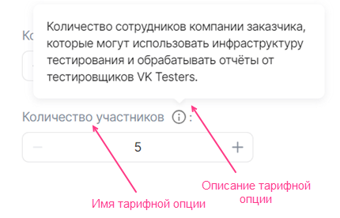
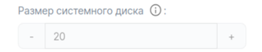
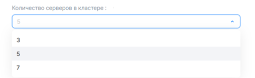
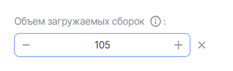
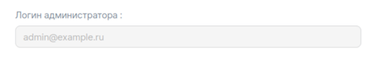
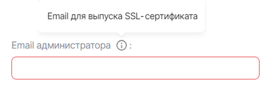
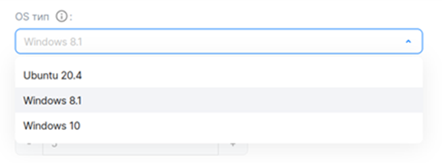
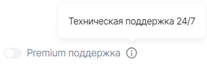

## {heading(Структура)[id=iboption_structure]}

<warn>

Имя YAML-файла постоплатной тарифной опции должно соответствовать значению `param` в API-запросе на передачу метрик (подробнее — в разделе {linkto(/ru/applications-and-services/marketplace/vendor/concepts/about/#billing_push)[text=%text]}).

</warn>

Тарифная опция описывается параметрами и секциями, приведенными в {linkto(#tab_top_level_options)[text=таблице %number]}.

{caption(Таблица {counter(table)[id=numb_tab_top_level_options]} — Параметры и секции для описания тарифной опции)[align=right;position=above;id=tab_top_level_options;number={const(numb_tab_top_level_options)}]}
[cols="2,5,2", options="header"]
|===
|Имя
|Описание
|Обязательный

|actions
|
Параметр определяет способ тарификации опции (подробнее — в разделе {linkto(/ru/applications-and-services/marketplace/vendor/concepts/about/#xaas_billing)[text=%text]}). Возможные значения:

* Для бесплатной или предоплатной тарификации укажите одно или оба значения:

   * `create` — опция будет активна при подключении сервиса.
   * `update` — опция будет активна при обновлении тарифного плана.

   Если опция активна, пользователь сможет изменить ее значение.
* Для постоплатной тарификации укажите значение `resource_usages`

|Да

|schema
|
Секция определяет:

* Тип тарифной опции.
* Имя и описание тарифной опции ({linkto(#pic_tariff_option)[text=рисунок %number]}).
* Настройки значения тарифной опции.

Параметры секции приведены в разделе {linkto(#iboption_schema)[text=%text]}
|Да

|billing
|
Секция определяет:

* Стоимость тарифной опции.
* Пользовательский шаг изменения для тарифной опции типа `integer`.

Параметры секции приведены в разделе {linkto(#iboption_billing)[text=%text]}
|Нет
|===
{/caption}

{caption(Рисунок {counter(pic)[id=numb_pic_tariff_option]} — Тарифная опция)[align=center;position=under;id=pic_tariff_option;number={const(numb_pic_tariff_option)} ]}
{params[width=45%]}
{/caption}

Примеры описания разных типов тарифных опций приведены в разделе {linkto(../ibopt_fill_in/#IB_option_fill_in)[text=%text]}.

## {heading(Секция billing)[id=iboption_billing]}

Платными тарифными опциями могут быть опции следующих типов:

* Числовой (`integer`, `number`). Поддерживается предоплатная и постоплатная тарификация.
* Логический (`boolean`). Поддерживается предоплатная тарификация.

Подробнее о типах тарификации — в разделе {linkto(/ru/applications-and-services/marketplace/vendor/concepts/about/#xaas_billing)[text=%text]}.

В зависимости от типа тарификации и типа опции в секции `billing` укажите параметры и дочерние секции, приведенные в {linkto(#tab_billing_integer)[text=таблице %number]}, {linkto(#tab_billing_boolean)[text=таблице %number]}, {linkto(#tab_billing_number)[text=таблице %number]}.

{caption(Таблица {counter(table)[id=numb_tab_billing_integer]} — Параметры секции billing для предоплатной опции типа integer с шагом изменения)[align=right;position=above;id=tab_billing_integer;number={const(numb_tab_billing_integer)}]}
[cols="2,5,2,2", options="header"]
|===
|Имя
|Описание
|Формат
|Обязательный

|base
|
Определяет стандартное значение тарифной опции, входящее в стоимость тарифного плана.

Стандартное значение — это минимальное значение, которое может задать пользователь.

Если параметр не задан, то стандартное значение тарифной опции автоматически будет равно `0`
|integer
|Нет

|cost
|
Определяет стоимость шага, на который можно изменить значение тарифной опции.

Если изменение опции бесплатно, то укажите `0`. Параметры шага определяются в секции `unit`
|float64, >= 0
|Да

|unit
|
Определяет параметры шага изменения опции
|—
|Да

4+|Параметры секции `unit`

|unit.size
|
Определяет размер шага, на который можно изменить значение тарифной опции.

Значение, указанное в этом параметре, тарифицируется в соответствии со стоимостью, заданной в параметре `billig.cost`
|integer, > 0
|Да

|unit.measurement
|
Определяет единицы измерения шага, заданного в параметре `unit.size`
|string, до 255 символов
|Нет
|===
{/caption}

{caption(Таблица {counter(table)[id=numb_tab_billing_boolean]} — Параметры секции billing для предоплатной опции-переключателя boolean)[align=right;position=above;id=tab_billing_boolean;number={const(numb_tab_billing_boolean)}]}
[cols="2,5,2,2", options="header"]
|===
|Имя
|Описание
|Формат
|Обязательный

|cost
|
Определяет стоимость опции
|float64, >= 0
|Да
|===
{/caption}

{caption(Таблица {counter(table)[id=numb_tab_billing_number]} — Параметры секции billing для постоплатной опции типа integer или number)[align=right;position=above;id=tab_billing_number;number={const(numb_tab_billing_number)}]}
[cols="2,5,2,2", options="header"]
|===
|Имя
|Описание
|Формат
|Обязательный

|cost
|
Определяет стоимость единицы тарифной опции
|float64, >= 0
|Да

|unit
|
Определяет единицы измерения опции
|—
|Да

4+|Параметры секции `unit`

|unit.size
|
Шаг тарификации опции. Значение должно быть `1`
|integer
|Да

|unit.measurement
|
Определяет единицы измерения опции
|string, до 255 символов
|Нет
|===
{/caption}

<warn>

Постоплатные тарифные опции могут быть только в бесплатном тарифном плане.

</warn>

## {heading(Секция schema)[id=iboption_schema]}

### {heading(Секция schema для числовых тарифных опций)[id=iboption_numeric_schemas]}

#### {heading(Бесплатная или предоплатная тарифная опция типа integer)[id=iboption_option_integer]}

Подтипы тарифной опции `integer`:

* Константа ({linkto(#pic_tariff_option_integer)[text=рисунок %number]}).

   {caption(Рисунок {counter(pic)[id=numb_pic_tariff_option_integer]} — Тарифная опция-константа типа integer)[align=center;position=under;id=pic_tariff_option_integer;number={const(numb_pic_tariff_option_integer)} ]}
   {params[width=40%]}
   {/caption}
* С выбором значения из списка ({linkto(#pic_tariff_option_select)[text=рисунок %number]}).

   {caption(Рисунок {counter(pic)[id=numb_pic_tariff_option_select]} — Тарифная опция типа integer c выбором значения из списка)[align=center;position=under;id=pic_tariff_option_select;number={const(numb_pic_tariff_option_select)} ]}
   {params[width=60%]}
   {/caption}
* С шагом изменения ({linkto(#pic_tariff_option_step)[text=рисунок %number]}, {linkto(#pic_tariff_option_step_plus)[text=рисунок %number]}).

   По умолчанию шаг изменения опции равен 1. Изменить размер шага, а также сделать его платным можно в секции {linkto(#iboption_billing)[text=%text]}.

   {caption(Рисунок {counter(pic)[id=numb_pic_tariff_option_step]} — Тарифная опция типа integer с шагом изменения)[align=center;position=under;id=pic_tariff_option_step;number={const(numb_pic_tariff_option_step)} ]}
   {params[width=35%]}
   {/caption}

   {caption(Рисунок {counter(pic)[id=numb_pic_tariff_option_step_plus]} — Тарифная опция типа integer с шагом изменения, значение увеличено на шаг изменения)[align=center;position=under;id=pic_tariff_option_step_plus;number={const(numb_pic_tariff_option_step_plus)} ]}
   {params[width=40%]}
   {/caption}

Параметры для бесплатной или предоплатной тарифной опции типа `integer` приведены в {linkto(#tab_tariff_option_integer)[text=таблице %number]}. Стоимость опции описывается в секции {linkto(#iboption_billing)[text=%text]}.

{caption(Таблица {counter(table)[id=numb_tab_tariff_option_integer]} — Секция schema для тарифной опции типа integer)[align=right;position=above;id=tab_tariff_option_integer;number={const(numb_tab_tariff_option_integer)}]}
[cols="2,5,2,2", options="header"]
|===
|Имя
|Описание
|Формат
|Обязательный

4+|**Основные параметры тарифной опции, одинаковые для всех подтипов**

|description
|
Имя тарифной опции
|string, до 255 символов
|
Да

|hint
|
Подсказка с описанием тарифной опции
|string, до 255 символов
|
Нет

|type
|
Определяет тип тарифной опции. Укажите значение `integer`
|—
|
Да

4+|**Параметры, чтобы настроить подтип тарифной опции**

4+|**Параметр для опции-константы**

|const
|
Определяет значение тарифной опции-константы
|integer
|
Да

4+|**Параметры для опции с выбором значения**

|enum
|
Определяет список значений, среди которых пользователь сможет выбрать одно
|Список, внутри списка — integer
|
Да

|default
|
Определяет значение тарифной опции по умолчанию
|integer
|
Да

4+|**Параметры для опции c шагом изменения 1**

|default
|
Определяет значение тарифной опции по умолчанию.

Если параметр не задан, то значение по умолчанию равно `0`
|integer, >= 0 или `minimum`, &#8656; `maximum`
|
Нет

|minimum
|
Определяет минимальное значение тарифной опции
|integer, >= 0 и &#8656; `maximum`
|
Нет

|maximum
|
Определяет максимальное значение тарифной опции
|integer, > 0 и >= `minimum`
|
Нет

|tag
|
Тег. Позволяет связать несколько опций между собой.

Используется, чтобы описать диск (подробнее — в разделе {linkto(../ibopt_fill_in/#IBoption_fill_in_volume)[text=%text]})
|string
|
Нет

4+|**Параметры для опции c пользовательским шагом изменения. Шаг изменения настраивается в секции {linkto(#iboption_billing)[text=%text]}**

|default
|
Определяет значение тарифной опции по умолчанию, рассчитанное относительно стандартного значения (стандартное значение задается в параметре `billing.base`):

* Если задано значение `0`, то значение по умолчанию тарифной опции равно стандартному значению (задано в параметре `billing.base`).
* Если задано значение `n > 0`, то значение по умолчанию тарифной опции складывается из стандартного значения и шага изменения, кратного `n`:

   ```
   billing.base + n * billing.unit.size
   ```

|integer, >= 0 или `minimum`, &#8656; `maximum`
|
Нет

|minimum
|
Определяет минимальное значение тарифной опции, рассчитанное относительно стандартного значения (стандартное значение задается в параметре `billing.base`) :

* Если задано значение `0`, то минимальное значение тарифной опции равно стандартному значению.
* Если задано значение `n > 0`, то минимальное значение тарифной опции складывается из стандартного значения и шага изменения, кратного `n`:

   ```
   billing.base + n * billing.unit.size
   ```

|integer, >= 0 и &#8656; `maximum`
|
Нет

|maximum
|
Определяет максимальное значение тарифной опции, рассчитанное относительно стандартного значения (стандартное значение задается в параметре `billing.base`):

* Если задано значение `0`, то максимальное значение тарифной опции равно стандартному значению.
* Если задано значение `n > 0`, то максимальное значение тарифной опции складывается из стандартного значения и шага изменения, кратного `n`:

   ```
   billing.base + n * billing.unit.size
   ```

|integer, > 0 и >= `minimum`
|
Нет
|===
{/caption}

#### {heading(Постоплатная тарифная опция типа integer или number)[id=iboption_option_postpaid]}

Параметры для постоплатной числовой тарифной опции приведены в {linkto(#tab_tariff_option_postpaid)[text=таблице %number]}. Стоимость опции описывается в секции {linkto(#iboption_billing)[text=%text]}.

{caption(Таблица {counter(table)[id=numb_tab_tariff_option_postpaid]} — Секция schema для постоплатной опции)[align=right;position=above;id=tab_tariff_option_postpaid;number={const(numb_tab_tariff_option_postpaid)}]}
[cols="2,5,2,2", options="header"]
|===
|Имя
|Описание
|Формат
|Обязательный

|description
|
Имя тарифной опции
|string, до 255 символов
|Да

|hint
|
Подсказка с описанием тарифной опции
|string, до 255 символов
|Нет

|type
|
Определяет тип тарифной опции. Укажите значение `integer` или `number`
|—
|Да
|===
{/caption}

### {heading(Секция schema для тарифной опции типа string)[id=iboption_option_string]}

Подтипы тарифной опции `string`:

* Константа ({linkto(#pic_option_string_const)[text=рисунок %number]}).

   {caption(Рисунок {counter(pic)[id=numb_pic_option_string_const]} — Тарифная опция-константа типа string)[align=center;position=under;id=pic_option_string_const;number={const(numb_pic_option_string_const)} ]}
   {params[width=60%]}
   {/caption}
* С вводом значения ({linkto(#pic_option_string_input)[text=рисунок %number]}).

   {caption(Рисунок {counter(pic)[id=numb_pic_option_string_input]} — Тарифная опция типа string c вводом значения)[align=center;position=under;id=pic_option_string_input;number={const(numb_pic_option_string_input)} ]}
   {params[width=45%]}
   {/caption}
* С выбором значения из списка ({linkto(#pic_option_string_enum)[text=рисунок %number]}).

   {caption(Рисунок {counter(pic)[id=numb_pic_option_string_enum]} — Тарифная опция типа string c выбором значения из списка)[align=center;position=under;id=pic_option_string_enum;number={const(numb_pic_option_string_enum)} ]}
   {params[width=60%]}
   {/caption}

Параметры для тарифной опции типа `string` приведены в {linkto(#tab_option_string)[text=таблице %number]}.

{caption(Таблица {counter(table)[id=numb_tab_option_string]} — Секция schema для тарифной опции типа string)[align=right;position=above;id=tab_option_string;number={const(numb_tab_option_string)}]}
[cols="2,5,2,2", options="header"]
|===
|Имя
|Описание
|Формат
|Обязательный

4+|**Основные параметры тарифной опции, одинаковые для всех подтипов**

|description
|
Имя тарифной опции
|string, до 255 символов
|Да

|hint
|
Подсказка с описанием тарифной опции
|string, до 255 символов
|Нет

|type
|
Определяет тип тарифной опции. Укажите значение `string`
|—
|Да

4+|**Параметры, чтобы настроить подтип тарифной опции**

4+|**Параметр для опции-константы**

|const
|
Определяет значение тарифной опции-константы
|string
|Да

4+|**Параметры для опции c вводом значения**

|default
|
Определяет значение по умолчанию
|string
|Нет

|pattern
|
Определяет шаблон, которому должно соответствовать значение тарифной опции
|regex
|Нет

|minLength
|
Определяет минимальное количество символов для значения тарифной опции
|integer, > 0 и &#8656; `maxLength`
|Нет

|maxLength
|
Определяет максимальное количество символов для значения тарифной опции
|integer, > 0 и >= `minLength`
|Нет

4+|**Параметры для опции с выбором значения из списка**

|enum
|
Определяет список значений, среди которых пользователь сможет выбрать одно
|Список, внутри списка — string
|Да

|default
|
Определяет значение по умолчанию
|string
|Да
|===
{/caption}

### {heading(Секция schema для тарифной опции типа boolean)[id=iboption_option_boolean]}

Подтип тарифной опции `boolean`:

* Константа ({linkto(#pic_option_boolean_const)[text=рисунок %number]}).

   {caption(Рисунок {counter(pic)[id=numb_pic_option_boolean_const]} — Тарифная опция-константа типа boolean)[align=center;position=under;id=pic_option_boolean_const;number={const(numb_pic_option_boolean_const)} ]}
   {params[width=35%]}
   {/caption}
* Переключатель ({linkto(#pic_option_boolean)[text=рисунок %number]}).

   {caption(Рисунок {counter(pic)[id=numb_pic_option_boolean]} — Переключатель boolean)[align=center;position=under;id=pic_option_boolean;number={const(numb_pic_option_boolean)} ]}
   {params[width=50%]}
   {/caption}

Параметры для тарифной опции типа `boolean` приведены в {linkto(#tab_option_boolean)[text=таблице %number]}.

{caption(Таблица {counter(table)[id=numb_tab_option_boolean]} — Секция schema для тарифной опции типа boolean)[align=right;position=above;id=tab_option_boolean;number={const(numb_tab_option_boolean)}]}
[cols="2,5,2,2", options="header"]
|===
|Имя
|Описание
|Формат
|Обязательный

4+|**Основные параметры тарифной опции, одинаковые для всех подтипов**

|description
|
Имя тарифной опции
|string, до 255 символов
|Да

|hint
|
Подсказка с описанием тарифной опции
|string, до 255 символов
|Нет

|type
|
Определяет тип тарифной опции. Укажите значение `boolean`
|—
|Да

4+|**Параметры, чтобы настроить подтип тарифной опции**

4+|**Параметр для опции-константы**

|const
|
Определяет значение тарифной опции-константы
|boolean
|Да

4+|**Параметр для опции-переключателя**

|default
|
Определяет значение тарифной опции по умолчанию.

<warn>

Если для переключателя `boolean` не задан параметр `default`, то значение по умолчанию будет равно `false`.

</warn>
|boolean
|Нет
|===
{/caption}

Чтобы тарифную опцию типа `boolean` сделать платной, опишите ее стоимость в секции {linkto(#iboption_billing)[text=%text]}.

### {heading(Секция schema для тарифной опции типа datasource)[id=iboption_option_datasource]}

Параметры для тарифной опции типа `datasource` приведены в {linkto(#pic_option_datasource)[text=таблице %number]}.

{caption(Таблица {counter(table)[id=numb_pic_option_datasource]} — Секция schema для тарифной опции типа datasource)[align=right;position=above;id=pic_option_datasource;number={const(numb_pic_option_datasource)}]}
[cols="2,5,2,2", options="header"]
|===
|Имя
|Описание
|Формат
|Обязательный

|description
|
Имя тарифной опции
|string, до 255 символов
|Да

|hint
|
Подсказка с описанием тарифной опции
|string, до 255 символов
|Нет

|type
|
Совместно с секцией `datasource` определяет тарифную опцию как опцию, связанную с сущностями облачной платформы.

Укажите значение `string`
|—
|Да

|default
|
Определяет значение по умолчанию.

Может быть задан только для типов `datasource`:

* `az`.
* `volume_type`.

Возможные значения для `az` (регион Москва):

* `ms1`.
* `gz1`.

Возможные значения для `volume_type`:

* `ceph-ssd` — диск типа SSD.
* `ceph-hdd` — диск типа HDD.
* `high-iops` — диск типа High-IOPS SSD (SSD с повышенной производительностью)

|—
|Нет

|tag
|
Тег. Позволяет связать несколько опций между собой.

Используется, чтобы описать диск (подробнее — в разделе {linkto(../ibopt_fill_in/#IBoption_fill_in_volume)[text=%text]})
|string
|Нет

|datasource
|
Секция, которая совместно с параметром `type` определяет тарифную опцию как опцию, связанную с сущностями облачной платформы.

Секция описывает конкретный тип сущности облачной платформы
|—
|Да

4+|**Параметры секции `datasource`**

|datasource.type
|
Параметр, определяющий тип сущности облачной платформы.

Возможные значения:

* `flavor` — типы ВМ, доступные в проекте пользователя облачной платформы.
* `az` — зоны доступности облачной платформы.
* `subnet` — виртуальные сети, доступные в проекте облачной платформы.
* `volume_type` — тип диска.

Пользователю будет отображаться список значений, соответствующий указанному типу с учетом фильтров (фильтры задаются в секции `datasource.filter`). Среди этих значений пользователю нужно будет выбрать одно
|—
|Да

|datasource.filter
|
Секция может быть задана только для типов `datasource`:

* `flavor`.
* `volume_type`.

Определяет фильтры для типа ВМ или диска
|—
|Нет

4+|**Фильтры для типа ВМ `datasource.filter`**

|datasource.filter.vcpus
|
Определяет фильтры для CPU ВМ
|Приведен в таблице {linkto(#tab_CPU_RAM)[text=Ограничения по CPU и RAM для ВМ]}
|Нет

|datasource.filter.ram
|
Определяет фильтры для RAM ВМ
|Приведен в таблице {linkto(#tab_CPU_RAM)[text=Ограничения по CPU и RAM для ВМ]}
|Нет

4+|**Фильтры для типа диска `datasource.filter`**

|datasource.filter.disk_class.enum
|
Определяет фильтры по типу диска.

Возможные значения:

* `ssd` — диск типа SSD.
* `hdd` — диск типа HDD.
* `high_iops_disk` — диск типа High-IOPS SSD (SSD с повышенной производительностью)

|Список
|Нет

|datasource.filter.name.enum
|
Определяет фильтры по имени диска.

Возможные значения:

* `ceph-ssd` — диск типа SSD.
* `ceph-hdd` — диск типа HDD.
* `high-iops` — диск типа High-IOPS SSD (SSD с повышенной производительностью)

|Список
|Нет
|===
{/caption}

Ограничения по CPU и RAM для ВМ задаются с помощью параметров, приведенных в {linkto(#tab_CPU_RAM)[text=таблице %number]}.

{caption(Таблица {counter(table)[id=numb_tab_CPU_RAM]} — Ограничения по CPU и RAM для ВМ)[align=right;position=above;id=tab_CPU_RAM;number={const(numb_tab_CPU_RAM)}]}
[cols="2,5,2,2", options="header"]
|===
|Имя
|Описание
|Формат
|Обязательный

|minimum
|
Определяет минимальное значение для CPU или RAM — в зависимости от того, в какой секции этот параметр задан.

Для RAM значение указывается в МБ
|integer, > 0 и &#8656;  `maximum`
|Нет

|maximum
|
Определяет максимальное значение для CPU или RAM — в зависимости от того, в какой секции этот параметр задан
|integer, > 0 и >= `minimum`
|Нет
|===
{/caption}
