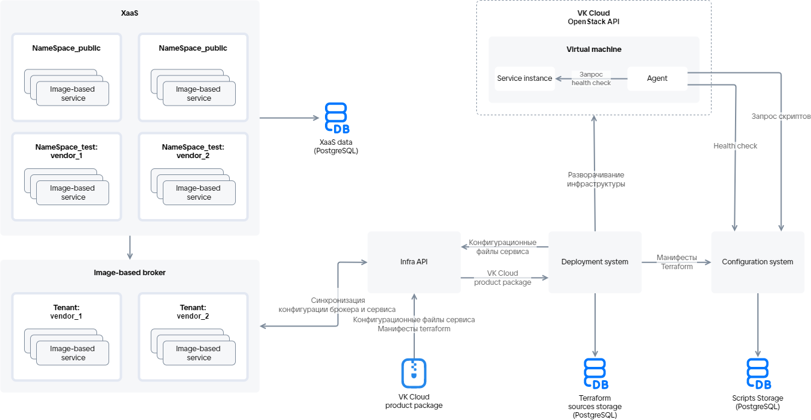

# {heading(Загрузка сервисного пакета в Магазин)[id=ibservice_upload_package]}

## {heading(Схема загрузки)[id=upload_scheme]}

Загрузка сервисного пакета в {var(sys1)} осуществляется с помощью системы развертывания через сервис Infra API. Схема загрузки приведена на {linkto(#pic_ib_upload)[text=рисунке %number]}.

{caption(Рисунок {counter(pic)[id=numb_pic_ib_upload]} — Схема загрузки сервисного пакета)[align=center;position=under;id=pic_ib_upload;number={const(numb_pic_ib_upload)} ]}

{/caption}

Описание основных элементов схемы приведено в {linkto(#tab_scheme_elements)[text=таблице %number]}.

{caption(Таблица {counter(table)[id=numb_tab_scheme_elements]} — Описание основных элементов схемы)[align=right;position=above;id=tab_scheme_elements;number={const(numb_tab_scheme_elements)}]}
[cols="2,5", options="header"]
|===
|Имя
|Описание

|
Infra API
|
Является точкой интеграции {var(sys2)} и облачной платформы для развертывания image-based приложений. Infra API проверяет данные пользователя, загружающего сервисный пакет или развертывающего инстанс сервиса. После успешной проверки Infra API получает доступ к межсервисному взаимодействию для создания ресурсов, описанных в манифесте Terraform. Infra API взаимодействует с системой развертывания и сервисом управления конфигурациями

|
Система развертывания (Deployment system)
|
Обеспечивает развертывание image-based приложения на ВМ в облачной платформе. Управляет инфраструктурой и ПО сервиса

|
Image-based брокер
|
Управляет жизненным циклом инстанса сервиса, включает в себя тенанты. Тенанты объединяют image-based приложения одного поставщика (`vendor`)

|
Сервис управления конфигурациями (Configuration system)
|
Сервер, на котором хранится:

* Конфигурация, описанная в манифестах Terraform.
* Результаты выполнения скриптов.
* Текущая конфигурация инстанса сервиса.

Предоставляет доступ к актуальной версии агента, устанавливаемой на ВМ

|
Агент (Agent)
|
Программное обеспечение, устанавливаемое на ВМ в процессе развертывания сервиса (подробнее — в разделе {linkto(../../ib_image_create/ib_image_agent#ib_image_agent)[text=%text]})

|
Сервисный пакет (VK Cloud product package)
|
Структурированный набор YAML-файлов и манифестов Terraform
|===
{/caption}

Тестовые (`NameSpace_test`) и открытые (`NameSpace_public`) пространства имен {var(sys2)} для каждого сервиса заданы в сервисном ключе.

## {heading(Порядок загрузки сервисного пакета в Магазин)[id=upload_actions]}

1. Выполните {linkto(../ibservice_upload_prepare/#ibservice_upload_prepare)[text=%text]}.
1. Протестируйте манифесты Terraform локально (подробнее — в разделе {linkto(../ibservice_upload_localtest/#ibservice_upload_localtest)[text=%text]}).
1. Протестируйте манифесты Terraform с системой развертывания (подробнее — в разделе {linkto(../ibservice_upload_deploysystemtest/#ibservice_upload_deploysystemtest)[text=%text]}).
1. Убедитесь, что файлы сервисного пакета заполнены и их структура соответствует используемой версии генератора JSON-файла (подробнее — в разделе {linkto(../../ib_structure/#ib_structure)[text=%text]}).
1. Убедитесь, что сочетания ID и ревизии каждого тарифного плана уникальны в рамках сервисного пакета.
1. Запакуйте сервисный пакет (директория `<SERVICE_NAME>` с конфигурационными файлами сервиса и манифестами Terraform) в zip-архив. Размер архива должен быть не более 30 МБ.
1. Чтобы загрузить архив в {var(sys1)}, выполните запрос к сервису Infra API со следующими параметрами:

   * Метод запроса: `POST`.
   * Путь запроса: `https://<CLOUD_HOST>/marketplace/api/infra-api/api/v1-public/product`

      Здесь `<CLOUD_HOST>` — доменное имя облачной платформы `https://cloud.vk.com`.
   * Тело запроса: zip-архив.
   * `x-service-token`: `<SERVICE_TOKEN>` — сервисный ключ.

      {caption(Пример запроса на загрузку сервисного пакета в {var(sys1)})[align=left;position=above]}
      ```bash
      $ curl -v -X POST https://cloud.vk.com/marketplace/api/infra-api/api/v1-public/product \
      -H 'x-service-token: <SERVICE_TOKEN>' \
      -F "upload=@/home/VKservice.zip"
      ```
      {/caption}

      HTTP-коды ответа:

       * 204 — сервисный пакет загружен.
       * 400, 404, 500 — ошибка выполнения запроса.
       * 401 — ошибка авторизации.

      Конфигурационные файлы, описывающие тарифные планы и опции сервиса, передаются image-based брокеру, манифесты Terraform — системе развертывания.

   Сервисный пакет, загружаемый в {var(sys1)}, сначала попадает в тестовое пространство имен, после публикации — в открытое.

1. После окончания загрузки сервиса зайдите в ЛК облачной платформы и убедитесь, что сервис отображается в {var(sys6)}. Загруженный сервис будет доступен только пользователям тестовых пространств имен {var(sys2)}, указанных в сервисном ключе.

   <info>

   Если после загрузки сервис не отображается в {var(sys6)}, то выйдите из ЛК и войдите заново.

   </info>

## {heading(Тестирование загруженного сервиса до публикации)[id=upload_test]}

Чтобы проверить, как сервис будет функционировать в облачной платформе, после загрузки сервисного пакета протестируйте сервис в тестовом пространстве имен {var(sys2)}:

<info>

Для тестирования сервиса выдаются бонусы. Чтобы получить бонусы, отправьте письмо на [marketplace@cloud.vk.com](mailto:marketplace@cloud.vk.com). Бонусные средства будут зачислены на бонусный счет проекта облачной платформы.

</info>

1. Зайдите в ЛК облачной платформы.
1. Убедитесь, что мастер конфигурации каждого тарифного плана отображается корректно.
1. Подключите сервис. Убедитесь, что развертывание инстанса сервиса выполнено успешно.

   Если при развертывании инстанса сервиса не удалось создать ресурс, описанный в манифесте, система развертывания запустит процесс развертывания сервиса повторно. Повторные попытки могут занимать до 1,5 ч и могут быть отключены в файле `settings.yaml` (подробнее — в разделе {linkto(../../tf_manifest/tf_manifest_settings/#tf_manifest_settings)[text=%text]}).

   <warn>

   При каждой новой попытке развернуть сервис все существующие ресурсы удаляются и создаются заново.

   </warn>

   <info>

   Если при подключении сервиса возникла ошибка, посмотрите логи (подробнее — в разделе {linkto(#ibservice_upload_package_log)[text=%text]}).

   </info>
1. Обновите инстанс сервиса:

   1. Поменяйте значения тарифных опций текущего тарифного плана.
   1. Перейдите на новый тарифный план.

      Изменение параметров ресурсов, описанных в манифесте, запускает процесс переустановки инстанса сервиса, при котором обновляются только измененные ресурсы. Если система развертывания не смогла обновить ресурсы, она будет пробовать обновить их повторно. Процесс обновления конфигурации инстанса сервиса с учетом повторных попыток может занимать до 1,5 ч. Повторные попытки могут быть отключены в файле `settings.yaml` (подробнее — в разделе {linkto(../../tf_manifest/tf_manifest_settings/#tf_manifest_settings)[text=%text]}).

   <warn>

   При обновлении конфигурации инстанса сервиса система развертывания обновляет только измененные ресурсы.

   </warn>
1. Проверьте основные пользовательские сценарии сервиса.
1. Удалите инстанс сервиса.
1. При необходимости внесите изменения в конфигурацию сервиса (подробнее — в разделе {linkto(../../../ibservice_update/#ibservice_update)[text=%text]}).

   <warn>

   Если в конфигурации сервиса на время тестирования и отладки были заданы тестовые значения для стоимости сервиса, отредактируйте их.

   </warn>
1. Если в сервисный пакет в процессе тестирования были внесены изменения, убедитесь, что ревизия сервиса обновлена.

## {heading(Просмотр логов инстанса сервиса)[id=ibservice_upload_package_log]}

1. Зайдите в ЛК облачной платформы.
1. Перейдите в раздел **Магазин приложений**.
1. Откройте консоль и получите JWT-токен авторизации в {var(sys6)}:

   ```console
   $ curl -X POST https://cloud.vk.com/marketplace/api/um/v1/tokens/sid \
   --cookie 'sid=<SID>'
   ```

   Здесь `<SID>` — значение файла cookie `sid` в веб-браузере.

   В ответе на команду отобразится JWT-токен.
1. Получите лог инстанса сервиса:

   ```console
   $ curl -v https://cloud.vk.com/marketplace/api/notifications/api/v1/instance?uuid=<UUID> \
   -H 'Authorization: Bearer <JWT_TOKEN>'
   ```

   Здесь:

   * `<UUID>` — индентификатор инстанса сервиса. Значение отображается в ЛК облачной платформы на странице инстанса сервиса — параметр **ID**.
   * `<JWT_TOKEN>` — JWT-токен авторизации, полученный на предыдущем шаге.
