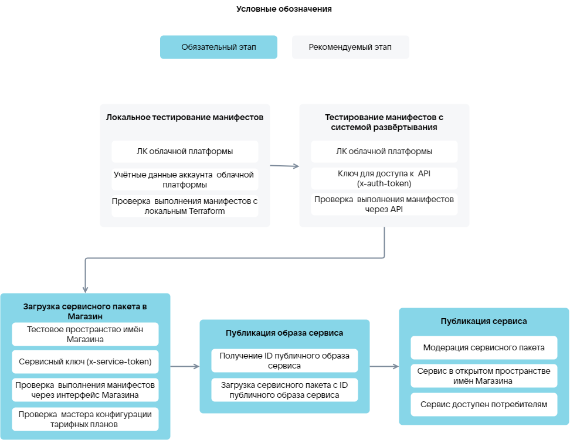

# {heading(Этапы загрузки сервиса)[id=ibservice_upload_phases]}

Этапы загрузки image-based приложения ({linkto(#pic_upload_phases)[text=рисунок %number]}):

1. {linkto(../ibservice_upload_localtest/#ibservice_upload_localtest)[text=%text]}.
1. {linkto(../ibservice_upload_deploysystemtest/#ibservice_upload_deploysystemtest)[text=%text]}.
1. {linkto(../ibservice_upload_package/#ibservice_upload_package)[text=%text]}.
1. {linkto(../ibservice_upload_publish_image/#ibservice_upload_publish_image)[text=%text]}.
1. {linkto(../ibservice_upload_publish/#ibservice_upload_publish)[text=%text]}.

{caption(Рисунок {counter(pic)[id=numb_pic_upload_phases]} — Этапы загрузки image-based приложения в {var(sys1)})[align=center;position=under;id=pic_upload_phases;number={const(numb_pic_upload_phases)} ]}
{params[noBorder=true]}
{/caption}

Перед тестированием манифестов Terraform проверьте, что параметры уже существующих ресурсов облачной платформы (например, тип ВМ, образ сервиса) указаны в манифестах верно. Используйте [источники данных провайдера VK CS](https://github.com/vk-cs/terraform-provider-vkcs/tree/master/docs/data-sources). Установка и настройка Terraform приведена в разделе {linkto(../ibservice_upload_localtest/#ibservice_upload_localtest)[text=%text]}.

{caption(Пример проверки того, что указанный тип ВМ существует в облачной платформе)[align=left;position=above]}
```hcl
data "vkcs_compute_flavor" "compute" {
flavor_id = "4e115a9b-XXXX-95cf130d63c7"
}
```
{/caption}

<info>

Проверка параметров существующих ресурсов облачной платформы сократит время тестирования манифестов и исключит попытки создания ресурсов с некорректной конфигурацией.

</info>
