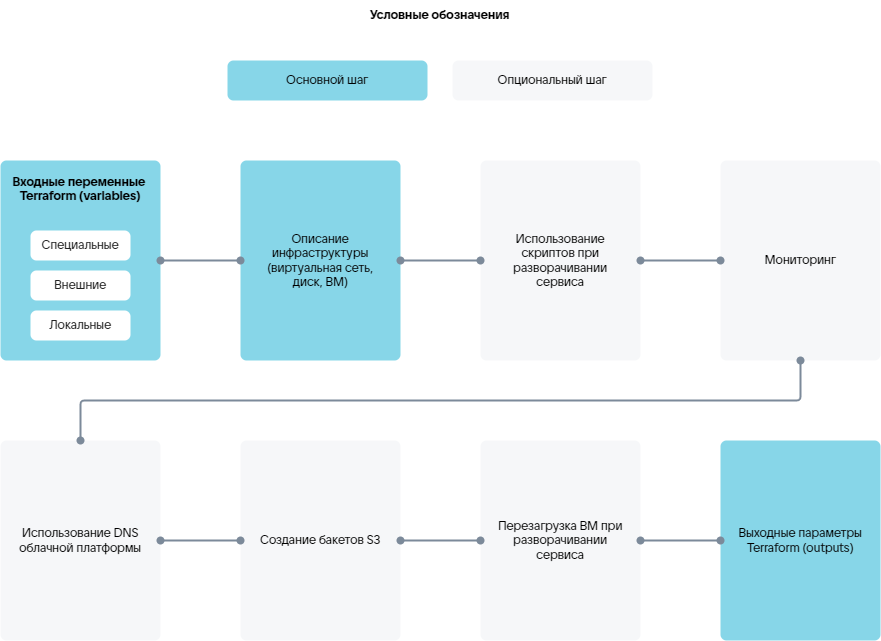

# {heading(Манифест Terraform)[id=tf_manifest_steps]}

Конфигурация инфраструктуры image-based приложения описывается с помощью манифеста Terraform `plans/<PLAN_NAME>/deployment/deploy.tf` на языке `HashiCorp Configuration Language (HCL)` (синтаксис — на [официальном сайте](https://developer.hashicorp.com/terraform/language/syntax/configuration)).

В манифесте `plans/<PLAN_NAME>/deployment/deploy.tf` опишите инфраструктуру для развертывания инстанса сервиса. Используйте ресурсы и источники данных провайдеров из {linkto(#tab_providers)[text=таблицы %number]}.

{caption(Таблица {counter(table)[id=numb_tab_providers]} — Провайдеры Terraform)[align=right;position=above;id=tab_providers;number={const(numb_tab_providers)}]}
[cols="2,5,2", options="header"]
|===
|Имя
|Описание
|Обозначение в манифесте

|VK CS
|
Содержит ресурсы и источники данных для описания инфраструктуры сервиса.

Ресурсы и источники данных приведены в [официальной документации провайдера](https://github.com/vk-cs/terraform-provider-vkcs/tree/master/docs).

Примеры содержимого для манифестов, описывающих создание ресурсов, приведены в сценариях в разделе [Практические руководства](/ru/tools-for-using-services/terraform/how-to-guides) по использованию Terraform
|
`vkcs`

|VK CS Infra (iVK CS)
|
Содержит ресурсы и источники данных, расширяющие возможности провайдера VK CS. Например, позволяющие отслеживать состояние инстанса сервиса, запускать скрипты и использовать их результаты в процессе развертывания. Для скриптов поддерживаются языки Bash и Python.

Ресурсы и источники данных приведены в разделе [Справочник по провайдеру VK CS Infra (iVK CS)](../../../ivkcs)
|
`ivkcs`

|Null
|
Ресурсы провайдера используются для запуска внешних процессов или действий, не связанных с ресурсами инфраструктуры напрямую
|
`null`

|Random
|
Ресурсы провайдера (подробнее — в [официальной документации провайдера](https://github.com/hashicorp/terraform-provider-random/tree/main/docs)) используются, чтобы генерировать пароли для доступа к инстансу сервиса
|
`random`

|Time
|
Ресурсы провайдера используются для настройки взаимодействия между другими ресурсами по времени. Например, создание паузы или временной метки
|
`time`
|===
{/caption}

## {heading(Элементы Terraform)[id=tf_elements]}

В манифесте используйте основные элементы Terraform:

* `variables` — входные переменные для конфигурации ресурсов.
* `resources` — ресурсы, позволяющие управлять объектами инфраструктуры. Например, создать ВМ. При описании ресурсов можно указывать зависимости с помощью блока `depends on`. Ресурс не будет создан, если не выполняется хотя бы одна зависимость.
* `data-sources` — источники данных, позволяющие получить определенную информацию от провайдера. Например, получить доступные типы ВМ или получить результаты выполнения скриптов.
* `outputs` — выходные параметры, результаты выполнения манифеста.

## {heading(Шаги для манифеста Terraform)[id=tf_manifest_steps]}

Основные и опциональные шаги, описываемые в манифесте Terraform, приведены на {linkto(#pic_tf_steps)[text=рисунке %number]}.

{caption(Рисунок {counter(pic)[id=numb_pic_tf_steps]} — Шаги для манифеста Terraform)[align=center;position=under;id=pic_tf_steps;number={const(numb_pic_tf_steps)} ]}

{/caption}

<err>

Конкретные шаги для описания развертывания сервиса зависят от требующейся инфраструктуры и ее настроек для конкретного сервиса.

</err>

Основные шаги для развертывания сервиса на ВМ в облачной платформе:

1. {linkto(../tf_manifest_variable/#tf_manifest_variable)[text=Описание входных переменных для конфигурации ресурсов]}.
1. {linkto(../tf_manifest_image/#tf_manifest_image)[text=Описание инфраструктуры]}.
1. {linkto(../tf_manifest_output/#tf_manifest_output)[text=Описание выходных параметров]}.

Дополнительные возможности:

* {linkto(../tf_manifest_script/#tf_manifest_script)[text=Использование скриптов]}:

   * Выполнение скриптов в процессе развертывания или переустановки сервиса.
   * Использование результатов выполнения скриптов другими ресурсами манифеста.
   * Получение результатов выполнения скриптов.

* {linkto(../tf_manifest_monitoring/#tf_manifest_monitoring)[text=%text]}.
* Использование DNS облачной платформы (подробнее — в разделе [Справочник по провайдеру VK CS Infra (iVK CS)](../../../ivkcs)).

   <warn>

   Управление созданными ресурсными DNS-записями (например, удаление) в ЛК облачной платформы будет недоступно.

   </warn>
* Создание бакетов S3 (подробнее — в разделе [Справочник по провайдеру VK CS Infra (iVK CS)](../../../ivkcs)). Созданные бакеты будут отображаться в ЛК облачной платформы.
* Перезагрузка ВМ в процессе развертывания сервиса (подробнее — в разделе [Справочник по провайдеру VK CS Infra (iVK CS)](../../../ivkcs)).

Дополнительные возможности обеспечиваются ресурсами провайдера iVK CS.

<info>

Идентификатор развертывания сервиса для ресурсов провайдера iVK CS получите с помощью специальной переменной `instance_uuid` (подробнее — в разделе {linkto(../tf_manifest_variable/#tf_manifest_variable)[text=%text]}).

</info>

Мониторинг ВМ и использование скриптов обеспечиваются специальными сервисами (подробнее — в разделе {linkto(../../ibservice_upload/ibservice_upload_package/#ibservice_upload_package)[text=%text]}), с которыми взаимодействует провайдер iVK CS:

* Сервис управления конфигурациями.
* Агент.

Подготовленный манифест загружается в систему развертывания в составе сервисного пакета (подробнее — в разделе [Загрузка image-based приложения в Магазин](../../ibservice_upload)).

## {heading(Пример манифеста Terraform)[id=tf_manifest_example]}

Ниже приведен манифест для развертывания сервиса Grafana на одной ВМ с использованием:

* Внешних IP-адресов.
* DNS облачной платформы.
* Мониторинга доступности адреса.

{caption(Пример манифеста для сервиса Grafana)[align=left;position=above]}
```hcl
# --------------------variables--------------------
# Специальные переменные
# Идентификатор развертывания сервиса
variable "instance_uuid" {
  type    = string
  default = "4a57a965-3c83-436c-80e2-428e421538cc"
}

variable "email" {
  type    = string
  default = "user@example.com"
}

# Внешние переменные
# Размещение с внешним или внутренним IP-адресом
variable "grafana_placement" {
  type    = string
  default = "internal"
}

# Резервное копирование
variable "backup_style" {
  type    = string
  default = "s3"
}

# Зона доступности
variable "ds-az" {
  type    = string
  default = "GZ1"
}

# Тип ВМ
variable "ds-flavor" {
  type    = string
  default = "a493b27d-170d-48eb-a24b-99e9b325f988"
}

# Идентификатор подсети
variable "ds-subnet" {
  type    = string
  default = "cd4224ac-0527-4291-a8e0-afae0cee02ed"
}

# Тип root-диска
variable "root_type" {
  type    = string
  default = "ceph-ssd"
}

# Размер root-диска, ГБ
variable "root_size" {
  type    = number
  default = 10
}

# Тип диска для хранения данных
variable "data_type" {
  type    = string
  default = "ceph-ssd"
}

# Размер диска для хранения данных, ГБ
variable "data_size" {
  type    = number
  default = 1
}

# Идентификатор образа сервиса
variable "image_uuid" {
  type        = string
  default     = "8c7a6443-bb79-4f04-884a-14231f0ba6cb"
  description = "grafana image"
}

# Порты доступа для группы безопасности
variable "ports" {
  type    = list(number)
  default = [
    22, 80, 443
  ]
  description = "ports for secgroup rule. grafana [80, 443]"
}

locals {
  # Сокращенный вариант instance_uuid
  short_name = substr(var.instance_uuid, 0, 8)
  # Генерация имени хоста
  hosts_name = "${local.short_name}-grafana"
}

# ---------------------data------------------------
# Получение данных виртуальной сети
data "vkcs_networking_subnet" subnet {
  subnet_id = var.ds-subnet
}

# --------------------backup-----------------------
# Создание бакетов S3
resource "ivkcs_s3" "s3_backup" {
  count = var.backup_style == "s3" ? 1 : 0
  name  = "${local.hosts_name}-backup"
}

# --------------------security group---------------
# Создание группы безопасности
resource "vkcs_networking_secgroup" "secgroup" {
  name = "${local.short_name}-grafana"
  sdn  = data.vkcs_networking_subnet.subnet.sdn
}

# Правила для группы безопасности
resource "vkcs_networking_secgroup_rule" "rules" {
  count             = length(var.ports)
  # Определение направления применения правил — для входящих (ingress) или исходящих (egress) соединений
  direction         = "ingress"
  # Список портов доступа
  port_range_max    = element(var.ports, count.index)
  port_range_min    = element(var.ports, count.index)
  # Протокол доступа
  protocol          = "tcp"
  # Удаленный сетевой префикс
  remote_ip_prefix  = "0.0.0.0/0"
  # Индентификатор группы безопасности, для которой созданы правила
  security_group_id = vkcs_networking_secgroup.secgroup.id
  description       = "rule_tcp_${element(var.ports, count.index)}"
}

# --------------------network----------------------
# Привязка IP-адреса к порту
resource "vkcs_networking_port" "ports" {
  name               = "${local.short_name}-grafana"
  admin_state_up     = "true"
  network_id         = data.vkcs_networking_subnet.subnet.network_id
  sdn                = data.vkcs_networking_subnet.subnet.sdn
  security_group_ids = [
    vkcs_networking_secgroup.secgroup.id
  ]
  fixed_ip {
    subnet_id = var.ds-subnet
  }
}

# --------------------keypair----------------------
# Создание ключевой пары
resource "ivkcs_ssh_keypair" "keypair" {}

# --------------------------vm---------------------
# Создание cloud-config конфигурации. Получение данных для инициализации агента на хосте
resource "ivkcs_user_data" "user_data" {
  # Идентификатор развертывания сервиса
  uuid      = var.instance_uuid
  hosts     = [local.hosts_name]
  target_os = "almalinux9"

  # Ключи для доступа по SSH
  ssh_authorized_keys = [
    ivkcs_ssh_keypair.keypair.public_key,
  ]
}

# Создание ВМ
resource "vkcs_compute_instance" "grafana" {
  name              = local.hosts_name
  flavor_id         = var.ds-flavor
  security_groups   = [vkcs_networking_secgroup.secgroup.name]
  availability_zone = var.ds-az
  metadata          = { "sid" : "xaas", "product" : "grafana" }

  # Root-диск
  block_device {
    source_type      = "volume"
    destination_type = "volume"
    boot_index       = 0
    uuid             = vkcs_blockstorage_volume.boot.id
  }

  # Применение cloud-config конфигурации для настройки ВМ. Установка агента
  user_data = ivkcs_user_data.user_data.user_data[0]
  # Прикрепление IP-адреса к ВМ
  network {
    port = vkcs_networking_port.ports.id
  }
  # Попытка остановки ВМ перед удалением
  stop_before_destroy = true
  # Тайм-аут создания ВМ
  timeouts {
    create = "10m"
  }
}

# --------------------volume-----------------------
# Создание root-диска
resource "vkcs_blockstorage_volume" "boot" {
  name              = "${local.short_name}-grafana-boot"
  # Метаданные
  metadata          = { "sid" : "xaas", "product" : "grafana" }
  # Идентификатор образа сервиса
  image_id          = var.image_uuid
  volume_type       = var.root_type
  size              = var.root_size
  availability_zone = var.ds-az
}

# Создание диска данных
resource "vkcs_blockstorage_volume" "grafana_data" {
  name              = "${local.short_name}-grafana-data"
  # Метаданные
  metadata          = { "sid" : "xaas", "product" : "grafana" }
  size              = var.data_size
  availability_zone = var.ds-az
  volume_type       = var.data_type
}

# Присоединение диска данных к ВМ
resource "vkcs_compute_volume_attach" "attached" {
  instance_id = vkcs_compute_instance.grafana.id
  volume_id   = vkcs_blockstorage_volume.grafana_data.id
}

# -----------------------external------------------
# Получение пула внешних IP-адресов
resource "vkcs_networking_floatingip" "fips" {
  count = var.grafana_placement == "external" ? 1 : 0
  pool  = data.vkcs_networking_subnet.subnet.sdn == "neutron" ? "ext-net" : "internet"
}

# Назначение ВМ внешнего IP-адреса
resource "vkcs_compute_floatingip_associate" "fip" {
  count       = length(vkcs_networking_floatingip.fips)
  floating_ip = vkcs_networking_floatingip.fips[count.index].address
  instance_id = vkcs_compute_instance.grafana.id
}

# Создание A-записи в DNS облачной платформы
resource "ivkcs_dns" "grafana" {
  count  = length(vkcs_networking_floatingip.fips)
  name   = "grafana-${local.short_name}"
  domain = "xaas.msk.vkcs.cloud"
  ip     = vkcs_networking_floatingip.fips[count.index].address
}

# --------------------agent-run--------------------
locals {
  grafana_domain   = var.grafana_placement == "external" ? "${ivkcs_dns.grafana[0].name}.${ivkcs_dns.grafana[0].domain}" : vkcs_compute_instance.grafana.access_ip_v4
  grafana_root_url = var.grafana_placement == "external" ? "https://${local.grafana_domain}" : "http://${local.grafana_domain}"

  # Стартовый скрипт для ресурса ivkcs_agent_exec.start
  start = <<-EOT
#!/bin/bash
ansible-playbook start.yml \
  --extra-vars "lego_enabled=${var.grafana_placement == "external" ? "true" : "false"}" \
  --extra-vars "lego_email=${var.email}" \
  --extra-vars "backup_enabled=${var.backup_style == "s3" ? "true" : "false"}" \
  --extra-vars "backup_access_token=${try(ivkcs_s3.s3_backup[0].access, "n/a")}" \
  --extra-vars "backup_secret_token=${try(ivkcs_s3.s3_backup[0].secret, "n/a")}" \
  --extra-vars "backup_bucket_name=${try(ivkcs_s3.s3_backup[0].name, "n/a")}_bucket" \
  --extra-vars "grafana_domain=${local.grafana_domain}" \
  --extra-vars "grafana_root_url=${local.grafana_root_url}"
EOT
}

resource "ivkcs_agent_exec" "start" {
  hosts = [local.hosts_name]
  name  = "start_grafana"
  uuid  = var.instance_uuid
  step {
    index   = 1
    type    = "bash"
    content = local.start
    options {
      timeout  = "20m"
      cwd      = "/opt/playbooks"
      attempts = 1
    }
  }

  depends_on = [
    vkcs_compute_instance.grafana,
    vkcs_compute_volume_attach.attached,
  ]
}

# --------------------health check-----------------

# Мониторинг ВМ
resource "ivkcs_agent_check" "health" {
  hosts = [local.hosts_name]
  uuid  = var.instance_uuid

  # Мониторинг по адресу
  http_health {
    method     = "GET"
    protocol   = var.grafana_placement == "internal" ? "http" : "https"
    host       = local.grafana_domain
    path       = "/api/health"
    http_codes = [200]
    period     = "30s"
  }

  timeouts {
    create = "5m"
  }

  depends_on = [
    ivkcs_agent_exec.start,
  ]
}

# --------------------outputs----------------------
# Вывод закрытого SSH-ключа для доступа к ВМ
output "keypair" {
  value     = ivkcs_ssh_keypair.keypair.private_key
  # Выходной параметр содержит чувствительные данные
  sensitive = true
}

# Вывод URL Grafana
output "grafana_url" {
  value = local.grafana_root_url
}

# Вывод идентификатора бакета S3
output "s3_backup" {
  value = try(ivkcs_s3.s3_backup[0].id, "n/a")
}
```
{/caption}
