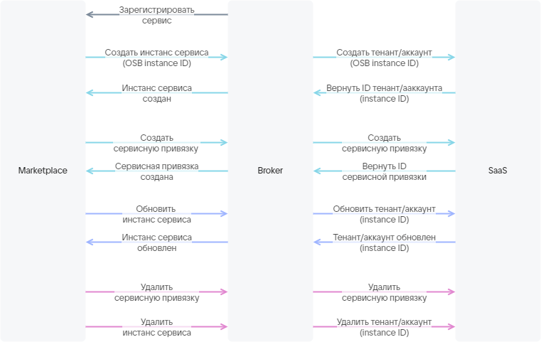

# {heading(Брокер для SaaS-приложения)[id=saas_broker]}

{var(sys1)} взаимодействует с сервисом с помощью брокера.

Разработайте брокер для SaaS-приложения по протоколу VK OSB. Чтобы получить протокол VK OSB, отправьте письмо на [marketplace@cloud.vk.com](mailto:marketplace@cloud.vk.com). Брокер должен реализовывать методы, описывающие жизненный цикл инстансов сервиса ({linkto(#pic_saas_broker)[text=рисунок %number]}).

{caption(Рисунок {counter(pic)[id=numb_pic_saas_broker]} — Взаимодействие брокера с {var(sys5)} и SaaS-приложением)[align=center;position=under;id=pic_saas_broker;number={const(numb_pic_saas_broker)} ]}

{/caption}

В брокере должна быть настроена basic-аутентификация по безопасному протоколу HTTPS c сертификатом, выданным доверенным центром сертификации.

<err>

Использование самоподписанных сертификатов запрещено.

</err>

Брокер можно разработать на основе шаблона, в котором уже реализовано взаимодействие между {var(sys5)} и брокером. Шаблон необходимо доработать описанием взаимодействия брокера с конкретным SaaS-приложением.

Чтобы разработать брокера на основе шаблона:

1. Отправьте письмо на [marketplace@cloud.vk.com](mailto:marketplace@cloud.vk.com), чтобы получить шаблон брокера. Шаблон разработан на языке Python на основе фреймворка [FastAPI](https://fastapi.tiangolo.com/tutorial/first-steps/).
1. Разработайте клиент для взаимодействия с API сервиса.
1. Разработайте сервисный менеджер, описывающий взаимодействие брокера и сервиса:

   1. Реализуйте метод для создания тенанта/аккаунта, принимающий на вход:

      * OSB ID инстанса сервиса, который формируется {var(sys5)} при подключении сервиса. OSB ID передается в SaaS-приложение, чтобы SaaS-приложение сформировало ID инстанса сервиса. ID инстанса сервиса используется в методах, описанных ниже.
      * ID тарифного плана.
      * Тарифные опции плана, описанные в секции `plans.schemas.service_instance.create` в JSON-файле.
      * Контекст (опционально). Контекст содержит информацию о пользователе (email, OpenStack PID).

   1. Реализуйте метод для обновления тенанта/аккаунта, принимающий на вход:

      * ID инстанса сервиса.
      * ID тарифного плана.
      * Тарифные опции плана, описанные в секции `plans.schemas.service_instance.update` в JSON-файле.

   1. Реализуйте методы для получения и удаления тенанта/аккаунта, принимающие на вход ID инстанса сервиса.
   1. Реализуйте метод для создания сервисных привязок, принимающий на вход:

      * ID инстанса сервиса.
      * Параметры сервисных привязок, описанные в секции `plans.schemas.service_binding.create` в JSON-файле.
      * Контекст (опционально). Контекст содержит информацию о пользователе (email, OpenStack PID).

   1. Реализуйте методы для получения и удаления сервисных привязок, принимающие на вход:

      * ID инстанса сервиса.
      * ID сервисной привязки.

1. Интегрируйте клиент в сервисный менеджер.
1. Настройте аутентификацию в брокере.

Если в SaaS-приложении есть постоплатные тарифные опции и метрики по ним собираются по pull-модели (подробнее — в разделе {linkto(#billing)[text=%text]}), выполните дополнительные действия:

1. В сервисном менеджере реализуйте метод для получения отчета по фактически использованным ресурсам SaaS-приложения. В ответе на запрос брокер должен передать {var(sys3)} отчет.

   {caption(Пример отчета о фактически использованных ресурсах SaaS-приложения)[align=left;position=above]}
   ```json
   {
     "batch_id": 35,
     "data": [
        {
         "kind": "vms",
         "type": "cb",
         "unit": "month",
         "price": 600.0,
         "value": 1.0,
         "plan_uuid": "2f070fe3-3e31-4482-bad4-a4d0c36bab31",
         "instance_uuid": "d1dff97c-df6c-45a7-95e1-b539a8d77721"
       },
       {
         "kind": "storage",
         "type": "cb",
         "unit": "GB-month",
         "price": 3.3,
         "value": 2.4474525451660156,
         "plan_uuid": "2f070fe3-3e31-4482-bad4-a4d0c36bab31",
         "instance_uuid": "d1dff97c-df6c-45a7-95e1-b539a8d77721"
       },
       {
         "kind": "vms",
         "type": "cb",
         "unit": "month",
         "price": 600.0,
         "value": 0.0,
         "plan_uuid": "354df2fa-5ec3-45e1-b99b-7d45840cf3df",
         "instance_uuid": "3910e993-63f0-4a90-95d7-5eea35785c29"
       },
       {
         "kind": "storage",
         "type": "cb",
         "unit": "GB-month",
         "price": 3.3,
         "value": 0.0,
         "plan_uuid": "354df2fa-5ec3-45e1-b99b-7d45840cf3df",
         "instance_uuid": "3910e993-63f0-4a90-95d7-5eea35785c29"
       },
       {
         "kind": "storage",
         "type": "cb",
         "unit": "GB-month",
         "price": 7.0,
         "value": 0.0,
         "plan_uuid": "d719f348-3497-4341-8465-a438bfcc2d96",
         "instance_uuid": "f10e67be-dfd7-4dcd-917c-4bfd3cd64ce2"
       }
     ]
   }
   ```
   {/caption}

   Здесь:

   * `batch_id` — ID отчета, сформированный брокером.
   * `kind` — имя тарифной опции. Должно соответствовать имени, используемому в файле с конфигурацией сервиса.
   * `type` — имя сервиса. Должно соответствовать `SERVICE_NAME`, указанному в имени файла с конфигурацией сервиса (`catalog_<SERVICE_NAME>.json`).
   * `unit` — единица измерения опции.
   * `price` — стоимость единицы опции в месяц. Должно соответствовать значению `plans.billing.options.cost` конкретной опции, указанному в файле с конфигурацией сервиса.
   * `value` — фактическое использованное количество опции за месяц, сформированное SaaS-приложением.
   * `plan_uuid` — ID тарифного плана.
   * `instance_uuid` — ID инстанса (тенанта/аккаунта) сервиса.

1. В сервисном менеджере реализуйте метод для сообщения брокеру о том, что отчет обработан (списание денежных средств по отчету произошло или запланировано).
