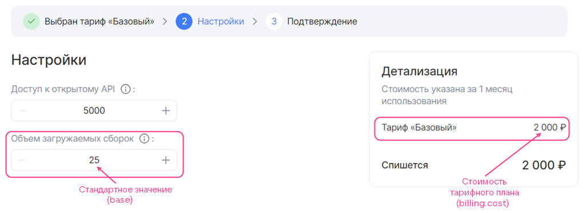
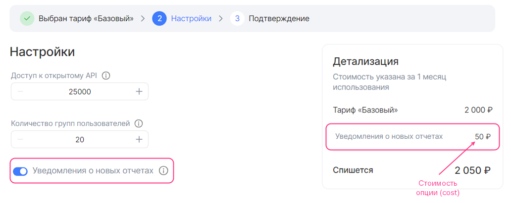

## {heading(Структура)[id=saas_plan_structure]}

В секции `plans` опишите тарифные планы сервиса по следующей структуре:

```json
      "plans": [
        {
          <PLAN_PARAMETERS>,
          "display": {
          },
          "billing": {
          },
          "schemas": {
          }
        },
        ...
      ]
```

Здесь:

* `<PLAN_PARAMETERS>` — параметры плана (подробнее — в разделе {linkto(#saas_plan_param)[text=%text]}).
* Секция `display` — описывает мастер конфигурации конкретного тарифного плана (подробнее — в разделе {linkto(#saas_plan_display)[text=%text]}).
* Секция `billing` — описывает стоимость плана и его опций (подробнее — в разделе {linkto(#saas_plan_billing)[text=%text]}).
* Секция `schemas` — описывает тарифные опции плана (подробнее — в разделе {linkto(#saas_plan_schema)[text=%text]}).

## {heading(Параметры тарифного плана)[id=saas_plan_param]}

Для тарифного плана укажите параметры, приведенные в {linkto(#tab_plan_params)[text=таблице %number]}.

{caption(Таблица {counter(table)[id=numb_tab_plan_params]} — Параметры тарифного плана)[align=right;position=above;id=tab_plan_params;number={const(numb_tab_plan_params)}]}
[cols="2,4,2,1,2", options="header"]
|===
|Имя
|Описание
|Формат
|Обязательный
|Значение по умолчанию

|id
|
Идентификатор тарифного плана UUID4 (ID), сформированный с помощью генератора UUID4
|string (UUID4)
|Да
|
—

|revision
|
Ревизия тарифного плана. Сочетание ревизии и ID тарифного плана определяет его уникальность в сервисе. Остальные параметры описывают характеристики конкретной ревизии тарифного плана
|string, до 255 символов
|Да
|
—

|name
|
Техническое имя тарифного плана, которое не отображается в интерфейсе {var(sys2)}. Должно быть указано латинскими буквами с использованием знака нижнего подчеркивания вместо пробелов
|string, до 255 символов
|Да
|
—

|description
|
Имя тарифного плана, которое отображается в интерфейсе {var(sys2)}
|string, до 255 символов
|Да
|
—

|free
|
Определяет, бесплатный тарифный план или нет
|boolean
|Да
|
—

|plan_updateable
|
Определяет, может ли пользователь переходить с одного тарифного плана на другой без удаления сервиса.

Переопределяет значение, заданное в одноименном параметре сервиса
|boolean
|Нет
|
—

|metadata
|
Определяет тестовые и открытые пространства имен {var(sys2)}, в которых тарифный план будет доступен.

Тестовые пространства имен задаются в ключе `test_ns`.

Открытые пространства имен задаются в ключе `prod_ns`.

Чтобы получить имена пространств имен, отправьте письмо на [marketplace@cloud.vk.com](mailto:marketplace@cloud.vk.com).

Если пространства имен не заданы, то будут использованы значения, указанные в одноименном параметре сервиса (подробнее — в разделе {linkto(../saas_param/#saas_param)[text=%text]})
|map, ключи — string
|Нет
|
—

|refundable
|
Может быть задан только для предоплатного тарифного плана.

Определяет, возвращать или нет на бонусный счет проекта денежные средства за оставшиеся дни расчетного периода, если пользователь изменил тарифный план или удалил инстанс сервиса.

Параметр влияет на дату списания оплаты за сервис, когда пользователь изменяет тарифный план (редактирует тарифные опции или переходит на новый):

* Если значение равно `true`, дата не изменяется.
* Если значение равно `false`, дата обновляется до даты изменения тарифного плана

|boolean
|Нет
|
`true`

|billing_cycle_flat
|
Может быть задан только для предоплатного тарифного плана.

Определяет длительность отчетного периода для тарификации.

Формат записи: `<КОЛИЧЕСТВО_МЕСЯЦЕВ> mons <КОЛИЧЕСТВО_ДНЕЙ> days`. Например, `1 mons 15 days`, `30 days`.

<info>

Количество дней в месяце `mons` рассчитывается на основе календарного значения. Поэтому периоды `1 mons 0 days` и `0 mons 31 days` не равны между собой.

</info>
|string
|Нет
|
`1 mons 0 days`

|billing_cycle_step
|
Может быть задан только для тарифного плана с постоплатными тарифными опциями.

Определяет длительность периода, с которым {var(sys1)} опрашивает брокера на наличие необработанных отчетов (подробнее — в разделе {linkto(/ru/applications-and-services/marketplace/vendor/concepts/about/#xaas_billing)[text=%text]}).

Формат записи: `<КОЛИЧЕСТВО_МЕСЯЦЕВ> mons <КОЛИЧЕСТВО_ДНЕЙ> days`. Например, `1 mons 15 days`, `30 days`.

<info>

Количество дней в месяце `mons` рассчитывается на основе календарного значения. Поэтому периоды `1 mons 0 days` и `0 mons 31 days` не равны между собой.

</info>
|string
|Нет
|
`0 mons 1 days`
|===
{/caption}

<err>

Сочетание ID и ревизии тарифного плана должно быть уникальным в рамках сервиса. Если план с такими же идентификатором и ревизией уже существует в этом сервисе, то тарифный план не будет обновлен.

</err>

## {heading(Секция display)[id=saas_plan_display]}

В секции `display` опишите мастер конфигурации тарифного плана (подробнее — в разделе {linkto(/ru/applications-and-services/marketplace/vendor/concepts/about/#xaas_wizard)[text=%text]}) по следующей структуре:

```json
"display": {
  "pages": [
    {
      <PAGE_PARAMETERS>,
      "groups": [
        {
          <GROUP_PARAMETERS>,
          "parameters": [
            {
              <OPTION_PARAMETERS>
            },
            ...
          ]
        }
        ...
      ]
    },
  ...
  ]
}
```

Здесь:

* Секция `pages` — описывает страницы мастера конфигурации тарифного плана. Может быть пустой.
* `<PAGE_PARAMETERS>` — параметры одной страницы.
* Секция `groups` — описывает группы тарифных опций в рамках одной страницы.
* `<GROUP_PARAMETERS>` — параметры группы тарифных опций.
* Секция `parameters` — определяет тарифные опции в рамках одной группы.

   <warn>

   Одна и та же тарифная опция может быть указана только в одной группе.

   </warn>
* `<OPTION_PARAMETERS>` — параметры тарифных опций.

В секции `display` описываются все страницы мастера конфигурации тарифного плана, кроме первой и последней. Максимальное количество страниц — 5.

Параметры страниц, групп и тарифных опций в группах одинаковые и приведены в {linkto(#tab_plan_params)[text=таблице %number]}.

{caption(Таблица {counter(table)[id=numb_tab_plan_params]} — Параметры страниц, групп и тарифных опций для мастера конфигурации тарифного плана)[align=right;position=above;id=tab_plan_params;number={const(numb_tab_plan_params)}]}
[cols="2,5,4,2", options="header"]
|===
|Имя
|Описание
|Формат
|Обязательный

|name
|
Имя страницы, группы или тарифной опции в JSON-файле.

<warn>

В интерфейсе {var(sys2)} тарифные опции будут отображаться с именами, заданными в параметре `description` этих опций (секция `plans.schemas`).

</warn>
|
string.

Имя страницы — до 32 символов.

Имя группы — до 255 символов
|Да

|index
|
Порядковый номер страницы, группы на странице или тарифной опции в группе
|
integer
|Нет
|===
{/caption}

Мастер конфигурации тарифного плана, приведенный на {linkto(#pic_wizard_saas)[text=рисунке %number]}, соответствует следующему содержимому секции `display`:

```json
"display": {
  "pages": [
    {
      "name": "Настройки", // Имя страницы
      "index": 0,
      "groups": [
        {
          "name": "", // Имя группы
          "index": 0,
          "parameters": [
            {
              "name": "api_requests_daily_limit", // Имя тарифной опции в JSON-файле
              "index": 0,
            },
            {
              "name": "groups",
              "index": 1,
            },
            {
              "name": "products",
              "index": 2,
            },
            {
              "name": "reports",
              "index": 3
            }
          ]
        }
      ]
    }
  ]
}
```

{caption(Рисунок {counter(pic)[id=numb_pic_wizard_saas]} — Мастер конфигурации тарифного плана)[align=center;position=under;id=pic_wizard_saas;number={const(numb_pic_wizard_saas)} ]}

{/caption}

По умолчанию в мастере конфигурации тарифного плана отображаются и настраиваются все группы тарифных опций `groups`. Чтобы группа отображалась только при определенных условиях, используйте конструкцию `when`. Описание конструкции приведено в разделе {linkto(/ru/applications-and-services/marketplace/vendor/ibservice_add/ibservice_configure/ib_display/#IBdisplay_when)[text=%text]}.

<warn>

Брокер должен поддерживать создание инстанса сервиса с учетом условий, заданных в конструкциях `when`.

</warn>

{caption(Структура `when` в формате JSON)[align=left;position=above]}
```json
{
  "when": {
    "in": { // Или "not_in"
      "key": {
        "param": "<OPTION>" // Или "const": "<VALUE>"
      },
      "values": [
        {
          "const": "<VALUE>"
        },
        {
          "param": "<OPTION>"
        },
      ...
      ]
    }
  },
  "parameters": [
  ...
  ]
}
```
{/caption}

Здесь:

* `<OPTION>` — имя тарифной опции в JSON-файле.
* `<VALUE>` — значение константы.

Конструкция `when` в секции `pages` используется таким же образом, как в image-based приложениях (подробнее — в разделе {linkto(/ru/applications-and-services/marketplace/vendor/ibservice_add/ibservice_configure/ib_display/#IBdisplay_when_in_pages)[text=%text]}).

{caption(Пример использования конструкции when в секции `pages`)[align=left;position=above]}
```json
{
  "pages": [
    {
      "name": "Настройки бекапа", // Имя страницы
      "groups": [
        {
          "name": "High-frequency бекап", // Имя группы тарифных опций
          "parameters": [
            {
              "name": "frequency_per_day" // Имя тарифной опции в JSON-файле
            }
          ],
          "when": {
            "in": {
              "key": {
                "param": "backup_method" // Имя тарифной опции в JSON-файле
              },
              "values": [
                {
                  "const": "high-frequency"
                }
              ]
            }
          }
        }
      ]
    }
  ]
}
```
{/caption}

В примере выше настраивается частота создания бекапов для метода high-frequency: если значение тарифной опции `backup_method` равно `high-frequency`, в мастере конфигурации тарифного плана отображать группу `High-frequency бекап` с тарифной опцией `frequency_per_day`.

Тарифная опция `backup_method`:

* Может использоваться в конструкции `when` в других группах.
* Должна быть задана в `parameters` в другой группе.

Тарифная опция `frequency_per_day` не может использоваться в других группах:

* В конструкции `when`, потому что поддерживается один уровень иерархии зависимостей.
* В `parameters`, потому что одна тарифная опция может быть указана только в одной группе.

## {heading(Секция billing)[id=saas_plan_billing]}

Секция `billing` описывает:

* Стоимость конкретного тарифного плана. Поддерживается предоплатная тарификация.
* Пользовательский шаг изменения для тарифных опций типа `integer`.
* Стоимость тарифных опций плана. Платными тарифными опциями могут быть опции следующих типов:

   * Числовой (`integer`, `number`). Поддерживается предоплатная и постоплатная тарификация.
   * Логический (`boolean`). Поддерживается предоплатная тарификация.

Подробнее о типах тарификации приведено в разделе {linkto(/ru/applications-and-services/marketplace/vendor/concepts/about/#xaas_billing)[text=%text]}.

<warn>

В рамках одного тарифного плана допускаются опции одного типа тарификации: тарифный план с предоплатными опциями или тарифный план с постоплатными опциями.

</warn>

Применяемый способ тарификации определяется местом описания тарифных опций в секции `plans.schemas` (подробнее — в разделе {linkto(#saas_plan_schema)[text=%text]}):

* Если опции описаны в секциях `service_instance.create` и `service_instance.update`, применяется предоплатная тарификация.
* Если опции описаны в секции `service_instance.resource_usages`, применяется постоплатная тарификация.

Опишите секцию `billing` по следующей структуре:

```json
"billing": {
            "cost": <COST>,
            "options": {
              "<OPTION>": {
                <OPTION_BILLING>
                },
              ...
              }
            }
```

Здесь:

* Параметр `cost` — определяет стоимость плана за отчетный период `<COST>` без учета платных тарифных опций. Задается в валюте страны, где развернут {var(sys1)}. Если план бесплатный, укажите `0`.

   <info>

   Длительность отчетного периода настраивается в параметре `plans.billing_cycle_flat` (подробнее — в разделе {linkto(#saas_plan_param)[text=%text]}).

   </info>
* Секция `options` (опциональная) — описывает стоимость платных тарифных опций.
* `<OPTION>` — имя тарифной опции в JSON-файле.
* `<OPTION_BILLING>` — стоимость тарифной опции и параметры шага изменения для опции типа `integer`. Сама тарифная опция (тип, настройки значения) описывается в секции {linkto(#saas_plan_schema)[text=%text]}.

<info>

Чтобы эффективно использовать бонусы, выдаваемые для тестирования и отладки сервиса в {var(sys6)} (подробнее — в разделе {linkto(../../saas_upload/saas_upload_testmarketplace/#saas_upload_testmarketplace)[text=%text]}), укажите тестовую стоимость тарифного плана и его опций.

</info>

### {heading(Секция billing с бесплатной тарифной опцией типа integer с пользовательским шагом изменения)[id=option_int_step_free]}

Шаг изменения тарифной опции типа `integer` в `<OPTION_BILLING>` описывается такими же параметрами, как и для image-based приложения (подробнее — в разделе {linkto(/ru/applications-and-services/marketplace/vendor/ibservice_add/ibservice_configure/iboption/#iboption_billing)[text=%text]}).

Чтобы опция была бесплатной, укажите `0` в параметре `billing.options.<OPTION>.cost`.

{caption(Пример описания секции `billing` для плана с бесплатной тарифной опцией типа `integer` с шагом изменения)[align=left;position=above]}
```json
"billing": {
  "cost": 2000,  // Стоимость тарифного плана
  "options": {
    "quantity": { // Имя опции в JSON-файле
      "base": 25, // Стандартное значение опции
      "cost": 0, // Стоимость шага изменения опции
      "unit": {
        "size": 100 // Шаг изменения опции
      }
    }
  }
}
```
{/caption}

На рисунках 1, 2, 3 приведено, как будет отображаться в мастере конфигурации тарифного плана стоимость тарифного плана и опция, описанные выше.

{caption(Рисунок {counter(pic)[id=numb_pic_option_int_step_prepayed]} — Тарифный план с бесплатной опцией типа integer с шагом изменения (base = 25, size = 100))[align=center;position=under;id=pic_option_int_step_prepayed;number={const(numb_pic_option_int_step_prepayed)} ]}
{params[width=90%]}
{/caption}

{caption(Рисунок {counter(pic)[id=numb_pic_option_int_step_free]} — Тарифный план с бесплатной опцией типа integer с шагом изменения, значение опции увеличено на 1 шаг (base = 25, size = 100))[align=center;position=under;id=pic_option_int_step_free;number={const(numb_pic_option_int_step_free)} ]}
{params[width=90%]}
{/caption}

{caption(Рисунок {counter(pic)[id=numb_pic_option_int_step_free1]} — Тарифный план с бесплатной опцией типа integer с шагом изменения, значение опции увеличено на 2 шага (base = 25, size = 100))[align=center;position=under;id=pic_option_int_step_free1;number={const(numb_pic_option_int_step_free1)} ]}
{params[width=90%]}
{/caption}

### {heading(Секция billing с предоплатной тарифной опцией типа integer с шагом изменения)[id=option_int_step_prepaid]}

Стоимость и шаг изменения предоплатной тарифной опции типа `integer` в `<OPTION_BILLING>` описывается такими же параметрами, как и для image-based приложения (подробнее — в разделе {linkto(/ru/applications-and-services/marketplace/vendor/ibservice_add/ibservice_configure/iboption/#iboption_billing)[text=%text]}).

Чтобы опция была предоплатной, укажите стоимость за 1 шаг изменения в параметре `billing.options.<OPTION>.cost`.

{caption(Пример описания секции `billing` для плана с предоплатной тарифной опцией типа `integer` с шагом изменения)[align=left;position=above]}
```json
"billing": {
  "cost": 2000, // Стоимость тарифного плана
  "options": {
    "quantity": { // Имя опции в JSON-файле
      "base": 25, // Стандартное значение опции
      "cost": 150, // Стоимость шага изменения опции
      "unit": {
        "size": 100 // Шаг изменения опции
      }
    }
  }
}
```
{/caption}

На рисунках 4, 5, 6 приведено, как будет отображаться в мастере конфигурации тарифного плана стоимость тарифного плана и опция, описанные выше.

{caption(Рисунок {counter(pic)[id=numb_pic_option_int_step_prepayed4]} — Тарифный план с предоплатной опцией типа integer с шагом изменения (base = 25, size = 100))[align=center;position=under;id=pic_option_int_step_prepayed4;number={const(numb_pic_option_int_step_prepayed4)} ]}
{params[width=90%]}
{/caption}

{caption(Рисунок {counter(pic)[id=numb_pic_option_int_step_prepayed1]} — Тарифный план с предоплатной опцией типа integer с шагом изменения, значение опции увеличено на 1 шаг (base = 25, size = 100))[align=center;position=under;id=pic_option_int_step_prepayed1;number={const(numb_pic_option_int_step_prepayed1)} ]}
{params[width=90%]}
{/caption}

{caption(Рисунок {counter(pic)[id=numb_pic_option_int_step_prepayed2]} — Тарифный план с предоплатной опцией типа integer с шагом изменения, значение опции увеличено на 2 шага (base = 25, size = 100))[align=center;position=under;id=pic_option_int_step_prepayed2;number={const(numb_pic_option_int_step_prepayed2)} ]}
{params[width=90%]}
{/caption}

### {heading(Секция billing с предоплатной тарифной опцией-переключателем boolean)[id=option_boolean]}

Чтобы опция-переключатель `boolean` была предоплатной, укажите стоимость в параметре `billing.options.<OPTION>.cost`.

{caption(Пример описания секции `billing` для плана с предоплатной тарифной опцией-переключателем `boolean`)[align=left;position=above]}
```json
"billing": {
  "cost": 2000, // Стоимость тарифного плана
  "options": {
    "notifications": { // Имя опции в JSON-файле
      "cost": 50 // Стоимость опции
    }
  }
}
```
{/caption}

На {linkto(#pic_option_bool)[text=рисунке %number]} приведено, как будет отображаться в мастере конфигурации тарифного плана стоимость тарифного плана и опция, описанные выше.

{caption(Рисунок {counter(pic)[id=numb_pic_option_bool]} — Тарифный план с предоплатной опцией-переключателем boolean)[align=center;position=under;id=pic_option_bool;number={const(numb_pic_option_bool)} ]}
{params[width=90%]}
{/caption}

### {heading(Секция billing с постоплатной числовой тарифной опцией)[id=option_number]}

Стоимость постоплатной опции типа `integer` или `number` в `<OPTION_BILLING>` описывается параметрами, приведенными в {linkto(#tab_option_number)[text=таблице %number]}.

{caption(Таблица {counter(table)[id=numb_tab_option_number]} — Параметры числовой постоплатной тарифной опции)[align=right;position=above;id=tab_option_number;number={const(numb_tab_option_number)}]}
[cols="2,5,2,2", options="header"]
|===
|Имя
|Описание
|Формат
|Обязательный

|cost
|
Определяет стоимость единицы тарифной опции.

<warn>

Если сбор метрик происходит по pull-модели, стоимость должна соответствовать значению `price`, указанному в методе брокера для передачи отчета {var(sys3)} (подробнее — в разделе {linkto(../../saas_broker/#saas_broker)[text=%text]}).

</warn>
|float64, >= 0
|Да

|unit
|
Определяет единицы измерения опции
|—
|Да

4+|Параметры секции `unit`

|unit.size
|
Шаг тарификации опции. Значение должно быть `1`
|integer
|Да

|unit.measurement
|
Определяет единицы измерения опции
|string, до 255 символов
|Нет
|===
{/caption}

<warn>

Постоплатные тарифные опции могут быть только в бесплатном тарифном плане.

</warn>

{caption(Пример описания секции `billing` для плана с постоплатной тарифной опцией `storage`)[align=left;position=above]}
```json
"billing": {
  "cost": 0, // Стоимость тарифного плана
  "options": {
    "storage": { // Имя опции в JSON-файле
      "cost": 7,
      "unit": {
      "size": 1,
      "measurement": "ГБ"
      }
    }
  }
}
```
{/caption}

В примере выше тарифный план бесплатный, единица тарифной опции `storage` стоит 7 денежных единиц ({linkto(#pic_option_postpaid)[text=рисунок %number]}).

{caption(Рисунок {counter(pic)[id=numb_pic_option_postpaid]} — Тарифный план с постоплатной опцией (billing.cost = 7, billing.unit.size = 1))[align=center;position=under;id=pic_option_postpaid;number={const(numb_pic_option_postpaid)} ]}
{params[width=70%]}
{/caption}

## {heading(Секция schemas)[id=saas_plan_schema]}

В секции `schemas` опишите тарифные опции конкретного плана (подробнее — в разделе {linkto(/ru/applications-and-services/marketplace/vendor/concepts/about/#xaas_option_types)[text=%text]}) по следующей структуре:

```json
"schemas": {
            "service_instance": {
              "create": {
                "parameters": {
                  "$schema": "http://json-schema.org/draft-04/schema#",
                  "type": "object",
                  "properties": {
                  }
                }
              },
              "update": {
                "parameters": {
                  "$schema": "http://json-schema.org/draft-04/schema#",
                  "type": "object",
                  "properties": {
                  }
                }
              },
              "resource_usages": {
                "parameters": {
                  "$schema": "http://json-schema.org/draft-04/schema#",
                  "type": "object",
                  "properties": {
                  }
                }
              }
            },
            "service_binding": {
              "create": {
                "parameters": {
                  "type": "object",
                  "properties": {
                  }
                }
              }
            }
          }
```

Здесь:

* Секция `service_instance` — описывает тарифные опции плана и определяет способ списания денежных средств для платных опций.

   * Секция `service_instance.create` — описывает бесплатные и предоплатные тарифные опции, которые будут активными в мастере конфигурации тарифного плана при подключении сервиса.
   * Секция `service_instance.update` — описывает бесплатные и предоплатные тарифные опции, которые будут активными в мастере конфигурации тарифного плана при обновлении тарифного плана сервиса.
   * Секция `service_instance.resource_usages` — описывает постоплатные тарифные опции.

   <warn>

   Все постоплатные тарифные опции должны быть описаны в брокере (подробнее — в разделе {linkto(../../saas_broker/#saas_broker)[text=%text]}).

   </warn>
* Секция `service_binding` — описывает создание сервисных привязок.

<warn>

В рамках одного тарифного плана могут быть опции только с одним типом тарификации. Могут быть описаны:

* Только секции `service_instance.create` и `service_instance.update` (обе или только одна).
* Или только секция `service_instance.resource_usages`.

</warn>

Все секции внутри `schemas` являются обязательными для объявления в JSON-файле. Секции могут быть пустыми.

Параметры тарифных опций описываются JSON-схемами. Стоимость платных опций, а также шаг изменения для опции типа `integer` описывается в секции `plans.billing.options` (подробнее — в разделе {linkto(#saas_plan_billing)[text=%text]}).

Для SaaS-приложения поддерживаются все типы тарифных опций, кроме `datasource` (подробнее — в разделе {linkto(/ru/applications-and-services/marketplace/vendor/concepts/about/#xaas_option_types)[text=%text]}). Тарифные опции описываются такими же параметрами, как для image-based приложения (подробнее — в разделе {linkto(/ru/applications-and-services/marketplace/vendor/ibservice_add/ibservice_configure/iboption/#iboption_schema)[text=%text]}). Стоимость опции описывается в секции {linkto(#saas_plan_billing)[text=%text]}.

Заполнение секции `schema` с примерами отображения разных типов опций в интерфейсе {var(sys2)} описано в разделе {linkto(/ru/applications-and-services/marketplace/vendor/ibservice_add/ibservice_configure/ibopt_fill_in#IB_option_fill_in)[text=%text]}.

Примеры описания разных типов опций в формате `JSON` приведены ниже.

{caption(Пример описания секции `schemas` для бесплатных и предоплатных тарифных опций)[align=left;position=above]}
```json
"schemas": {
            "service_instance": {
              "create": {
                "parameters": {
                  "$schema": "http://json-schema.org/draft-04/schema#",
                  "type": "object",
                  "properties": {
                    "int_const": {  // Тарифная опция-константа типа integer
                      "type": "integer",
                      "description": "Размер системного диска",
                      "hint": "В ГБ",
                      "const": 20
                    },
                    "int_enum": {  // Тарифная опция типа integer с выбором значения из списка
                      "type": "integer",
                      "description": "Количество серверов в кластере",
                      "enum": [3, 5, 7],
                      "default": 5
                    },
                    "int_step_1": {  // Тарифная опция типа integer с шагом изменения 1
                      "type": "integer",
                      "description": "Количество участников",
                      "hint": "Количество сотрудников компании заказчика, которые могут использовать инфраструктуру тестирования и обрабатывать отчеты от тестировщиков VK Testers.",
                      "default": 20,
                      "minimum": 20
                    },
                    "int_step_user": {  // Тарифная опция типа integer с пользовательским шагом изменения. Параметры шага описываются в секции billing
                      "type": "integer",
                      "description": "Объем загружаемых сборок",
                      "hint": "На платформу можно загружать тестовые сборки приложений для раздачи сотрудникам заказчика и тестировщикам VK Testers. Чем больше хранилище, тем больше версий ваших продуктов можно сохранять на платформе тестирования. Поддерживаемые платформы: iOS, Android, Windows, MacOS, Linux.",
                      "default": 0
                    },
                    "string_const": {  // Тарифная опция-константа типа string
                      "type": "string",
                      "description": "Логин администратора",
                      "const": "admin@example.ru"
                    },
                    "string_input": {  // Тарифная опция типа string с вводом значения
                      "type": "string",
                      "description": "Email администратора",
                      "hint": "Email для выпуска SSL-сертификата"
                    },
                    "string_enum": {  // Тарифная опция типа string с выбором значения из списка
                      "type": "string",
                      "description": "OS тип",
                      "hint": "Операционная система",
                      "enum": ["Ubuntu 20.4", "Windows 8.1", "Windows 10"],
                      "default": "Windows 8.1"
                    },
                    "boolean_const": {  // Тарифная опция-константа типа boolean
                      "type": "boolean",
                      "description": "Premium поддержка",
                      "hint": "Техническая поддержка 24/7",
                      "const": false
                    },
                    "boolean": {  // Тарифная опция-переключатель типа boolean
                      "type": "boolean",
                      "description": "Уведомления об обновлениях",
                      "hint": "Получать ли на почту уведомления о новых версиях сервиса.",
                      "default": true
                    }
                  }
                }
              },
              "update": {
                "parameters": {
                  "$schema": "http://json-schema.org/draft-04/schema#",
                  "type": "object",
                  "properties": {
                  }
                }
              },
              "resource_usages": {
                "parameters": {
                  "$schema": "http://json-schema.org/draft-04/schema#",
                  "type": "object",
                  "properties": {
                  }
                }
              }
            },
            "service_binding": {
              "create": {
                "parameters": {
                  "type": "object",
                  "properties": {
                  }
                }
              }
            }
}
```
{/caption}

{caption(Пример описания секции `schemas` для постоплатных тарифных опций)[align=left;position=above]}
```json
"schemas": {
            "service_instance": {
              "create": {
                "parameters": {
                  "$schema": "http://json-schema.org/draft-04/schema#",
                  "type": "object",
                  "properties": {
                  }
                }
              },
              "update": {
                "parameters": {
                  "$schema": "http://json-schema.org/draft-04/schema#",
                  "type": "object",
                  "properties": {
                  }
                }
              },
              "resource_usages": {
                "parameters": {
                  "$schema": "http://json-schema.org/draft-04/schema#",
                  "type": "object",
                  "properties": {
                    "storage": {
                      "description": "Хранение в ДЦ Киберпротект для продуктов Бэкап Облачный",
                      "type": "number"
                    }
                  }
                }
              }
            },
            "service_binding": {
              "create": {
                "parameters": {
                  "type": "object",
                  "properties": {
                  }
                }
              }
            }
          }
```
{/caption}

<warn>

Если сбор метрик происходит по pull-модели, имя опции в JSON-файле должно соответствовать значению `kind`, указанному в методе брокера для передачи отчета {var(sys3)} (подробнее — в разделе {linkto(../../saas_broker/#saas_broker)[text=%text]}).

Если сбор метрик осуществляется по push-модели, имя опции в JSON-файле должно соответствовать значению `param` в API-запросе на передачу метрик (подробнее — в разделе {linkto(/ru/applications-and-services/marketplace/vendor/concepts/about/#billing_push)[text=%text]}).

</warn>
