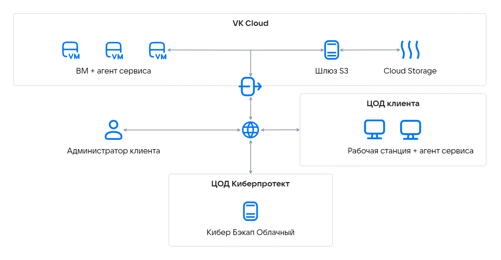

Шлюз S3 позволяет сервису [Кибер Бэкап Облачный](/applications-and-services/marketplace/initial-configuration/cyber-backup-quick-start) использовать публичный облачный сервис [Cloud Storage](/ru/storage/s3) для хранения резервных копий. Это обеспечивает возможность доступа к резервным копиям через интернет.

При подключении Шлюзa S3 для «Кибер Бэкап Облачный» в инфраструктуре VK Cloud создается кластер для хранения резервных копий, который состоит из следующих элементов:

- Виртуальные машины. При настройке и подключении шлюза будет развернут как минимум один сервер на ВМ. Для достижения отказоустойчивости создается кластер из нескольких ВМ.
- Виртуальные диски.
- Бакет Cloud Storage для хранения резервных копий.
- Сетевой балансировщик нагрузки с внешним IP-адресом для распределения нагрузки между ВМ (для отказоустойчивой конфигурации).

Архитектура сервиса:

{params[noBorder=true]}

Данные, предназначенные для загрузки в публичное облако, сначала сохраняются локально и только после этого отправляются в место назначения.

<err>
Для хранения промежуточных копий используйте постоянное локальное хранилище. Использование временных дисков может привести к потере данных.
</err>

В локальном кластере хранилища должно быть достаточно логического пространства. Например, при ежедневном резервном копировании места должно хватать для резервных копий не за один, а хотя бы за полтора дня.

Резервные копии представляют собой холодные данные со специфической схемой доступа: к этим данным обращаются редко, но они должны быть немедленно доступны при обращении. Для хранения резервных копий в [Cloud Storage](/ru/storage/s3) используются бакеты с классом хранения Hotbox и Icebox.

В таблице указаны минимальные конфигурации ВМ для создания кластера хранения.

[cols="1,2,2", options="header"]
|===
|Ресурсы
|Один сервер
|Три сервера (отказоустойчивая конфигурация)

|vCPU
|4
|12

|RAM (ГБ)
|8
|24

|SSD (ГБ)
|120
|360

|Тип ВМ
|Standart-4-8
|Standart-4-8
|===

Количество серверов для настройки шлюза напрямую влияет на производительность при передаче резервных копий в облако. Для крупных проектов с большим объемом данных и инфраструктурой рекомендуется создавать отказоустойчивый кластер.

Чтобы подключить и настроить Шлюз S3 для «Кибер Бэкап Облачный» обратитесь в [техническую поддержку](/ru/contacts). Для расчета стоимости предоставьте информацию по объему инфраструктуры (ВМ) и данных (ГБ), резервные копии которых необходимо выполнять. Заявка на развертывание шлюза рассматривается в течение одной рабочей недели.

В процессе развертывания шлюза в вашем проекте VK Cloud будут созданы необходимые [облачные ресурсы](../concepts/about/), а также настроены учетные записи, тенанты и [квоты](ru/tools-for-using-services/account/concepts/quotasandlimits).

После развертывания для управления используется панель сервиса Кибер Бэкап Облачный.
