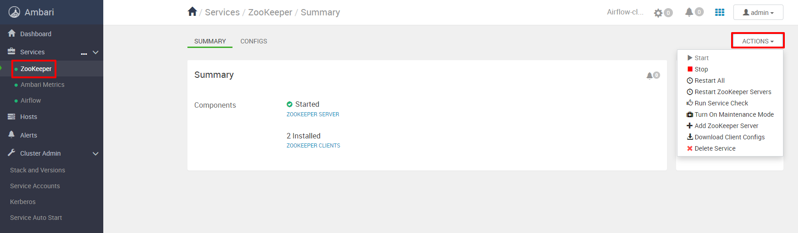
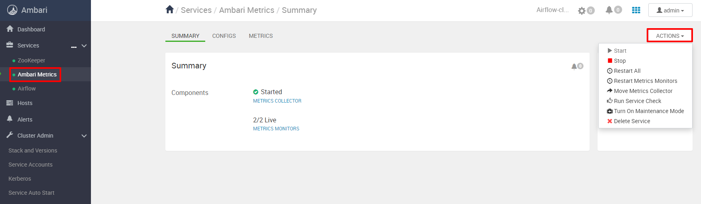

Apache Airflow - платформа для создания, планирования и мониторинга рабочих процессов.

Airflow позволяет создавать рабочие процессы в виде направленных ациклических графов (DAG) задач. Разнообразные служебные программы командной строки выполняют сложные операции на DAG. Пользовательский интерфейс легко визуализирует конвейеры, работающие в производственной среде, отслеживает ход выполнения и при необходимости устраняет неполадки.

## Принципы Apache Airflow

Динамический - конвейеры имеют конфигурацию кода (Python), что позволяет создавать динамические конвейеры.

Расширение - легкое определение собственных операторов и исполнителей, а также расширение библиотеки в соответствии с уровнем абстракций, подходящих используемой среде.

Четкость - параметризация скриптов встроена в ядро Airflow с использованием мощного инструмента шаблонов Jinja.

Масштабируемость - Airflow имеет модульную архитектуру и использует очередь сообщений для организации произвольного количества рабочих процессов. Airflow готов к бесконечному масштабированию.

Данная платформа не является решением для потоковой передачи данных.

## Компоненты сборки

**ZooKeeper**

Apache Zookeeper - open source проект Apache Software Foundation, сервис-координатор, который обеспечивает распределенную синхронизацию небольших по объему данных (конфигурационная информация, пространство имен) для группы приложений. Zookeeper представляет из себя распределенное хранилище "ключ-значение", гарантирующий надежное хранение информации за счет синхронной репликации между узлами, контроля версий, механизма очередей и блокировок. За счет использования оперативной памяти и масштабируемости обладает высокой скоростью.

Архитектурно Zookeeper организован по клиент-серверной технологии, когда клиентские приложения обращаются к одному из узлов, объединенных в ансамбль. Среди ансамбля серверов выделяется главный узел — Лидер, который выполняет все операции записи и запускает автоматическое восстановление при отказе любого из подключенных серверов. Остальные узлы — подписчики или последователи, реплицируют данные с Лидера и используются клиентскими приложениями для чтения.

ZooKeeper имитирует виртуальную древовидную файловую систему из взаимосвязанных узлов, которые представляют собой совмещенное понятие файла и директории. Каждый узел этой иерархии может одновременно хранить данные и иметь подчиненные узлы-потомки.

В интерфейсе Ambari для управления компонентом Zookeeper необходимо открыть соответствующую вкладку и открыть выпадающее меню "Действия/Actions":

**Ambari Metrics**

Ambari Metrics System (AMS) - собирает, агрегирует и обслуживает системные метрики в кластерах, управляемых Ambari и имеет 4 компонента:

- мониторы метрик на каждом хосте в кластере собирают метрики системного уровня и публикуют их в Metrics Collector
- Hadoop Sinks подключается к компонентам Hadoop для публикации метрик в Metrics Collector
- Metrics Collector это демон, работающий на определенном хосте в кластере и получающий данные от зарегистрированных пользователей, мониторов или приемников
- Grafana это демон, который работает на определенном хосте в кластере и обслуживает предварительно созданные панели мониторинга для визуализации метрик.

В интерфейсе Ambari для управления компонентом Ambari Metrics необходимо открыть соответствующую вкладку и открыть выпадающее меню "Действия/Actions":

<>
