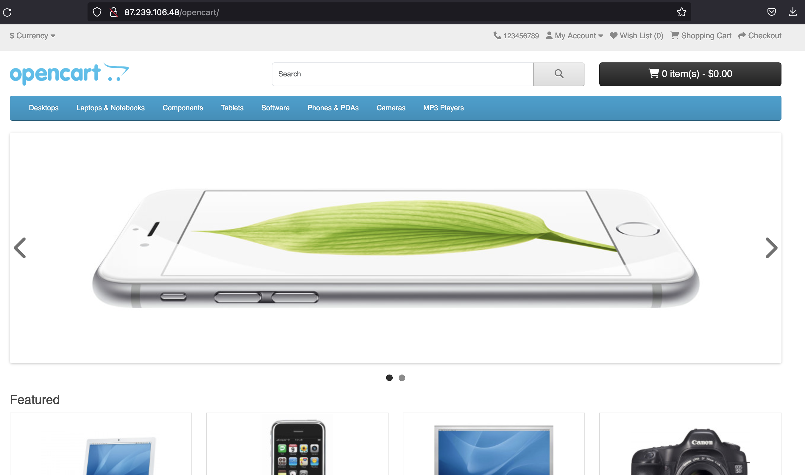

[OpenCart](https://www.opencart.com) — платформа для создания интернет-магазина. OpenCart построена по принципу MVC и может быть установлена на любом веб-сервере с поддержкой PHP и MySQL.

Данная инструкция поможет развернуть OpenCart версии 4.0.2.3 в операционной системе Ubuntu 22.04 в VK Cloud, а также настроить DNS-запись для доступа по доменному имени. В качестве СУБД используется MySQL 8.0 конфигурации Single.

## Подготовительные шаги

1. [Зарегистрируйтесь](/ru/additionals/start/account-registration) в VK Cloud.
1. [Создайте](/ru/networks/vnet/operations/manage-net#sozdanie_seti) сеть `network1` с доступом в интернет и подсетью `10.0.0.0/24`.
1. [Создайте ВМ](/ru/base/iaas/service-management/vm/vm-create):

   - имя: `Ubuntu_22_04_OpenCart`;
   - операционная система: Ubuntu 22.04;
   - сеть: `network1` с подсетью `10.0.0.0/24`;
   - назначьте публичный IP-адрес. В примере будет использоваться `87.239.106.48`;
   - группы безопасности: `default`, `ssh+www`.

1. [Создайте инстанс БД](/ru/dbs/dbaas/instructions/create/create-single-replica):

   - имя: `MySQL-9341`;
   - СУБД: MySQL 8.0;
   - тип конфигурации: Single;
   - сеть: `network1`;
   - название БД: `MySQL-9341`;
   - имя пользователя БД: `user`;
   - пароль пользователя: `AN0r25e0ae4d626p`;

   В примере внутренний IP созданного инстанса: `10.0.0.7`.

1. [Создайте](/ru/networks/dns/publicdns#sozdanie_dns_zony) DNS-зону.

   <warn>

   Убедитесь, что DNS-зона делегирована успешно и NS-записи настроены верно: зона должна находиться в статусе **NS-записи настроены верно**.

   </warn>

1. [Создайте](/ru/networks/dns/publicdns#dobavlenie_resursnyh_zapisey) запись в выделенной зоне:

   - тип записи: `A`;
   - имя: например, `site-opencart.example.vk.cloud`;
   - IP-адрес: внешний адрес ВМ `87.239.106.48`.

1. (Опционально) Проверьте резолвинг имени в IP-адрес с помощью команды `nslookup site-opencart.example.vk.cloud`. Вывод при успешной операции:

   ```bash
   Non-authoritative answer:
   Name:   site-opencart.example.vk.cloud
   Address: 87.239.106.48
   ```

## 1. Установите OpenCart на ВМ

1. [Подключитесь](/ru/base/iaas/service-management/vm/vm-connect/vm-connect-nix) к ВМ `Ubuntu_22_04_OpenCart`.
1. Обновите пакеты до актуальной версии и перезагрузите ВМ с помощью команд:

   ```bash
   sudo dnf update -y
   sudo systemctl reboot
   ```

1. Загрузите необходимые репозитории и запустите веб-сервер:

   ```bash
   sudo apt install apache2 apache2-utils libapache2-mod-php php8.1 php8.1-cli php8.1-curl php8.1-fpm php8.1-gd php8.1-intl php8.1-mbstring php8.1-mysql php8.1-opcache php8.1-readline php8.1-soap php8.1-xml php8.1-xmlrpc php8.1-zip php-gd -y
   sudo systemctl enable apache2 --now
   ```

1. Скачайте репозиторий OpenCart и разверните его в директории `opencart` на запущенном веб-сервере:

   ```bash
   cd ~
   wget https://github.com/opencart/opencart/archive/refs/tags/4.0.2.3.tar.gz
   tar xzf 4.0.2.3.tar.gz
   sudo cp -r opencart-4.0.2.3/upload /var/www/html/opencart
   sudo chown -R www-data:www-data /var/www/html/opencart
   sudo mv /var/www/html/opencart/config-dist.php /var/www/html/opencart/config.php
   sudo mv /var/www/html/opencart/admin/config-dist.php /var/www/html/opencart/admin/config.php
   ```

1. В браузере введите публичный IP-адрес ВМ с `/opencart`. В текущей инструкции это `site-opencart.example.vk.cloud/opencart`.
1. В мастере установки ознакомьтесь и примите условия лицензионного соглашения OpenCart.
1. На шаге «Pre-Installation» проверьте готовность ВМ к установке OpenCart — все проверки должны быть выполнены успешно.
1. На шаге «Configuration» укажите параметры `MySQL-9341`:

   - **DB Driver**: `MySQLi`.
   - **Hostname**: `10.0.0.7`.
   - **Username**: `user`.
   - **Password**: `AN0r25e0ae4d626p`.
   - **Database**: `MySQL-9341`.
   - **Port**: `3306`.

    На этом же шаге укажите учетные данные администратора.

1. Дождитесь завершения установки: появится страница **Installation complete**.
1. (Опционально) Донастройте OpenCart согласно рекомендациям разработчика ПО:

   1. Удалите директорию `install` с веб-сервера:

      ```bash
      sudo rm -rf /var/www/html/opencart/install
      ```

   1. Переместите директорию `storage` в `/var/www`:

      ```bash
      sudo mv /var/www/html/opencart/system/storage/ /var/www
      ```

   1. Конфигурационных файлах `/var/www/html/opencart/config.php` и `/var/www/html/opencart/admin/config.php` замените:

      ```bash
      // исходная строка
      define('DIR_STORAGE', DIR_SYSTEM . 'storage/');

      // заменяемая строка
      define('DIR_STORAGE', '/var/www/storage/');
      ```

## 2. Проверьте работоспособность OpenCart

В браузере перейдите по адресу `http://site-opencart.example.vk.cloud/opencart/`. При успешной установке откроется страница с демо-магазином.



## Удалите неиспользуемые ресурсы

Развернутые виртуальные ресурсы тарифицируются. Если они вам больше не нужны:

- [Удалите](/ru/base/iaas/service-management/vm/vm-manage#udalenie_vm) ВМ `Ubuntu_22_04_OpenCart`.
- [Удалите](/ru/dbs/dbaas/instructions/manage-instance/mysql#udalenie_instansa_bd_ili_ego_hostov) инстанс БД `MySQL-9341`.
- При необходимости [удалите](/ru/networks/vnet/operations/manage-floating-ip#udalenie_plavayushchego_ip_adresa_iz_proekta) плавающий IP-адрес `87.239.106.48`.
- [Удалите](/ru/networks/dns/publicdns#udalenie_resursnyh_zapisey) созданную DNS-запись `site-opencart.example.vk.cloud`.
