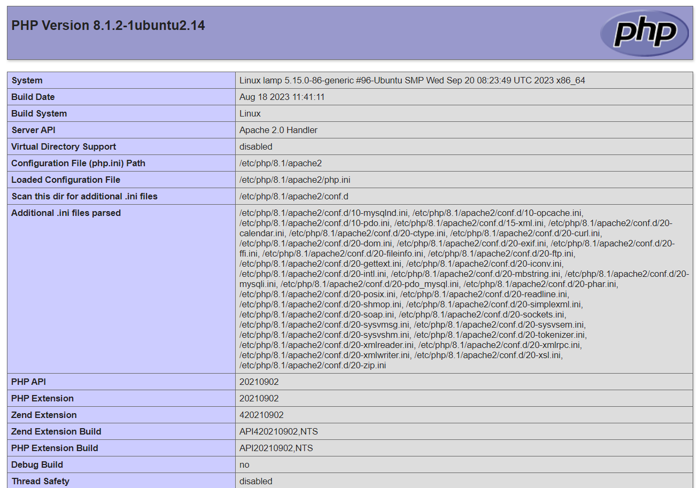

Стек LAMP включает в себя операционную систему семейства Linux, веб-сервер Apache, систему управления базами данных MySQL и серверный язык сценариев для обработки динамического контента PHP. Все это используется для поддержки динамических сайтов и веб-приложений.

Данная инструкция поможет развернуть сервер Apache в операционной системе Ubuntu 22.04 в VK Cloud, установить PHP, а также настроить DNS-запись для доступа по доменному имени. В качестве СУБД используется MySQL 8.0 конфигурации Single.

## 1. Подготовительные шаги

1. [Зарегистрируйтесь](/ru/additionals/start/account-registration) в VK Cloud.
1. [Создайте](/ru/networks/vnet/operations/manage-net#sozdanie_seti) сеть `network1` с доступом в интернет и подсетью `10.0.0.0/24`.
1. [Создайте ВМ](/ru/base/iaas/instructions/vm/vm-create):

   - имя: `Ubuntu_22_04_LAMP`;
   - тип виртуальной машины: `STD2-2-2`;
   - операционная система: Ubuntu 22.04;
   - сеть: `network1` с подсетью `10.0.0.0/24`;
   - назначьте публичный IP-адрес. В примере будет использоваться `211.243.95.137`;
   - группы безопасности: `default`, `ssh+www`.

1. [Создайте инстанс БД](/ru/dbs/dbaas/instructions/create/create-single-replica):

   - имя: `MySQL-5864`;
   - СУБД: MySQL 8.0;
   - тип конфигурации: Single;
   - сеть: `network1`.

   Остальные параметры выберите на свое усмотрение.

   <info>

   Внутренний IP созданного инстанса: `10.0.0.7` — используйте его для дальнейшей работы со стеком.

   </info>

1. [Создайте](/ru/networks/dns/publicdns#sozdanie_dns_zony) DNS-зону.

   <warn>

   Убедитесь, что DNS-зона делегирована успешно и NS-записи настроены верно: зона должна находиться в статусе **NS-записи настроены верно**.

   </warn>

1. [Создайте](/ru/networks/dns/publicdns#dobavlenie_resursnyh_zapisey) запись в выделенной зоне:

   - тип записи: `A`;
   - имя: например, `site-lamp.example.vk.cloud`;
   - IP-адрес: внешний адрес ВМ `211.243.95.137`.

1. (Опционально) Проверьте резолвинг имени в IP-адрес с помощью команды `nslookup site-lamp.example.vk.cloud`. Вывод при успешной операции:

   ```bash
   Non-authoritative answer:
   Name:   site-lamp.example.vk.cloud
   Address: 211.243.95.137
   ```

## 2. Установите Apache и PHP на ВМ

1. [Подключитесь](/ru/base/iaas/instructions/vm/vm-connect/vm-connect-nix) к ВМ `Ubuntu_22_04_LAMP`.
1. Обновите пакеты до актуальной версии и перезагрузите ВМ с помощью команд:

   ```bash
   sudo apt update && sudo apt upgrade -y
   sudo reboot
   ```

1. Загрузите необходимые репозитории и запустите веб-сервер:

   ```bash
   sudo apt install apache2 apache2-utils libapache2-mod-php php8.1 php8.1-cli php8.1-curl php8.1-fpm php8.1-gd php8.1-intl php8.1-mbstring php8.1-mysql php8.1-opcache php8.1-readline php8.1-soap php8.1-xml php8.1-xmlrpc php8.1-zip php-gd -y
   sudo systemctl enable apache2 --now
   ```

## 3. Проверьте работоспособность веб-сервера

1. На ВМ `Ubuntu_22_04_LAMP` создайте файл `/var/www/html/info.php` с содержимым:

   ```php
   <?php
    phpinfo();
   ?>
   ```
1. В браузере перейдите по адресу `http://site-lamp.example.vk.cloud/info.php`.

   Откроется страница с информацией об установленной версии PHP.

   

1. (Опционально) Удалите файл `/var/www/html/info.php` с веб-сервера.

## Удалите неиспользуемые ресурсы

Развернутые виртуальные ресурсы тарифицируются. Если они вам больше не нужны:

- [Удалите](/ru/base/iaas/instructions/vm/vm-manage#udalenie_vm) ВМ `Ubuntu_22_04_LAMP`.
- [Удалите](/ru/dbs/dbaas/instructions/manage-instance/mysql#udalenie_instansa_bd_ili_ego_hostov) инстанс БД `MySQL-5864`.
- При необходимости [удалите](/ru/networks/vnet/operations/manage-floating-ip#udalenie_plavayushchego_ip_adresa_iz_proekta) плавающий IP-адрес `211.243.95.137`.
- [Удалите](/ru/networks/dns/publicdns#udalenie_resursnyh_zapisey) созданную DNS-запись `site-lamp.example.vk.cloud`.
