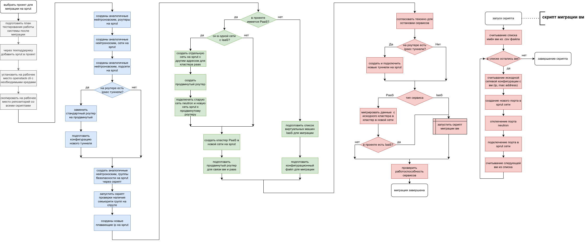

## Для чего нужна миграция

Для повышения надежности и доступности сетевой инфраструктуры облака рекомендуется перевести проекты в [Sprut](/ru/networks/vnet/concepts/sdn#sprut) — SDN собственной разработки VK Cloud, которая обеспечивает стабильную работу сетей и сетевых функций поверх этих сетей на больших масштабах.

SDN Sprut была разработана, чтобы расширить возможности [SDN Neutron](/ru/networks/vnet/concepts/sdn#neutron), которая использовалась ранее. SDN Neutron эффективна при работе с небольшими сетями, но имеет ограничения при работе с крупными сетями (тысячи и десятки тысяч портов). Так как SDN является основной всех виртуальных сетей и сервисов, то эти ограничения существенно влияли на стабильность, масштабируемость и развитие как пользовательских проектов, так и всей платформы.

SDN Sprut полностью совместима с Openstack Neutron API и имеет ряд преимуществ в сравнении с SDN Neutron:

- легче масштабируется и подходит для сетей любого размера;
- позволяет свободно интегрироваться с сервисами VK Cloud и сторонними сервисами;
- имеет более высокую производительность;
- имеет сервисы, недоступные в SDN Neutron;
- независима от OpenStack.

Сейчас Sprut — основная SDN для всех новых проектов, но старые проекты используют SDN Neutron. Вы можете самостоятельно перенести свои проекты в SDN Sprut. В личном кабинете можно [узнать, к какой SDN подключен ваш проект](ru/tools-for-using-services/account/service-management/project-settings/manage#sdn_view).

<warn>
Поддержка SDN Neutron прекратится в конце 2025 года. После этого пользователи SDN Neutron могут столкнуться с проблемами безопасности и отсутствием обновлений.
</warn>

Вы можете самостоятельно перенести свои проекты в SDN Sprut.

Функциональные преимущества миграции:

- [Продвинутый маршрутизатор](/ru/networks/vnet/how-to-guides/advanced-router) с поддержкой динамической маршрутизации по протоколу BGP для построения отказоустойчивых схем маршрутизации.
- [Cloud Direct Connect](https://cloud.vk.com/direct-connect) — выделенные подключения между локальной сетью компании и VK Cloud.
- [Общие сети](/ru/networks/vnet/concepts/net-types#shared_net) для объединения проектов в одном регионе.
- Децентрализованный DHCP-сервис для повышения отказоустойчивости.
- Изолированный трафик между различными проектами в рамках PaaS-сервисов.
- Децентрализованный и отказоустойчивый [приватный DNS-сервис](/ru/networks/dns/private-dns) внутри облака.

Нефункциональные преимущества миграции:
- REST API и другие механизмы интеграции с сервисами платформы или сторонними сервисами.
- Повышение производительности до 34% по сравнению с SDN Neutron.
- Сокращение времени отклика API и UI.
- Готовность к горизонтальному масштабированию SDN-компонентов.
- Автоматическое восстановление работоспособности сетевых сущностей.
- Улучшение отказоустойчивости за счет реакции системы на события в режиме реального времени.
- Возможность автоматической конфигурации и мониторинга сетевой инфраструктуры.

## {heading(Последовательность миграции)[id=migration_sequence]}

На схеме представлена последовательность действий при миграции в SDN Sprut:

{params[noBorder=true]}

Все действия разбиты на четыре этапа:

1. Подготовка и анализ текущей инфраструктуры.
2. [Миграция сетевой инфраструктуры](../iaas/) (IaaS).
3. [Миграция платформенных сервисов](../paas/) (PaaS).
4. Постмиграционное тестирование и оптимизация.

## {heading(Какие сервисы можно мигрировать)[id=services_to_migrate]}

[cols="1,2,1", options="header"]
|===
|Сервис
|Возможность миграции
|Описание

|Сеть
| 
.6+|[Миграция сетевой инфраструктуры](../iaas/)

|Маршрутизатор
| 

|Плавающий IP-адрес
|Плавающий IP-адрес нельзя перенести, нужно создать новый в SDN Sprut и назначить его ВМ

|Виртуальная машина
| 

|Группа безопасности
| 

|VPN (IPsec)
| 

|Балансировщик нагрузки
| 
.4+|Миграция платформенных сервисов

|Файловое хранилище (NFS)
|В разработке

|База данных
|В разработке

|Kubernetes
|В разработке
|===

## {heading(Инструменты миграции)[id=migration_instruments]}

Вы можете самостоятельно перенести ваш проект в SDN Sprut при помощи следующих инструментов:

- Terraform: наиболее простой способ миграции, но требует большего технического окна (времени, когда сервис не будет работать).
- Личный кабинет и Openstack CLI: требует больше времени на подготовку миграции, но меньшего технического окна.

При миграции проектов используются следующие скрипты:

[cols="1,3", options="header"]
|===
|Скрипт
|Описание

|[copy-router-and-networks.sh](https://github.com/vk-cs/neutron-2-sprut/blob/guide_v3/copy-router-and-networks.sh)
|Скрипт копирует конфигурации маршрутизаторов и подключенных к ним сетей и подсетей в SDN Neutron и создает аналогичные в SDN Sprut

|[copy-ipsec.sh](https://github.com/vk-cs/neutron-2-sprut/blob/guide_v3/copy-ipsec.sh)
|Скрипт копирует конфигурации IPsec-туннелей в SDN Neutron и создает аналогичные в SDN Sprut

|[copy-loadbalancer.sh](https://github.com/vk-cs/neutron-2-sprut/blob/guide_v3/copy-loadbalancer.sh)
|Скрипт копирует конфигурации балансировщиков в SDN Neutron и создает аналогичные в SDN Sprut

|[copy-security-group.sh](https://github.com/vk-cs/neutron-2-sprut/blob/guide_v3/copy-security-group.sh)
|Скрипт копирует группы безопасности в SDN Neutron и создает аналогичные в SDN Sprut, добавляя в их название `-sprut`

|[check-if-all-sprut-sg-present.sh](https://github.com/vk-cs/neutron-2-sprut/blob/guide_v3/check-if-all-sprut-sg-present.sh)
|Скрипт проверяет, какие группы безопасности назначены каждой копируемой ВМ в SDN Neutron, после чего проверяет наличие групп с таким же названием и постфиксом `-sprut`. Группы `default`, `all`, `ssh+www` игнорируются, так как являются базовыми для обеих SDN

|[migrator.sh](https://github.com/vk-cs/neutron-2-sprut/blob/guide_v3/migrator.sh)
|Скрипт переключает сетевой интерфейс ВМ из SDN Neutron в SDN Sprut. Возможно переключение с сохранением  MAC или IP-адреса порта и без сохранения. ВМ должна быть активна до запуска скрипта

|[migrator-multiple.sh](https://github.com/vk-cs/neutron-2-sprut/blob/guide_v3/migrator-multiple.sh)
|Скрипт переключает сетевые интерфейсы нескольких ВМ  из SDN Neutron в SDN Sprut. ВМ должны быть активны и иметь только по одному сетевому интерфейсу

|[modify-terraform-state.sh](https://github.com/vk-cs/neutron-2-sprut/blob/guide_v3/modify-terraform-state.sh)
|Скрипт изменяет состояния каждой ВМ в файле `terraform.tfstate` при миграции через Terraform
|===
