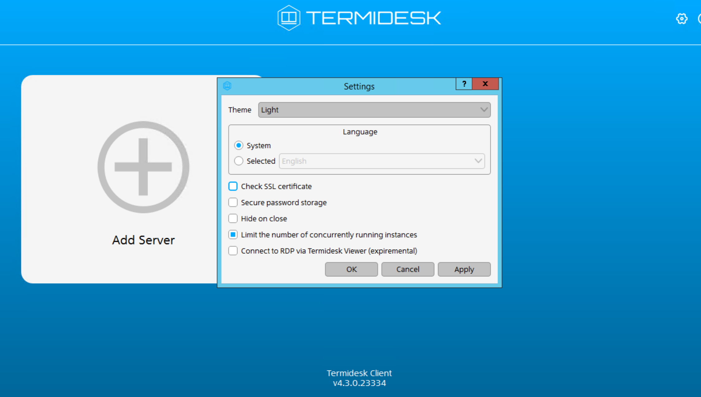
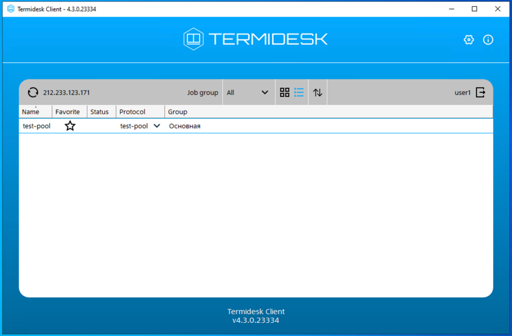

Для взаимодействия с виртуальным рабочим столом сервиса Cloud Desktop на пользовательскую рабочую станцию необходимо [установить](../install-termidesk-client/) программный клиент Termidesk.

В зависимости от принадлежности к той или иной группе LDAP вам будут доступны рабочие столы определенного типа:

* Сессионный рабочий стол — рабочий стол создается по мере необходимости в автоматическом режиме, назначается первому подключившемуся к нему пользователю и удаляется после выхода пользователя из гостевой ОС рабочего стола.
* Персонализированный рабочий стол — рабочий стол закрепляется за первым подключившимся к нему пользователем, который владеет им на протяжении жизненного цикла рабочего стола.

## {heading(Подключение к Termidesk и открытие рабочего стола с прохождением двухфакторной аутентификации)[id=getting_started_auth]}

1. В веб-браузере подключитесь к пулу рабочих столов, используя IP-адрес сервера, предоставленный вашим системным администратором.
1. Выберите домен авторизации, на котором настроен SAML-сервер.
1. На странице SAML-провайдера введите ваши логин и пароль LDAP.
1. При первом входе привяжите приложение для генерации одноразовых паролей (ОТP), например Google Authenticator.
1. Введите код из приложения OTР.

   Откроется начальный экран со списком доступных рабочих столов.

1. Нажмите на имя нужного рабочего стола.
1. Введите учетные данные для входа в операционную систему.

## {heading(Подключение к Termidesk и открытие рабочего стола без двухфакторной аутентификации)[id=getting_started_open]}

1. Запустите приложение клиента Termidesk.
1. Нажмите на значок .
1. В открывшемся окне отключите опцию **Check SSL certificate** (Проверка SSL сертификата) и нажмите кнопку **ОК**.

   {params[width=80%]}

1. Нажмите кнопку **Add server** и введите IP-адрес сервера для подключения. Протокол для подключения указывать не нужно, подразумевается защищенное HTTPS-соединение.
1. Нажмите кнопку **OK**.

   <info>

   При последующих запусках клиента список серверов будет доступен на главном экране приложения. Для подключения дважды нажмите на плитку нужного сервера.

   </info>

1. При успешном подключении в окне **Server Connection Configuration** укажите ваши логин и пароль LDAP и нажмите кнопку **OK**.
1. Выберите сервер и нажмите кнопку **Connect**.

   После успешного входа в систему откроется начальный экран со списком доступных рабочих столов.

1. Нажмите на имя нужного рабочего стола.

   {params[width=80%]}

   При удачном подключении откроется отдельное окно с виртуальным рабочим столом.

1. Введите учетные данные для входа в операционную систему.

## {heading(Использование командной строки при работе с клиентом)[id=getting_started_cli]}

1. Откройте терминал.
2. В терминале перейдите в директорию установки и запустите клиент, выполнив команды:

    * Под ОС Linux:

        ```console
        cd <ПУТЬ> 
        termidesk-client
        ```

    * Под ОС Windows:

        ```console
        cd "<ПУТЬ"
        termidesk-client.exe
        ```

    Здесь <ПУТЬ> — путь к директории, в которой установлен клиент Termidesk.

При запуске клиента из командной строки доступны дополнительные параметры (ключи):

[cols="1,2", options="header"]
|===
|Ключ
|Описание

|`--help`
|Вывести список доступных ключей и параметров

|`--version`
|Вывести информацию о версии клиента

|`--debug`
|Запустить клиент в режиме отладки с выводом всей служебной информации в реальном времени

|`--timeout`
|Время ожидания сетевых подключений. По умолчанию 60 сек

|`--user-auth`
|Имя аутентификатора при подключении к серверу. Доступен с версии 4.3

|`--user-name`
|Имя пользователя при подключении к серверу. Доступен с версии 4.3

|`--user-password`
|Пароль пользователя при подключении к серверу. Доступен с версии 4.3
|===

<warn>

Подробнее о ключах клиента Termidesk — в [официальной документации](https://wiki.astralinux.ru/termidesk-help/4.3.2).

</warn>
