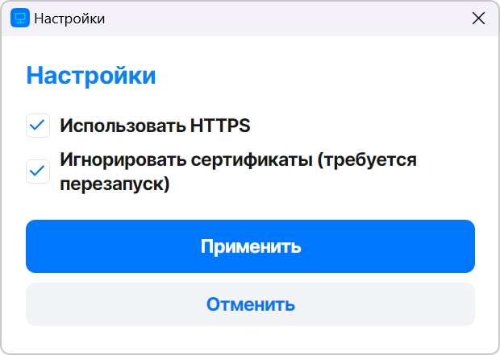
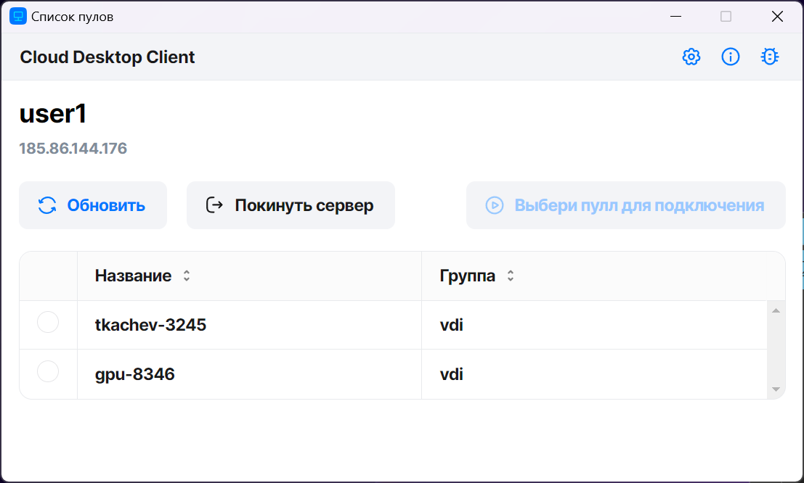

Для взаимодействия с виртуальным рабочим столом сервиса Cloud Desktop на пользовательскую рабочую станцию необходимо [установить](../install-vk-client/) клиентское приложение Cloud Desktop Client.

В зависимости от принадлежности к той или иной группе LDAP вам будут доступны рабочие столы определенного типа:

* Сессионный рабочий стол — рабочий стол создается по мере необходимости в автоматическом режиме, назначается первому подключившемуся к нему пользователю и удаляется после выхода пользователя из гостевой ОС рабочего стола.
* Персонализированный рабочий стол — рабочий стол закрепляется за первым подключившимся к нему пользователем, который владеет им на протяжении жизненного цикла рабочего стола.

## {heading(Подключение к Cloud Desktop Client и открытие рабочего стола)[id=getting_started_open]}

1. Запустите приложение Cloud Desktop Client.
1. Нажмите на значок 
1. В открывшемся окне выберите опцию **Игнорировать сертификаты** и нажмите кнопку **Применить** .

   {params[width=40%]}

1. Нажмите кнопку **Добавить сервер** и в окне **Настройка подключения к серверу** укажите следующие параметры:

   * Название сервера.
   * IP-адрес сервера для подключения. Протокол для подключения указывать не нужно, подразумевается защищенное HTTPS-соединение.
   * Порт. По умолчанию — `5031`.
   * Логин и пароль LDAP.

1. Нажмите кнопку **Применить**.

   <info>

   При последующих запусках Cloud Desktop Client список серверов будет доступен на главном экране приложения.

   </info>

1. Выберите сервер и нажмите **Подключиться**.

   Если для сервиса Cloud Desktop настроена двухфакторная аутентификация, откроется веб-страница двухфакторной авторизации. В противном случае, откроется список доступных пулов рабочих столов.

1. Если открылась веб-страница двухфакторной авторизации, выполните одно из действий:

   * При первом подключении к серверу настройте второй фактор авторизации. Конкретный сценарий зависит от провайдера двухфакторной авторизации. Например, потребуется отсканировать QR-код через приложение Google Authentificator и затем ввести код из приложения в поле на веб-странице.
   * При повторном подключении к серверу укажите второй фактор авторизации. Конкретный сценарий зависит от провайдера двухфакторной авторизации.

   После успешного входа в систему откроется список доступных пулов рабочих столов.

1. Выберите нужный пул и нужный рабочий стол и нажмите кнопку **Подключиться**.

   {params[width=80%]}

   При удачном подключении откроется отдельное окно с виртуальным рабочим столом.

1. Если настройками ОС предусмотрен **Экран безопасности**, нажмите на значок  и выберите пункт **Экран безопасности**. На открывшемся экране безопасности нажмите комбинацию клавиш CTRL+ALT+DEL.
1. Введите учетные данные для входа в операционную систему.
