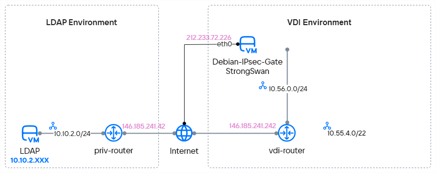
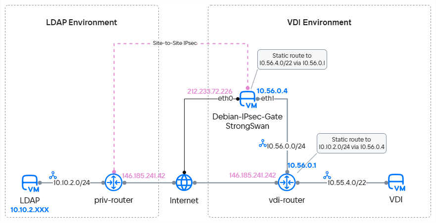

Для организации VPN-туннеля на базе VK Cloud нужно указать одну или несколько существующих подсетей, находящихся за маршрутизатором.
Это не позволяет настроить VPN-подключение для VDI, так как подсети для VDI создаются динамически в заранее определенном адресном пространстве. Для успешной интеграции с VDI-окружением VPN-туннель можно организовывать с использованием выделенного VPN-сервера на базе IaaS ВМ (виртуальной машины). Это позволит организовать защищенную связность до CIDR, указанного в настройках VDI.

Чтобы показать настройку защищенного подключения c виртуальными рабочими столами:

- Будет создан VPN-туннель между LDAP-окружением и VDI-окружением в VK Cloud.
- На стороне LDAP в качестве VPN-решения будет использован встроенный VPN-сервис VK Cloud. В реальном сценарии вы можете использовать любое оборудование или ПО с возможностью создания VPN-подключения по технологии IPsec Site-2-Site.
- На стороне VDI в качестве VPN-решения будет использована ВМ на базе ОС Debian 11 и дополнительными пакетами strongSwan.
- Будет создана транзитная сеть, которая свяжет VPN-шлюз на базе Debian 11 с маршрутизатором платформы, за которым будут сформированы сети VDI.
- Для имитации VDI будет добавлена сеть с ВМ. ВМ будет выполнять пинг LDAP-сервера для проверки сетевой связности.

## Подготовительные шаги

1. Убедитесь, что клиент OpenStack [установлен](/ru/tools-for-using-services/cli/openstack-cli#1_ustanovite_klient_openstack), и [пройдите аутентификацию](/ru/tools-for-using-services/cli/openstack-cli#3_proydite_autentifikaciyu) в проекте.

1. Создайте LDAP-окружение:

    1. Выберите или [создайте](/ru/networks/vnet/service-management/net#sozdanie_seti) в VK Cloud виртуальную сеть с доступом к интернету. Используйте существующий маршрутизатор с подключением к внешней сети или [создайте](/ru/networks/vnet/service-management/router#dobavlenie_marshrutizatora) новый.

        Запишите следующую информацию:

        - IP-адрес подсети;
        - IP-адрес и имя маршрутизатора.

    1. Создайте в выбранной сети [виртуальную машину](/ru/computing/iaas/service-management/vm/vm-create) c ОС Windows Server 2019.

        Запишите имя и IP-адрес ВМ.

1. Создайте VDI-окружение:

    1. Выберите или [создайте](/ru/networks/vnet/service-management/net#sozdanie_seti) в VK Cloud виртуальную сеть с доступом к интернету, которая будет выполнять функцию транзитной сети. Используйте существующий маршрутизатор с подключением к внешней сети или [создайте](/ru/networks/vnet/service-management/router#dobavlenie_marshrutizatora) новый.

        Запишите следующую информацию:

        - IP-адрес подсети;
        - IP-адрес и имя маршрутизатора.

    1. Заранее выделите CIDR для сети, имитирующей VDI. CIDR будет использован для настройки VDI окружения.

        Запишите IP-адрес (CIDR) подсети.

1. [Создайте виртуальную машину](/ru/computing/iaas/service-management/vm/vm-create) с подключением к внешней сети `ext-net`. Это позволит не использовать плавающий IP при дальнейшей настройке.

    Параметры ВМ:

    - ОС: Debian 11;
    - Рекомендуемый тип ВМ: `STD3-2-4`.

    Запишите имя и IP-адрес ВМ.

1. Обновите OC на ВМ Debian:

    1. [Подключитесь](/ru/computing/iaas/service-management/vm/vm-connect/vm-connect-nix) к виртуальной машине `Debian-IPsec-Gate` по SSH и получите права root-пользователя (команда `sudo bash`).

    1. Обновите ОС перед дальнейшей настройкой:

        ```bash
        apt update && apt upgrade -y
        ```

    1. Выполните перезагрузку ВМ при помощи команды `reboot`.

1. Убедитесь, что собраны все сведения, необходимые для дальнейшей работы.

    Для примера далее используются следующие данные:

    - AD/LDAP окружение:

        - IP-адрес подсети: `10.10.2.0/24`;
        - имя и IP-адрес маршрутизатора: `priv-router`, `146.185.241.42`;
        - имя и IP-адрес AD/LDAP-сервера: `LDAP`, `10.10.2.14`.

    - VDI окружение:

        - IP-адрес подсети: `10.56.0.0/24`;
        - IP-адрес подсети для VDI: `10.55.4.0/22`;
        - имя и IP-адрес маршрутизатора: `vdi-router`, `146.185.241.242`.

    - Имя и IP-адрес виртуальной машины во внешней сети: `Debian-IPsec-Gate`, `212.233.72.226`.

Схема предварительной подготовки сетей:

{params[noBorder=true]}

## 1. Настройте VPN-туннель на стороне AD/LDAP

В личном кабинете [создайте VPN](/ru/networks/vnet/service-management/vpn) со следующими параметрами:

1. На шаге **Настройка IKE** укажите алгоритмы для первичного IPsec-соединения:

    - **IKE-политика**:	`Новая IKE политика`;
    - **Имя политики**:	`d11-gate-ike`;
    - **Время жизни ключа**: `28800`;
    - **Алгоритм авторизации**:	`sha256`;
    - **Алгоритм шифрования**:	`aes-256`;
    - **Версия IKE**: `v2`;
    - **Группа Диффи-Хеллмана**: `group14`.

1. На шаге **Настройка IPsec** укажите алгоритмы для защиты полезного трафика между узлами:

    - **IPsec-политика**:	`Новая IPsec политика`;
    - **Имя политики**:	`d11-gate-ike`;
    - **Время жизни ключа**: `28800`;
    - **Алгоритм авторизации**:	`sha256`;
    - **Алгоритм шифрования**:	`aes-256`;
    - **Версия IKE**: `v2`;
    - **Группа Диффи-Хеллмана**: `group14`.

1. На шаге **Создание Endpoint Groups** укажите сети, трафик между которыми будет защищен VPN:

    - **Маршрутизатор**: `priv-router`;
    - **Local Endpoint**: `Новая endpoint-группа`;
    - **Имя**:	`d11-tunnel-local-acl`;
    - **Подсети**: `priv_subnet_demo (10.10.2.0/24)`;
    - **Remote Endpoint**: `Новая endpoint-группа`;
    - **Имя группы**: `d11-tunnel-remote-acl`;
    - **Адрес подсети**: `10.55.4.0/22`.

1. На шаге **Настройка туннеля** укажите адрес удаленного шлюза, с которым будет установлено IPsec-соединение, и ключ для авторизации (PSK):

    - **Настройки**: `Расширенные`;
    - **Имя туннеля**: `d11-ipsec-tun`;
    - **Публичный IPv4 адрес пира (Peer IP)**: `212.233.72.226`;
    - **Ключ совместного использования (PSK)**: нажмите кнопку **Сгенерировать** или введите свой ключ;
    - **Идентификатор маршрутизатора пира для аутентификации (Peer ID)**: `212.233.72.226`;
    - **Состояние инициатора**:	`bi-directional`;
    - **При обнаружении недоступности пира**: `restart`;
    - **Интервал обнаружения недоступности пира**: 15 секунд;
    - **Время для обнаружения недоступности пира**: 60 секунд.

## 2. Подключите дополнительный сетевой интерфейс к ВМ Debian

Чтобы настроить VPN-туннель на стороне VDI-окружения, добавьте для сервера Debian дополнительный сетевой интерфейс в подсеть `vdi-transit-vsubnet` с привязкой к нему адреса `10.56.0.4`:

1. В [личном кабинете](https://mcs.mail.ru/app/) перейдите в раздел **Облачные вычисления** → **Виртуальные машины**.
1. Выберите BM `Debian-IPsec-Gate` и перейдите на вкладку **Сети**.
1. Нажмите кнопку **Добавить подключение**.
1. Укажите следующие настройки подключения:

    - **Имя**: `vdi-transit`;
    - **Сеть подключения**:	`vdi-transit-vsubnet`;
    - **DNS-имя**:	`debian-ipsec-gate`;
    - **Задать IP-адрес**: включите опцию;
    - **IP-адрес**:	`10.56.0.4`;
    - **Настройки Firewall**: удалите все правила.
1. Нажмите **Сохранить**.

## 3. Настройте дополнительный сетевой интерфейс в ВМ Debian

1. [Подключитесь](/ru/computing/iaas/service-management/vm/vm-connect/vm-connect-nix) к виртуальной машине `Debian-IPsec-Gate` по SSH и получите права root-пользователя (команда `sudo bash`).
1. Создайте файл `eth1` с помощью команды:

    ```bash
    vim /etc/network/interfaces.d/eth1
    ```

1. Добавьте в созданный файл следующие строки:

    ```bash
    auto eth1
    iface eth1 inet static
    address 10.56.0.4/24
    mtu 1500
    post-up ip route add 10.55.4.0/22 via 10.56.0.1 || true
    pre-down ip route del 10.55.4.0/22 via 10.56.0.1 || true
    ```

    <info>

    Строки `post-up` и `pre-down` автоматизируют управление маршрутом в будущую сеть VDI при подключении и отключении интерфейса `eth1`.

    </info>

1. Выполните команду для применения новых сетевых настроек:

    ```bash
    systemctl restart networking
    ```

1. Проверьте корректность настройки IP-адреса интерфейса `eth1`:

   ```bash
   ip a | grep 10.56
   ```

   Интерфейс настроен корректно, если вернется ответ:

   ```bash
   inet 10.56.0.4/24 brd 10.56.0.7 scope global eth1
   ```
1. Проверьте корректность настройки маршрута в сеть `10.55.4.0/22`:

   ```bash
   ip r | grep 10.55
   ```

   Маршрут в будущую сеть VDI верный и добавлен автоматически, если вернется ответ:

   ```bash
   10.55.4.0/22 via 10.56.0.1 dev eth1
   ```

## 4. Отключите Port Security на порте в сторону транзитной сети

Отключите IP Source Guard для порта VPN-шлюза, чтобы он мог пересылать любой трафик:

1. Откройте новую сессию терминала и выполните команду:

    ```bash
    openstack port list --server Debian-IPsec-Gate
    ```

    В ответе вернется список портов `Debian-IPsec-Gate`. Найдите порт, направленный в сторону транзитной сети:

    ```bash
    +--------------------------------------+-------------+-------------------+-------------------------------------------------------------------------------+--------+
    | ID                                   | Name        | MAC Address       | Fixed IP Addresses                                                            | Status |
    +--------------------------------------+-------------+-------------------+-------------------------------------------------------------------------------+--------+
    | 4d75dafe-d562-462a-afe9-31ede945a196 |             | fa:16:3e:34:e1:3a | ip_address='212.233.72.226', subnet_id='9ec13002-fb52-4e00-ac69-84d86a75d807' | ACTIVE |
    | f00c7678-47c0-4d88-9be2-b5592de9112f | vdi-transit | fa:16:3e:fe:e2:26 | ip_address='10.56.0.4', subnet_id='2f50371c-4e91-4f05-aff1-33bef1388fdf'      | ACTIVE |
    +--------------------------------------+-------------+-------------------+-------------------------------------------------------------------------------+--------+
    ```

1. Выключите Port Security:

    ```bash
    openstack port set --disable-port-security f00c7678-47c0-4d88-9be2-b5592de9112f
    ```

## 5. Включите пересылку пакетов в ВМ

Включите IP Forwarding, чтобы виртуальная машина могла маршрутизировать трафик из транзитной сети в VPN-туннель:

1. Откройте сессию терминала с подключенной ВМ `Debian-IPsec-Gate`.

1. Выполните команду:

    ```bash
    echo 'net.ipv4.ip_forward = 1' | sudo tee -a /etc/sysctl.conf
    ```

1. Выполните команду для применения настроек без перезагрузки ОС:

    ```bash
    sysctl -p
    ```

1. Проверьте, что настройки применены:

    ```bash
    cat /proc/sys/net/ipv4/ip_forward
    ```

    Если в ответе вернется `1`, пересылка пакета подключена.

## 6. Установите пакеты для настройки VPN-туннеля на стороне ВМ Debian

1. Выполните команду:

    ```bash
    apt install vim strongswan strongswan-swanctl iptables iptables-persistent netfilter-persistent conntrack bmon -y
    ```

    Пакет `iptables-persistent` будет использован, чтобы записывать конфигурацию активной таблицы правил iptables в файл и подгружать список правил для обработки трафика при перезапуске ОС.

1. Включите автоматический запуск сервисов `strongswan` и `netfilter`:

    ```bash
    systemctl enable strongswan-starter
    systemctl start strongswan-starter
    systemctl enable netfilter-persistent
    ```

## 7. Добавьте конфигурацию IPsec и автоматизируйте ее запуск

1. Создайте конфигурационный файл swanctl для настройки VPN-подключения:

    ```bash
    vim /etc/swanctl/conf.d/vkcloud.conf
    ```

1. Добавьте в файл `swanctl` следующие строки:

    ```bash
    connections {
        vkcloud-ikev2 {
            remote_addrs = 146.185.241.42
            local_addrs = 212.233.72.226
            version = 2
            proposals = aes256-sha256-modp2048
            dpd_delay = 15s
            dpd_timeout = 60
            rekey_time = 28800s
            local-1 {
                auth = psk
                id = 212.233.72.226
            }
            remote-1 {
                auth = psk
                id = 146.185.241.42
            }
            children {
                vkcloud-sa {
                    mode = tunnel
                    local_ts = 10.55.4.0/22
                    remote_ts = 10.10.2.0/24
                    esp_proposals = aes256-sha256-modp2048
                    dpd_action = restart
                    rekey_time = 14400s
                    start_action = start
                }
            }
        }
    }
    secrets {
        ike-vkcloud {
            id = 146.185.241.42
            secret = <PSK_Secret>
        }
    }
    ```

    Здесь `<PSK_Secret>` — ключ совместного использования (PSK), созданный ранее.

1. Автоматизируйте запуск VPN-подключения при перезагрузке ОС:

    1. Выполните команду:

        ```bash
        vim /etc/strongswan.d/charon.conf
        ```

    1. Найдите строку `# Section containing a list of scripts` и добавьте в нее команду считывания конфигурации swanctl:

        ```bash
        start-scripts {
            swanctl = /usr/sbin/swanctl --load-all
        }
        ```

## 8. Запустите IPsec и проверьте состояние VPN-туннеля

1. Выполните команду для применения новых параметров конфигурации и запуска VPN-подключения:

    ```bash
    swanctl --load-all
    ```

1. Проверьте загрузку конфигурации VPN-соединения:

    ```bash
    swanctl --list-conns
    ```

    Ожидаемый ответ:

    ```bash
    vkcloud-ikev2: IKEv2, no reauthentication, rekeying every 28800s, dpd delay 15s
    local:  212.233.72.226
    remote: 146.185.241.42
    local pre-shared key authentication:
        id: 212.233.72.226
    remote pre-shared key authentication:
        id: 146.185.241.42
    vkcloud-sa: TUNNEL, rekeying every 14400s, dpd action is restart
        local:  10.55.4.0/22
        remote: 10.10.2.0/24
    ```

1. Проверьте уставку IKE/SA туннелей:

    ```bash
    swanctl --list-sas
    ```

    Ожидаемый ответ:

    ```bash
    vkcloud-ikev2: #1, ESTABLISHED, IKEv2, e462fc2edaae6649_i* e9f38c18ddd4f0ef_r
    local  '212.233.72.226' @ 212.233.72.226[4500]
    remote '146.185.241.42' @ 146.185.241.42[4500]
    AES_CBC-256/HMAC_SHA2_256_128/PRF_HMAC_SHA2_256/MODP_2048
    established 3053s ago, rekeying in 23290s, reauth in 22543s
    vkcloud-sa: #1, reqid 1, INSTALLED, TUNNEL, ESP:AES_CBC-256/HMAC_SHA2_256_128
        installed 3053s ago, rekeying in 10951s, expires in 12787s
        in  ca12c3fa,      0 bytes,     0 packets
        out cce2ec61,      0 bytes,     0 packets
        local  10.55.4.0/22
        remote 10.10.2.0/24
    ```

## 9. Настройте правила iptables

Для корректного прохождения трафика в VPN-туннель добавьте ряд настроек в цепочки iptables:

1. Для корректной работы IPsec VPN-туннеля создайте правило для исключения целевого трафика (from Source to Destination). Правило разместите в цепочке NAT Postrouting до правила, которое накладывает PAT-трансляцию при выводе трафика в интернет.

    Добавьте правила в таблицу NAT:

    ```bash
    iptables -t nat -A POSTROUTING -s 10.55.4.0/22 -d 10.10.2.0/24 -j ACCEPT
    ```

1. Для предотвращения фрагментации пакетов данных оптимизируйте TCP MSS. Для этого добавьте правило в цепочки FORWARD. Значение MSS (Maximum Segment Size) подбирается исходя из индивидуальных характеристик каждого туннеля и интернет-подключения.

    Добавьте правила в таблицу MANGLE:

    ```bash
    iptables -t mangle -A FORWARD -s 10.10.2.0/24 -d 10.55.4.0/22 -p tcp -m tcp --tcp-flags SYN,RST SYN -m tcpmss --mss 1321:65495 -j TCPMSS --set-mss 1320
    iptables -t mangle -A FORWARD -s 10.55.4.0/22 -d 10.10.2.0/24 -p tcp -m tcp --tcp-flags SYN,RST SYN -m tcpmss --mss 1321:65495 -j TCPMSS --set-mss 1320
    ```

1. Сохраните настройки:

    ```bash
    service netfilter-persistent save
    ```

## 10. Настройте статистический маршрут из VDI-окружения в AD/LDAP

1. В [личном кабинете](https://mcs.mail.ru/app/) перейдите в раздел **Виртуальные сети** → **Маршрутизаторы**.
1. Выберите маршрутизатор `vdi-router` и перейдите на вкладку **Статические маршруты**.
1. Нажмите кнопку **Добавить статический маршрут**.
1. Укажите параметры маршрута:

    - **Сеть назначения (CIDR)**: `10.10.2.0/24`;
    - **Промежуточный узел (Next HOP)**: `10.56.0.4`.

    <info>

    В качестве IP-адреса Next HOP используется IP-адрес внутреннего сетевого интерфейса с подключением к транзитной сети у ВМ с ОС Debian 11.

    </info>

1. Нажмите кнопку **Добавить маршрут**.

## 11. Проверьте работоспособность

1. [Создайте](/ru/networks/vnet/service-management/net#sozdanie_seti) виртуальную сеть с CIDR `10.55.4.0/22` и маршрутизатором `vdi-router`. Эта сеть имитирует сеть VDI и нужна для проверки сетевой связности. При развертывании VDI такая сеть создается автоматически.

1. Создайте тестовую [виртуальную машину](/ru/computing/iaas/service-management/vm/vm-create) в сети `10.55.4.0/22` и подключитесь к ней по SSH.

1. Отправьте пинг до LDAP-сервера:

    ```bash
    ping 10.10.2.14
    ```

    IP-адрес должен отвечать на пинг.

Схема выстроенного взаимодействия между сетями и машинами внутри сетей:

{params[noBorder=true]}

## Удалите неиспользуемые ресурсы

Если созданные ресурсы вам больше не нужны, удалите их:

1. [Удалите](/ru/computing/iaas/service-management/vm/vm-manage#delete_vm) виртуальные машины.
1. [Удалите](/ru/networks/vnet/service-management/vpn#udalenie_vpn_tunnelya) VPN.
1. [Удалите](/ru/networks/vnet/service-management/router#udalenie_marshrutizatora) маршрутизаторы.
1. Удалите [подсеть](/ru/networks/vnet/service-management/net#udalenie_podseti) и [сеть](/ru/networks/vnet/service-management/net#udalenie_seti), в которой была размещена ВМ.
