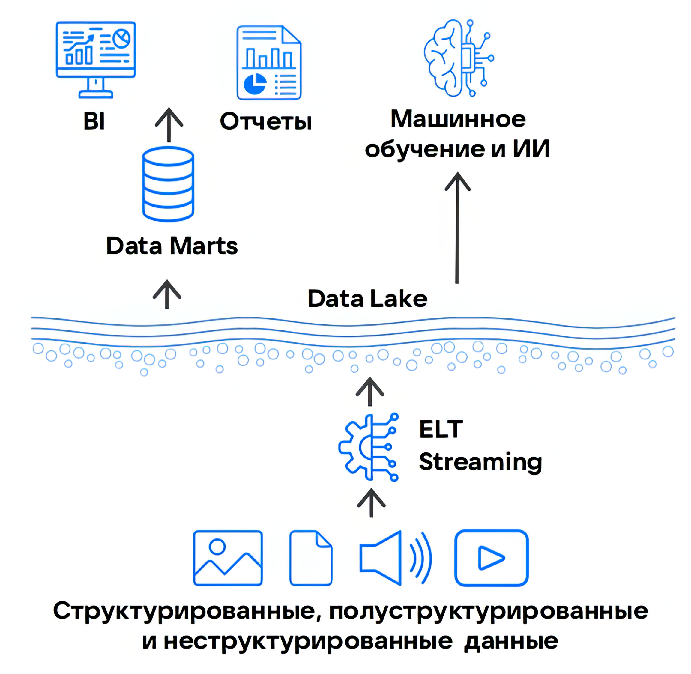

Data Lake или *озера данных* — это архитектура корпоративных хранилищ данных (КХД), которая появилась как альтернатива [Data Warehouse](../dwh) (DWH) для хранения больших объемов данных в их исходном формате.

В отличие от Data Warehouse, в архитектуре Data Lake данные могут быть и структурированными, и полуструктурированными, и неструктурированными. Поэтому в Data Lake не нужно предварительно определять схему хранения данных и обрабатывать их на этапе загрузки.

{params[width=40%; noBorder=true]}

## Модели хранения данных в Data Lake

Обработка значительных массивов неструктурированных данных требует принципиально других методов хранения по сравнению с Data Warehouse. Существует несколько моделей хранения, подходящих для создания озера данных, но наиболее распространены два решения:

- Объектное хранилище — хранит любые типы данных в виде объектов с метаданными.

     Как правило, реализуется в виде облачного решения с моделью оплаты pay-as-you-go, при этом не требует затрат на администрирование инфраструктуры.
     
     Большинство подобных сервисов поддерживают S3 API, что позволяет подключать объектное хранилище для работы с аналитическими, ETL, BI и ML-платформами. VK Cloud тоже предоставляет такой сервис — [VK Object Storage](/ru/data-platform/dlh/concepts/components/s3).

- Кластер [HDFS](https://hadoop.apache.org/docs/stable/hadoop-project-dist/hadoop-hdfs/HdfsDesign.html) (Hadoop Distributed File System).

     Реализуется в основном on-premise в собственной или арендованной инфраструктуре с самостоятельным администрированием.

     Поддерживает интеграцию с Hadoop-стеком (MapReduce, Hive, HBase, Pig, Spark и др.), который можно развернуть в той же инфраструктуре, что и кластер HDFS. Это позволяет локализовать данные в закрытой системе и улучшить производительность обработки за счет меньших задержек.

## Преимущества Data Lake относительно DWH

- Высокая производительность при обработке данных за счет использования колоночных хранилищ данных на ELT-подходах.
- Возможность работать с необработанными данными, например для подготовки датасетов в ML-задачах.
- Экономичное хранение любых типов данных в озере данных.
- Гибкость выбора инструментов в зависимости от типа данных. Например, [Cloud Trino](/ru/data-platform/dlh/concepts/components/trino) для создания ETL/ELT процессов, или создание полного цикла ML с помощью библиотеки MLlib в [Cloud Spark](/ru/data-platform/dlh/concepts/components/spark).

## Ограничения Data Lake

- Отсутствие встроенной SQL-совместимости, что затрудняет интеграцию с BI-системами.
- Дублирование данных и бизнес-логики при использовании дополнительных СУБД для аналитики.
- Избыточное перемещение данных между системами, увеличивающее задержки и риски для безопасности.

## Альтернативы Data Lake

Data Lake и предшествующая ей архитектура [Data Warehouse](../dwh) имеют некоторые недостатки и не закрывают полностью все бизнес-потребности. Поэтому появилось более универсальное решение для работы с большими данными — [Data Lakehouse](../dlh), объединяющее в себе преимущества обеих архитектур и минимизирующее их недостатки.
