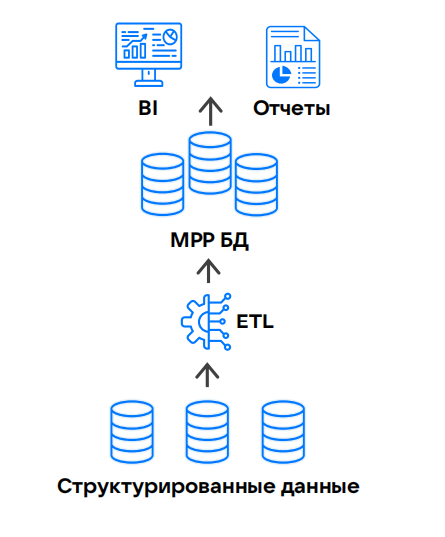

Data Warehouse (DWH) — это первая из архитектурных концепций, реализующая идею *корпоративного хранилища данных* (КХД). КХД — это центральный репозиторий, который хранит большой объем данных организации, собранных из различных источников, и управляет этими данными.

В корпоративных хранилищах данных информация собирается от разных подразделений (систем), то есть имеет разную структуру. Кроме того, такие хранилища содержат не только текущие, но и архивные данные, поэтому их объемы обычно значительны. Это создает две основные задачи, которые нужно решить при организации КХД:
- предварительная обработка и нормализация данных (приведение к единым форматам, устранение дубликатов и противоречий) перед их размещением в хранилище;
- распределенное хранение больших объемов данных на разных серверах и объединение их в единую систему.

В DWH структурированные данные из реляционных СУБД собираются в многомерное [OLAP](https://ru.wikipedia.org/wiki/OLAP)-хранилище, обеспечивающее доступ к данным через SQL-запросы для последующей обработки. Результат преобразования данных передается в BI-системы и сервисы формирования аналитической отчетности.

{params[width=40%; noBorder=true]}

## Модели хранения данных в DWH

Важную роль в построении архитектуры КХД играет выбор структуры хранения данных. В Data Warehouse существуют жесткие ограничения на структуру, поэтому не каждая модель хранения данных подходит для построения архитектуры DWH.

Стандартами являются следующие модели:

- Модель Кимбалла, в которой одна центральная таблица (таблица фактов) хранит агрегированные данные о фактах или событиях, а несколько связанных вспомогательных таблиц измерений содержат описательные атрибуты различных сущностей.
- Модель Инмона, использующая [нормализованную](https://ru.wikipedia.org/wiki/%D0%9D%D0%BE%D1%80%D0%BC%D0%B0%D0%BB%D1%8C%D0%BD%D0%B0%D1%8F_%D1%84%D0%BE%D1%80%D0%BC%D0%B0) структуру с минимизацией избыточности данных. Чаще всего модель применяется в пилотных и MVP-проектах, где важна быстрая реализация, а требования к хранилищу данных минимальны.
- Data Vault 2.0 — гибридный подход к проектированию структуры данных, сочетающий в себе принципы моделей Кимбалла и Инмона.

[cols="1,3,3", options="header"]
|===
| Модель
| Преимущества
| Недостатки

| Кимбалла
| - Быстрое извлечение данных, благодаря особенности строения хранилища.
- Простота в использовании (структура очевидна для большинства дата-специалистов)
| - Добавление новых параметров в таблицу фактов снижает производительность.
- Сложно адаптировать под быстроизменяющиеся потребности бизнеса

| Инмона
| - Единый источник данных в виде центрального хранилища.
- Низкая избыточность данных
| - Любое изменение в бизнес-процессах требует перепроектирования схемы.
- Сложно добавлять новые источники данных без модификации ETL-пайплайнов

| Data Vault 2.0
| - Система устойчива к изменениям в источниках данных и бизнес-правилах.
- Новые данные могут быть интегрированы без значительного воздействия на существующие структуры.
- Работает с любыми типами данных (структурированные, полуструктурированные, сырые).
| - Объединение оператором `JOIN` большого количества таблиц повышает риск ошибок и замедляет выполнение запросов относительно моделей Кимбалла и Инмона.
- Сложность выстраивания проверки данных из-за большого количества сущностей и сложных связей между ними.
- Для работы с такой моделью требуются специалисты с особыми навыками и развитым абстрактным мышлением
|===

## Ограничения DWH

Особенности моделей данных, используемых при проектировании структуры хранилища в DWH, формируют ограничения самой архитектуры DWH:

- высокая стоимость хранения и масштабирования;
- отсутствие доступа к необработанным данным;
- сложная логика в ETL-процессах;
- ограниченные возможности масштабирования;
- высокие затраты на разработку и сопровождение;
- сложности в технической поддержке и устранении неполадок.

В результате ИТ-инфраструктура не успевает адаптироваться к изменяющимся запросам бизнеса, так как любое изменение инфраструктуры (подключение нового источника данных или изменение структуры хранения) влечет за собой масштабные доработки ETL-процессов.

## Альтернативы DWH

Необходимость упростить взаимодействие с КХД за счет снижения требований к процессу загрузки и организации данных привело к появлению новых решений:

- [Data Lake](../data-lake) — архитектурного компонента, позволяющего хранить слабоструктурированные данные в исходном виде, без строгой регламентации, характерной для DWH.
- [Data Lakehouse](../dlh) — универсального решения для работы с большими данными, сочетающего в себе преимущества архитектур Data Warehouse и Data Lake.
