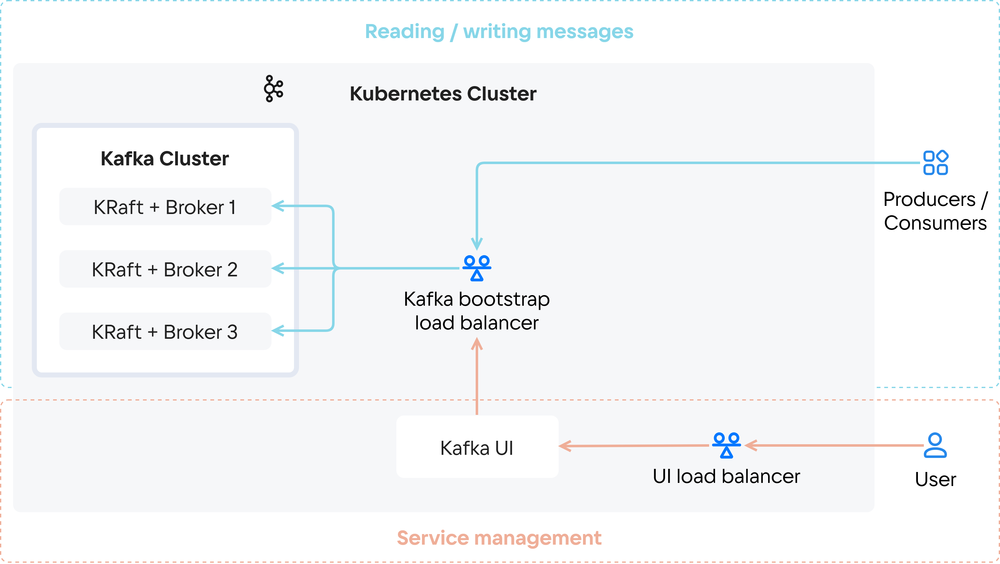

Кластер Cloud Kafka состоит из нескольких кластеров Zookeeper и нескольких [брокеров](https://kafka.apache.org/documentation/#intro_concepts_and_terms) (Kafka Broker). Количество экземпляров Zookeeper и Kafka Broker зависит от выбранного режима отказоустойчивости. Чтобы повысить производительность кластера, можно вручную увеличить количество брокеров.

Сервис работает по принципу «публикация/подписка»: поставщики (producers) публикуют сообщения в топики, а потребители (consumers) опрашивают сервис для получения новых сообщений. Для работы у поставщиков и потребителей должно быть настроено подключение через [балансировщик нагрузки](/ru/networks/balancing/concepts/load-balancer) bootstrap (Kafka bootstrap load balancer). Балансировщик обеспечивает отказоустойчивое подключение поставщиков и потребителей.

Для кластера Cloud Kafka может быть создан [Kafka Connect](https://kafka.apache.org/documentation/#connect) — инструмент потоковой передачи данных между Apache Kafka и другими системами. Сервис Cloud Kafka поддерживает коннекторы:

- [JDBC](https://github.com/Aiven-Open/jdbc-connector-for-apache-kafka),
- [S3](https://github.com/Aiven-Open/s3-connector-for-apache-kafka),
- [Debezium](https://github.com/debezium/debezium/),
- [ClickHouse](https://github.com/ClickHouse/clickhouse-kafka-connect).

Также для работы с кластером разворачивается инструмент [Kafka UI](https://docs.kafka-ui.provectus.io/overview/readme). Его основные функции:

- просматривать список топиков кластера Apache Kafka и сообщений в них;
- запускать коннекторы и отслеживать их работу в Kafka Connect;
- отслеживать доступность брокеров.
