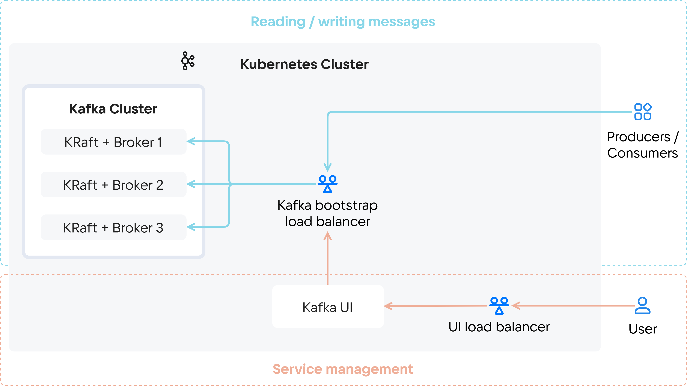

# {heading(Архитектура сервиса)[id=kafka_architecture]}

<!---->

Кластер Cloud Kafka состоит из совмещенных узлов KRaft и [брокера](https://kafka.apache.org/documentation/#intro_concepts_and_terms) (Kafka Broker). Количество таких узлов зависит от выбранного режима отказоустойчивости. Чтобы повысить производительность кластера, количество узлов можно увеличить вручную.

Сервис работает по принципу «публикация/подписка»: поставщики (producers) публикуют сообщения в топики, а потребители (consumers) опрашивают сервис для получения новых сообщений. Для работы у поставщиков и потребителей должно быть настроено подключение через {ifdef(public)} [балансировщик нагрузки](/ru/networks/balancing/concepts/about) {/ifdef} {ifndef(public)}балансировщик нагрузки{/ifndef} bootstrap (Kafka bootstrap load balancer). Балансировщик обеспечивает отказоустойчивое подключение поставщиков и потребителей.