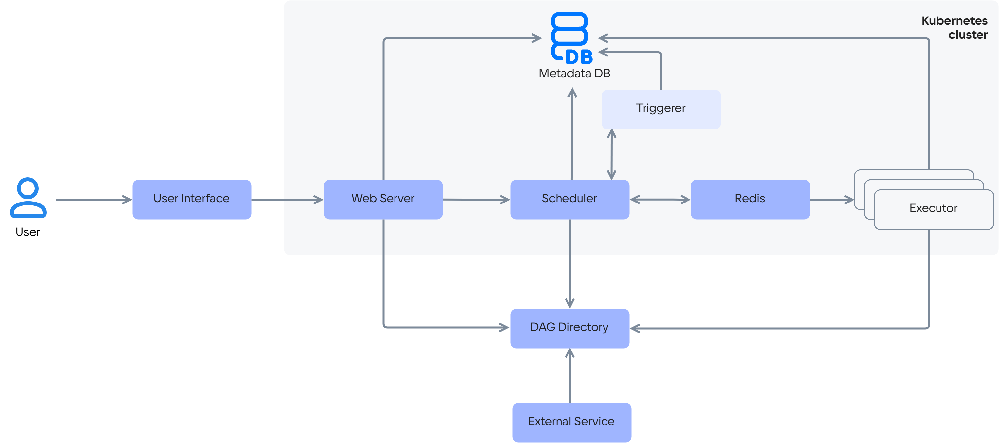

Сервис Cloud Airflow работает на базе кластеров [Cloud Containers](/ru/kubernetes) и может быть развернут в следующих конфигурациях:

{include(/ru/_includes/_airflow.md)[tags=conf]}

Cloud Airflow представляет рабочие процессы (workflow) виде направленных ациклических графов (DAG — Directed Acyclic Graph). Графы представляют из себя DAG-файлы со скриптами на языке Python и размещаются в хранилище DAG-файлов. Для корректного выполнения рабочих процессов имена DAG-файлов должны быть уникальными. Хранилище DAG-файлов является центральным звеном архитектуры сервиса и обеспечивает взаимосвязь всех остальных компонентов.

Компоненты архитектуры сервиса Cloud Airflow:

- Веб-сервер (Web Server) — веб-приложение для управления и визуализации рабочих процессов.
- База метаданных (Metadata DB) — служебная база данных, которая хранит историю выполнения задач, сами задачи и системные настройки, что обеспечивает согласованность рабочих процессов. В Cloud Airflow используется база данных [PostgreSQL](/ru/dbs/dbaas/how-to-guides/tls-connect).
- Планировщик (Scheduler) — отвечает за запуск задач в соответствии с DAG. Он регулярно проверяет, какие задачи готовы к выполнению (по умолчанию — каждую минуту), и отправляет их на исполнение указанному Executor через очередь задач (Reddis).
- Триггерер (Triggerer) — компонент архитектуры, который ожидает внешние события от планировщика для возобновления отложенных задач.
- Очередь задач (Redis) — очередь для асинхронного обмена между планировщиком и исполнителями.
- Исполнитель (Executor) — отвечает за выполнение задач из DAG на [worker-узлах](/ru/kubernetes/k8s/concepts/architecture#topologii_klastera). Исполнитель забирает задачи из очереди и определяет, где и как они будут запускаться. Исполнители бывают различных типов. В сервисе Cloud Airflow используется исполнитель с типом  CeleryExecutor, распределенный исполнитель задач на основе библиотеки Celery (Python).
- Хранилище DAG-файлов (DAG Directory) — каталог с Python-файлами, в которых описаны рабочие процессы.
- Внешний сервис (External Service) — внешние сервисы, с которыми взаимодействуют задачи (например, PostgreSQL, AWS S3, HTTP API).

{params[noBorder=true]}

Общий принцип работы с сервисом:

Пользователь загружает DAG-файл в хранилище (DAG Directory). Планировщик (Scheduler) обнаруживает новый DAG-файл и начинает планировать его запуски. Когда приходит время выполнения, планировщик ставит задачи в очередь (Redis). Исполнитель (Executor) забирает задачу из очереди и выполняет её. Результат (успех или ошибка) записывается в базу метаданных (Metadata DB). Веб-сервер (Web Server) отображает статус выполнения в UI.
