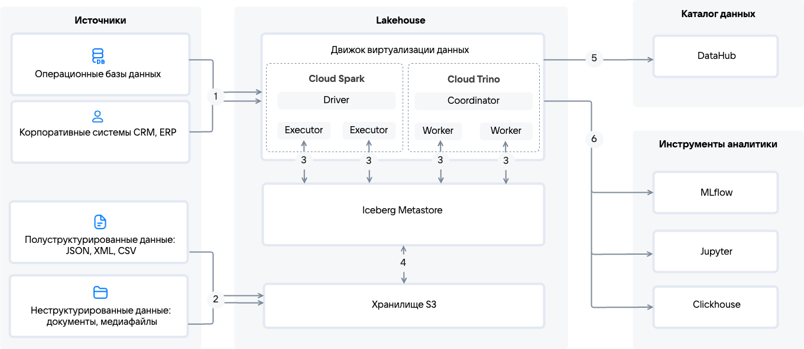

[Data Lakehouse (DLH)](/ru/data-processing/dlh/concepts/about) собирает структурированные и неструктурированные данные из различных источников, обрабатывает их через [Cloud Spark](https://cloud.vk.com/docs/data-processing/dlh/concepts/components/spark) ([ETL](https://ru.wikipedia.org/wiki/ETL) или ELT) или [Cloud Trino](https://cloud.vk.com/docs/data-processing/dlh/concepts/components/trino) (SQL-запросы), хранит в [S3-хранилище](https://cloud.vk.com/docs/data-processing/dlh/concepts/components/s3) с каталогизацией в [Iceberg Metastore](https://cloud.vk.com/docs/data-processing/dlh/concepts/components/iceberg), управляет метаданными в DataHub и предоставляет данные для аналитики, BI и ML через Cloud Trino, Cloud Spark или [ClickHouse](https://cloud.vk.com/docs/data-processing/dlh/concepts/components#clickhouse).

{params[noBorder=true]}

1. Структурированные данные из оперативных ([OLTP](https://ru.wikipedia.org/wiki/OLTP)) и корпоративных (CRM, ERP) систем поступают в Cloud Trino напрямую или через Cloud Spark для выполнения сложных ETL- и ELT-процессов.
 
1. Полуструктурированные (JSON, XML, CSV) и неструктурированные (медиафайлы, документы) данные передаются в хранилище S3 в виде потоков или блоками.

1. [Cloud Trino](https://cloud.vk.com/docs/data-processing/dlh/concepts/components/trino) и [Cloud Spark](https://cloud.vk.com/docs/data-processing/dlh/concepts/components/spark) используют API Iceberg Metastore для обмена данными с хранилищем S3.

    В Cloud Trino процесс обработки запросов включает прием ([PULL-модель](#data_processing_models)) и оптимизацию SQL-запросов координатором (Coordinator), который затем распределяет их между рабочими узлами (Workers), обеспечивая функциональность, аналогичную традиционным СУБД.

    Cloud Spark применяется для выполнения сложных ETL- и ELT-процессов. Этот сервис поддерживает как пакетную, так и потоковую обработку данных:

    - При [потоковой обработке](https://en.wikipedia.org/wiki/Stream_processing) (Streaming Processing) данные обрабатываются непрерывно, микропартиями (mini-batches) или событийно (event-by-event), в режиме реального времени. Потоковая обработка осуществляется по [PUSH-модели](#data_processing_models).

    - При [пакетной обработке](https://en.wikipedia.org/wiki/Batch_processing) (Batch Processing) данные накапливаются партиями (файлы, таблицы) и обрабатываются единовременно. Процесс извлечения запускается по расписанию или вручную ([PULL-модель](#data_processing_models)).

1. Iceberg Metastore каталогизирует объекты [хранилища S3](https://cloud.vk.com/docs/data-processing/dlh/concepts/components/s3) и предоставляет API для доступа к нему.

    Хранение данных организовано с поддержкой [ACID](https://ru.wikipedia.org/wiki/ACID)-транзакций через сервис [Iceberg Metastore](https://cloud.vk.com/docs/data-processing/dlh/concepts/components/iceberg), который позволяет представить объекты хранилища S3 как таблицы БД. Использование хранилища S3 значительно снижает стоимость хранения.

1. Общий список объектов и правил их обработки публикуется в каталоге данных на базе DataHub (с поддержкой функционала Data Discovery, Data Quality, Metadata Management, Data Governance, Data Lineage) для управления доступом и отслеживания истории данных.
1. Обработанные данные из Cloud Trino и Cloud Spark могут быть использованы в различных внешних аналитических системах: MLflow, Jupyter, ClickHouse. Эти системы позволяют проводить углубленный анализ данных, создавать детализированные визуализации и управлять жизненным циклом моделей машинного обучения.

## {heading(Модели обработки данных)[id=data_processing_models]}

В зависимости от задачи данные могут обрабатываться следующими способами:

- _PULL-модель_ — это подход, при котором данные из источника извлекаются по расписанию путем выполнения batch-процессов, которыми удобно управлять в Cloud Airflow. Подход применяется для простых ETL- и ELT-процессов, аналитики в хранилище S3, BI-интеграции, SQL-запросов к базам данных и если нагрузку на источник нужно контролировать.

- _PUSH-модель_ — это подход, при котором данные из источника автоматически отправляются в Cloud Spark или Cloud Trino. Подход используется для задач, где критична непрерывная доставка и обработка больших объемов данных: сложные ETL- и ELT-процессы, подготовка данных для аналитики, машинное обучение на больших данных.

При проектировании архитектуры Data Lakehouse важно определить, какие типы данных и каким образом будут обрабатываться:

[cols="<,<,<",options="header"]
|===
| Критерий
| PULL-модель
| PUSH-модель

| Сервис
| [Cloud Airflow](https://cloud.vk.com/docs/data-processing/dlh/concepts/components/airflow), [Cloud Trino](https://cloud.vk.com/docs/data-processing/dlh/concepts/components/trino), [Cloud Spark](https://cloud.vk.com/docs/data-processing/dlh/concepts/components/spark) (пакетная обработка)
| [Cloud Spark](https://cloud.vk.com/docs/data-processing/dlh/concepts/components/spark) (потоковая обработка, микробатчи)

| Поддержка источников
| API, БД, файлы
| Для каждого источника необходимо разработать компонент, который будет отправлять данные через Producer API

| Частота обновления
| По расписанию
| В реальном времени

| Задержка данных  
| 5–60 минут
| < 1 секунды

| Нагрузка на источник
| Высокая (50–500 подключений в час)
| Низкая (1–5 постоянных подключений)

| Масштабируемость
| Ограниченная (до 100 параллельных операций в секунду)
| Высокая (до 10 000 параллельных операций в секунду)

| Сложность интеграции
| Низкая (1–2 дня на конфигурацию)
| Высокая (требуется разработка Producer)
|===
