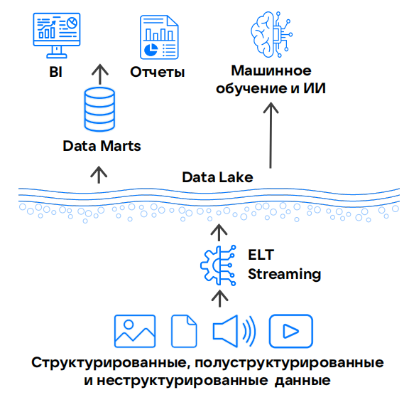

Архитектура Data Lake — этап развития корпоративных хранилищ данных (КХД), пришедший на смену КХД на базе систем управления реляционными базами данных и поддержкой OLAP, таким как [Data Warehouse](../dwh) (DWH).

Основа Data Lake — хранилище для больших объёмов данных в их исходном формате (озеро данных), причём эти данные могут быть и структурированными, и неструктурированными.

Архитектура Data Lake в отличие от DWH строится так, что структурированность данных в ней не важна. Поэтому в Data Lake не нужно предварительно определять схему хранения данных и обрабатывать их на этапе загрузки, в то время как в DWH данные приходится предварительно обрабатывать. Это позволяет использовать широкий набор инструментов, таких как SQL, ML, Spark и другие.

<!--{params[width=40%; noBorder=true]}-->

## Модели хранения данных в Data Lake

Обработка значительных массивов неструктурированных данных требует принципиально других методов хранения по сравнению с Data Warehouse. Наиболее популярным решением для архитектуры Data Lake является модель хранения данных на базе экосистемы [Hadoop](https://ru.wikipedia.org/wiki/Hadoop).

В Hadoop данные, которые не помещаются на одном сервере или просто требуют обработки, хранятся распределенно на множестве узлов. Количество таких узлов может исчисляться сотнями или тысячами.

Для хранения данных в исходном формате используется система [HDFS](https://hadoop.apache.org/docs/stable/hadoop-project-dist/hadoop-hdfs/HdfsDesign.html) (Hadoop Distributed File System), входящая в экосистему Hadoop. HDFS хорошо масштабируется горизонтально (до петабайтов данных) и поддерживает репликацию для обеспечения отказоустойчивости.

Настройка процессов управления большим количеством узлов — сложная и ресурсоемкая задача, требующая высокой квалификации администраторов.

## Преимущества Data Lake относительно DWH

- Высокая производительность при обработке данных за счет использования колоночных хранилищ данных на ELT-подходах.
- Доступ к необработанным данным, что критично для подготовки датасетов в ML-задачах.
- Экономичное хранение любых типов данных в озере данных.
- Гибкость выбора инструментов для обработки и анализа данных (Cloud Spark, Cloud Flink и прочие).

## Ограничения Data Lake

- Отсутствие встроенной SQL-совместимости, что затрудняет интеграцию с BI-системами.
- Дублирование данных и бизнес-логики при использовании дополнительных СУБД для аналитики.
- Избыточное перемещение данных между системами, увеличивающее задержки и риски для безопасности.
- Ограничения, связанные с использованием экосистемы Hadoop, как наиболее популярного способа хранения данных:

     - Hadoop-экосистема сложна в эксплуатации и требует высокой квалификации администраторов.
     - В Data Lake на базе ранних версий Hadoop нет транзакционной поддержки (ACID) и контроля качества данных. Это ограничивает применение Data Lake в сценариях с одновременной записью и чтением данных (создание аналитических сервисов).
     - Новые версии Hadoop и готовые корпоративные решения недоступны на российском рынке.

## Альтернативы Data Lake

Data Lake и предшествующая ей архитектура [Data Warehouse](../dwh) имеют некоторые недостатки и не закрывают полностью все бизнес-потребности. Поэтому появилось более универсальное решение для работы с большими данными — [Data Lakehouse](../dlh), объединяющее в себе преимущества обеих архитектур и минимизирующее их недостатки.
