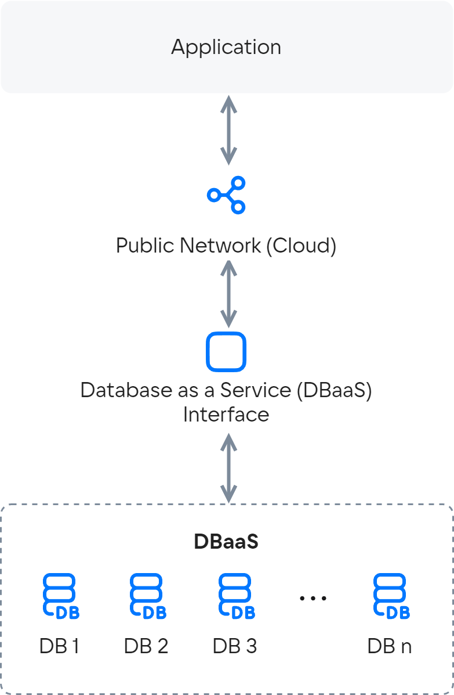

# {heading(Архитектура сервиса)[id=dbaas-architecture]}

## {heading(Архитектура сервиса)[id=dbaas-architecture-service]}

Архитектура сервиса Cloud Databases (база данных как сервис) в упрощенном виде:

{params[width=30%; noBorder=true]}

В панели управления {var(cloud)} разворачивается виртуальная машина или кластер с предустановленными средствами управления базой данных. При создании виртуальной машины или кластера можно выбрать, создавать ли реплику (для конфигурации **Master-Replica**), или количество узлов (для конфигурации **Кластер**).

Далее клиентские приложения через сетевой интерфейс (IP-адрес, коннектор, API) взаимодействуют с базой данных, как с обычной локальной базой — с поправкой на скорость сетевого подключения.

## {heading(Архитектура кластера OpenSearch)[id=dbaas-architecture-opensearch]}

В кластере OpenSearch данные хранятся и обрабатываются на узлах с ролью `data`. Узлы кластера с ролью `master` отвечают за управление кластером и отслеживание его состояния.

Роли `master` и `data` могут быть совмещены в рамках одного узла. Таким образом, в {var(cloud)} можно создать кластер, состоящий:

- только из узлов с ролью `data`, совмещающих роль `master`;
- из узлов с ролью `data` и выделенных узлов с ролью `master`.

Подробнее о ролях узлов в [документации OpenSearch](https://opensearch.org/docs/latest/tuning-your-cluster/cluster/).

На платформе {var(cloud)} для кластера OpenSearch можно создать отдельный узел, на котором размещается сервис [OpenSearch Dashboards](https://opensearch.org/docs/latest/dashboards/quickstart-dashboards/).