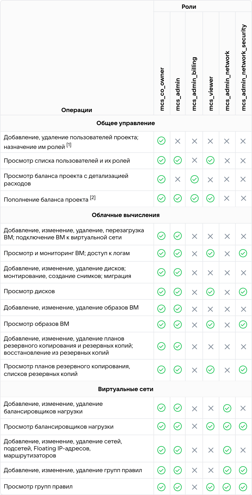

# {heading(Введение)[id=intro-about]}

## {heading(Общая информация)[id=intro-about-general]}

Полное наименование системы: {var(cloud)}.

{var(cloud)} является удобным инструментом построения надежной и безопасной облачной инфраструктуры. Она предоставляет доступ к качественным облачным сервисам, на которых вы можете строить свой бизнес, запускать приложения и сервисы и ускорять разработку. Работа в {var(cloud)} помогает экономить финансовые и временные ресурсы.

Основным графическим интерфейсом {var(cloud)} является личный кабинет. Вы можете использовать его для управления основными услугами {var(cloud)}.

Доступ к личному кабинету осуществляется с помощью веб-браузера по адресу:

{ifndef(private-cert)}
```console
lk.<ДОМЕННОЕ_ИМЯ>
```
{/ifndef}

{ifdef(private-cert)}
```console
LK<ДОМЕННОЕ_ИМЯ>
```
{/ifdef}

Здесь `<ДОМЕННОЕ_ИМЯ>` — это доменное имя вашей компании, где развернут {var(cloud)}.

{ifndef(private-cert)}
## {heading(Преимущества {var(cloud)})[id=intro-about-advantages]}

Основными преимуществами {var(cloud)} являются:

- Инновационные технологии в частной инсталляции.

  {var(cloud)} развивается вместе с публичным облаком для бизнеса VK Cloud Solutions. Таким образом, {var(cloud)} среди прочего получает обновления и сервисы, надежность которых доказана в проектах тысяч клиентов публичного облака.

- Интегрированные PaaS.

  {var(cloud)} — полноценная технологическая платформа для создания частного облака с интегрированными PaaS-решениями и каталогом корпоративных IT-приложений.

- Проверенные инструменты эксплуатации.

  Средства управления серверным оборудованием, мониторинга, обработки логов в {var(cloud)} выверены за 20 лет эксплуатации инфраструктуры VK и 5 лет создания и использования локального частного облака.

- Кастомизация и поддержка.

  {var(cloud)} дорабатывается под цели и задачи каждого из заказчиков. Выделенная команда экспертов помогает внедрить облако, грамотно выстроить процессы и оптимальную эксплуатацию.

- Снижение TCO.

  {var(cloud)} предоставляет оптимизацию расходов и снижение стоимости владения по сравнению с частными облаками большинства международных вендоров.
{/ifndef}

{ifdef(private-cert)}
## {heading(Режимы работы)[id=intro-about-work-mode]}

{var(cloud)} может работать в одном из следующих режимов:

- Штатный.
- Ограниченный.
- Аварийный.
- Сервисный.

Подробнее — в документе **Руководство администратора {var(cloud)}** в разделе **Режимы функционирования**.

## {heading(Права и учетные записи пользователей)[id=intro-about-rbac]}

Каждому пользователю соответствует персонифицированная учетная запись.

Для пользователей личного кабинета поддерживается набор ролей, назначаемых в рамках отдельного проекта. Пользователю можно назначить одну или несколько ролей из {linkto(#tab_roles_mcs)[text=таблицы %number]}.

{caption(Таблица {counter(table)[id=numb_tab_roles_mcs]} — Роли пользователей личного кабинете)[align=right;position=above;id=tab_roles_mcs;number={const(numb_tab_roles_mcs)}]}
[cols="2,2,3", options="header"]
|===
|ID роли
|Название роли
|Описание

|`mcs_viewer`
|Наблюдатель
|Позволяет просматривать большую часть информации о проекте, но без доступа на редактирование

|`mcs_co_owner`
|Совладелец проекта
|Обеспечивает доступ ко всем ресурсам проекта. Может быть назначена вручную

|`mcs_admin_network`
|Администратор сети
|Обеспечивает доступ ко всем объектам сетевой подсистемы

|`mcs_admin_billing`
|Администратор биллинга проекта
|Обеспечивает доступ только к пункту **Баланс** и функциям биллинга

|`mcs_admin`
|Администратор проекта
|Обеспечивает доступ ко всем ресурсам проекта, кроме групп пользователей и баланса

|`mcs_admin_network_security`
|Администратор сетевой безопасности
|Осуществляет контроль сетевых настроек
|===
{/caption}

Каждой роли соответствует определенный набор прав, приведенных в {linkto(#tab_rbac_mcs)[text=таблице %number]}.

[1] Указанная функциональность отключена в личном кабинете {var(cloud)}. Взаимодействие с пользователями и ролями осуществляется в Портале администратора.

[2] В реализации {var(cloud)} все операции на запись осуществляются в Портале администратора. Пример: изменение баланса или цен.

{caption(Таблица {counter(table)[id=numb_tab_rbac_mcs]} — Права пользователей личного кабинета)[align=center;position=under;id=tab_rbac_mcs;number={const(numb_tab_rbac_mcs)}]}
{params[width=100%;noBorder=true]}
{/caption}

## {heading(Безопасность паролей)[id=intro-about-security-pass]}

Безопасность паролей обеспечивается {var(cloud)}.

При создании паролей соблюдайте правила:

- Длина и сложность.

  Пароли должны быть не менее 8 символов. Они должны включать буквы верхнего и нижнего регистра, цифры. Избегайте слов, которые можно найти в словарях. Старайтесь не использовать личную информацию, которую легко угадать.

- Уникальность.

  Создавайте уникальные пароли. Использование одного и того же пароля увеличивает риск компрометации всех ваших данных.

- Регулярное обновление.

  Регулярно обновляйте свои пароли. Рекомендуется менять пароли каждые 3-6 месяцев.

- Избегание общих ошибок.

  Не записывайте пароли на заметках или карточках. Также избегайте использования простых паролей, таких как `12345678` или `qwerty12`.

## {heading(Журнал событий безопасности)[id=intro-about-security-log]}

Журнал событий безопасности {var(cloud)} доступен только администратору {var(cloud)}.

Подробнее — в документе **Руководство администратора {var(cloud)}** в разделе **Журнал событий безопасности**.

## {heading(Параметры безопасности)[id=intro-about-security-param]}

Подробнее о доступных параметрах безопасности в личном кабинете:

- {linkto(../../tools-for-using-services/account/instructions/account-manage-private/keypairs-private#private-account-manage-keypairs)[text=%text]}.
- {linkto(../../storage/backups/instructions/create-backup-plan/create-backup-plan.md#backup-plan-create-vm)[text=%text]}.

{/ifdef}