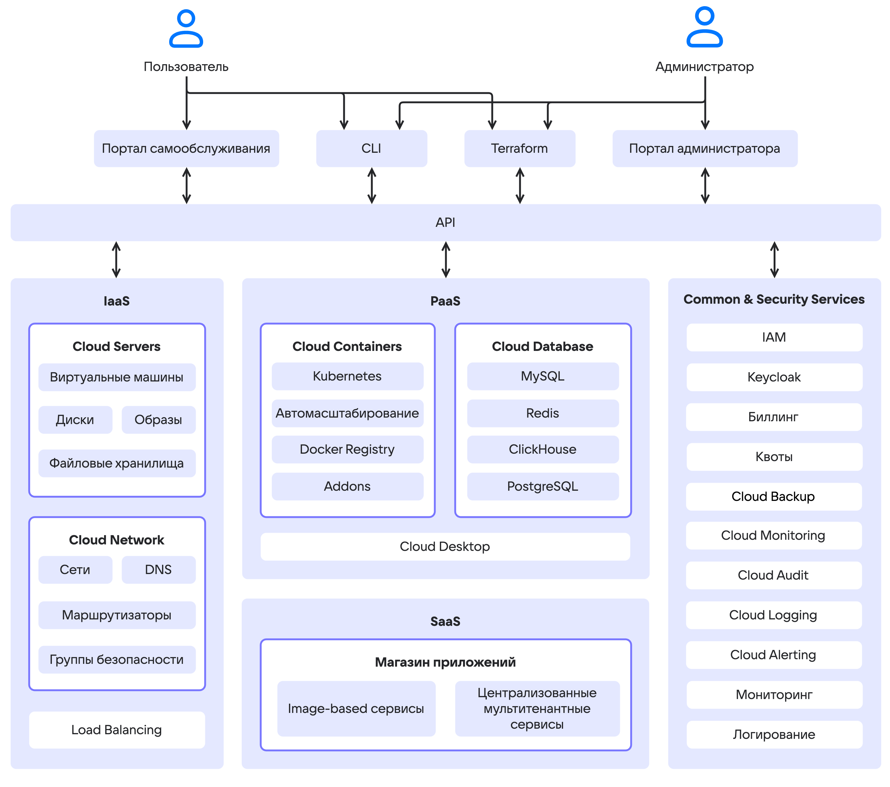

# {heading(О сервисах {var(cloud)})[id=service-list]}

В {var(cloud)} могут быть развернуты сервисы виртуализации, мониторинга, контейнеров, хранилищ данных. Архитектура базируется на четырех группах сервисов:

- **Infrastructure as a Service (IaaS)**. IaaS-сервисы построены на базе [OpenStack](https://www.openstack.org/software) и компонентов собственной разработки. Управляют динамическим выделением ресурсов, масштабированием, отказоустойчивостью. IaaS предоставляет базовые компоненты: виртуальные серверы, сеть, хранилища данных, доступ к выделенному оборудованию.

  {cut(Список IaaS-сервисов)}

  - {linkto(../../computing/iaas#iaas)[text=Cloud Servers]} — управляет вычислительными ресурсами {var(cloud)}, виртуальными машинами, виртуальными дисками и файловыми хранилищами.
  - {linkto(../../networks/vnet#vnet)[text=Cloud Networks]} — обеспечивает сетевое взаимодействие в рамках выбранного {linkto(../../tools-for-using-services/account/concepts/projects#tools-account-concepts-projects)[text=проекта]} с помощью технологии SDN (Software Defined Network). Функционирует на базе OpenStack Neutron. Включает в себя компоненты:

    - {linkto(../../networks/vnet/concepts/dns#vnet-dns)[text=DNS]} — поддерживает приватный DNS, обеспечивающий разрешение имен для сервисов {var(cloud)}.
    - {linkto(../../networks/balancing/concepts/about#balancing-load-balancer)[text=Load Balancer]} — распределяет нагрузку на инфраструктуру, обеспечивая отказоустойчивость и гибкое масштабирование приложений.

  {/cut}

- **Platform as a Service (PaaS)**. Включают в себя решения для управления кластерами Kubernetes, масштабируемыми СУБД и виртуальными рабочими местами.

  {cut(Список PaaS-сервисов)}

  - {linkto(../../kubernetes/k8s#k8s-k8s)[text=Cloud Containers]} — позволяет создавать и управлять кластерами Kubernetes, в которых можно запускать сервисы и приложения.
  - {linkto(../../dbs/dbaas#dbaas-dbaas)[text=Cloud Databases]} — предоставляет масштабируемые СУБД: PostgreSQL,{ifdef(private-pg)} Postgres Pro,{/ifdef} ClickHouse, Redis.
  - {linkto(../../monitoring-services/alerting#alerting)[text=Cloud Alerting]} —  настраивает уведомления об изменении ключевых метрик сервисов {var(cloud)}.
  - {linkto(../../monitoring-services/logging#logging)[text=Cloud Logging]} — агрегирует и анализирует логи сервисов в {var(cloud)}.
  - {linkto(../../monitoring-services/monitoring#monitoring)[text=Cloud Monitoring]} — обеспечивает мониторинг метрик, специфичных для PaaS-сервисов, например, аналитика по подам K8s-контейнеров, статистика транзакций СУБД.
  - {linkto(../../computing/cloud-desktops#cloud-desktops)[text=Cloud Desktop]} — управляемые виртуальные рабочие места.

  {/cut}

- **Software as a Service (SaaS)**. Корпоративный маркетплейс с каталогом готовых решений для бизнеса и ИТ-команд, что позволяет сократить время внедрения и снизить издержки.

  {cut(Список SaaS-сервисов)}

  - [Marketplace](../../applications-and-services/marketplace) — позволяет быстро разворачивать среды веб-разработки и администрирования на базе виртуальных машин.
  {/cut}

- **Common&Security-сервисы** обеспечивают безопасную работу пользователей и поддерживают ролевую модель при использовании ресурсов {var(cloud)}. Поддерживает встроенный мониторинг сервисов и отдельных сущностей {var(cloud)}.

  {cut(Список Common&Security-сервисов)}

  - Биллинг — ведет учет использования ресурсов и контроль расходов.
  - Квоты — обеспечивает функции управления квотами.
  - {linkto(../../monitoring-services/event-log#event-log)[text=Cloud Audit]} — формирует журнал аудита действий пользователей в {var(cloud)}.
  - {linkto(../../storage/backups#cloud-backup)[text=Cloud Backup]} — управляет планами резервного копирования виртуальных машин и управляемых СУБД.
  - IAM — управляет аутентификацией и авторизацией пользователей, администраторов и сервисов {var(cloud)}.
  - Keycloak — обеспечивает хранение учетных записей пользователей и интеграцию с внешними службами каталогов.
  - Мониторинг — реализует мониторинг состояния {var(cloud)}.
  - Логирование — реализует хранение журналов компонентов {var(cloud)}.

  {/cut}

Общая схема компонентов и сервисов {var(cloud)} показана ниже.

{params[noBorder=true]}