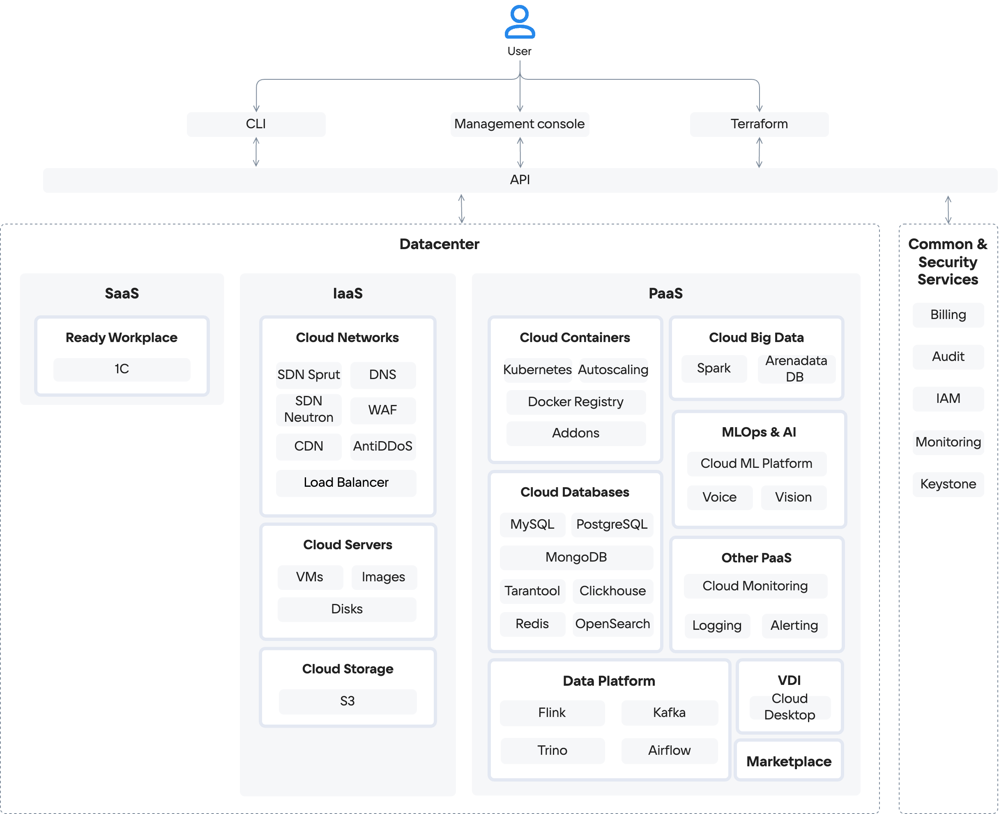

В VK Cloud могут быть развернуты сервисы виртуализации, мониторинга, контейнеров, хранилищ данных. Архитектура базируется на четырех группах сервисов:

- IaaS-сервисы построены на базе [OpenStack](https://www.openstack.org/software/) и компонентов собственной разработки. Управляют динамическим выделением ресурсов, масштабированием, отказоустойчивостью. Размещены в одном облачном дата-центре с PaaS-сервисами.

  

    
Список IaaS-сервисов

  - [Cloud Servers](/ru/computing/iaas) (IaaS Compute) — предоставляет виртуальные машины с возможностью выделения публичных IP и безлимитным трафиком в 1 ГБит/с (также [доступны](/ru/computing/gpu) виртуальные машины с NVIDIA GPU). Отвечает за виртуализацию и интеграцию ресурсов, использует гипервизор KVM.
  - [Cloud Storage](/ru/storage/s3) (IaaS Storage) — предоставляет S3-совместимое объектное хранилище. Рабочая нагрузка на хранилище распределяется между всеми узлами хранения. Можно развернуть хранилище с настраиваемой архитектурой.
  - [Cloud Networks](/ru/networks/vnet) (IaaS Network) — обеспечивает сетевое взаимодействие в рамках выбранного [проекта](/ru/tools-for-using-services/account/concepts/projects) с помощью технологии SDN (Software Defined Network). Функционирует на базе OpenStack Neutron и на базе ПО собственной разработки — Sprut. Включает в себя компоненты:

    - [DNS](/ru/networks/dns) — поддерживает публичный и приватный DNS, обеспечивающий разрешение имен для сервисов платформы VK Cloud.
    - [CDN](/ru/networks/cdn) — организует передачу контента от ваших серверов к пользователям с минимальной задержкой.
    - [Load Balancer](/ru/networks/balancing/concepts/load-balancer) — распределяет нагрузку на инфраструктуру, обеспечивая отказоустойчивость и гибкое масштабирование приложений.
    - [AntiDDoS](/ru/security/firewall-and-protection-ddos#antiddos) — фильтрует трафик, приходящий к развернутым в проекте ресурсам VK Cloud для блокирования DDoS-атак.
    - [WAF](/ru/security/firewall-and-protection-ddos#waf) (Web Application Firewall) — настраивает правила фильтрации входящего и исходящего трафика для обнаружения и блокирования сетевых атак.

  

- PaaS-сервисы включают в себя решения с открытым исходным кодом (Kubernetes) и решения технологических партнеров. Поддерживается встроенный мониторинг сервисов и отдельных сущностей VK Cloud.

  

    
Список PaaS-сервисов

  - [Cloud Containers](/ru/kubernetes/k8s) — позволяет создавать и управлять кластерами Kubernetes, в которых можно запускать сервисы и приложения.
  - [Cloud Databases](/ru/dbs/dbaas) — предоставляет масштабируемые СУБД: MySQL, PostgreSQL, Postgres Pro, ClickHouse, MongoDB, Redis, Tarantool, OpenSearch, Arenadata DB на базе Greenplum.
  - [Cloud Big Data](/ru/data-processing/bigdata) — применяется для анализа больших данных на базе Arenadata Hadoop, поддерживает масштабирование.
  - [Cloud Streams](/ru/data-processing/cloud-streams) — предоставляет кластера на базе Arenadata Streaming для обработки потоковых данных.
  - [Cloud ML Platform](/ru/ml/mlplatform) — поддерживает сервисы для полного цикла ML-разработки.
  - [Cloud Voice](/ru/ml/cloud-voice) — предоставляет REST API для распознавания и синтеза речи на базе машинного обучения.
  - [Vision](/ru/ml/vision) — предоставляет REST API для распознавания лиц и объектов на базе машинного обучения.
  - [Cloud Alerting](/ru/monitoring-services/alerting) —  настраивает уведомления об изменении ключевых метрик сервисов VK Cloud.
  - [Cloud Logging](/ru/monitoring-services/logging) — агрегирует и анализирует логи сервисов в VK Cloud.
  - [Cloud Monitoring](/ru/monitoring-services/monitoring) — обеспечивает мониторинг метрик, специфичных для PaaS-сервисов, например, аналитика по подам K8s-контейнеров, статистика транзакций СУБД PostgreSQL.
  - Дополнительные сервисы:

    - [1С:Готовое рабочее место](/ru/applications-and-services/1cgrm) — предоставляет ресурсы и ПО для развертывания сервисов 1С: Бухгалтерия, Зарплата и Управление персоналом, Управление нашей фирмой.
    - [Магазин приложений](/ru/applications-and-services/marketplace) — позволяет быстро разворачивать среды веб-разработки и администрирования на базе виртуальных машин.

  

- Common&Security-сервисы обеспечивают безопасную работу пользователей и поддерживают ролевую модель при использовании ресурсов VK Cloud.

  

    
Список Common&Security-сервисов

  - [Billing](/ru/intro/billing) — ведет учет использования ресурсов и контроль расходов, формирует финансовые отчеты, обеспечивает взаимодействие с платежными системами при оплате сервисов.
  - [Audit](/ru/monitoring-services/event-log) — формирует журнал аудита действий пользователей в VK Cloud.
  - IAM — управляет аутентификацией и авторизацией пользователей и сервисов в совокупности с Keystone.
  - [Cloud Monitoring](/ru/monitoring-services/monitoring) — обеспечивает мониторинг облачных сервисов и пользовательских приложений.
  - Keystone — обеспечивает аутентификацию клиента по API, обнаружение служб и распределенную мультитенантную авторизацию.

  

VK Cloud предоставляет [техническую поддержку](/ru/intro/start/support/support-info) для своих сервисов. Партнерские решения (например, AntiDDoS, WAF) поддерживаются совместно с партнером.

Общая схема компонентов и сервисов VK Cloud показана ниже.

{params[noBorder=true]}

Управление облачными сервисами выполняется с помощью API. Пользователи взаимодействуют с API через один или несколько [инструментов](/ru/tools-for-using-services):

- личный кабинет VK Cloud;
- OpenStack CLI;
- Terraform с отдельным провайдером.

## Отказоустойчивость

Физическая отказоустойчивость реализована размещением VK Cloud в трех дата-центрах уровня надежности Tier III в РФ. При таком размещении гарантируется поддержание SLA ЦОДов более 98% с общим [SLA](/ru/intro/start/support/sla) 99.95%.

Сетевая отказоустойчивость обеспечивается связью дата-центров трассами с пропускной способностью 200 ГБ/с. Связь каждого сервера с магистральными провайдерами идет по двум независимым каналам, через два маршрутизатора.

Логическая отказоустойчивость реализована с помощью зон доступности (availability zone), которые объединяются в [регионы](/ru/tools-for-using-services/account/concepts/regions).

<info>

Статус зон доступности, сервисов и инфраструктуры VK Cloud можно проверить на странице [Статус работы сервисов](https://status.msk.cloud.vk.com).

</info>

### {heading(Зоны доступности)[id=az]}

В каждой зоне доступности находится один или несколько центров обработки данных (ЦОДов), где физически размещены объекты облачной инфраструктуры. В VK Cloud зона доступности соответствует отдельному ЦОД уровня Tier III. VK Cloud предоставляет зоны доступности:

[cols="1,1,2,3", options="header"]
|===
| Регион
| Зона доступности
| Дата-центр
| Адрес дата-центра

.3+|Москва
|`GZ1`
|[Goznak](https://tech.goznak.ru/dc-goznak-moscow)
|г. Москва, проспект Мира, 105, стр. 6.

|`MS1`
|DataLine NORD4
|г. Москва, Коровинское ш., 41.

|`ME1`
|«Медведково» Ростелеком-ЦОД
|г. Москва, Чермянская ул., д. 4.

|Казахстан
|`QAZ`
|[QazCloud](https://qazcloud.kz/)
|Республика Казахстан, Акмолинская область, г. Косшы, ул. Республики 1.

|===

Каждый дата-центр оснащен независимыми системами электропитания и охлаждения.

Зоны доступности одного региона соединены с помощью резервированной выделенной оптоволоконной сети высокой пропускной способности и с низким уровнем задержек для высокой скорости передачи данных между зонами.

Инфраструктура зон доступности MS1 и GZ1 региона Москва VK Cloud [защищена](/ru/intro/it-security/compliance-152fz) в соответствии с ФЗ РФ «О персональных данных» №152-ФЗ.

## Безопасность

Безопасность VK Cloud обеспечивается постоянным мониторингом сервисов VK Cloud, проведением внешних аудитов. VK Cloud участвует в программе аудита безопасности [HackerOne](https://www.hackerone.com). Информационная система VK Cloud [аттестована](https://cloud.vk.com/cloud-platform/certificates/) по требованиям 21 Приказа ФСТЭК России для работы с персональными данными.

Подробная информация приведена в разделе [Безопасность платформы](/ru/intro/it-security).

## Миграция в VK Cloud

VK Cloud поддерживает миграцию с использованием [стороннего ПО](../../../migration) или [средствами платформы](../../../migration/migrate-hystax-mr). Перенос виртуальных ресурсов обходится дешевле за счет реализации сервисов на базе OSS-решений (Open Source Solutions).
