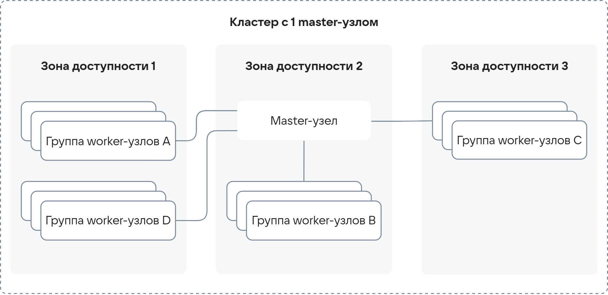
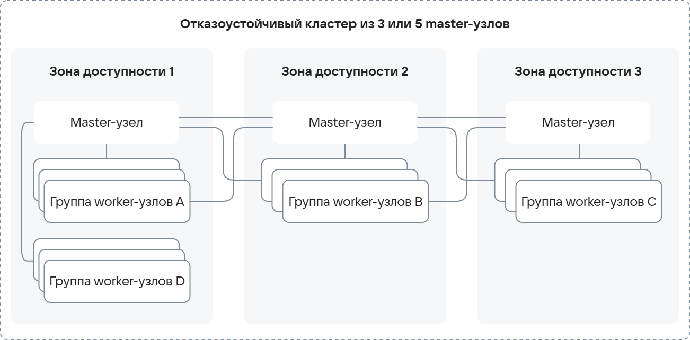

# {heading(Архитектура сервиса)[id=k8s-architecture]}

Сервис Cloud Containers обеспечивает среду для работы с кластерами Kubernetes на платформе {var(cloud)}. Архитектура сервиса, опираясь на [OpenStack](https://www.openstack.org/), дает пользователям широкие возможности для работы, обеспечивает отказоустойчивость, масштабируемость и интеграцию с другими сервисами платформы.

{cut(Схема взаимодействия Cloud Containers с другими компонентами {var(cloud)})}

Cloud Containers следит за корректной работой кластеров, в то время как:

- {linkto(../../../../computing/iaas#iaas)[text=Cloud Servers]} управляет ВМ на узлах кластера.
- {linkto(../../../../networks/vnet#vnet)[text=Cloud Networks]} управляет сетями кластера.

{params[noBorder=true; width=50%]}

{/cut}

## {heading(Топологии кластера)[id=k8s-architecture-topology]}

Кластер Kubernetes в сервисе Cloud Containers состоит из двух типов узлов (nodes) — master-узлов и worker-узлов:

- _Master-узлы_ хранят информацию о состоянии всего кластера и управляют распределением рабочей нагрузки по worker-узлам. Управление master-узлами пользователям не доступно, оно происходит на стороне платформы {var(cloud)}.

   Когда вы {linkto(../../instructions/create-cluster/create-webui-gen-2#k8s-create-webui-gen-2)[text=создаете]} кластер Kubernetes, Cloud Containers выбирает минимально подходящий {linkto(../../../../computing/iaas/concepts/vm/flavor#iaas-flavor)[text=шаблон конфигурации]} для его master-узлов. По умолчанию это ВМ с процессором Intel Cascade Lake, 2 CPU и 6 ГБ оперативной памяти. {linkto(../storage#k8s-storage-supported-storage-types)[text=Тип диска]} master-узлов — High-IOPS SSD на 20 ГБ.

   На master-узлах по умолчанию включено {linkto(../scale#k8s-scale-types)[text=автоматическое масштабирование]}, поэтому при изменении нагрузки на кластер количество его вычислительных ресурсов будет изменяться автоматически.

- _Worker-узлы_ выполняют рабочую нагрузку ([workload](https://kubernetes.io/docs/concepts/workloads/)). Они могут быть организованы в группы worker-узлов. Для повышения отказоустойчивости разместите группы в разных {linkto(../../../../start/concepts/architecture#architecture-az)[text=зонах доступности]}. Управление worker-узлами также происходит на стороне платформы {var(cloud)}, но при этом они имеют сетевую связанность с проектами пользователей. 

Отказоустойчивость кластера зависит от количества master-узлов и их распределения по зонам доступности. Возможные конфигурации:

- Кластер Kubernetes с одним master-узлом.

  Такой кластер не отказоустойчив: даже если worker-узлов несколько и они организованы в группы, при потере единственного master-узла кластер станет неработоспособен.

   {cut(Схема взаимодействия узлов для кластера с одним master-узлом)}
   {params[noBorder=true; width=80%]}
   {/cut}

- Стандартный кластер Kubernetes из 3 или 5 master-узлов.

  Такой кластер отказоустойчив на уровне зоны доступности: при стабильной работе зоны доступности и потере нескольких master-узлов он сохранит свою работоспособность, пока работает более половины master-узлов. Когда остается один master-узел, кластер перестает работать. 

  {cut(Схема взаимодействия узлов для стандартного кластера)}  
  {params[noBorder=true; width=80%]}
  {/cut}

- Отказоустойчивый кластер Kubernetes из 3 или 5 master-узлов.

  Master-узлы отказоустойчивых кластеров распределяются по всем зонам доступности региона. Такой кластер максимально отказоустойчив: при отказе одной зоны доступности нагрузка будет распределена между master-узлами, которые расположены в других зонах доступности. Однако, как и в стандартных кластерах, отказоустойчивый кластер сохраняет работоспособность, пока работает более половины master-узлов, и перестает работать, когда остается один master-узел.

  {cut(Схема взаимодействия узлов для отказоустойчивого кластера)}
  {params[noBorder=true; width=80%]}
  {/cut}

Вне зависимости от выбранной топологии кластера master-узлы используют распределенное хранилище «ключ-значение» [etcd](https://etcd.io/) для хранения информации о состоянии кластера:

- Кластер с одним master-узлом имеет один экземпляр `etcd`.
- В кластерах с несколькими master-узлами есть несколько экземпляров `etcd`, работающих в кластерном режиме для отказоустойчивости.
- Под каждый экземпляр `etcd` выделен отдельный высокопроизводительный SSD-диск (High-IOPS). Это позволяет организовать максимально быстрое взаимодействие с API-эндпоинтом кластера при минимальных задержках.

Для отказоустойчивости на уровне worker-узлов рекомендуется создать несколько групп worker-узлов в разных зонах доступности и размещать реплики приложения на этих узлах так, чтобы реплики тоже были в разных зонах доступности.

## {heading(Окружение кластера)[id=k8s-architecture-cluster-environment]}

На master- и worker-узлах используется операционная система AlmaLinux (начиная с версии Kubernetes 1.31).

Кластер запускает контейнеры через Kubernetes [Container Runtime Interface](https://kubernetes.io/docs/concepts/architecture/cri/) (CRI) с помощью CRI-O.

Подробнее в разделе {linkto(../versions#k8s-versions)[text=Доступные версии Kubernetes и политика поддержки версий]}.

## {heading(Интеграция с Kubernetes API)[id=k8s-architecture-kubernetes-api-integration]}

Все взаимодействие с кластером происходит через [Kubernetes API](https://kubernetes.io/ru/docs/concepts/overview/kubernetes-api/).

API-эндпоинт кластеров Cloud Containers размещен за {linkto(../network#k8s-network)[text=отдельным балансировщиком нагрузки]}, поэтому доступ к API кластера можно получить по одному и тому же IP-адресу вне зависимости от количества master-узлов.

## {heading(Интеграция с платформой {var(cloud)})[id=k8s-architecture-platform-integration]}

Интеграция с платформой {var(cloud)} осуществляется через стандартные интерфейсы Kubernetes:

- [Container Storage Interface](https://kubernetes-csi.github.io/docs/) (CSI) — интеграция с сервисами хранения данных.

  Позволяет использовать в кластерах хранилище {var(cloud)} в виде постоянных томов ([persistent volumes](https://kubernetes.io/docs/concepts/storage/persistent-volumes/)).
  Доступно использование Persistent Volume Claim (PVC).

  Интеграция достигается с помощью OpenStack Cinder API. Подробнее в разделе {linkto(../storage#k8s-storage)[text=Хранилище в кластере]}.

- [Container Network Interface](https://kubernetes.io/docs/concepts/extend-kubernetes/compute-storage-net/network-plugins/) (CNI) — интеграция с сетевыми подсистемами.

  В кластерах Kubernetes, которые вы создаете в сервисе Cloud Containers, реализованы плагины, поддерживающие CNI: [Calico](https://projectcalico.docs.tigera.io/about/about-calico) и [Cilium](https://docs.cilium.io/en/stable/index.html) (доступен только для кластеров второго поколения). Они обеспечивают:

  - сетевую связность между контейнерами, {linkto(../../reference/pods#k8s-pods)[text=подами]} и узлами кластера;
  - применение и соблюдение [сетевых политик](https://kubernetes.io/docs/concepts/services-networking/network-policies/) (Network Policies) Kubernetes.

  Calico и Cilium интегрируются с платформой {var(cloud)} с помощью SDN Sprut. Подробнее в разделе {linkto(../network#k8s-network)[text=Сеть в кластере]}.

## {heading(Встроенная поддержка Open Policy Agent)[id=k8s-architecture-opa-gatekeeper]}

В кластеры Cloud Containers встроен {linkto(../../reference/gatekeeper#k8s-gatekeeper)[text=Open Policy Agent Gatekeeper]}. Он позволяет применять {linkto(../security-policies#k8s-security-policies)[text=политики безопасности]} для ресурсов Kubernetes. Также в таких кластерах действуют {linkto(../security-policies#k8s-security-policies-default)[text=политики безопасности по умолчанию]}.

## {heading(Возможности масштабирования кластера)[id=k8s-architecture-scaling-features]}

Кластер Cloud Containers имеет встроенные {linkto(../scale#k8s-scale)[text=возможности масштабирования master-узлов и worker-узлов]}.

В том числе поддерживается автоматическое масштабирование узлов кластера, при котором количество узлов регулируется автоматически в зависимости от потребностей рабочей нагрузки:

- Для master-узлов оно включено по умолчанию и его нельзя выключить. 
- Для worker-узлов оно происходит с помощью {linkto(../cluster-autoscaler#k8s-cluster-autoscaler)[text=Cluster Autoscaler]} и включается вручную при определении {linkto(../../instructions/helpers/node-group-settings#k8s-node-group-settings)[text=настроек для каждой группы узлов]}.