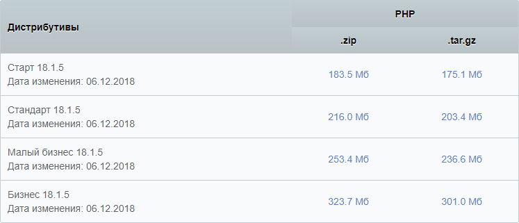
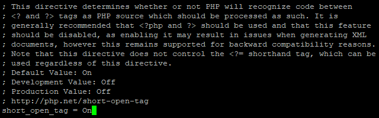
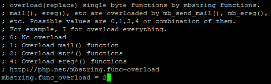
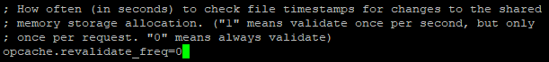
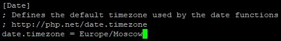
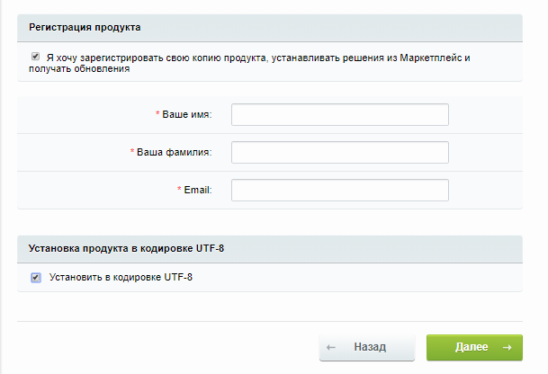
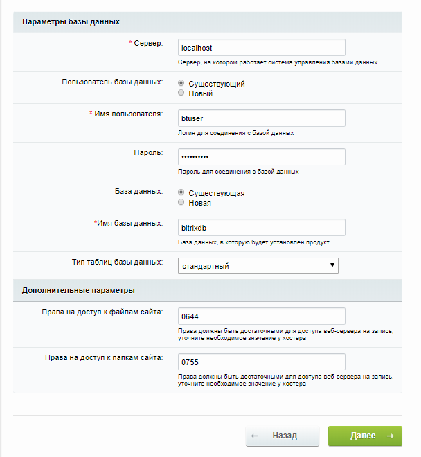
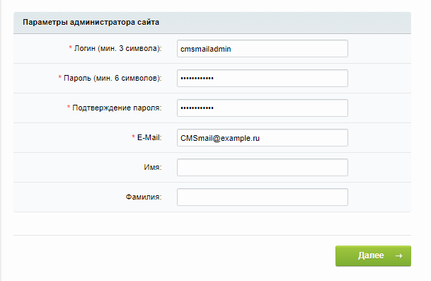

1С-Битрикс: Управление сайтом - профессиональная система управления интернет-ресурсами, с помощью которой можно создавать и поддерживать информационные порталы, интернет-магазины и корпоративные сайты.

## Требования

- Операционная система Ubuntu версии 18.04.
- Пользователь с доступом к команде sudo.
- Установленный стек LAMP.

Если у вас еще не установлен стек LAMP:

- Вы можете получить готовый стек LAMP в облаке [в виде настроенной виртуальной машины](https://mcs.mail.ru/app/services/marketplace/) на Ubuntu 18.04. При регистрации вы получаете бесплатный бонусный счет, которого хватает, чтобы тестировать сервер несколько дней.
- Вы можете установить стек LAMP самостоятельно. О том, как установить стек LAMP на Ubuntu 18.04, [Установка стека LAMP на операционную систему Ubuntu](https://mcs.mail.ru/help/lamp-setup/lamp-ubuntu-18).

## Подготовка к установке 1С-Битрикс: Управление сайтом

1.  Перейдите на сайт [загрузки дистрибутива 1С Битрикс](https://www.1c-bitrix.ru/download/cms.php) и выберите нужный дистрибутив (например, Стандарт):

    

1.  Откройте окно терминала.
1.  Установите дополнительные пакеты PHP, выполнив команду:

    ```
    sudo apt-get install php-common php-mbstring php-xmlrpc  -y
    ```

1.  Перейдите в домашний каталог, выполнив команду:

    ```
    cd ~
    ```

1.  Создайте временный каталог tempBT, выполнив команду:

    ```
    mkdir tempBT
    ```

1.  Перейдите в каталог tempBT, выполнив команду:

    ```
    cd ~/tempBT
    ```

1.  Скачайте соответствующий выбранному дистрибутиву архив, выполнив команду:

    ```
    wget https://www.1c-bitrix.ru/download/standard_encode.tar.gz
    ```

1.  Распакуйте архив в каталог /var/www/html, выполнив команду:

    ```
    sudo tar xzvf standard_encode.tar.gz -C /var/www/html
    ```

1.  Удалите временный каталог tempBT, выполнив команду:

    ```
    sudo rm -Rf ~/tempBT
    ```

1. Замените владельца каталогов и файлов в корневом каталоге веб-сервера, используя команду:

    ```
    sudo chown -R имя_пользователя:www-data /var/www/html
    где имя_пользователя - это имя пользователя sudo, www-data - имя группы
    Например: sudo chown -R www-data:www-data /var/www/html
    ```

    <warn>

    **Внимание**

    Во избежание ошибок веб-сервера Apache при запуске скриптов используйте имя пользователя www-data и имя группы www-data по умолчанию.

    </warn>

1. Если необходимо предоставить доступ к файлам корневого каталога веб-сервера другому пользователю, включите этого пользователя в группу www-data, используя команду:

    ```
    sudo usermod -a -G www-data имя_пользователя
    Например: sudo usermod -a -G www-data btuser
    ```

1. Настройте права доступа к файлам и папкам корневого каталога, используя команду:

    ```
    sudo chmod -R 775 /var/www/html
    ```

1. В файле php.ini измените значения параметров, отвечающих за корректную работу 1С-Битрикс: Управление сайтом.

    <info>

    **Примечание**

    Для быстрого поиска параметров в файле используйте сочетание клавиш CTRL+W.

    </info>

    Для этого:

    1. Откройте файл php.ini для редактирования, выполнив команду:

        ```
        sudo nano /etc/php/7.2/apache2/php.ini
        ```

    1. Для параметра short_open_tag укажите значение On:

        ```
        short_open_tag = On
        ```

        

    1. Для параметра mbstring.func_overload укажите значение 2:

        ```
        mbstring.func_overload = 2
        ```

        

    1. Для параметра opcache.revalidate_freq укажите значение 0:

        ```
        opcache.revalidate_freq=0
        ```

        

    1. Для параметра date.timezone укажите значение Europe/Moscow:

        ```
        date.timezone = Europe/Moscow
        ```

        

    1. Сохраните изменения, используя сочетание клавиш CTRL+O, и завершите редактирование, используя сочетание клавиш CTRL+X.

1. Создайте конфигурационный файл `bitrix.conf`, выполнив команду:

    ```
    sudo nano /etc/apache2/sites-available/bitrix.conf
    ```

1. В этот файл добавьте следующие строки:

    ```
    <VirtualHost \*:80>
    DocumentRoot /var/www/html/
    ServerName <внешний IP-адрес вашего веб-сервера>
    <Directory /var/www/html/>
    Options +FollowSymlinks
    AllowOverride All
    Require all granted
    </Directory>
    ErrorLog ${APACHE_LOG_DIR}/bitrix_error.log
    CustomLog ${APACHE_LOG_DIR}/bitrix_access.log combined
    </VirtualHost>
    ```

    Сохраните изменения, используя сочетание клавиш CTRL+O, и завершите редактирование, используя сочетание клавиш CTRL+X.

1. Отключите сайт по умолчанию 000-default.conf, выполнив команду:

    ```
    sudo a2dissite 000-default.conf  
    ```

1. Подключите новый виртуальный хост, выполнив команду:

    ```
    sudo a2ensite bitrix.conf
    ```

1. Подключите модуль Apache rewrite, выполнив команду:

    ```
    sudo a2enmod rewrite
    ```

1. Перезагрузите веб-сервер Apache, выполнив команду:

    ```
    sudo systemctl reload apache2
    ```

## Настройка СУБД MySQL

Чтобы начать работу с 1С-Битрикс: Управление сайтом, необходимо создать и настроить выделенную базу данных MySQL. Для этого:

1.  Откройте окно терминала.
2.  Для перехода в оболочку MySQL выполните команду:

    ```
    sudo mysql -u root -p 
    ```

Используйте аутентификацию учетной записи root, относящуюся исключительно к СУБД MySQL.

3.  Создайте новую базу данных для 1С-Битрикс: Управление сайтом, используя команду:

    ```
    CREATE DATABASE имя_базы;
    Например: CREATE DATABASE bitrixdb;
    ```

    <warn>

    **Внимание**

    После всех команд СУБД MySQL должна ставиться точка с запятой.

    </warn>

4.  Создайте пользователя с правами полного доступа к созданной базе данных и назначьте ему пароль, используя команду:

    ```
    CREATE USER имя_пользователя@localhost IDENTIFIED BY 'пароль';
    Например: CREATE USER mxuser@localhost IDENTIFIED BY 'mypassword';
    ```

5.  Предоставьте пользователю привилегии, необходимые для создания и изменения таблиц базы данных, выполнив команду:

    ```
    GRANT ALL PRIVILEGES ON  имя_базы.\* TO имя_пользователя@localhost;
    Например: GRANT ALL PRIVILEGES ON bitrixdb.\* TO btuser@localhost;
    ```

6.  Актуализируйте предоставление привилегий к таблицам базы данных, выполнив команду:

    ```
    FLUSH PRIVILEGES;
    ```

7.  Выйдите из оболочки MySQL, выполнив команду:

    ```
    exit
    ```

## Установка 1С-Битрикс: Управление сайтом

Для установки 1С-Битрикс: Управление сайтом в адресной строке веб-браузера введите:

```
http://<внешний IP-адрес вашего веб-сервера>/setup
```

В результате будет запущен мастер установки, следуйте его указаниям:

1.  Ознакомьтесь с вводной информацией и нажмите кнопку «Далее».
1.  Ознакомьтесь с лицензионным соглашением и нажмите кнопку «Далее».
1.  При необходимости укажите данные для регистрации своей копии продукта. Затем установите флажок «Установить в кодировке UTF-8» и нажмите кнопку «Далее».

    

1.  Убедитесь, что все поля с элементом «Текущее значение» выделены зеленым, и нажмите кнопку «Далее».
1.  Укажите параметры базы данных.

    

    Используйте имя пользователя базы данных, пароль и имя базы данных, которые вы указали при настройке БД MySQL. Другим параметрам рекомендуется оставить значения по умолчанию. Затем нажмите кнопку «Далее» и дождитесь завершения установки.

1.  Укажите параметры для создания учетной записи администратора и нажмите кнопку «Далее».

    

1.  Выберите типовое решение для конфигурации (например, 1С-Битрикс: Персональный сайт) и нажмите кнопку «Далее».

В результате вы перейдете к индивидуальной настройке выбранного шаблона. Выберите решение, которое вы хотите использовать для вашего сайта, введите название и имя владельца сайта. Затем нажмите кнопку «Установить».

Будет запущена установка выбранного шаблона. По завершении установки нажмите кнопку «Перейти на сайт».

## Обратная связь

Возникли проблемы или остались вопросы? [Напишите нам, мы будем рады вам помочь](https://mcs.mail.ru/help/contact-us).
