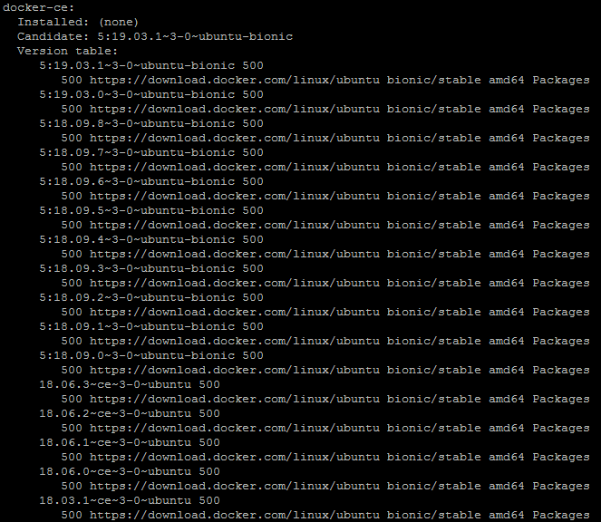
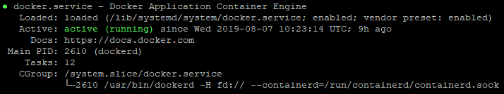
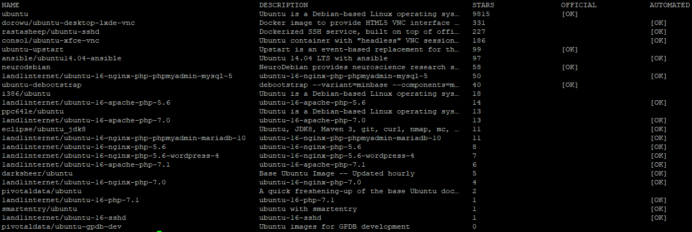
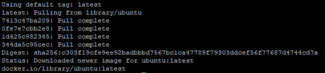
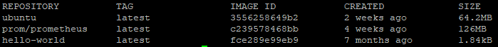
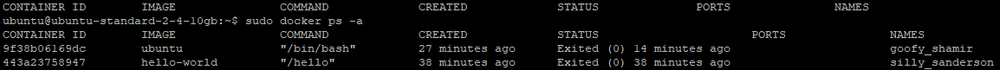

Docker CE (Community Edition) – это  платформа для быстрой сборки, отладки и развертывания приложений. Docker CE позволяет быстро разворачивать приложения в любой среде, упаковывая программное обеспечение в конфигурируемые контейнеры.

Контейнеры включают все необходимое для работы приложения (библиотеки, системные инструменты, код и среду исполнения) и позволяют запускать приложения в процессах с изоляцией ресурсов. Они подобны виртуальным машинам, но являются более портируемыми, менее требовательными к ресурсам и более зависимыми от операционной системы хостовой машины.

**Как сэкономить время на установке Docker CE**

Вы можете получить уже установленный Docker CE на Ubuntu 18.04 в виде настроенной виртуальной машины VK Cloud Solutions. При регистрации вы получаете бесплатный бонусный счет, которого достаточно, чтобы тестировать приложение несколько дней.

**[**[подключить машину Docker CE](https://mcs.mail.ru/app/services/marketplace/)**]**

Чтобы узнать больше о Docker CE в магазине приложений, перейдите в [Центр помощи](https://mcs.mail.ru/help/quick-start/docker-ce).

**Требования**

- Операционная система Ubuntu версии 18.04.
- Пользователь с доступом к команде sudo.

## Установка Docker CE

Чтобы установить Docker CE:

1.  Откройте окно терминала.
2.  Обновите индексы пакетов, выполнив команду:

```
sudo apt update
```

3.  Установите дополнительные программные пакеты, позволяющие установщику apt использовать пакеты по защищенному протоколу HTTPS, выполнив команду:

```
sudo apt install apt-transport-https ca-certificates curl software-properties-common -y
```

4.  Установите доверенный ключ GPG репозитория Docker, выполнив команду:

```
curl -fsSL https://download.docker.com/linux/ubuntu/gpg | sudo apt-key add -
```

5.  Убедитесь, что ключ загружен, выполнив команду:

```
apt-key list
```

В результате отобразится примерно следующий список:

****

6.  Добавьте официальный репозиторий Docker в каталог системных репозиториев APT, выполнив команду:

```
sudo add-apt-repository "deb [arch=amd64] https://download.docker.com/linux/ubuntu bionic stable"
```

7.  Обновите индексы пакетов, выполнив команду:

```
sudo apt update
```

8.  Убедитесь, что репозиторий Docker подключен в качестве источника установки Docker CE, выполнив команду:

```
apt-cache policy docker-ce
```

В результате отобразится примерно следующее:

****

9.  Установите Docker CE, выполнив команду:

```
sudo apt install docker-ce -y
```

10. Чтобы при запуске операционной системы Docker CE запускался автоматически, выполните команду:

```
sudo systemctl enable docker
```

11. Проверьте работу Docker CE, выполнив команду:

```
sudo systemctl status docker --no-pager -l
```

В результате отобразится примерно следующее:

****

## Использование Docker CE

**Примечание**

Синтаксис командной строки Docker CE состоит из  ключа (command) и опций (options):

```
docker [OPTIONS] COMMAND
```

Для примера использования Docker CE:

1.  Откройте окно терминала.
2.  Для просмотра справочной информации по синтаксису командной строки Docker CE выполните команду:

```
docker --help
```

3.  Для просмотра текущей информации о Docker CE выполните команду:

```
sudo docker info
```

## Работа с образами Docker CE

Контейнеры запускаются из образов Docker. По умолчанию Docker получает образы из Docker Hub, который представляет собой реестр образов.

Для примера работы с образами Docker CE:

1.  Откройте окно терминала.
2.  Проверьте доступность образов на Docker Hub и возможность их загрузки, выполнив команду:

```
sudo docker run hello-world
```

В результате отобразится примерно следующее:

****

**Примечание**

Далее рассмотрим пример с образом ОС Ubuntu, так как он является более функциональным для демонстрации.

3.  Для просмотра доступных образов ОС Ubuntu в Docker Hub выполните команду:

```
sudo docker search ubuntu
```

В результате возвращается список всех образов с подходящими под условия поиска именами:

****

4.  Загрузите образ ОС Ubuntu, выполнив команду:

```
sudo docker pull ubuntu
```

В результате отобразится примерно следующее:

****

5.  Для просмотра загруженных образов выполните команду:

```
sudo docker images
```

В результате отобразится примерно следующее:

****

## Запуск docker-образа

Команда docker run включает две команды:

```
docker pull
docker start
```

Для получения дополнительной информации используйте команды:

```
docker run --help и docker start --help
```

Чтобы запустить docker-образ:

1.  Откройте окно терминала.
2.  В качестве примера запустите docker-образ Ubuntu, выполнив команду:

```
sudo docker run -it ubuntu
```

В результате из docker-образа создается контейнер и выполняется запуск этого контейнера. Вы сможете начать работу с командной оболочкой контейнера. При этом командная строка будет иметь примерно следующий вид:

```
root@f1d4ef1c3e97:/#, где f1d4ef1c3e97 - идентификатор контейнера Ubuntu
```

**Примечание**

Ключ -t назначает псевдо-TTY, подключенный к STDIN контейнера. Часто этот ключ используется с опцией -i (например, если для выполнения каких-либо действий нужно подключиться к оболочке (bash) внутри docker-контейнера).

3.  Обновите индексы пакетов, выполнив команду:

```
apt update
```

4.  Для примера установите среду выполнения JavaScript - Node.js, выполнив команду:

```
apt install nodejs -y
```

5.  Проверьте статус и версию установленного пакета Node.js, выполнив команду:

```
node -v
```

6.  Для выхода из командной оболочки, выполните команду:

```
exit
```

## Управление контейнерами Docker CE

Для примера управления контейнерами Docker CE:

1.  Откройте окно терминала.
2.  Для просмотра всех контейнеров выполните команду:

```
sudo docker ps -a
```

В результате отобразится примерно следующее:

****

3.  Для просмотра только активных контейнеров выполните команду:

```
sudo docker ps
```

4.  Для запуска контейнера выполните команду:

```
sudo docker start <CONTAINER ID>
```

Например, команда для запуска контейнера Ubuntu:

```
sudo docker start 9f38b06169dc
```

5.  Для остановки контейнера выполните команду:

```
sudo docker stop <CONTAINER ID>
```

6.  Для удаления контейнера выполните команду:

```
sudo docker rm <CONTAINER ID>
```

**Обратная связь**

Возникли проблемы или остались вопросы? [Напишите нам, мы будем рады вам помочь](https://mcs.mail.ru/help/contact-us).
