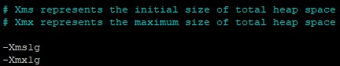
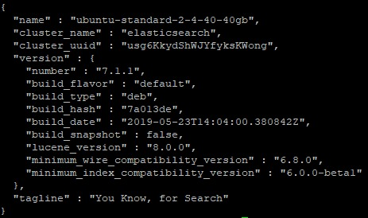

Данная статья описывает установку стека ELK на операционную систему семейства Linux — Ubuntu 18.04.

Стек ELK — это мощный набор инструментов для эффективного решения широкого спектра задач сбора, хранения и анализа данных:

- Elasticsearch – решение для полнотекстового поиска, построенное поверх Apache Lucene и имеющее дополнительные удобства.
- Logstash – утилита для сборки, фильтрации и последующего перенаправления в конечное хранилище данных. Этот механизм обеспечивает конвейер в реальном времени. Он может принимать данные из нескольких источников и преобразовывать их в документы JSON.
- Kibana — приложение, позволяющее брать и искать данные из Elasticsearch и строить наглядные графики.

## Требования

- Операционная система Ubuntu версии 18.04.
- Установленный веб-сервер Nginx.
- Установленная виртуальная машина Java.
- Пользователь с доступом к команде **sudo**.

## Установка веб-сервера Nginx

По сравнению с веб-сервером Apache веб-сервер Nginx использует меньше ресурсов для размещения объемных сайтов с высоким трафиком. Благодаря архитектуре Nginx можно легко масштабироваться до сотен тысяч параллельных соединений.

Чтобы установить и выполнить первичную настройку веб-сервера Nginx:

1. Откройте окно терминала.
1. Обновите индексы пакетов, выполнив команду:

   ```
   sudo apt update
   ```

1. Установите веб-сервер Nginx, выполнив команду:

   ```
   sudo apt install nginx -y
   ```

1. Для проверки работы веб-сервера запустите веб-браузер и в адресной строке введите IP-адрес веб-сервера.

   Если установка выполнена успешно, откроется следующая страница веб-сервера:

   ****

## Установка виртуальной машины Java

Для работы стека ELK требуется виртуальная машина Java. Чтобы установить JVM:

1. Откройте окно терминала.
1. Установите программный пакет JVM, выполнив команду:

   ```
   sudo apt install default-jre -y
   ```

   В результате будет установлен пакет Java Runtime Environment (JRE).

1. Установите программный пакет JDK, включающий компилятор Java, стандартные библиотеки классов Java, примеры, документацию и различные утилиты. Для этого выполните команду:

   ```
   sudo apt install default-jdk -y
   ```

## Установка и настройка Elasticsearch

Чтобы установить и выполнить первичную настройку Elasticsearch:

1. Для проверки текущей версии Elasticsearch, перейдите на страницу: [https://www.elastic.co/downloads/elasticsearch](https://www.elastic.co/downloads/elasticsearch).

1. Откройте окно терминала.

1. Импортируете открытый ключ GPG Elasticsearch, с использованием которого защищаются пакеты Elastic, выполнив команду:

   ```
   sudo wget -qO - https://artifacts.elastic.co/GPG-KEY-elasticsearch | sudo apt-key add 
   ```

1. Добавьте пакеты Elastic в каталог системных репозиториев sources.list.d, выполнив команду:

   ```
   sudo echo "deb https://artifacts.elastic.co/packages/7.x/apt stable main" | sudo tee -a /etc/apt/sources.list.d/elastic-7.x.list
   ```

1. Обновите индексы пакетов, выполнив команду:

   ```
   sudo apt update
   ```

1. Установите Elasticsearch, выполнив команду:

   ```
   sudo apt install elasticsearch
   ```

1. Внесите изменения в конфигурационный файл `elasticsearch.yml`. Для этого:

   1. Откройте этот файл для редактирования, выполнив команду:

      ```
      sudo nano /etc/elasticsearch/elasticsearch.yml
      ```

   1. Найдите строку:

      ```
      #network.host: 192.168.0.1 
      ```

      Замените ее на строку:

         ```
         network.host: localhost
         ```

         <info>

         **Примечание**

         Для поиска по файлу используйте сочетание клавиш CTRL+W.

         </info>

         После редактирования конфигурационного файла `.yml` убедитесь, что в нем нет лишних пробелов и/или отступов!

   1. Сохраните изменения, используя сочетание клавиш CTRL+O, и завершите редактирование, используя сочетание клавиш CTRL+X.

1. Запустите сервис Elasticsearch, выполнив команду:

   ```
   sudo systemctl start elasticsearch
   ```

1. Проверьте статус запуска сервиса Elasticsearch, выполнив команду:

   ```
   sudo systemctl status elasticsearch
   ```

1. Если отображается ошибка:

   ****

   Выполните следующее:

      1. Откройте файл, содержащий параметры виртуальной машины Java, выполнив команду:

         ```
         sudo nano /etc/elasticsearch/jvm.options
         ```

      1. Найдите параметры, определяющие минимальное и максимальное количество оперативной памяти для Java:

         

         <info>

         **Примечание**

         Подробно о параметрах Xms и Xmx [читайте тут](https://docs.oracle.com/cd/E15523_01/web.1111/e13814/jvm_tuning.htm#PERFM161). Для машин с небольшим объемом оперативной памяти мы рекомендуем ограничить объем памяти, используемый JVM.

         </info>

      1. В параметрах `-Xms1g` и `-Xmx1g` укажите нужные значения. Например, для операционной системы с объемом оперативной памяти 1 ГБ, можно указать:

         ```
         -Xms128m
         -Xmx128m
         ```

      1. Сохраните изменения, используя сочетание клавиш `CTRL+O`, и завершите редактирование, используя сочетание клавиш `CTRL+X`.
      1. Запустите сервис Elasticsearch и проверьте статус. В случае отсутствия ошибок отобразится следующее:

         ****

1. Чтобы при перезагрузке операционной системы сервис Elasticsearch запускался автоматически, выполните команду:

   ```
   sudo systemctl enable elasticsearch
   ```

1. Для проверки доступа к сервису Elasticsearch отправьте HTTP-запрос, выполнив команду:

   ```
   curl -X GET localhost:9200
   ```

   Если установка Elasticsearch выполнена успешно, отобразится следующая информация:

      ****

## Установка и настройка Kibana

Чтобы установить и выполнить первичную настройку Kibana, выполните следующее:

1. Убедитесь, что вы успешно установили Elasticsearch.
1. Откройте окно терминала.
1. Установите Kibana, выполнив команду:

   ```
   sudo apt install kibana
   ```

1. Запустите Kibana, выполнив команду:

   ```
   sudo systemctl start kibana
   ```

1. Чтобы при перезагрузке операционной системы сервис Kibana запускался автоматически, выполните команду:

   ```
   sudo systemctl enable kibana
   ```

1. Для проверки статуса работы Kibana, выполните команду:

   ```
   sudo systemctl status kibana
   ```

1. Внесите изменения в конфигурационный файл `kibana.yml`. Для этого:

   1. Откройте этот файл, выполнив команду:

      ```
      sudo nano /etc/kibana/kibana.yml
      ```

   1. Найдите строку:

      ```
      #server.port: 5601 
      ```

      И замените ее на строку:

         ```
         server.port: 5601
         ```

   1. Найдите строку

      ```
      #server.host: "localhost" 
      ```

      И замените ее на строку:

         ```
         server.host: "localhost"
         ```

   1. Найдите строку:

      ```
      #elasticsearch.hosts: ["http://localhost:9200"] 
      ```

      И замените ее на строку:

         ```
         elasticsearch.hosts: ["http://localhost:9200"]
         ```

   1. Сохраните изменения, используя сочетание клавиш CTRL+O, и завершите редактирование, используя сочетание клавиш CTRL+X

1. Создайте учетную запись администратора для доступа к веб-интерфейсу Kibana. Для этого выполните команду:

   ```
   echo "mcskibadmin:\`openssl passwd -apr1\`" | sudo tee -a /etc/nginx/htpasswd.users
   ```

   где `mcskibadmin` - логин учетной записи администратора, `htpasswd.users` - файл, в котором хранятся учетные данные.

   Затем введите пароль.

1. Создайте файл с виртуальным сайтом для веб-сервера Nginx, выполнив команду:

   ```
   sudo nano /etc/nginx/sites-available/elk
   ```

1. В этот файл добавьте следующую информацию:

   ```
   server {
       listen 80;
    
       server_name <внешний IP-адрес веб-сервера>;
    
       auth_basic "Restricted Access";
       auth_basic_user_file /etc/nginx/htpasswd.users;
    
       location / {
           proxy_pass http://localhost:5601;
           proxy_http_version 1.1;
           proxy_set_header Upgrade $http_upgrade;
           proxy_set_header Connection 'upgrade';
           proxy_set_header Host $host;
           proxy_cache_bypass $http_upgrade;
       }
   }
   ```

   Сохраните изменения, используя сочетание клавиш CTRL+O, и завершите редактирование, используя сочетание клавиш CTRL+X.

1. Активируйте новую конфигурацию Nginx, выполнив команду:

   ```
   sudo ln -s /etc/nginx/sites-available/elk /etc/nginx/sites-enabled/
   ```

1. Перезагрузите Kibana, выполнив команду:

   ```
   sudo systemctl restart kibana
   ```

1. Перезагрузите веб-сервер Nginx, выполнив команду:

   ```
   sudo systemctl restart nginx 
   ```

1. Убедитесь, что синтаксис конфигурационного файла nginx не содержит ошибок, выполнив команду:

   ```
   sudo nginx -t
   ```

## Установка и настройка Logstash

Чтобы установить и выполнить первичную настройку Logstash:

1. Установите Logstash, выполнив команду команду:

   ```
   sudo apt install logstash
   ```

1. Создайте и настройте конфигурационный файл, содержащий правила приема информации с beats-агентов. Для этого:

   <info>

   **Примечание**

   Далее приведен один из возможных вариантов настройки. Дополнительную информацию [читайте тут](https://www.elastic.co/guide/en/logstash/7.2/logstash-config-for-filebeat-modules.html#parsing-system).

   </info>

   1. Создайте файл `02-beats-input.conf`, выполнив команду:

      ```
      sudo nano /etc/logstash/conf.d/02-beats-input.conf
      ```

   1. В этот файл добавьте строки:

      ```
      input {
        beats {
          port => 5044
        }
      }
      ```

   1. Сохраните изменения, используя сочетание клавиш `CTRL+O`, и завершите редактирование, используя сочетание клавиш `CTRL+X`.

1. Создайте и настройте конфигурационный файл `30-elasticsearch-output.conf`, содержащий правила хранения beats в информации Elasticsearch. Для этого:

   1. Создайте файл `30-elasticsearch-output.conf`, выполнив команду:

      ```
      sudo nano /etc/logstash/conf.d/30-elasticsearch-output.conf
      ```

   1. В этот файл добавьте следующие строки:

      ```
      output {
        elasticsearch {
          hosts => ["localhost:9200"]
          sniffing => true
          manage_template => false
          template_overwrite => true
          index => "%{[@metadata][beat]}-%{+YYYY.MM.dd}"
          document_type => "%{[@metadata][type]}"
        }
      }
      ```

   1. Сохраните изменения, используя сочетание клавиш `CTRL+O`, и завершите редактирование, используя сочетание клавиш `CTRL+X`.

1. Создайте файл, содержащий правила фильтрации и структуризации входящих данных. Для этого:

   1. Создайте файл `10-system-filter.conf`, выполнив команду:

      ```
      sudo nano /etc/logstash/conf.d/10-logstash-filter.conf
      ```

   1. В открывшийся файл поместите следующие строки:

      ```
      input { stdin { } }
      filter {
      grok {
         match => { "message" => "%{COMBINEDAPACHELOG}" }
      }
      date {
         match => [ "timestamp" , "dd/MMM/yyyy:HH:mm:ss Z" ]
      }
      }
      output {
      elasticsearch { hosts => ["localhost:9200"] }
      stdout { codec => rubydebug }
      }
      ```

   1. Сохраните изменения, используя сочетание клавиш `CTRL+O`, и завершите редактирование, используя сочетание клавиш `CTRL+X`.

1. Проверьте конфигурацию Logstash, выполнив команду:

      ```
      sudo -u logstash /usr/share/logstash/bin/logstash --path.settings /etc/logstash -t
      ```

1. Запустите Logstash, выполнив команду:

   ```
   sudo systemctl start logstash
   ```

1. Чтобы при перезагрузке операционной системы сервис Logstash запускался автоматически, выполните команду:

   ```
   sudo systemctl enable logstash
   ```

## Установка и настройка Filebeat

Filebeat позволяет собирать данные (beats) из различных источников и передавать их в Logstash или Elasticsearch в Linux-подобных системах.

Для установки Filebeat:

1. Откройте терминал.

1. Установите Filebeat, выполнив команду:

   ```
   sudo apt install filebeat
   ```

1. Настройте конфигурационный файл `filebeat.yml`. Для этого:

   1. Откройте этот файл:

      ```
      sudo nano /etc/filebeat/filebeat.yml
      ```

   1. Запретите Filebeat отправлять данные напрямую в Elasticsearch. Для этого найдите строки:

      ```
      output.elasticsearch:
        # Array of hosts to connect to.
        hosts: ["localhost:9200"]
      ```

      И замените их на строки:

         ```
         #output.elasticsearch:
             # Array of hosts to connect to.
             #hosts: ["localhost:9200"]
         ```

   1. Укажите сервису Filebeat использовать Logstash в качестве сборщика логов. Для этого найдите строки:

      ```
      #output.logstash:  
          # The Logstash hosts  
          #hosts: ["localhost:5044"]
      ```

      И замените их на строки:

         ```
         output.logstash:
             # The Logstash hosts
             hosts: ["localhost:5044"]
         ```

         Сохраните изменения, используя сочетание клавиш `CTRL+O`, и завершите редактирование, используя сочетание клавиш `CTRL+X`.

1. Включите модуль Logstash. Для этого выполните команду:

   ```
   sudo sudo filebeat modules enable logstash
   ```

   <info>

   **Примечание**

   Подробно о filebeat-модулях [читайте тут](https://www.elastic.co/guide/en/beats/filebeat/6.4/filebeat-module-system.html).

   </info>

1. Для просмотра включенных модулей выполните команду:

   ```
   sudo filebeat modules list
   ```

1. Загрузите шаблон индекса Elasticsearch, выполнив команду:

   ```
   sudo filebeat setup --template -E output.logstash.enabled=false -E 'output.elasticsearch.hosts=["localhost:9200"]'
   ```

   <info>

   **Примечание**

   Индексы Elasticsearch представляют собой набор документов, имеющих сходные характеристики. Они определяются по именам, которые используются для ссылок на индексы при выполнении различных операций с индексами. Шаблон индексов загружается автоматически при создании новых индексов.

   </info>

1. Дашборды позволяют визуализировать данные Filebeat отсылаемые в Kibana. Для включения дашборда выполните команду:

   ```
   sudo filebeat setup -e -E output.logstash.enabled=false -E output.elasticsearch.hosts=['localhost:9200'] -E setup.kibana.host=localhost:5601
   ```

1. Запустите Filebeat, выполнив команду:

   ```
   sudo systemctl start filebeat
   ```

1. Чтобы при перезагрузке операционной системы сервис filebeat запускался автоматически, выполните команду:

   ```
   sudo systemctl enable filebeat
   ```

1. Чтобы убедиться, что Elasticsearch получает данные, запросите индекс Filebeat с помощью команды:

   ```
   curl -XGET 'http://localhost:9200/filebeat-\*/_search?pretty'
   ```

Установка стека ELK завершена.

В адресной строке веб-браузера введите IP-адрес вашего Elastic-сервера. Для входа используйте учетные данные администратора . После успешной авторизации вы перейдете на основную страницу Kibana.
