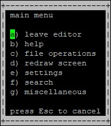
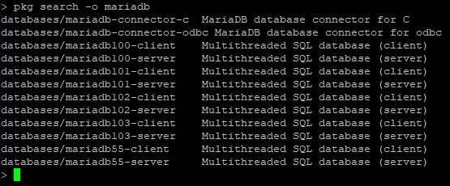
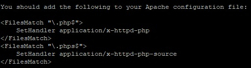
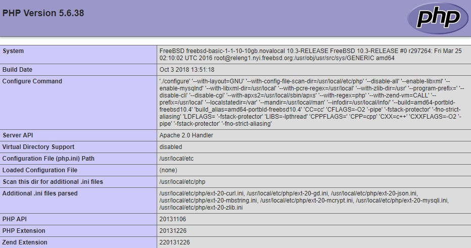

Данная статья описывает установку стека FAMP на операционную систему семейства Unix — FreeBSD 10.3.

Стек FAMP включает в себя операционную систему FreeBSD, веб-сервер Apache, систему управления базами данных MySQL (mariadb) и серверный язык сценариев для обработки динамического контента PHP. Все это необходимо для поддержки динамических сайтов и веб-приложений.

## Требования

- Операционная система FreeBSD версии 10.3.
- Пользователь с доступом к команде sudo.

## Подготовка к установке стека FAMP

Перед установкой стека FAMP:

1. Откройте файл `resolv.conf` для редактирования, выполнив команду:

   ```
   sudo ee /etc/resolv.conf
   ```

1. В файле resolv.conf выполните следующее:

   1. Добавьте строку `nameserver <IP-адрес вашего DNS-сервера>`;

      <warn>

      **Внимание**

      Если вы используйте виртуальную машину, предоставляемую облачным сервисом [VK CS](https://mcs.mail.ru/), в строке `nameserver 8.8.8.8` просто удалите символ `#`.

      </warn>

   1. Строку `nameserver 127.0.0.1` оставьте без изменения;
   1. Сохраните изменения, выполнив следующее:
      1. Откройте меню, используя сочетание клавиш `CTRL+[`;
      1. В меню выберите пункт **a**, затем снова выберите пункт **а**;

         ****

         

   В результате содержимое файла `resolv.conf` должно выглядеть примерно так:

   ****

1. Для сетевого интерфейса укажите корректное значение параметра mtu. Для этого:

   <info>

   **Примечание**

   Чтобы узнать корректное значение mtu, обратитесь к вашему интернет-провайдеру

   </info>

   1. Выполните команду:

      ```
      ifconfig
      ```

   1. Для нужного сетевого интерфейса найдите параметр `mtu <значение>`, например:

      ****

   1. Укажите новое значение mtu, выполнив команду:

      ```
      sudo ifconfig <имя сетевого интерфейса> mtu <значение> up
      ```

      <info>

      **Примечание**

      Если вы используйте виртуальную машину, предоставляемую облачным сервисом [VK CS](https://mcs.mail.ru/), выполните команду:

      ```
      sudo ifconfig vtnet0 mtu 1400 up
      ```

      </info>

   1. Для проверки внесенных изменений используйте команду:

      ```
      ping cms.mail.ru
      ```

   Убедитесь, что обмен запросами происходит успешно. Затем прервите выполнение команды, используя сочетание клавиш CTRL + C.

1. Для отображения пакетов, доступных для обновления, и файлов, которые будут изменены в процессе обновления, выполните команду:

   ```
   sudo freebsd-update fetch .
   ```

1. Запустите процесс обновления, выполнив команду:

   ```
   sudo freebsd-update install
   ```

## Установка и настройка веб-сервера Apache

Чтобы установить и выполнить первичную настройку веб-сервера Apache:

1. Проверьте доступные версии Apache, выполнив команду:

   ```
   ls /usr/ports/www/ | grep apache
   ```

1. Выберите версию Apache (например, **apache24**) и запустите установку, выполнив команду:

   ```
   sudo pkg install apache24
   ```

   <warn>

   **Внимание**

   При установке сервера Apache может потребоваться обновление пакета установщика pkg. Для обновления ответьте `Y`.

   </warn>

1. Чтобы при перезагрузке операционной системы сервис Apache запускался автоматически, выполните команду:

   ```
   sudo sysrc apache24_enable="yes"
   ```

1. Запустите сервер Apache, выполнив команду:

   ```
   sudo service apache24 start
   ```

1. Для проверки работы Apache в адресной строке веб-браузера введите:

   ```
   <внешний IP-адрес веб-сервера>/index.html
   ```

Если установка веб-сервера Apache прошла успешно, загрузится страница веб-сервера, содержащая строку:

   

## Установка СУБД MySQL (mariadb)

В качестве базы данных рассматривается установка `mariadb`, которая является ответвлением от СУБД MySQL. Чтобы установить и настроить `mariadb`:

1. Откройте окно терминала.

1. Проверьте доступные версии `mariadb`, выполнив команду:

   ```
   pkg search -o mariadb
   ```

   

1. Выберите версию `mariadb` (например, **mariadb103**) и запустите установку, выполнив команду:

   ```
   sudo pkg install mariadb103-server mariadb103-client
   ```

1. Чтобы при перезагрузке операционной системы сервис `mariadb` запускался автоматически, выполните команду:

   ```
   sudo sysrc mysql_enable="yes"
   ```

1. Запустите `mariadb`, выполнив команду:

   ```
   sudo service mysql-server start
   ```

1. Для изменения конфигурации сервера `mariadb` используйте команду:

   ```
   sudo mysql_secure_installation
   ```

   Данная команда запускает сценарий повышения безопасности сервера СУБД mariadb. Для настройки безопасности:

   1. Укажите пароль для учетной записи root.

      <warn>

      **Внимание**

      Рекомендуется указывать надежный пароль, который содержит не менее 8 символов, включающих по крайней мере одну заглавную букву, одну строчную букву, одну цифру и один специальный символ.

      </warn>

      Пользователь root в данном случае относится исключительно к СУБД MySQL и не является учетной записью ОС CentOS.

   1. При необходимости удалите анонимные (anonymous) учетные записи, которые создаются при установке СУБД maridb:
      - Ответьте `Y` для удаления анонимных учетных записей.
      - Ответьте `N`, если удаление анонимных учетных записей не требуется.

      Данные учетные записи предназначены только для тестирования БД и в большинстве случаев могут быть удалены.

   1. При необходимости запретите предоставление удаленного доступа к базам СУБД MySQL для учетной записи root:
      - Ответьте `Y` для отключения возможности удаленного доступа.
      - Ответьте `N`, для разрешения удаленного доступа.

   1. При необходимости удалите тестовую базу (Test):
      - Ответьте `Y` для удаления базы Test.
      - Ответьте `N`, если удаление базы Test не требуется.

      Данная база создается при установке сервера СУБД MySQL и предназначена для тестирования. Удаление базы Test не влияет на работу системы.

   1. В ответ на запрос на внесение изменений в СУБД MySQL и перезагрузку привилегий доступа к таблицам:
      - Ответьте `Y` для внесения изменений и перезагрузки.
      - Ответьте `N`, если внесение изменений и перезагрузка не требуются.

## Установка PHP

Для установки PHP:

1. Откройте окно терминала.
1. Проверьте доступные версии PHP, выполнив команду:

   ```
   ls /usr/ports/lang/ | grep php
   ```

   

1. Для отображения всех доступных утилит PHP используйте команду:

   ```
   pkg search -o php
   ```

1. Установите PHP и дополнительные утилиты, выполнив команду:

   ```
   sudo pkg install php56 mod_php56 php56-mbstring php56-mcrypt php56-zlib php56-curl php56-gd php56-json php56-mysqli
   ```

   По завершении установки отобразится справочная информация, содержащая конфигурацию сервера Apache, например:

   ****

1. Создайте файл `php.conf`, выполнив команду:

   ```
   sudo ee /usr/local/etc/apache24/Includes/php.conf 
   ```

1. В файл `php.conf` добавьте следующие строки:

   ```
   <IfModule dir_module>
       DirectoryIndex index.php index.html
       <FilesMatch "\.php$">
           SetHandler application/x-httpd-php
       </FilesMatch>
       <FilesMatch "\.phps$">
           SetHandler application/x-httpd-php-source
       </FilesMatch>
   </IfModule>
   ```

   Сохраните внесенные изменения.

1. Перезагрузите веб-сервер Apache, выполнив команду:

   ```
   sudo service apache24 restart
   ```

1. Убедитесь, что веб-сервер Apache корректно отображает скрипты PHP. Для этого:

   1. Создайте файл `info.php`, выполнив команду:

      ```
      sudo ee /usr/local/www/apache24/data/info.php

      ```

   1. В файл `info.php` поместите текст:

      ```
      <?php
          phpinfo();
      ?>
      ```

   1. Сохраните внесенные изменения и завершите редактирование;

   1. В адресной строке браузера к адресу веб-сервера добавьте строку:

      ```
      /info.php
      ```

      В результате должна отобразиться примерно следующая страница:

      ****

   <warn>

   **Внимание**

   В целях безопасности после проверки системы рекомендуется удалить файл `info.php`, выполнив команду:

   ```
   sudo rm /usr/local/www/apache24/data/info.php

   ```

   </warn>

## Обратная связь

Возникли проблемы или остались вопросы? [Напишите нам, мы будем рады вам помочь](https://mcs.mail.ru/help/contact-us).
