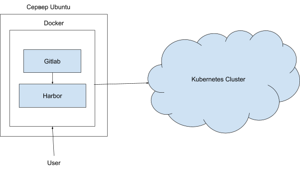

В данной статье рассмотрим схему работы и последовательность действий для настройки Gitlab, Harbor и авторазвертывание приложения в кластер Kubernetes.

## Конфигурация оборудования

- Сервер Ubuntu 18.04 LTS x86_64.
- Установленный и настроенный кластер K8s ([например, в VK Cloud](https://mcs.mail.ru/app/services/containers/list/)).

## Схема работы

****

На сервере Ubuntu настройте Docker, в нем разверните Gitlab и Harbor. Gitlab — полнофункциональный Git-сервер с возможностью хранения репозиториев, управления ими, а также со средствами сборки (pipelines) и доставки (ci/cd). Harbor — регистри для хранения Docker-образов. K8s — кластер Kubernetes, в который настраивается тестовое авторазвертывание приложения.

## Последовательность действий

1. [Установите и настройте Docker](/ru/additionals/cases/cases-gitlab/case-docker).
2. [Установите и настройте Gitlab](/ru/additionals/cases/cases-gitlab/case-gitlab).
3. [Установите и настройте Harbor](/ru/additionals/cases/cases-gitlab/case-harbor).
4. [Настройте авторазвертывание приложения в кластер Kubernetes](/ru/additionals/cases/cases-gitlab/case-k8s-app).
