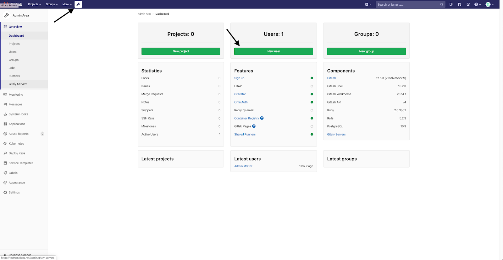
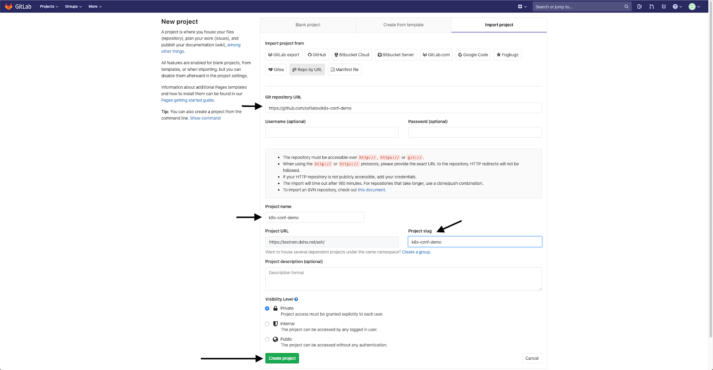
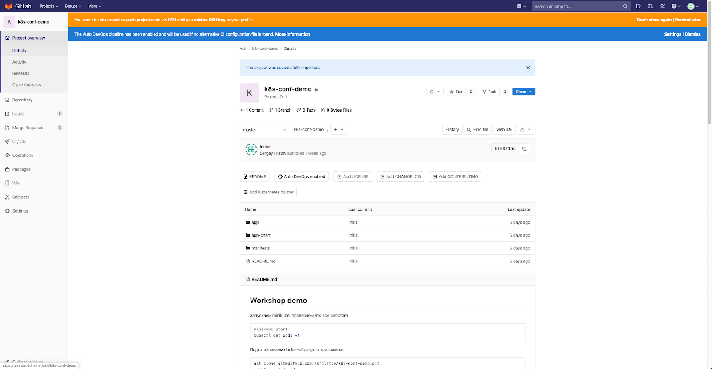
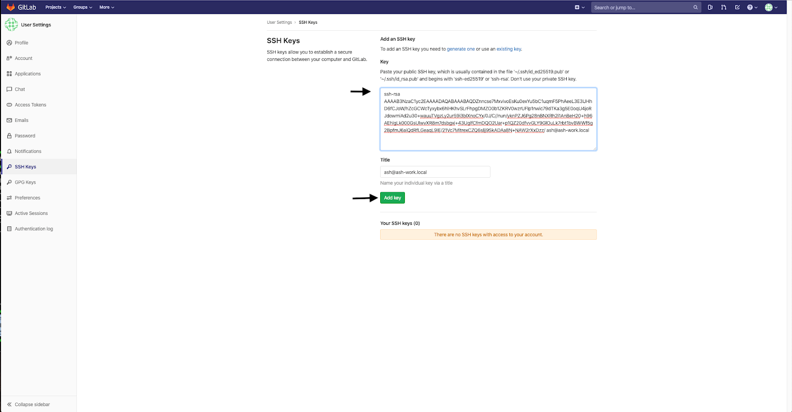

В данной статье рассмотрим, как установить и настроить Gitlab.

После этого вы можете:

- [Установить и настроить Harbor](https://mcs.mail.ru/help/gitlab-ci-cd/harbor-installation);
- [Настроить авторазвертывание приложения в кластер Kubernetes](https://mcs.mail.ru/help/gitlab-ci-cd/k8s-autodeploy).

## Установка Gitlab

Перед установкой Gitlab [установите и настройте Docker](https://mcs.mail.ru/help/gitlab-ci-cd/docker-installation).

Чтобы установить Gitlab:

1.  Назначьте серверу DNS-имя, которое будет использоваться для доступа к Git, одним из способов:

- Если у вас есть для этого домен, добавьте в него ваш сервер.
- Если у вас нет свободного домена, воспользуйтесь, например, сервисом [NoIP](https://www.noip.com/), который предоставляет динамический DNS. Для этого зарегистрируйтесь на сервере, выберите имя и установите клиент на сервер (подробнее [в статье разработчика сервиса NoIP](https://www.noip.com/support/knowledgebase/installing-the-linux-dynamic-update-client/)).

2.  Создайте файл `/root/docker-compose.yml` и добавьте в него следующее:

```
version: '3.7'
services:
  gitlab:
   container_name: gitlab
   image: 'gitlab/gitlab-ce:latest'
   restart: always
   hostname: '<SERVER_DNS_NAME>'
   environment:
     GITLAB_OMNIBUS_CONFIG: |
       external_url 'https://<SERVER_DNS_NAME>'
       # Add any other gitlab.rb configuration here, each on its own line
   ports:
     - '80:80'
     - '443:443'
     - '22:22'
   volumes:
     - '/opt/gitlab/config:/etc/gitlab'
     - '/opt/gitlab/logs:/var/log/gitlab'
     - '/opt/gitlab/data:/var/opt/gitlab'

  gitlab-runner:
   container_name: gitlab-runner
   image: gitlab/gitlab-runner:latest
   restart: always
   volumes:
     - '/opt/gitlab-runner/data:/home/gitlab_ci_multi_runner/data'
     - '/opt/gitlab-runner/config:/etc/gitlab-runner'
     - '/var/run/docker.sock:/var/run/docker.sock:rw'
   environment:
     - CI_SERVER_URL=https://<SERVER_DNS_NAME>/ci
```

Этот файл запускает два образа: для gitlab и для gitlab-runner (это pipeline для сборки).

Обратите внимание, что контейнер должен быть доступен из внешней сети по порту 22, иначе при доступе командой git придется указывать нестандартный порт. Поэтому системный ssh перенесите на другой порт. Для этого откройте файл `/etc/ssh/sshd_config` и найдите строку:

```
#Port 22 
```

Если строка закомментирована, раскомментируйте ее и измените номер порта, например:

```
Port 35242   
```

Перезапустите sshd:

```
root@ubuntu-standard-2-4-40gb:/etc/ssh# service sshd restart
```

Убедитесь, что сервис слушает на новом порту:

```
root@ubuntu-standard-2-4-40gb:/etc/ssh# netstat -tulpn | grep 35242
tcp 0 0 0.0.0.0:35242 0.0.0.0:\* LISTEN 3625/sshd
tcp6       0      0 :::35242                :::\*                    LISTEN      3625/sshd
```

Авторизуйтесь по новому порту. Если подключиться не удается, проверьте настройки Firewall.

3.  Создайте необходимые директории для persistent storage gitlab:

```
root@ubuntu-standard-2-4-40gb:~# mkdir /opt/gitlab
root@ubuntu-standard-2-4-40gb:~# mkdir /opt/gitlab/config
root@ubuntu-standard-2-4-40gb:~# mkdir /opt/gitlab/logs
root@ubuntu-standard-2-4-40gb:~# mkdir /opt/gitlab/data
root@ubuntu-standard-2-4-40gb:~# mkdir /opt/gitlab-runner
root@ubuntu-standard-2-4-40gb:~# mkdir /opt/gitlab-runner/config
root@ubuntu-standard-2-4-40gb:~# mkdir /opt/gitlab-runner/data
```

4.  Запустите docker-compose:

```
root@ubuntu-standard-2-4-40gb:~# docker-compose up -d
Creating network "root_default" with the default driver
Pulling gitlab (gitlab/gitlab-ce:latest)...
latest: Pulling from gitlab/gitlab-ce
976a760c94fc: Pull complete
c58992f3c37b: Pull complete
0ca0e5e7f12e: Pull complete
f2a274cc00ca: Pull complete
163f3071a3f8: Pull complete
d96d45e9c9e7: Pull complete
9a0f4e25d3a3: Pull complete
19aad3ea2a1d: Pull complete
fcafd8209320: Pull complete
3a4ea7fd547c: Pull complete
Digest: sha256:f5cb34c4d6bca26734dbce8889863d32c4ce0df02079b8c50bc4ac1dd89b53f4
Status: Downloaded newer image for gitlab/gitlab-ce:latest
Pulling gitlab-runner (gitlab/gitlab-runner:latest)...
latest: Pulling from gitlab/gitlab-runner
7ddbc47eeb70: Pull complete
c1bbdc448b72: Pull complete
8c3b70e39044: Pull complete
45d437916d57: Pull complete
59a312699ead: Pull complete
6562c5999ae2: Pull complete
368e9065e920: Pull complete
b92ce2befcc8: Pull complete
420f91b9ac4d: Pull complete
Digest: sha256:c40748978103959590474b81b72d58f0c240f010b4c229181aaf3132efdf4bd1
Status: Downloaded newer image for gitlab/gitlab-runner:latest
Creating gitlab-runner ... done
Creating gitlab        ... done
```

Запуск занимает около 5 минут, затем сервис доступен по HTTP. Проверьте состояние запуска:

```
root@ubuntu-standard-2-4-40gb:~# docker ps
CONTAINER ID        IMAGE                         COMMAND                  CREATED             STATUS                   PORTS                                                          NAMES
bb20bc6cb7d5        gitlab/gitlab-ce:latest       "/assets/wrapper"        10 minutes ago      Up 6 minutes (healthy)   0.0.0.0:22->22/tcp, 0.0.0.0:80->80/tcp, 0.0.0.0:443->443/tcp   gitlab
a2209bb357e7        gitlab/gitlab-runner:latest   "/usr/bin/dumb-init ..."   10 minutes ago      Up 10 minutes                                                                           gitlab-runner
```

## Настройка Gitlab

1.  При установке Gitlab генерируются самоподписанные сертификаты для HTTPS. Не будем их использовать, перейдем на сертификаты LetsEncrypt. Для этого откройте файл `/opt/gitlab/config/gitlab.rb` и приведите к указанному виду следующие параметры:

```
################################################################################
# Let's Encrypt integration
################################################################################
letsencrypt['enable'] = true
# letsencrypt['contact_emails'] = [] # This should be an array of email addresses to add as contacts
# letsencrypt['group'] = 'root'
# letsencrypt['key_size'] = 2048
# letsencrypt['owner'] = 'root'
# letsencrypt['wwwroot'] = '/var/opt/gitlab/nginx/www'
# See http://docs.gitlab.com/omnibus/settings/ssl.html#automatic-renewal for more on these sesttings
letsencrypt['auto_renew'] = true
letsencrypt['auto_renew_hour'] = 0
letsencrypt['auto_renew_minute'] = 15 # Should be a number or cron expression, if specified.
letsencrypt['auto_renew_day_of_month'] = "\*/7"

```

В результате будет разрешено использование LetsEncrypt и обновления сертификатов будут проверяться 1 раз в неделю в 00:15.

2.  Перейдите в Docker и запустите перевыпуск сертификатов:

```
root@ubuntu-standard-2-4-40gb:~# docker exec -it gitlab bash
root@testrom:/# gitlab-ctl reconfigure
```

<info>

**Примечание**

На момент написания статьи механизм выпуска сертификатов LetsEncrypt работал некорректно из-за изменений в API LetsEncrypt (подробности читайте в кейсах [38255](https://gitlab.com/gitlab-org/gitlab/issues/38255) и [4900](https://gitlab.com/gitlab-org/omnibus-gitlab/issues/4900)). Для решения этой проблемы в файле `/opt/gitlab/embedded/cookbooks/letsencrypt/resources/certificate.rb` закомментируйте секцию `acme_certificate 'staging' do [...] end`.

</info>

3.  В браузере в строке поиска укажите имя Gitlab-сервера и создайте пароль администратора (root):

****

Затем войдите в систему:


4.  Перейдите в  зону администратора и выберите создание нового пользователя:

****

5.  Введите параметры пользователя:


6.  Вам на почту придет письмо, перейдите по ссылке и введите пароль. Затем авторизуйтесь от имени нового пользователя.

## Создание проекта

Чтобы настроить CI/CD, возьмите проект из [семинара «Как запустить ваше приложение в Kubernetes»](https://www.youtube.com/watch?v=rBzgGmuBgo0).

Сделайте форк [репозитория](https://github.com/ssfilatov/k8s-conf-demo) в локальный Gitlab, затем настройте развертывание и доставку для него.

Для этого:

1.  Нажмите Create a project:


2.  Выберите Import Project, Repo by URL:


3.  Введите название репозитория, URL исходного репозитория, project slug и создайте проект:



4.  Через некоторое время проект будет импортирован:



5.  Создайте ssh-ключ для доступа к репозиторию через Git. Для этого на своей рабочей станции в консоли выполните следующее:

```
ash-work:~ ssh-keygen -t rsa -f ~/.ssh/myrepo
Generating public/private rsa key pair.
Enter passphrase (empty for no passphrase):
Enter same passphrase again:
Your identification has been saved in /Users/ash/.ssh/myrepo.
Your public key has been saved in /Users/ash/.ssh/myrepo.pub.
The key fingerprint is:
SHA256:icv9wRrYB9PqRH9/imp4F8VpL1RPkCENu4OIybDKJH0 ash@ash-work.local
The key's randomart image is:
+---[RSA 2048]----+
| ooo+ |
| oo o|
| . .. +.|
| . + + + . .\* .|
|. o E = S o o+ . |
| + o . \* \* ... .|
| o + \*.= .. . |
| o.=oo.o .|
| oooo. oo |
+----[SHA256]-----+
```

6.  В вашей домашней директории в папке .ssh будет создана пара ключей myrepo: публичный и приватный. Публичный ключ загрузите в Gitlab. Для этого:

    1. Перейдите в веб-интерфейс Gitlab, в верхнем правом углу нажмите на иконку, и выберите  Settings:

    ****

    2. Выберите SSH Keys:

    ****

    3. В поле ввода вставьте содержимое файла `myrepo.pub` и нажмите Add key:

    ****

    В результате ключ будет добавлен:

    

Теперь с приватным ключом можно получить доступ в репозиторий. Для упрощения работы добавьте в `~/.ssh/config` следующую секцию:

```
host <SERVER_DNS_NAME>
HostName <SERVER_DNS_NAME> 
IdentityFile ~/.ssh/myrepo 
User git
```

Клонируйте репозиторий локально:

```
ash-work:git git clone git@<SERVER_DNS_NAME>:ash/k8s-conf-demo.git

Клонирование в «k8s-conf-demo»...

remote: Enumerating objects: 23, done.

remote: Counting objects: 100% (23/23), done.

remote: Compressing objects: 100% (23/23), done.

remote: Total 23 (delta 3), reused 0 (delta 0)

Получение объектов: 100% (23/23), 6.33 KiB | 6.33 MiB/s, готово.

Определение изменений: 100% (3/3), готово.
```

Теперь [установите и настройте хранилище Harbor](https://mcs.mail.ru/help/gitlab-ci-cd/harbor-installation), в которое будут складываться собранные образы.
