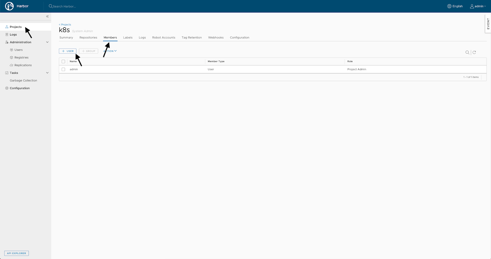

В данной статье рассмотрим, как установить и настроить хранилища репозиториев Harbor. После этого вы можете [настроить авторазвертывание приложения в кластер Kubernetes](https://mcs.mail.ru/help/gitlab-ci-cd/k8s-autodeploy).

Установка хранилища репозиториев Harbor
---------------------------------------

Перед установкой Harbor:

1.  [Установите и настройте Docker](https://mcs.mail.ru/help/gitlab-ci-cd/docker-installation).
2.  [Установите и настройте Gitlab](https://mcs.mail.ru/help/gitlab-ci-cd/gitlab-installation).

Harbor устанавливается как Docker-образ с помощью online installer.

Чтобы установить хранилища репозиториев Harbor:

1.  Скачайте скрипт online installer и разархивируйте его:

```
root@ubuntu-standard-2-4-40gb:~# wget https://github.com/goharbor/harbor/releases/download/v1.9.3/harbor-online-installer-v1.9.3.tgz 
root@ubuntu-standard-2-4-40gb:~# tar -zxvf harbor-online-installer-v1.9.3.tgz
```

2.  В получившейся папке harbor настройте файл harbor.yml:
    ```
    hostname: <SERVER_DNS_NAME>
    http:
      # port for http, default is 80. If https enabled, this port will redirect to https port
      port: 8080
    # https related config
     https:
    #   # https port for harbor, default is 443
       port: 8443
    #   # The path of cert and key files for nginx
       certificate: /opt/gitlab/config/ssl/<SERVER_DNS_NAME>.crt
       private_key: /opt/gitlab/config/ssl/<SERVER_DNS_NAME>.key
    # The default data volume
    data_volume: /opt/harbor
    ```
    

Причем:

*   Имя хоста совпадает с именем Gitlab, так как развертывание выполняется на сервере, на котором находится Gitlab.
*   Используем нестандартные HTTP- и HTTPS-порты, так как стандартные используются веб-интерфейсом Gitlab. 
*   Использует сертификат и ключ LetsEncrypt, которые были созданы при настройке Gitlab.

3.  Выполните скрипт install.sh:
    ```
    root@ubuntu-standard-2-4-40gb:~/harbor# ./install.sh
    
    [Step 0]: checking installation environment ...
    Note: docker version: 19.03.5
    Note: docker-compose version: 1.25.0
    
    [Step 1]: preparing environment ...
    [Step 2]: starting Harbor ...
    Creating harbor-log ... done
    Creating registryctl ... done
    Creating redis ... done
    Creating harbor-db ... done
    Creating harbor-portal ... done
    Creating registry ... done
    Creating harbor-core ... done
    Creating nginx ... done
    Creating harbor-jobservice ... done
    
    ✔ ----Harbor has been installed and started successfully.----
    ```
    

Harbor запущен.

Настройка хранилища репозиториев Harbor
---------------------------------------

1.  Авторизуйтесь в Harbor. 

Так как у нас используются нестандартные порты, URL будет иметь следующий вид:

```
https://<SERVER_DNS_NAME>:8443
```

Логин по умолчанию admin. Первичный пароль задается в файле harbor.yml (по умолчанию - Harbor12345).

****

2.  Смените пароль пользователя admin. Для этого в правом верхнем углу нажмите на admin и выберите Change Password:

****

3.  Укажите текущий и новый пароли:

****

4.  Создайте пользователя, от имени которого Gitlab будет работать с Harbor. Для этого слева выберите Users:**
    
    **
5.  Укажите данные нового пользователя:**
    
    
    
    **

**Внимание**

Запомните введенный для пользователя пароль, он потребуется для интеграции с Gitlab.

6.  Создайте новый проект, в который будут складываться собранные образы из Gitlab. Для этого слева выберите Projects:

**

**    

6.  Введите данные нового проекта:

**

**

7.  Добавьте пользователя в проект:**
    
    ****
    
    **
8.  Укажите для пользователя имя и роль:**
    
    
    
    **Теперь [настройте авторазвертывание приложения в кластер Kubernetes](https://mcs.mail.ru/help/gitlab-ci-cd/k8s-autodeploy).

**Обратная связь**

Возникли проблемы или остались вопросы? [Напишите нам, мы будем рады вам помочь](https://mcs.mail.ru/help/contact-us).