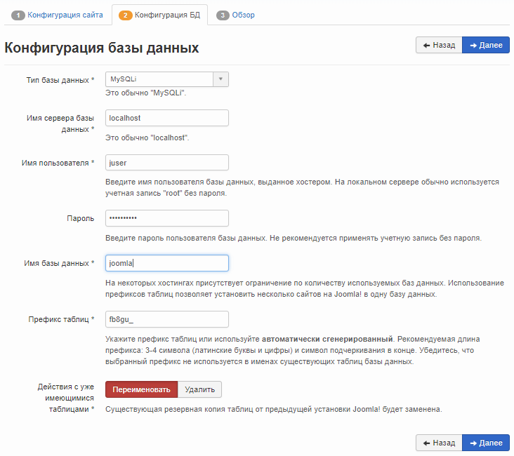
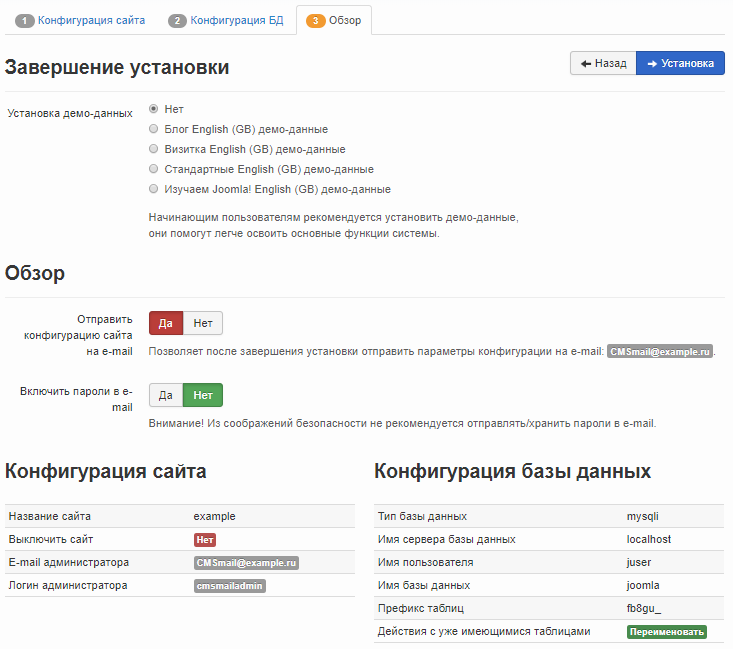
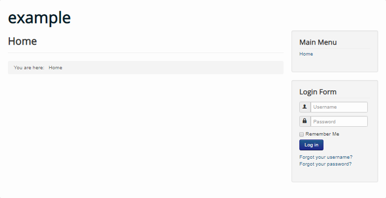

Joomla! - система управления содержимым (CMS), написанная на языках PHP и JavaScript и использующая в качестве хранилища базы данных СУБД MySQL. Joomla! предлагает нативный bootstrap, мультиязычную среду, множество всевозможных модулей расширений, а также высокую безопасность. Joomla! распространяется по лицензии GNU/GPL и может использоваться бесплатно.

## Требования

- Операционная система Ubuntu версии 18.04.
- Пользователь с доступом к команде sudo.
- Установленный стек LAMP.

Если у вас еще не установлен стек LAMP:

- Вы можете получить готовый стек LAMP в облаке [в виде настроенной виртуальной машины](https://mcs.mail.ru/app/services/marketplace/) на Ubuntu 18.04. При регистрации вы получаете бесплатный бонусный счет, которого хватает, чтобы тестировать сервер несколько дней.
- Вы можете установить стек LAMP самостоятельно. О том, как установить стек LAMP на Ubuntu 18.04, [читайте тут](https://mcs.mail.ru/help/lamp-setup/lamp-ubuntu-18).

## Настройка БД MySQL

Чтобы начать работу с Joomla!, необходимо создать и настроить выделенную базу данных MySQL. Для этого:

1.  Откройте окно терминала.
2.  Для перехода в оболочку MySQL выполните команду:

```
sudo mysql -u root -p 
```

Используйте аутентификацию учетной записи root, которая относится исключительно к СУБД MySQL.

3.  Создайте базу данных для Joomla!, используя команду:

```
CREATE DATABASE имя_базы;
```

Например:

```
CREATE DATABASE joomla;
```

<warn>

**Внимание**

После всех команд СУБД MySQL должна ставиться точка с запятой.

</warn>

4.  Создайте пользователя с правами полного доступа к созданной базе данных и назначьте ему пароль, используя команду:

```
CREATE USER имя_пользователя@localhost IDENTIFIED BY 'пароль';
```

Например:

```
CREATE USER [juser@localhost](mailto:juser@localhost) IDENTIFIED BY 'mypassword';
```

5.  Предоставьте пользователю необходимые привилегии для создания и изменения таблиц базы данных, выполнив команду:

```
GRANT ALL PRIVILEGES ON  имя_базы.\* TO имя_пользователя@localhost;
```

Например:

```
GRANT ALL PRIVILEGES ON joomla.\* TO [juser@localhost](mailto:juser@localhost);
```

6.  Актуализируйте предоставление привилегий к таблицам базы данных, выполнив команду:

```
FLUSH PRIVILEGES;
```

7.  Выйдите из оболочки MySQL, выполнив команду:

```
exit
```

## Подготовка к установке Joomla!

Перед установкой Joomla!:

1.  Перейдите на [сайт](https://github.com/joomla/joomla-cms/releases) и запомните номер последней версии Joomla!:


2.  Откройте окно терминала.
3.  Перейдите в домашний каталог, выполнив команду:

```
cd ~
```

3.  Создайте временный каталог `tempJL`, выполнив команду:

```
mkdir tempJL
```

4.  Перейдите в созданный каталог, выполнив команду:

```
cd ~/tempJL
```

5.  Скачайте последнюю версию Joomla!, выполнив команду:

```
wget https://github.com/joomla/joomla-cms/releases/download/<номер версии>/Joomla_<номер версии>-Stable-Full_Package.tar.gz
```

Например:

```
wget https://github.com/joomla/joomla-cms/releases/download/3.9.3/Joomla_3.9.3-Stable-Full_Package.tar.gz
```

6.  Создайте папку `Joomla`, выполнив команду:

```
sudo mkdir /var/www/html/joomla
```

7.  Распакуйте и переместите файлы из текущего каталога в каталог `/var/www/html/Joomla`, выполнив команду:

```
sudo tar -xvzf Joomla_<номер версии>-Stable-Full_Package.tar.gz -C /var/www/html/joomla
```

Например:

```
sudo tar -xvzf Joomla_3.9.3-Stable-Full_Package.tar.gz -C /var/www/html/joomla
```

8.  Удалите временный каталог `tempJL`, выполнив команду:

```
rm -Rf ~/tempJL
```

9.  Замените владельца каталогов и файлов в корневом каталоге веб-сервера, используя команду:

```
sudo chown -R имя_пользователя:www-data /var/www/html/
```

где `имя_пользователя` - имя пользователя sudo, `www-data` - имя группы
Например:

```
sudo chown -R www-data:www-data /var/www/html/joomla/
```

<info>

**Примечание**

Во избежание ошибок веб-сервера Apache при запуске скриптов используйте имя пользователя www-data и имя группы www-data по умолчанию.

</info>

10. Если необходимо предоставить доступ к файлам корневого каталога веб-сервера другому пользователю, включите этого пользователя в группу www-data, используя команду:

```
sudo usermod -a -G www-data имя_пользователя
```

Например:

```
sudo usermod -a -G www-data wuser
```

11. Настройте права доступа к файлам и папкам, выполнив команду:

```
sudo chmod -R 755 /var/www
```

12. Чтобы настроить Joomla!, создайте конфигурационный файл `joomla.conf` в директории `/etc/apache2/sites-available/`, выполнив команду:

```
sudo nano /etc/apache2/sites-available/joomla.conf
```

13. В созданный файл добавьте следующие строки:

```
<VirtualHost \*:80>
DirectoryIndex index.php
DocumentRoot /var/www/html/joomla
ServerName <внешний IP-адрес вашего веб-сервера>
<Directory /var/www/html/joomla>
</Directory>
ErrorLog /var/log/apache2/joomla-error_log
CustomLog /var/log/apache2/joomla-access_log common
</VirtualHost>
```

Сохраните изменения, используя сочетание клавиш CTRL+O, и завершите редактирование, используя сочетание клавиш CTRL+X.

14. Отключите сайт по умолчанию `000-default.conf`, используя команду:

```
sudo a2dissite 000-default.conf
```

15. Подключите новый виртуальный хост, используя команду:

```
sudo a2ensite joomla
```

16. Перезагрузите веб-сервер Apache, выполнив команду:

```
sudo systemctl reload apache2
```

## Установка Joomla!

Для установки Joomla! в адресной строке веб-браузера укажите внешний IP-адрес веб-сервера. В результате будет запущен мастер установки Joomla!, следуйте его указаниям:

1.  На странице **Конфигурация сайта** укажите название сайта, информацию для учетной записи администратора и нажмите кнопку **Далее**:

****

2.  На странице **Конфигурация базы данных** укажите настройки базы данных и нажмите кнопку **Далее**:

<info>

**Примечание**

В настройках базы данных укажите имя пользователя базы данных, пароль и имя базы данных, которые вы выбрали при настройке БД MySQL.

</info>

****

3.  На последней странице проверьте выбранные параметры Joomla!, при необходимости отправьте их по электронной почте и нажмите кнопку **Установить**:



4.  Когда Joomla! будет установлена, отобразится страница с соответствующей информацией:


5.  Для завершения установки нажмите кнопку **Удалить директорию Installation**.
6.  Для перехода на главную страницу вашего сайта нажмите кнопку **Сайт**:

****

## Обратная связь

Возникли проблемы или остались вопросы? [Напишите нам, мы будем рады вам помочь](https://mcs.mail.ru/help/contact-us).
