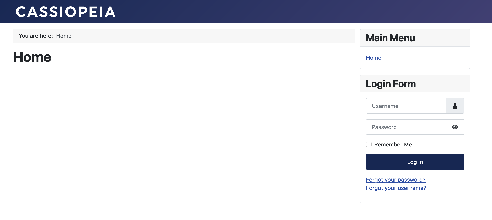

[Joomla!](https://www.joomla.org) — система управления содержимым (CMS), написанная на языках PHP и JavaScript и использующая в качестве хранилища базы данных СУБД MySQL.

Данная инструкция поможет развернуть CMS Joomla версии 4.3.4 в операционной системе Almalinux 9 в VK Cloud, а также настроить DNS-запись для доступа по доменному имени. В качестве СУБД используется MySQL 8.0 конфигурации Single.

## 1. Подготовительные шаги

1. [Зарегистрируйтесь](/ru/additionals/start/get-started/account-registration#registraciya_v_lichnom_kabinete) в личном кабинете VK Cloud.
1. [Подтвердите](/ru/additionals/start/get-started/account-registration#podtverzhdenie_uchetnoy_zapisi) учетную запись.
1. [Создайте](/ru/networks/vnet/operations/manage-net#sozdanie_seti) сеть `network1` с доступом в интернет и подсетью с адресом `10.0.0.0/24`.
1. [Создайте ВМ](/ru/base/iaas/instructions/vm/vm-create):

   - имя: `Almalinux_9_Joomla`;
   - операционная система: Almalinux 9;
   - сеть: `network1` с подсетью `10.0.0.0/24`;
   - назначьте публичный IP-адрес. В примере будет использоваться `87.239.105.44`;
   - группы безопасности: `default`, `ssh+www`.

1. [Создайте инстанс БД](/ru/dbs/dbaas/instructions/create/create-single-replica):

   - имя: `MySQL-7313`;
   - СУБД: MySQL 8.0;
   - тип конфигурации: Single;
   - сеть: `network1`;
   - название БД: `MySQL-7313`;
   - имя пользователя БД: `user`;
   - пароль пользователя: `AN0r25e0ae4d626p`;

   В примере внутренний IP созданного инстанса: `10.0.0.7`.

1. [Создайте](/ru/networks/dns/publicdns#sozdanie_zony) DNS-зону.

   <warn>

   Убедитесь, что DNS-зона делегирована успешно и NS-записи настроены верно: зона должна находиться в статусе **NS-записи настроены верно**.

   </warn>

1. [Создайте](/ru/networks/dns/publicdns#dobavlenie_resursnyh_zapisey) запись в выделенной зоне:

   - тип записи: `A`;
   - имя: например, `site-joomla.example.vk.cloud`;
   - IP-адрес: внешний адрес ВМ `87.239.105.44`.

1. (Опционально) Проверьте резолвинг имени в IP-адрес с помощью команды `nslookup site-joomla.example.vk.cloud`. Вывод при успешной операции:

   ```bash
   Non-authoritative answer:
   Name:   site-joomla.example.vk.cloud
   Address: 87.239.105.44
   ```

## 2. Установите Joomla! на ВМ

1. [Подключитесь](/ru/base/iaas/instructions/vm/vm-connect/vm-connect-nix) к ВМ `Almalinux_9_Joomla`.
1. Обновите пакеты до актуальной версии и перезагрузите ВМ с помощью команд:

   ```bash
   sudo dnf update -y
   sudo systemctl reboot
   ```

1. Загрузите необходимые репозитории, последовательно выполнив команды:

   ```bash
   sudo dnf install https://dl.fedoraproject.org/pub/epel/epel-release-latest-9.noarch.rpm -y
   sudo dnf install https://rpms.remirepo.net/enterprise/remi-release-9.rpm -y
   sudo dnf module enable php:remi-8.2 -y
   sudo dnf install wget httpd php php-mysqlnd php-gd php-xml php-mbstring php-intl php-pecl-zip -y
   ```

1. Запустите httpd-демон:

   ```bash
   sudo systemctl enable httpd.service --now
   ```

1. Скачайте репозиторий CMS Joomla! и разверните ее в подкаталоге `joomla` на запущенном веб-сервере:

   ```bash
   wget https://github.com/joomla/joomla-cms/releases/download/4.3.4/Joomla_4.3.4-Stable-Full_Package.tar.gz
   sudo mkdir -p /var/www/html/joomla
   sudo tar xzf Joomla_4.3.4-Stable-Full_Package.tar.gz -C /var/www/html/joomla/
   sudo chown -R apache:apache /var/www/html/joomla
   ```

1. Установите параметры SELinux для корректной работы веб-сервера:

   ```bash
   sudo setsebool -P httpd_enable_cgi on
   sudo setsebool -P httpd_unified on
   sudo setsebool -P httpd_builtin_scripting on
   sudo setsebool -P httpd_can_network_connect on
   ```

1. В браузере введите публичный IP-адрес ВМ с `/joomla`. В текущей инструкции это `87.239.105.44/joomla`.
1. В мастере установки укажите русский язык и название сайта — `site-joomla.example.vk.cloud`.
1. На шаге «Параметры учетной записи» укажите учетные данные администратора CMS.
1. На шаге «Параметры базы данных» БД укажите параметры `MySQL-7313`:

   - **Тип базы данных**: **MySQL (PDO)**.
   - **Имя хоста**: `10.0.0.7`.
   - **Имя пользователя базы данных**: `user`.
   - **Пароль пользователя базы данных**: `AN0r25e0ae4d626p`.
   - **Имя базы данных**: `MySQL-7313`.

1. (Опционально) Создайте или удалите файл в каталоге `/var/www/html/joomla/installation`: название файла и его расположение отобразится во всплывающем окне мастера установки.

## 3. Проверьте работоспособность Joomla!

В браузере перейдите по адресу `http://site-joomla.example.vk.cloud/joomla/`. При успешной установке откроется стартовая страница CMS Joomla!



## Удалите неиспользуемые ресурсы

Развернутые виртуальные ресурсы тарифицируются. Если они вам больше не нужны:

- [Удалите](/ru/base/iaas/instructions/vm/vm-manage#udalenie_vm) ВМ `Almalinux_9_Joomla`.
- [Удалите](/ru/dbs/dbaas/instructions/manage-instance/mysql#udalenie_instansa_bd_ili_ego_hostov) инстанс БД `MySQL-7313`.
- При необходимости [удалите](/ru/networks/vnet/operations/manage-floating-ip#udalenie_plavayushchego_ip_adresa_iz_proekta) плавающий IP-адрес `87.239.105.44`.
- [Удалите](/ru/networks/dns/publicdns#udalenie_resursnyh_zapisey) созданную DNS-запись `site-joomla.example.vk.cloud`.
