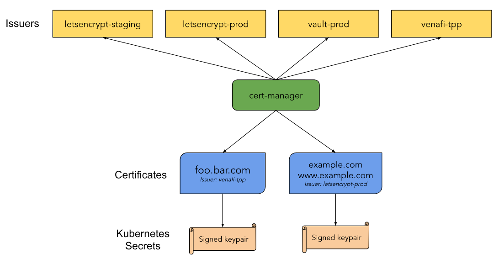

## Конфигурация оборудования

- Установленный и настроенный кластер Kubernetes.
- При использовании Helm2 — установленный Tiller.

## Что такое Cert-manager

Cert-manager — нативное для Kubernetes средство управления сертификатами. Cert-manager может получать сертификаты из нескольких источников (например, [Let’s Encrypt](https://letsencrypt.org/), [HashiCorp Vault](https://www.vaultproject.io/), [Venafi](https://www.venafi.com/)), из локальных контейнеров, содержащих сертификат и ключ, либо может генерировать самоподписанные сертификаты, которые чаще всего используются для предоставления https-доступа к ingress-контроллерам. Кроме того, Cert-manager контролирует срок действия сертификатов и поддерживает автоматическое обновление сертификатов. Схема организации Cert-manager (источник: [официальная документация](https://cert-manager.io/docs/)):



## Установка Cert-manager

1.  Уточните версию кластера Kubernetes:

```
kubectl version
Client Version: version.Info{Major:"1", Minor:"16+",
GitVersion:"v1.16.6-beta.0",
GitCommit:"e7f962ba86f4ce7033828210ca3556393c377bcc",
GitTreeState:"clean", BuildDate:"2020-01-15T08:26:26Z",
GoVersion:"go1.13.5", Compiler:"gc", Platform:"darwin/amd64"}
Server Version: version.Info{Major:"1", Minor:"16",
GitVersion:"v1.16.4",
GitCommit:"2bba0127d85d5a46ab4b778548be28623b32d0b0",
GitTreeState:"clean", BuildDate:"2020-05-19T18:09:41Z",
GoVersion:"go1.12.12", Compiler:"gc", Platform:"linux/amd64"
```

2.  В зависимости от версии Kubernetes создайте `CustomResouceDefinitions`, необходимый для работы Cert-Manager, используя одну из команд:

```
# Kubernetes 1.22.9
kubectl apply --validate=false -f https://github.com/jetstack/cert-manager/releases/download/v1.9.1/cert-manager.crds.yaml

# Kubernetes 1.15+
kubectl apply --validate=false -f https://github.com/jetstack/cert-manager/releases/download/v0.16.0/cert-manager.crds.yaml

# Kubernetes <1.15
kubectl apply --validate=false -f https://github.com/jetstack/cert-manager/releases/download/v0.16.0/cert-manager-legacy.crds.yaml
```

Поскольку мы используем Kubernetes 1.22.9, выполним команду:

```
kubectl apply --validate=false -f
https://github.com/jetstack/cert-manager/releases/download/v1.9.1/cert-manager.crds.yaml

customresourcedefinition.apiextensions.k8s.io/certificaterequests.cert-manager.io created
customresourcedefinition.apiextensions.k8s.io/certificates.cert-manager.io created
customresourcedefinition.apiextensions.k8s.io/challenges.acme.cert-manager.io created
customresourcedefinition.apiextensions.k8s.io/clusterissuers.cert-manager.io created
customresourcedefinition.apiextensions.k8s.io/issuers.cert-manager.io created
customresourcedefinition.apiextensions.k8s.io/orders.acme.cert-manager.io created
```

3.  Создайте пространство имен для Cert-manager:

```
kubectl create namespace cert-manager
namespace/cert-manager created
```

4.  В Helm добавьте репозиторий Jetstack:

```
helm repo add jetstack https://charts.jetstack.io
"jetstack" has been added to your repositories
```

5.  Обновите список репозиториев:

```
helm repo update
Hang tight while we grab the latest from your chart repositories...
...Skip local chart repository
...Successfully got an update from the "jetstack" chart repository
...Successfully got an update from the "stable" chart repository
Update Complete.
```

6.  Установите Cert-Manager:

```
helm install cert-manager --namespace cert-manager jetstack/cert-manager
NAME: cert-manager
LAST DEPLOYED: Tue Aug  4 11:08:28 2020
NAMESPACE: cert-manager
STATUS: deployed
REVISION: 1
TEST SUITE: None
NOTES:
cert-manager has been deployed successfully!

In order to begin issuing certificates, you will need to set up a ClusterIssuer
or Issuer resource (for example, by creating a 'letsencrypt-staging' issuer).

More information on the different types of issuers and how to configure them
can be found in our documentation:

https://cert-manager.io/docs/configuration/

For information on how to configure cert-manager to automatically provision
Certificates for Ingress resources, take a look at the \`ingress-shim\`
documentation:


```

<info>

**Примечание**

Если при установке Cert-Manager возникли ошибки типа "Forbidden: User ….", значит у вас нет прав для установки в данный namespace. Для получения прав:

```
kubectl create clusterrolebinding tiller-cluster-rule --clusterrole=cluster-admin --serviceaccount=kube-system:tiller
```

Затем повторите команду для  установки.

Подробнее о настройке прав Helm см. [тут](https://mcs.mail.ru/help/ingress/helm).

</info>

## Проверка Cert-manager

1.  Убедитесь, что Cert-manager установлен:

```
kubectl get pods --namespace cert-manager

NAME                                     READY STATUS RESTARTS   AGE
cert-manager-8d4ccddb9-wkwqf             1/1   Running 0         13m
cert-manager-cainjector-df4dc78cd-fbc9q  1/1   Running 0         13m
cert-manager-webhook-5f78ff89bc-qj48g    1/1   Running 0         13m

```

Все три контейнера должны быть в состоянии Running.

2.  Создайте файл test-resources.yaml:

```
cat <<EOF > test-resources.yaml
apiVersion: v1
kind: Namespace
metadata:
    name: cert-manager-test
---
apiVersion: cert-manager.io/v1
kind: Issuer
metadata:
    name: test-selfsigned
    namespace: cert-manager-test
spec:
    selfSigned: {}
---
apiVersion: cert-manager.io/v1
kind: Certificate
metadata:
    name: selfsigned-cert
    namespace: cert-manager-test
spec:
    commonName: example.com
    secretName: selfsigned-cert-tls
    issuerRef:
        name: test-selfsigned
EOF
```

3.  Примените созданный файл:

```
kubectl apply -f test-resources.yaml

namespace/cert-manager-test unchanged
issuer.cert-manager.io/test-selfsigned created
certificate.cert-manager.io/selfsigned-cert created
```

4.  Через несколько секунд проверьте статус созданных сертификатов:

```
kubectl describe certificate -n cert-manager-test

Name:         selfsigned-cert
Namespace:    cert-manager-test
Labels:       <none>
Annotations:  kubectl.kubernetes.io/last-applied-configuration:
                {"apiVersion":"cert-manager.io/v1alpha2","kind":"Certificate","metadata":{"annotations":{},"name":"selfsigned-cert","namespace":"cert-mana...
API Version:  cert-manager.io/v1beta1
Kind:         Certificate
Metadata:
  Creation Timestamp:  2020-08-04T08:12:12Z
  Generation:          1
  Resource Version:    6492
  Self Link:           /apis/cert-manager.io/v1beta1/namespaces/cert-manager-test/certificates/selfsigned-cert
  UID:                 11e705d0-4948-4967-8b70-f0028f81acfb
Spec:
  Common Name:  example.com
  Issuer Ref:
    Name:       test-selfsigned
  Secret Name:  selfsigned-cert-tls
Status:
  Conditions:
    Last Transition Time:  2020-08-04T08:12:12Z
    Message:               Certificate is up to date and has not expired
    Reason:                Ready
    Status:                True
    Type:                  Ready
  Not After:               2020-11-02T08:12:11Z
  Not Before:              2020-08-04T08:12:11Z
  Renewal Time:            2020-10-03T08:12:11Z
  Revision:                1
Events:
  Type    Reason     Age   From          Message
  ----    ------     ----  ----          -------
  Normal  Issuing    34s   cert-manager  Issuing certificate as Secret does not exist
  Normal  Generated  34s   cert-manager  Stored new private key in temporary Secret resource "selfsigned-cert-mqhmp"
  Normal  Requested  34s   cert-manager  Created new CertificateRequest resource "selfsigned-cert-5g6rn"
  Normal  Issuing    34s   cert-manager  The certificate has been successfully issued
```

## Резервное копирование и восстановление настроек Cert-manager

Для резервирования настроек Cert-manager выполните команду:

```
kubectl get -o yaml \
    --all-namespaces \
     issuer,clusterissuer,certificates,certificaterequests > cert-manager-backup.yaml

```

Для восстановления настроек Cert-manager выполните команду:

```
kubectl apply -f cert-manager-backup.yaml
```

## Обновление Cert-manager

Рассмотрим обновление Cert-manager версии 0.12 до версии 0.16.

1.  Обновите CRD:

```
kubectl apply --validate=
false -f https://github.com/jetstack/cert-manager/releases/download/v0.16.0/cert-manager.crds.yaml
customresourcedefinition.apiextensions.k8s.io/certificaterequests.cert-manager.io configured
customresourcedefinition.apiextensions.k8s.io/certificates.cert-manager.io configured
customresourcedefinition.apiextensions.k8s.io/challenges.acme.cert-manager.io configured
customresourcedefinition.apiextensions.k8s.io/clusterissuers.cert-manager.io configured
customresourcedefinition.apiextensions.k8s.io/issuers.cert-manager.io configured
customresourcedefinition.apiextensions.k8s.io/orders.acme.cert-manager.io configured
```

2.  Обновите список репозиториев Helm:

```
helm repo update
Hang tight while we grab the latest from your chart repositories...
...Skip local chart repository
...Successfully got an update from the "jetstack" chart repository
...Successfully got an update from the "stable" chart repository
Update Complete.
```

3.  Сделайте резервную копию настроек, как написано выше.
4.  Посмотрите текущую установленную версию Cert-manager:

```
helm list -n cert-manager | grep cert-manager
cert-manager    cert-manager    1           2020-08-04 11:29:40.949832 +0300 MSK    deployed    cert-manager-v0.12.0 v0.12.0
```

5.  Удалите деплойменты (см. [документ](https://cert-manager.io/docs/installation/upgrading/upgrading-0.13-0.14/)):

```
kubectl delete -n cert-manager deployment cert-manager cert-manager-cainjector cert-manager-webhook
deployment.apps "cert-manager" deleted
deployment.apps "cert-manager-cainjector" deleted
deployment.apps "cert-manager-webhook"deleted
```

6.  Выполните обновление:

```
 helm upgrade --version 0.16.0 cert-manager --namespace cert-manager jetstack/cert-manager
Release "cert-manager" has been upgraded. Happy Helming!
NAME: cert-manager
LAST DEPLOYED: Tue Aug  4 12:27:16 2020
NAMESPACE: cert-manager
STATUS: deployed
REVISION: 3
TEST SUITE: None
NOTES:
cert-manager has been deployed successfully!

In order to begin issuing certificates, you will need to set up a ClusterIssuer
or Issuer resource (for example, by creating a 'letsencrypt-staging' issuer).

More information on the different types of issuers and how to configure them
can be found in our documentation:

https://cert-manager.io/docs/configuration/

For information on how to configure cert-manager to automatically provision
Certificates for Ingress resources, take a look at the \`ingress-shim\`
documentation:

https://cert-manager.io/docs/usage/ingress/>
```

7.  Проверьте версию:

```
helm list -n cert-manager | grep cert-manager

cert-manager    cert-manager    3           2020-08-04 12:27:16.694045 +0300 MSK    deployed    cert-manager-v0.16.0
```

## Удаление Cert-manager

1.  Просмотрите созданные пользовательские ресурсы:

```
kubectl get Issuers,ClusterIssuers,Certificates,CertificateRequests,Orders,Challenges --all-namespaces
NAMESPACE NAME READY AGE
cert-manager-test issuer.cert-manager.io/test-selfsigned True 67m

NAMESPACE NAME READY SECRET AGE
cert-manager-test certificate.cert-manager.io/selfsigned-cert True selfsigned-cert-tls   67m

NAMESPACE NAME READY AGE
cert-manager-test   certificaterequest.cert-manager.io/selfsigned-cert-2334779822   True    67m
```

При необходимости эти ресурсы нужно будет удалить отдельно.

2.  Удалите Cert-manager:

```
helm delete --namespace cert-manager cert-manager
release "cert-manager"
uninstalled
```

3.  Удалите пространство имен Cert-manager:

```
kubectl delete namespace cert-manager
namespace "cert-manager" deleted
```

4.  Если необходимо также удалить все пользовательские ресурсы, удалите манифест CustomResourceDefinitions:

```
kubectl delete -f
https://github.com/jetstack/cert-manager/releases/download/v0.16.0/cert-manager.crds.yaml
customresourcedefinition.apiextensions.k8s.io "certificaterequests.cert-manager.io" deleted
customresourcedefinition.apiextensions.k8s.io "certificates.cert-manager.io" deleted
customresourcedefinition.apiextensions.k8s.io "challenges.acme.cert-manager.io" deleted
customresourcedefinition.apiextensions.k8s.io "clusterissuers.cert-manager.io" deleted
customresourcedefinition.apiextensions.k8s.io "issuers.cert-manager.io" deleted
customresourcedefinition.apiextensions.k8s.io "orders.acme.cert-manager.io"
```
