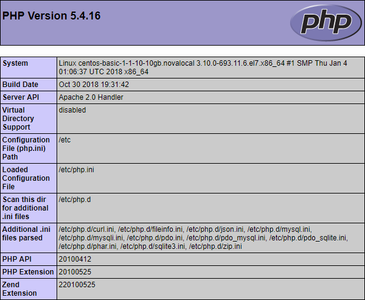

Данная статья описывает установку стека LAMP на операционную систему семейства Linux - CentOS 7.4

Стек LAMP включает в себя операционную систему семейства Linux, веб-сервер Apache, систему управления базами данных MySQL и серверный язык сценариев для обработки динамического контента PHP. Все это необходимо для поддержки динамических сайтов и веб-приложений

## Как сэкономить время на установке стека LAMP

Вы можете получить готовый стек LAMP на Ubuntu 18.04 в виде [настроенной виртуальной машины VK Cloud](https://mcs.mail.ru/app/services/marketplace/). При регистрации вы получаете бесплатный бонусный счет, которого достаточно, чтобы тестировать сервер несколько дней.

Чтобы узнать больше о LAMP в магазине приложений, перейдите в [Центр помощи](https://mcs.mail.ru/help/quick-start/-lamp-stack-apachephp).

#### Требования

- Операционная система CentOS 7.4
- Пользователь с доступом к команде sudo

## Подготовка к установке стека LAMP

Перед установкой стека LAMP выполните следующее:

1.  Откройте окно терминала
2.  Обновите систему, выполнив команду:

```
sudo yum update -y
```

Дождитесь завершения обновления системы

3.  Установите консольную утилиту wget, выполнив команду:

```
sudo yum install wget -y
```

4.  Установите текстовый редактор nano, выполнив команду:

```
sudo yum install nano -y
```

## Установка и настройка веб-сервера Apache

Чтобы установить и выполнить первичную настройку веб-сервера Apache:

1.  Откройте окно терминала

2.  Установите веб-сервер Apache, выполнив команду:

```
sudo yum install httpd -y
```

3.  Запустите веб-сервер Apache в качестве службы, выполнив команду:

```
sudo systemctl start httpd.service
```

4.  Чтобы при перезагрузке операционной системы запуск веб-сервера Apache в качестве службы выполнялся автоматически, выполните команду:

```
sudo systemctl enable httpd.service
```

5.  Для проверки конфигурации веб-сервера Apache выполните команду:

```
apachectl configtest
```

В случае отсутствия ошибок отобразится строка:

```
Syntax OK
```

6.  Для проверки работы веб-сервера запустите веб-браузер и в адресной строке введите IP-адрес веб-сервера

Если установка и конфигурирование веб-сервера Apache выполнены успешно, отобразится примерно следующая дефолтная страница веб-сервера:


## Установка СУБД MySQL

Чтобы установить и настроить СУБД MySQL:

1.  Откройте окно терминала

2.  Скачайте установочный пакет СУБД MySQL, выполнив команду:

```
wget http://repo.mysql.com/mysql-community-release-el7-5.noarch.rpm
```

3.  Добавьте пакет СУБД MySQL в репозиторий ОС CentOS, выполнив команду:

```
sudo rpm -ivh mysql-community-release-el7-5.noarch.rpm
```

4.  Установите сервер СУБД MySQL, выполнив команду:

```
sudo yum install mysql-server -y
```

5.  Запустите MySQL в качестве службы, выполнив команду:

```
sudo systemctl start mysqld.service
```

6.  Чтобы при перезагрузке операционной системы запуск MySQL в качестве службы выполнялся автоматически, выполните команду:

```
sudo systemctl enable mysqld.service
```

7.  Для внесения изменений в конфигурацию сервера СУБД MySQL используйте команду:

```
sudo mysql_secure_installation
```

Данная команда запускает сценарий повышения безопасности сервера СУБД MySQL. Для настройки безопасности:

- Укажите пароль для учетной записи root

<warn>

**Внимание**

Рекомендуется указывать надежный пароль, который содержит не менее 8 символов, включающих по крайней мере одну заглавную букву, одну строчную букву, одну цифру и один специальный символ

</warn>

Пользователь root в данном случае относится исключительно к СУБД MySQL и не является учетной записью ОС CentOS

- При необходимости удалите анонимные (anonymous) учетные записи, которые создаются при установке СУБД MySQL
  - Ответьте Y(es) для удаления анонимных учетных записей
  - Ответьте N(o), если удаление анонимных учетных записей не требуется

Данные учетные записи предназначены только для тестирования БД и в большинстве случаев могут быть удалены

- При необходимости запретите предоставление удаленного доступа к базам СУБД MySQL для учетной записи root:
  - Ответьте Y(es) для отключения возможности удаленного доступа
  - Ответьте N(o), для разрешения удаленного доступа
- При необходимости удалите тестовую базу (Test)
  - Ответьте Y(es) для удаления базы Test
  - Ответьте N(o), если удаление базы Test не требуется

Данная база создается при установке сервера СУБД MySQL и предназначена для тестирования. Удаление базы Test не влияет на работу системы

- В ответ на запрос на внесение изменений в СУБД MySQL и перезагрузку привилегий доступа к таблицам:
  - Ответьте Y(es) для внесения изменений и перезагрузки
  - Ответьте N(o), если внесение изменений и перезагрузка не требуются

## Установка PHP

Для установки PHP:

1.  Откройте окно терминала
2.  Установите PHP, выполнив команду:

```
sudo yum install php php-mysql php-gd php-xml -y
```

3.  Перезагрузите веб-сервер Apache, выполнив команду:

```
sudo systemctl restart httpd.service
```

4.  Убедитесь, что веб-сервер Apache корректно отображает скрипты PHP. Для этого:

- Создайте файл info.php, выполнив команду:

```
sudo nano /var/www/html/info.php
```

- В файл info.php поместите текст:

```
<?php
    phpinfo();
?>
```

- Сохраните внесенные изменения, используя сочетание клавиш CTRL+O
- Завершите редактирование, используя сочетание клавиш CTRL+X
- В адресной строке браузера к адресу веб-сервера добавьте строку:

```
/info.php
```

В результате должна отобразиться примерно следующая страница:



<warn>

**Внимание**

В целях безопасности после проверки системы рекомендуется удалить файл info.php, выполнив команду:

```
sudo rm /var/www/html/info.php
```

</warn>
