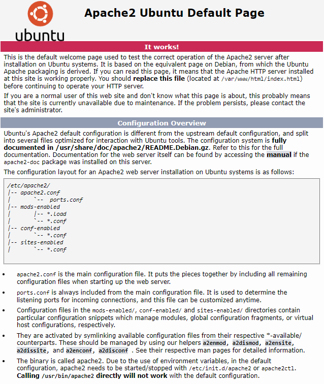
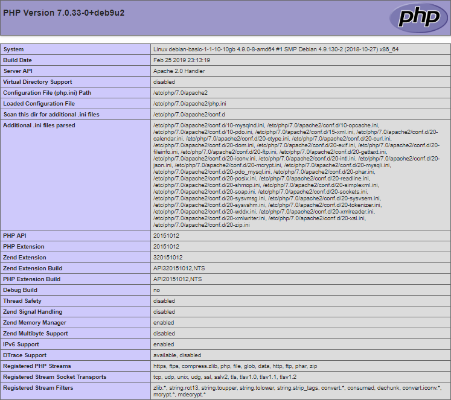

Данная статья описывает установку стека LAMP на операционную систему семейства Linux - Debian 9.4.

Стек LAMP включает в себя операционную систему семейства Linux, веб-сервер Apache, систему управления базами данных MySQL и серверный язык сценариев для обработки динамического контента PHP. Все это необходимо для поддержки динамических сайтов и веб-приложений.

\*\*Как сэкономить время на установке стека LAMP

\*\*

\*\*

Вы можете получить готовый стек LAMP на Ubuntu 18.04 в виде настроенной виртуальной машины VK Cloud. При регистрации вы получаете бесплатный бонусный счет, которого достаточно, чтобы тестировать сервер несколько дней.

[[подключить машину LAMP](https://mcs.mail.ru/app/services/marketplace/)]

Чтобы узнать больше о LAMP в магазине приложений, перейдите в [Центр помощи](https://mcs.mail.ru/help/quick-start/-lamp-stack-apachephp).

\*\*

#### Требования

- Операционная система Debian версии 9.4.
- Пользователь с доступом к команде sudo.

## Установка и настройка веб-сервера Apache

Чтобы установить и выполнить первичную настройку веб-сервера Apache:

1.  Откройте окно терминала.
2.  Обновите списки установочных пакетов до актуальных версий, выполнив команду:

    ```
    sudo apt-get update
    ```

3.  Установите последнюю версию веб-сервера Apache и дополнительных модулей, выполнив команду:

    ```
    sudo apt install apache2 apache2-utils
    ```

    Согласитесь с установкой веб-сервера Apache, ответив Y(es).

4.  Откройте конфигурационный файл apache2.conf для редактирования, выполнив команду:

    ```
    sudo nano /etc/apache2/apache2.conf
    ```

5.  В файле apache2.conf:
    - В конец добавьте строку ServerName <IP-адрес>, указав внешний IP-адрес веб-сервера.
    - Сохраните внесенные изменения, используя сочетание клавиш CTRL+O.
    - Завершите редактирование, используя сочетание клавиш CTRL+X.
6.  Для проверки конфигурации и текущего состояния веб-сервера Apache выполните команду:

    ```
    sudo apache2ctl configtest
    ```

    В случае отсутствия ошибок отобразится строка:

    ```
    Syntax OK
    ```

7.  Для применения изменений перезагрузите веб-сервер Apache, выполнив команду:

    ```
    sudo systemctl restart apache2
    ```

8.  Для проверки работы веб-сервера запустите веб-браузер и в адресной строке введите IP-адрес веб-сервера.

Если установка и конфигурирование веб-сервера Apache выполнены успешно, отобразится примерно следующая дефолтная страница веб-сервера:



## Установка СУБД MySQL

Чтобы установить и настроить СУБД MySQL:

1.  Откройте окно терминала.
2.  Установите сервер СУБД MySQL, выполнив команду:

    ```
    sudo apt-get install mysql-server
    ```

    Согласитесь с установкой сервера СУБД MySQL, ответив Y(es).

3.  Для внесения изменений в конфигурацию сервера СУБД MySQL используйте команду:

```
sudo mysql_secure_installation
```

Данная команда запускает сценарий повышения безопасности сервера СУБД MySQL. Для настройки безопасности:

- Задайте пароль для учетной записи root.

Рекомендуется использовать надежный пароль.

**Внимание**

Пользователь root в данном случае относится исключительно к СУБД MySQL и не является учетной записью ОС Debian.

- При необходимости удалите анонимные (anonymous) учетные записи, которые создаются при установке СУБД MySQL:

- Ответьте Y(es) для удаления анонимных учетных записей.
- Ответьте N(o), если удаление анонимных учетных записей не требуется.

Данные учетные записи предназначены только для тестирования базы данных и в большинстве случаев могут быть удалены.

- При необходимости запретите удаленный доступ к СУБД MySQL для учетной записи root:
  - Ответьте Y(es) для отключения возможности удаленного доступа.
  - Ответьте N(o) для разрешения удаленного доступа.
- При необходимости удалите тестовую базу (Test):
  - Ответьте Y(es) для удаления базы Test.
  - Ответьте N(o), если удаление базы Test не требуется.

Данная база создается при установке сервера СУБД MySQL и предназначена для тестирования. Удаление базы Test не влияет на работу системы.

- В ответ на запрос на внесение изменений в СУБД MySQL и перезагрузку привилегий доступа к таблицам:
  - Ответьте Y(es) для внесения изменений и перезагрузки.
  - Ответьте N(o), если внесение изменений и перезагрузка не требуются.

## Установка PHP и дополнительных пакетов

Чтобы установить PHP и дополнительные пакеты, которые могут потребоваться для работы и настройки WordPress:

1.  Откройте окно терминала.
2.  Для установки PHP совместно с дополнительными пакетами используйте команду:

    ```
    sudo apt-get install php libapache2-mod-php php-cli php-mcrypt php-intl php-mysql php-curl php-gd php-soap php-xml php-zip php-readline php-opcache php-json
    ```

Чтобы выполнить установку, ответьте Y(es).

3.  Убедитесь, что веб-сервер Apache корректно отображает скрипты PHP. Для этого:

- Создайте файл info.php, выполнив команду:

```
sudo nano /var/www/html/info.php
```

- В файл info.php поместите текст:

```
<?php
    phpinfo();
?>
```

- Сохраните изменения, используя сочетание клавиш CTRL+O.
- Завершите редактирование, используя сочетание клавиш CTRL+X.
- В адресной строке браузера к адресу веб-сервера добавьте строку:

```
/info.php 
```

В результате должна отобразится примерно следующая страница:



**Внимание**

В целях безопасности после проверки системы рекомендуется удалить файл _info.php_, выполнив команду:

```
sudo rm /var/www/html/info.php
```

**Обратная связь**

Возникли проблемы или остались вопросы? [Напишите нам, мы будем рады вам помочь](https://mcs.mail.ru/help/contact-us).
